# DealSignal 架构与流程图资源 v2.1.0

> **资源编号**：`ARC-2024-001`  
> **版本**：`v2.1.0`  
> **模板版本**：`v1`  
> **状态**：`已批准`  
> **编写人/适用对象**：`技术团队 / 架构师 / 后端负责人 / 前端负责人`  
> **编写日期**：`2026-06-20`  
> **最后更新**：`2026-06-20`  
> **关联资源**：  
> - `docs/PRD-v2.1.0.md`  
> - `docs/TDD-v2.1.0.md`  
> - `docs/database-model-v2.1.0.md`  
> - `docs/templates/ARCHITECTURE-DIAGRAMS-template-v1.md`  
> **评审人**：`CTO、架构师、后端负责人、前端负责人、产品经理、QA 负责人`  
> **渲染工具**：`Mermaid`

---

## 0. 资源使用说明

本资源是 **DealSignal** 的**架构与流程图统一交付资源**，独立于 PRD 和 TDD，用于集中承载所有帮助开发工程师理解系统、快速进入编码的图表。

**为什么独立成册**：
- PRD 聚焦“做什么”，TDD 聚焦“怎么做”。二者篇幅已经较大，嵌入大量图表会显著降低可读性。
- 图表具有独立演进特征：架构随迭代调整，但需求文字可能不变。
- 开发工程师在编码前通常需要快速浏览“一张大图 + 若干核心流程图”，独立资源便于检索。
- 图表源文件使用 Mermaid 文本格式，便于 diff 与版本控制。

**本资源与 PRD/TDD 的关系**：
- **PRD**：引用本资源中与其功能需求对应的业务流程图、用户旅程图。
- **TDD**：引用本资源中的系统架构图、部署架构图、数据流图、时序图、状态图、ER 图。
- **本资源**：作为“活地图”，随技术实现持续更新。

**目标读者**：
- 新加入的开发工程师（快速 onboarding）
- 后端/前端/测试工程师（编码与用例设计）
- 架构师、Tech Lead（评审与演进）
- 产品经理、运营（理解系统能力边界）

---

## 1. 资源控制信息

### 1.1 变更日志

| 版本 | 日期 | 修改人 | 修改内容 | 影响范围 |
|------|------|--------|----------|----------|
| v2.1.0 | 2026-06-20 | 技术团队 | 按 ARCHITECTURE-DIAGRAMS-template-v1 创建 DealSignal v2.1.0 架构图资源，包含业务架构、C4 Container 系统架构、部署拓扑、数据流、业务流程、时序、状态、ERD 及图表管理规范 | 全资源 |

### 1.2 图表资产清单

| 图表 | 类型 | 工具 | 源文件 | 链接 |
|------|------|------|--------|------|
| 业务架构图 | Flowchart | Mermaid | `docs/ARCHITECTURE-v2.1.0.md` | [查看](#3-业务架构图) |
| C4 Container 系统架构图 | C4 Container | Mermaid | `docs/ARCHITECTURE-v2.1.0.md` | [查看](#4-系统架构图) |
| 部署拓扑图 | Flowchart | Mermaid | `docs/ARCHITECTURE-v2.1.0.md` | [查看](#5-部署架构图) |
| 上传与解析数据流图 | Flowchart | Mermaid | `docs/ARCHITECTURE-v2.1.0.md` | [查看](#61-上传--解析数据流) |
| 安全查看数据流图 | Flowchart | Mermaid | `docs/ARCHITECTURE-v2.1.0.md` | [查看](#62-安全查看与签名-url-数据流) |
| AI 问答数据流图 | Flowchart | Mermaid | `docs/ARCHITECTURE-v2.1.0.md` | [查看](#63-ai-问答数据流) |
| 创建智能链接流程图 | Flowchart | Mermaid | `docs/ARCHITECTURE-v2.1.0.md` | [查看](#71-创建智能链接) |
| Workspace 邀请流程图 | Flowchart | Mermaid | `docs/ARCHITECTURE-v2.1.0.md` | [查看](#72-workspace-邀请) |
| 数据室访问申请流程图 | Flowchart | Mermaid | `docs/ARCHITECTURE-v2.1.0.md` | [查看](#73-数据室访问申请) |
| 文档上传时序图 | Sequence | Mermaid | `docs/ARCHITECTURE-v2.1.0.md` | [查看](#81-文档上传端到端时序) |
| 公开链接访问时序图 | Sequence | Mermaid | `docs/ARCHITECTURE-v2.1.0.md` | [查看](#82-公开链接访问时序) |
| AI 问答时序图 | Sequence | Mermaid | `docs/ARCHITECTURE-v2.1.0.md` | [查看](#83-ai-问答时序) |
| 文档生命周期状态图 | State | Mermaid | `docs/ARCHITECTURE-v2.1.0.md` | [查看](#91-文档生命周期状态) |
| 链接生命周期状态图 | State | Mermaid | `docs/ARCHITECTURE-v2.1.0.md` | [查看](#92-链接生命周期状态) |
| 数据室访问申请状态图 | State | Mermaid | `docs/ARCHITECTURE-v2.1.0.md` | [查看](#93-数据室访问申请生命周期状态) |
| 核心 ERD | ER Diagram | Mermaid | `docs/ARCHITECTURE-v2.1.0.md` | [查看](#10-实体关系图erd) |

### 1.3 评审记录

| 轮次 | 日期 | 参与人 | 结论 | 待办 |
|------|------|--------|------|------|
| 架构评审 | 2026-06-20 | CTO、架构师 | 通过 | C4 Container 系统架构与部署拓扑已确认 |
| 后端评审 | 2026-06-20 | 后端负责人 | 通过 | 数据流图与时序图已确认 |
| 前端评审 | 2026-06-20 | 前端负责人 | 通过 | 页面状态与组件交互已确认 |
| QA 评审 | 2026-06-20 | QA 负责人 | 通过 | 核心流程图与时序图覆盖 P0 用例 |
| 产品评审 | 2026-06-20 | 产品经理 | 通过 | 业务流程图与 PRD 关键路径一致 |
| 最终评审 | 2026-06-20 | 全体 | 已批准 | ARCHITECTURE-v2.1.0 进入实施阶段 |

---

## 2. 图表分类与用途

| 图表类型 | 回答的问题 | 主要读者 | 推荐位置 |
|----------|------------|----------|----------|
| 业务架构图 | 系统支撑哪些业务能力？ | 产品、业务、架构 | 本资源第 3 章 |
| 系统架构图（C4 Container） | 有哪些服务/应用？如何交互？ | 开发、测试、运维 | 本资源第 4 章 |
| 部署架构图 | 服务部署在哪里？如何扩展？ | 运维、SRE、架构 | 本资源第 5 章 |
| 数据流图 | 数据从哪里来？到哪里去？ | 开发、数据、安全 | 本资源第 6 章 |
| 业务流程图 | 用户/系统如何完成一件事？ | 产品、开发、测试 | 本资源第 7 章 |
| 时序图 | 多个组件按什么顺序交互？ | 开发（编码直接参考） | 本资源第 8 章 |
| 状态图 | 实体有哪些状态？如何流转？ | 开发、测试 | 本资源第 9 章 |
| ERD | 有哪些表？关系是什么？ | 后端、DBA、数据 | 本资源第 10 章 |

---

## 3. 业务架构图

### 3.1 图：DealSignal 业务能力全景

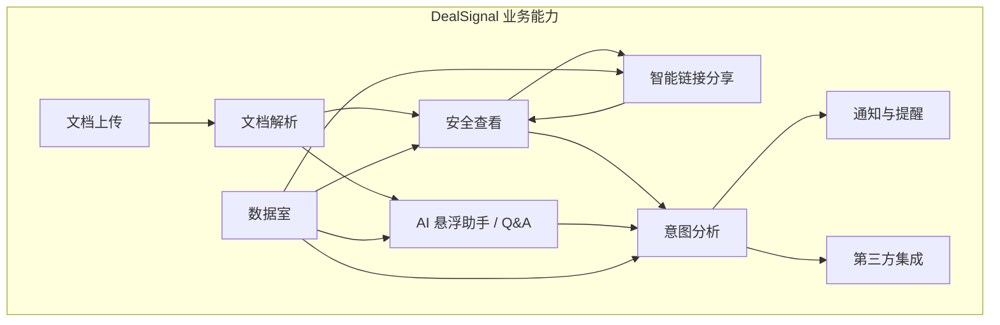

### 3.2 说明

| 属性 | 内容 |
|------|------|
| 用途 | 表达 DealSignal v2.1.0 支撑的核心业务能力及其依赖关系，覆盖“上传 → 解析 → 分享 → 查看 → 问答 → 洞察 → 跟进”完整闭环 |
| 读者 | 产品、业务、架构师 |
| 更新频率 | 每个大版本 |
| 对应 PRD | PRD-v2.1.0 第 7 章“解决方案概述”、第 8 章“功能需求” |


---

## 4. 系统架构图

### 4.1 图：C4 Container 级别系统架构

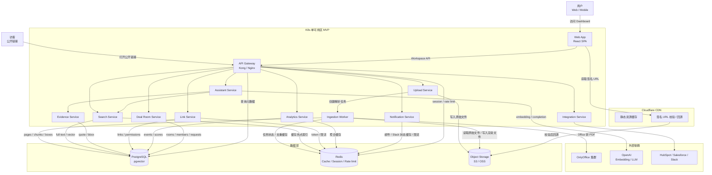

### 4.2 组件说明

| 组件 | 技术栈 | 职责 | 对应 TDD 章节 |
|------|--------|------|---------------|
| Web App | React 18 + Vite + TypeScript | Dashboard、Viewer、AI 助手、数据室等前端界面，基于 Canvas 渲染页面与水印 overlay | PRD-v2.1.0 前端设计（TDD 第 6.3 节 Viewer Frontend 作为实现参考） |
| API Gateway | Kong / Nginx + OpenTelemetry | 路由、鉴权、限流、租户/Workspace 上下文解析、日志与 trace 入口 | TDD-v2.1.0 第 5.6 节“路由策略” |
| Upload Service | Go 1.22+ + Gin | 文件上传、校验、hash、去重、创建 ingestion_job、生成直传 URL | TDD-v2.1.0 第 6.1 节“Upload Service” |
| Ingestion Worker | Go 1.22+ + PDF 处理库（如 go-fitz / pdfcpu）+ OnlyOffice | 异步解析 PDF / Office，生成 webp、chunks、boxes、embedding，更新文档状态 | TDD-v2.1.0 第 6.2 节“Ingestion Worker” |
| Search Service | Go 1.22+ + pgx + pgvector | exact / full-text / vector / hybrid search，返回候选 chunks | TDD-v2.1.0 第 6.4 节“Search Service” |
| Evidence Service | Go 1.22+ | 将 Search Service 结果聚合成 quote + page + bbox 的 evidence 列表 | TDD-v2.1.0 第 6.5 节“Evidence Service” |
| Assistant Service | Go 1.22+ + openai-go | 基于 evidence 调用 LLM 生成回答，管理 assistant_sessions 上下文 | TDD-v2.1.0 第 6.6 节“Assistant Service” |
| Link Service | Go 1.22+ + Gin + sqlc + pgx | 智能链接创建、权限策略、token 校验、访问日志、链接生命周期 | TDD-v2.1.0 第 6.7 节“Link & Permission Service” |
| Analytics Service | Go 1.22+ | 行为事件采集、热度评分、跟进建议、聚合分析 | TDD-v2.1.0 第 6.8 节“Analytics Service” |
| Notification Service | Go 1.22+ + SMTP / Slack Webhook | 邮件通知、Slack 提醒、事件合并与重试 | TDD-v2.1.0 第 6.9 节“Notification Service” |
| Deal Room Service | Go 1.22+ + Gin + sqlc + pgx | 数据室结构、成员权限、访问审批、NDA gating、Q&A | TDD-v2.1.0 第 6.10 节“Deal Room Service” |
| Integration Service | Go 1.22+ | CRM 同步、Slack 集成、第三方 OAuth 与 webhook 管理 | TDD-v2.1.0 第 6.11 节“Integration Service” |
| OnlyOffice 集群 | OnlyOffice Document Server（自托管） | Office 文档转 PDF、格式兼容处理 | TDD-v2.1.0 第 6.2 节“Ingestion Worker” |
| PostgreSQL | RDS PostgreSQL 15 + pgvector 扩展 | 业务数据、文档元数据、chunks、向量索引、审计日志 | TDD-v2.1.0 第 4.2 节“表结构设计” |
| Redis | ElastiCache / 阿里云 Redis | 缓存、会话、限流、评分聚合缓存 | TDD-v2.1.0 第 8.2 节“缓存策略”、第 8.3 节“异步处理” |
| Object Storage | S3 / 阿里云 OSS（私有 bucket） | 原始文件、PDF canonical、page webp、缩略图 | TDD-v2.1.0 第 7.3 节“对象存储安全” |
| CDN | Cloudflare | 静态资源分发、签名 URL 校验、DDoS 防护 | TDD-v2.1.0 第 7.4 节“签名 URL 安全” |
| OpenAI | OpenAI API / 兼容 Embedding & LLM | text-embedding 与 chat completion，用于搜索向量与 AI 问答 | TDD-v2.1.0 第 6.6 节“Assistant Service” |

### 4.3 说明

| 属性 | 内容 |
|------|------|
| 用途 | 表达 DealSignal v2.1.0 的容器级边界、服务间调用关系及外部依赖，作为后端拆分、接口设计与联调的统一参考 |
| 读者 | 开发、测试、运维 |
| 更新频率 | 每次架构变更 |
| 对应 TDD | TDD-v2.1.0 第 6 章“核心模块设计” |


---

## 5. 部署架构图

### 5.1 图：生产环境部署拓扑

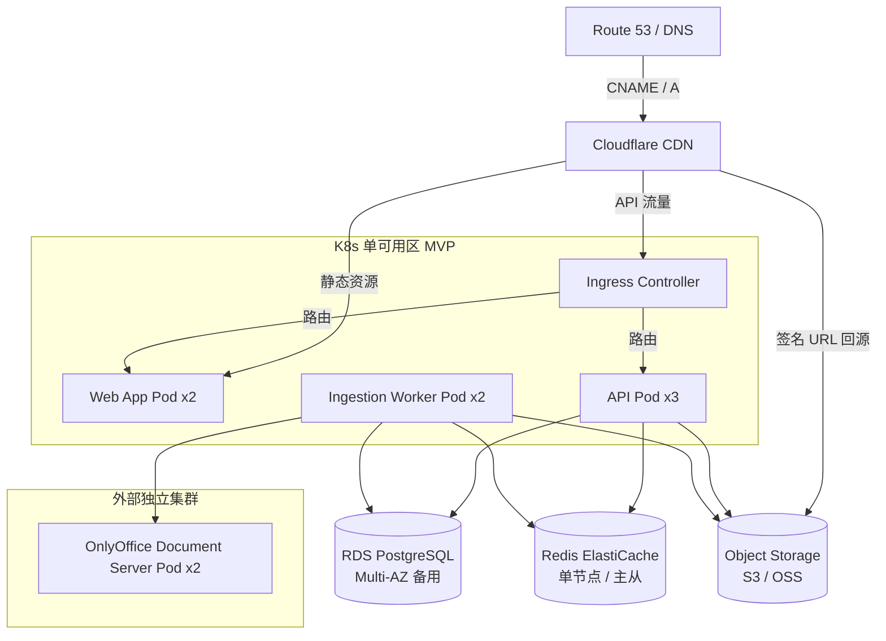

### 5.2 说明

| 属性 | 内容 |
|------|------|
| 用途 | 描述 MVP 阶段单可用区 K8s 部署方式，以及 RDS、Redis、OSS、CDN、OnlyOffice 的位置与访问关系；明确 MVP 高可用边界与后续扩展方向 |
| 读者 | 运维、SRE、架构 |
| 更新频率 | 每次基础设施变更 |
| 对应 TDD | TDD-v2.1.0 第 9 章“部署与运维” |

---

## 6. 数据流图

### 6.1 上传 → 解析数据流

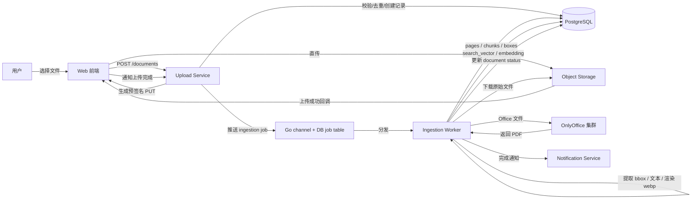

#### 数据流说明

| 步骤 | 数据 | 来源 | 去向 | 存储/处理 |
|------|------|------|------|-----------|
| 1 | 原始文件二进制 | 用户 | Web 前端 → Upload Service | OSS（私有 bucket） |
| 2 | 文档元数据 | Upload Service | PostgreSQL | documents、document_files |
| 3 | 解析任务 | Upload Service | PostgreSQL / Go dispatcher | `ingestion_jobs` 表 + Go channel |
| 4 | 转换后 PDF / webp | Ingestion Worker | OSS | document_files（PDF_CANONICAL / PAGE_WEBP） |
| 5 | 页面、chunk、box、向量 | Ingestion Worker | PostgreSQL | document_pages、document_chunks、chunk_boxes |
| 6 | 状态与通知 | Ingestion Worker | PostgreSQL / Notification Service | document status、邮件通知 |

### 6.2 安全查看与签名 URL 数据流

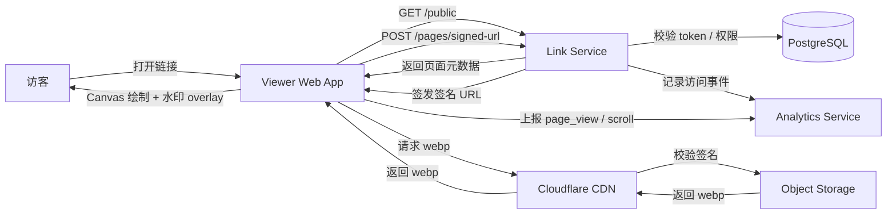

#### 数据流说明

| 步骤 | 数据 | 来源 | 去向 | 存储/处理 |
|------|------|------|------|-----------|
| 1 | 公开链接 token | 访客 | Link Service | links 表校验 |
| 2 | 页面元数据 | Link Service | Viewer | document_pages |
| 3 | 签名 image URL | Link Service | Viewer | Cloudflare URL Signing |
| 4 | webp 图片 | Object Storage | CDN → Viewer | 签名临时访问 |
| 5 | 阅读行为事件 | Viewer | Analytics Service | page_views、events |
| 6 | 动态水印信息 | Link Service | Viewer | 前端 Canvas overlay 绘制 |

### 6.3 AI 问答数据流

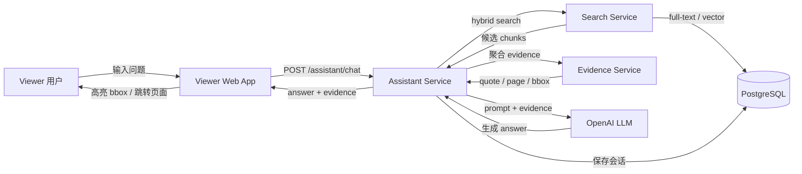

#### 数据流说明

| 步骤 | 数据 | 来源 | 去向 | 存储/处理 |
|------|------|------|------|-----------|
| 1 | 用户问题 + 会话上下文 | Viewer | Assistant Service | assistant_sessions |
| 2 | hybrid search 请求 | Assistant Service | Search Service | exact / full-text / vector |
| 3 | 候选 chunk | PostgreSQL | Search Service | document_chunks、chunk_boxes |
| 4 | evidence（quote / page / bbox） | Evidence Service | Assistant Service | 内存聚合 |
| 5 | LLM answer | OpenAI | Assistant Service | 基于 evidence 生成 |
| 6 | 回答与引用 | Assistant Service | Viewer | 自动定位与高亮 |


---

## 7. 业务流程图

### 7.1 创建智能链接

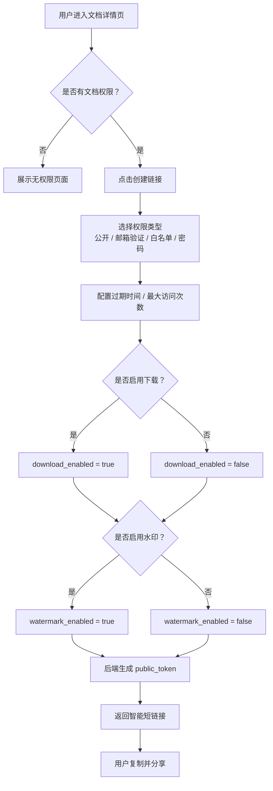

#### 业务规则

| 规则编号 | 规则 | 对应 PRD |
|----------|------|----------|
| BR-LINK-01 | 文档状态必须为 READY 才能创建链接 | FR-07 |
| BR-LINK-02 | 同一文档可创建多个独立配置的智能链接 | FR-07 |
| BR-LINK-03 | 公开链接使用品牌方自定义域名 + query token 形式，token 不可预测 | FR-07、FR-08 |
| BR-LINK-04 | 权限变更（禁用/撤回/修改）实时生效 | FR-08 |

### 7.2 Workspace 邀请

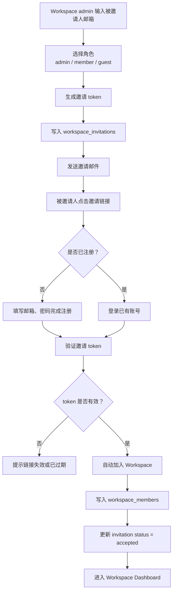

#### 业务规则

| 规则编号 | 规则 | 对应 PRD |
|----------|------|----------|
| BR-INV-01 | 仅 tenant admin 可创建 Workspace 邀请 | 6.3 技术约束 |
| BR-INV-02 | 邀请 token 默认有效期 7 天，最大 30 天 | 6.3 技术约束 |
| BR-INV-03 | 注册后自动加入对应 Workspace，角色为 member | FR-13、路径 D |
| BR-INV-04 | 同一邮箱未被接受前不可重复发送有效邀请 | workspace_invitations 唯一约束 |

### 7.3 数据室访问申请

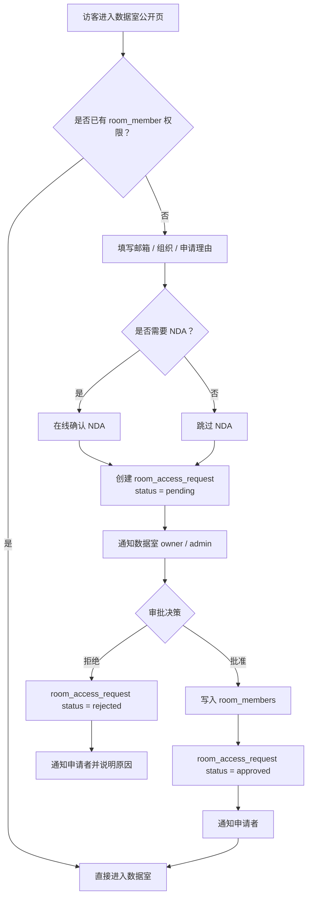

#### 业务规则

| 规则编号 | 规则 | 对应 PRD |
|----------|------|----------|
| BR-ROOM-01 | 未注册访客可通过邮箱申请访问，审批通过后以邮箱标识加入 room_members | FR-13 |
| BR-ROOM-02 | NDA 未确认前限制访问敏感资料 | FR-12 |
| BR-ROOM-03 | 审批操作记录审计日志，防止越权审批 | FR-13 |
| BR-ROOM-04 | 权限变更后已打开会话按新权限生效 | FR-12 |

---

## 8. 时序图

### 8.1 文档上传端到端时序

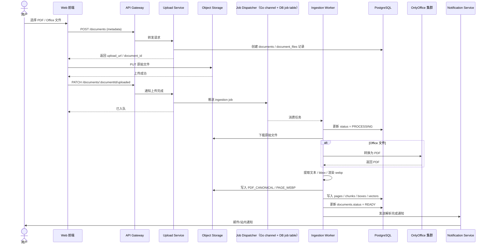

#### 时序图使用说明

| 属性 | 内容 |
|------|------|
| 用途 | 指导上传、直传、异步解析、通知全链路的接口实现与错误处理 |
| 涉及服务 | Web 前端、API Gateway、Upload Service、Object Storage、Redis、Ingestion Worker、PostgreSQL、OnlyOffice、Notification Service |
| 关键数据 | document_id、source_hash、upload_url、ingestion_job、pages、chunks、boxes、document.status |
| 异常分支 | 文件超大/格式错误返回 400；上传中断可重试；解析失败 status = FAILED 并通知；OnlyOffice 不可用时降级或重试 |
| 对应 TDD | TDD-v2.1.0 第 6.1 节“Upload Service”、第 6.2 节“Ingestion Worker” |
| 对应 API | API-01、API-02 |

### 8.2 公开链接访问时序

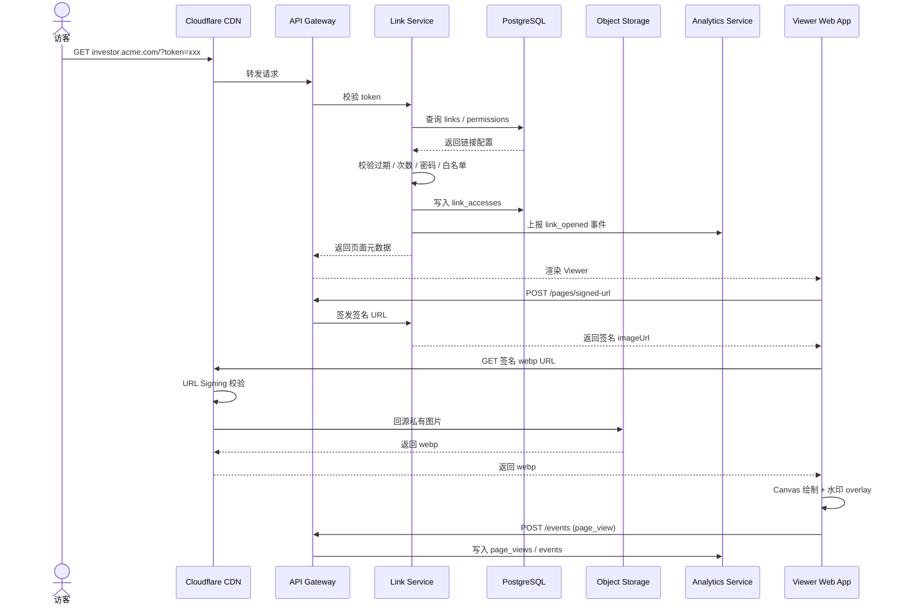

#### 时序图使用说明

| 属性 | 内容 |
|------|------|
| 用途 | 指导公开链接落地页、权限校验、签名 URL、CDN 回源、行为上报的完整交互 |
| 涉及服务 | Cloudflare、API Gateway、Link Service、PostgreSQL、Object Storage、Analytics Service、Viewer Web App |
| 关键数据 | public_token、link_accesses、page 元数据、签名 imageUrl、page_views |
| 异常分支 | token 无效/过期/超限返回拦截页；签名 URL 过期返回 403；OSS 不可用时 CDN 缓存兜底 |
| 对应 TDD | TDD-v2.1.0 第 6.7 节“Link & Permission Service”、第 6.8 节“Analytics Service” |
| 对应 API | API-03、API-04、API-05、API-09 |

### 8.3 AI 问答时序

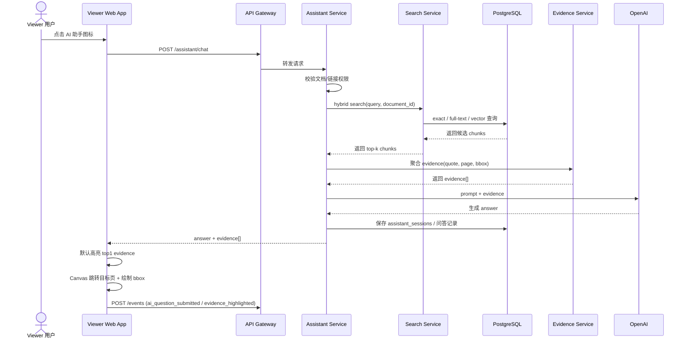

#### 时序图使用说明

| 属性 | 内容 |
|------|------|
| 用途 | 指导 AI 悬浮助手从提问、搜索、证据聚合、LLM 生成到前端高亮的完整时序 |
| 涉及服务 | Viewer Web App、API Gateway、Assistant Service、Search Service、PostgreSQL、Evidence Service、OpenAI |
| 关键数据 | query、chunks、evidence、answer、assistant_sessions、events |
| 异常分支 | 无搜索结果时拒绝编造；LLM 不可用时返回服务暂不可用；bbox 异常时忽略该引用 |
| 对应 TDD | TDD-v2.1.0 第 6.4 节“Search Service”、第 6.5 节“Evidence Service”、第 6.6 节“Assistant Service” |
| 对应 API | API-06、API-07 |


---

## 9. 状态图

### 9.1 文档生命周期状态

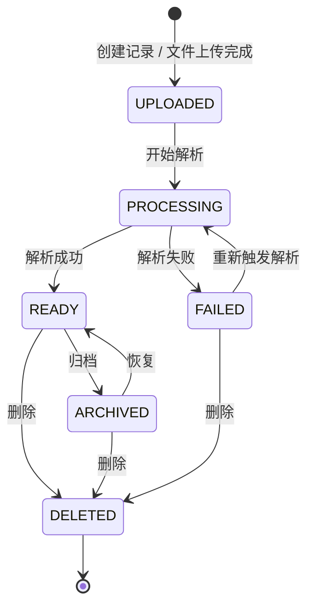

#### 状态说明

| 状态 | 说明 | 可执行操作 | 对应事件 |
|------|------|------------|----------|
| UPLOADED | 已上传，等待解析 | 触发解析、删除 | document_uploaded |
| PROCESSING | 解析中 | 查询进度 | ingestion_job_created |
| READY | 可查看、可分享、可分析 | 查看、创建链接、AI 问答、归档 | document_ingestion_completed |
| FAILED | 解析失败 | 重试、删除 | document_ingestion_failed |
| ARCHIVED | 已归档，不主动展示 | 恢复、删除 | document_archived |
| DELETED | 已删除（逻辑或物理） | - | document_deleted |

### 9.2 链接生命周期状态

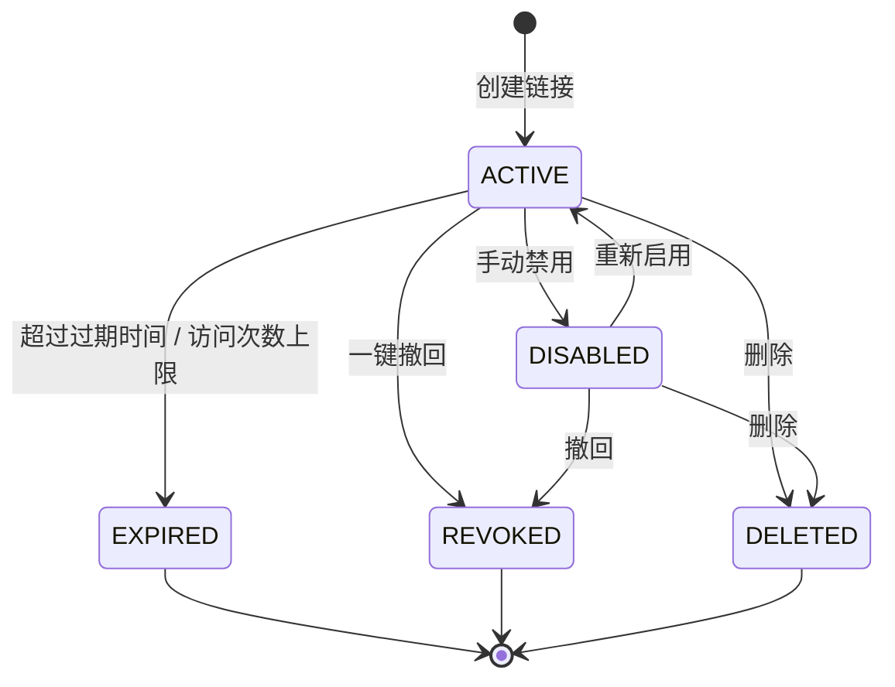

#### 状态说明

| 状态 | 说明 | 可执行操作 | 对应事件 |
|------|------|------------|----------|
| ACTIVE | 生效中，可正常访问 | 访问、编辑、禁用、撤回、删除 | link_created |
| DISABLED | 被手动禁用，访问被拒绝 | 启用、撤回、删除 | link_disabled |
| EXPIRED | 过期或达到最大访问次数 | 查看日志、删除 | link_expired |
| REVOKED | 已撤回，永久不可访问 | 查看日志、删除 | link_revoked |
| DELETED | 已删除 | - | link_deleted |

### 9.3 数据室访问申请生命周期状态

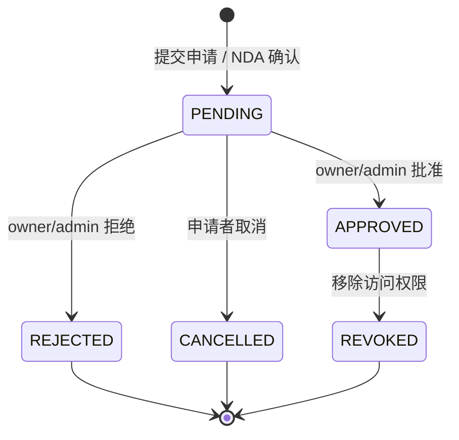

#### 状态说明

| 状态 | 说明 | 可执行操作 | 对应事件 |
|------|------|------------|----------|
| PENDING | 待审批 | owner/admin 审批、申请者取消 | deal_room_access_requested |
| APPROVED | 已批准，授予 room_member 权限 | 进入数据室、后续可撤销 | deal_room_access_approved |
| REJECTED | 已拒绝 | 查看拒绝原因、可再次申请 | deal_room_access_rejected |
| CANCELLED | 申请者主动取消 | - | deal_room_access_cancelled |
| REVOKED | 已授予权限被收回 | - | deal_room_access_revoked |

---

## 10. 实体关系图（ERD）

### 10.1 图：核心数据模型

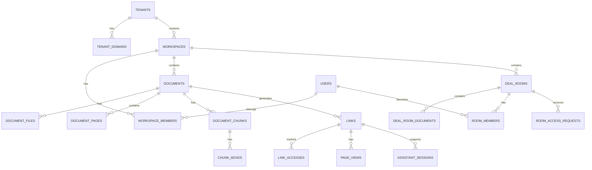

### 10.2 说明

| 属性 | 内容 |
|------|------|
| 用途 | 表达 DealSignal v2.1.0 核心实体及其关系，指导数据库表设计与 API 资源建模；所有业务表均含 `tenant_id` + `workspace_id` 实现行级隔离 |
| 读者 | 后端、DBA、数据 |
| 详细 DDL | 参见 `docs/database-model-v2.1.0.md` 与 `docs/TDD-v2.1.0.md` 第 8 章“数据模型” |

---

## 11. 图表管理规范

### 11.1 命名规范

图表源文件统一采用 `小写英文-连字符-v数字` 格式，名称中包含图表类型与业务对象，便于检索与排序。

| 图表 | 命名示例 |
|------|----------|
| 业务架构图 | `business-architecture-v1` |
| 系统架构图 | `system-architecture-v1` |
| 部署拓扑图 | `deployment-topology-v1` |
| 上传解析数据流图 | `upload-ingestion-dataflow-v1` |
| 创建智能链接流程图 | `create-smart-link-flow-v1` |
| 文档上传时序图 | `document-upload-sequence-v1` |
| 文档生命周期状态图 | `document-state-v1` |
| 核心 ERD | `core-erd-v1` |

### 11.2 版本管理

- 图表与代码一同版本控制，源文件统一使用 Mermaid 文本格式。
- 大版本变更（如服务拆分、新增核心模块）升级主版本号。
- 小调整（如新增字段、修正箭头）升级次版本号。
- 每次变更需在本文档第 1.1 节“变更日志”中登记。

### 11.3 维护责任

| 图表类型 | 维护责任人 | 触发更新条件 |
|----------|------------|--------------|
| 业务架构图 | 产品负责人 / 架构师 | 业务领域调整 |
| 系统架构图 | 架构师 | 服务拆分/合并/引入新组件 |
| 部署拓扑图 | SRE / 运维负责人 | 基础设施变更 |
| 数据流图 | 后端负责人 / 数据工程师 | 数据处理链路变更 |
| 业务流程图 | 产品经理 | 业务流程变更 |
| 时序图 | 后端负责人 | 接口交互变更 |
| 状态图 | 后端负责人 | 实体状态变更 |
| ERD | 后端负责人 / DBA | 表结构变更 |

### 11.4 与 PRD/TDD 的引用方式

在 PRD 中：
```markdown
- 业务流程详见 [docs/ARCHITECTURE-v2.1.0.md#7-业务流程图](ARCHITECTURE-v2.1.0.md)。
```

在 TDD 中：
```markdown
- 系统架构详见 [docs/ARCHITECTURE-v2.1.0.md#4-系统架构图](ARCHITECTURE-v2.1.0.md)。
- 时序图详见 [docs/ARCHITECTURE-v2.1.0.md#8-时序图](ARCHITECTURE-v2.1.0.md)。
- 状态图详见 [docs/ARCHITECTURE-v2.1.0.md#9-状态图](ARCHITECTURE-v2.1.0.md)。
- 数据流图详见 [docs/ARCHITECTURE-v2.1.0.md#6-数据流图](ARCHITECTURE-v2.1.0.md)。
```

---

## 12. 检查清单

- [x] 所有核心业务流程都有流程图
- [x] 所有关键接口交互都有时序图
- [x] 所有核心实体都有状态图
- [x] 系统架构图覆盖所有服务/组件
- [x] 部署架构图与 MVP 生产环境一致
- [x] 数据流图覆盖 P0 数据链路（上传解析、安全查看、AI 问答）
- [x] ERD 与数据库模型一致
- [x] 图表源文件已纳入版本控制
- [x] PRD 中引用了对应的业务流程图
- [x] TDD 中引用了对应的架构/时序/状态图
- [x] 图表版本号与资源版本号一致
- [x] 图表有明确维护责任人

