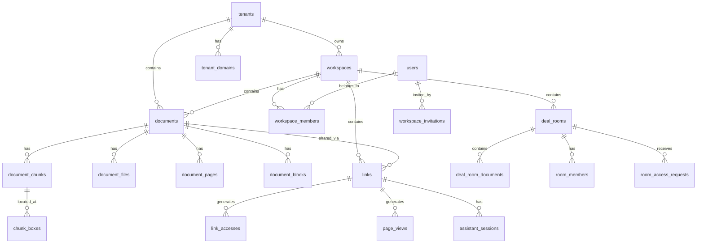

# TDD：DealSignal — 智能文档分享与交易信号平台 v2.1.0

> **文档编号**：`TDD-2024-001`  
> **版本**：`v2.1.0`  
> **模板版本**：`v2`  
> **状态**：`已批准`  
> **编写人/适用对象**：`技术团队`  
> **编写日期**：`2026-06-20`  
> **关联文档**：  
> - `docs/PRD-v2.1.0.md`  
> - `docs/database-model-v2.1.0.md`  
> - `docs/ARCHITECTURE-v2.1.0.md`  
> - `docs/IMPLEMENTATION-PLAN-v2.1.0.md`  
> - `docs/QA-TEST-PLAN-v2.1.0.md`  
> **评审人**：`架构师、后端负责人、前端负责人、DevOps、安全负责人、测试负责人`  
> **AI 置信度**：`high`  
> **AI 红线**：执行前必须通读本 TDD 的 `ai_red_flags` 与第 8 节「性能设计」。  
> **待人工确认事项**：`OnlyOffice 部署、LLM 模型版本、Cloudflare URL Signing 密钥轮转`

---

## 0. 文档使用说明

本文档为 DealSignal v2.1.0 的技术设计文档（Technical Design Document，TDD），基于 `docs/PRD-v2.1.0.md` 编制，面向架构师、开发工程师、测试工程师、DevOps、安全工程师、SRE。

TDD 目标：
- 将 PRD 中的功能需求落盘为可实施的技术方案。
- 明确系统边界、服务职责、数据模型、接口契约、安全策略、性能目标、部署拓扑。
- 为开发、测试、运维提供统一的技术上下文与决策依据。
- 定义生产级基线：可观测性、可恢复性、可扩展性、成本可控。

**使用方式**：
- 章节按 `[必须]` / `[推荐]` / `[可选]` 标注；初创团队可裁剪可选章节，DealSignal 涉及融资/投资敏感材料，建议保留全部安全与合规章节。
- 本文档已用实际内容替换所有 `{占位符}` 与 TODO 标记。
- 所有 P0 接口均提供 OpenAPI 风格契约；所有 P0 数据表均提供 DDL 与索引示例。

### 0.1 LLM / Agent 消费指引

当本 TDD 被 AI Agent 或 LLM 消费时，建议按以下顺序加载上下文：

| 顺序 | 内容 | 说明 |
|------|------|------|
| 1 | front matter | 获取版本、状态、owner、linked_prd、ai_red_flags、pending_confirmation |
| 2 | 第 0 节使用说明 | 理解模板目标与裁剪策略 |
| 3 | 第 2 节范围与上下文 | 理解系统边界与依赖 |
| 4 | 第 3 节总体架构 | 理解服务/组件/数据流 |
| 5 | 第 4 节数据模型 + 第 5 节接口契约 | 理解核心 schema 与 API |
| 6 | 第 8 节性能设计 | 加载性能、安全、可靠性约束 |
| 7 | 其他章节按需加载 | 上下文受限时可跳过部署拓扑、成本估算等 |

**分块策略**：
- 若全文超过模型上下文上限 60%，先读取范围、架构、数据模型、接口契约、性能设计。
- 具体部署命令、监控面板配置等可在实现阶段按需拉取。
- `ai_red_flags` 与 `pending_confirmation` 必须在任何生成/修改动作前加载。

---

## 1. 文档控制信息

### 1.1 变更日志

| 版本 | 日期 | 修改人 | 修改内容 | 影响范围 |
|------|------|--------|----------|----------|
| v0.1.1-sync | 2026-06-21 | 技术团队 | 对齐前端实际栈与 i18n：React 19 + React Router 8 + Vite 8 + Tailwind CSS 4 + Base UI；双语 `en`/`zh-CN` 已落地 | 第 2、6 章 |
| v0.1.0 | 2026-06-20 | 技术团队 | 初始版本，基于 PRD-v2.1.0 编制技术方案 | 全文档 |

### 1.2 关联文档

| 文档类型 | 名称 | 路径 |
|----------|------|------|
| PRD | 《PRD-v2.1.0》 | `docs/PRD-v2.1.0.md` |
| 数据库模型 | 《database-model-v2.1.0》 | `docs/database-model-v2.1.0.md` |
| 产品路线图 | 《IMPLEMENTATION-PLAN-v2.1.0》 | `docs/IMPLEMENTATION-PLAN-v2.1.0.md` |
| 设计稿 | 《UI-DESIGN-DELIVERABLE-v2.1.0》 | `docs/UI-DESIGN-DELIVERABLE-v2.1.0.md` |
| 架构与流程图 | 《ARCHITECTURE-v2.1.0》 | `docs/ARCHITECTURE-v2.1.0.md` |
| 架构决策记录 | ADR | `docs/adr/` |

### 1.3 评审记录

| 轮次 | 日期 | 参与人 | 结论 | 待办 |
|------|------|--------|------|------|
| 技术初审 | 2026-06-20 | 架构师、后端负责人 | 通过 | 后端栈统一为 Go，异步队列为 Go channel + DB job table |
| 安全评审 | 2026-06-20 | 安全负责人 | 通过 | 签名 URL、租户隔离、审计日志策略已确认 |
| 最终评审 | 2026-06-20 | 全体 | 已批准 | 确认 OnlyOffice / LLM / Cloudflare 密钥轮转方案；TDD 进入执行阶段 |

---

## 2. 概述与目标

### 2.1 设计目标

将 PRD 中定义的功能需求落盘为可实施的技术方案，重点解决以下技术问题：

1. **多格式文档安全解析与预览**：PDF / Office 文档上传后，统一转 PDF、提取语义与 bbox、渲染为 webp，并通过后端签名 CDN URL 在 Canvas 上安全绘制。
2. **AI 悬浮助手问答与原文定位**：基于 hybrid search（exact + full-text + vector）检索 evidence，由 LLM 生成带引用的回答，并在 Canvas 上自动跳转与高亮对应 bbox。
3. **多租户 + Workspace 混合隔离**：对外通过子域名/自定义域名识别租户，对内通过 `tenant_id` + `workspace_id` 行级隔离数据。
4. **意图分析与行为驱动通知**：基于页面级阅读事件计算热度评分，触发邮件/Slack 提醒与跟进建议。

### 2.2 设计原则

| 原则 | 说明 | 落地方式 |
|------|------|----------|
| **服务自治** | 每个服务独立部署、独立扩展、独立回滚 | 模块化 Go 服务 + CI/CD 独立流水线；核心服务编译为独立二进制，必要时拆分为独立 worker 进程 |
| **数据安全优先** | 多租户严格隔离，所有敏感访问鉴权 | 行级隔离 + 签名 URL + 审计日志 |
| **异步解耦** | 重操作不阻塞核心链路 | Go channel + DB job table（ingestion_jobs 等）本地分发；状态持久化在 PostgreSQL，支持重试、死信与可观测性；Redis 用于缓存/会话/限流 |
| **可观测性** | 日志、指标、追踪覆盖所有核心路径 | OpenTelemetry + Prometheus/Grafana + 结构化日志 |
| **成本可控** | 资源按需分配，避免过度设计 | 单可用区起步，按业务量扩展 |
| **可恢复性** | 单点故障可自动恢复，数据可恢复 | 主从复制、定期备份、灾难恢复预案 |

### 2.3 范围边界

**包含**：
- 文档上传与校验（Upload Service）
- 异步文档解析 pipeline（Ingestion Worker）：PDF / Office 转 PDF、webp 渲染、chunk/bbox 生成
- 安全文档查看（Viewer）：签名 URL、Canvas 渲染、阅读行为采集
- AI 悬浮助手（Search / Evidence / Assistant Service）
- 智能链接与权限（Link & Permission Service）
- 意图分析（Analytics Service）：热度评分、跟进建议
- 数据室（Deal Room Service）
- 通知（Notification Service）：邮件
- 集成（Integration Service）：CRM / Slack
- 多租户/Workspace 认证与授权
- 对象存储、CDN、pgvector、Redis 基础设施集成

**不包含**（明确排除，避免范围蔓延）：
- AI 自动改 deck / 生成完整材料
- 完整电子签与复杂合同协作
- 原生视频会议
- 复杂 BI 报表与企业级 DLP
- 法律级 DRM 保护
- 自建邮件群发系统
- CSV 导出
- Markdown 文档上传与解析
- 多语言（已作为 v2.1.1 增强提前落地：支持 `en` / `zh-CN`，默认 `en`）
- 数据驻留、SSO/SCIM

---

## 3. 架构总览

### 3.1 系统架构图

```text
┌───────────────────────────────────────────────────────────────────────────────────┐
│                                    用户访问层                                       │
│  ┌──────────────┐  ┌──────────────┐  ┌─────────────────────────────────────────┐  │
│  │   Web App    │  │  Public      │  │  Custom Domain / Brand Pages            │  │
│  │ (React 19 +  │  │  Viewer      │  │  (investor.fund.com)                    │  │
│  │  Vite 8)     │  │  Landing     │  │                                         │  │
│  └──────┬───────┘  └──────┬───────┘  └──────────────────┬──────────────────────┘  │
│         └─────────────────┴─────────────────────────────┘                         │
│                              │                                                    │
│                    Cloudflare CDN + URL Signing                                   │
│                              │                                                    │
└──────────────────────────────┼────────────────────────────────────────────────────┘
                               │
                    ┌──────────┴──────────┐
                    │    API Gateway      │
                    │  (Traefik / Nginx)  │
                    │                     │
                    │  SSL 终止 / Host 解析│
                    │  路由 / 限流 / WAF   │
                    └──────────┬──────────┘
                               │
        ┌──────────────────────┼──────────────────────┐
        │                      │                      │
   ┌────┴────┐           ┌────┴────┐           ┌────┴────┐
   │ Web API │           │ Public  │           │Upload   │
   │  (Gin)  │           │ API     │           │Service  │
   │         │           │  (Gin)  │           │  (Gin)  │
   └────┬────┘           └────┬────┘           └────┬────┘
        │                      │                      │
        └──────────────────────┼──────────────────────┘
                               │
        ┌──────────────────────┼──────────────────────┐
        │                      │                      │
   ┌────┴────┐           ┌────┴────┐           ┌────┴────┐
   │ Search  │           │Evidence │           │Assistant│
   │ Service │           │ Service │           │ Service │
   │  (Go)   │           │  (Go)   │           │  (Go)   │
   └────┬────┘           └────┬────┘           └────┬────┘
        │                      │                      │
        │               ┌──────┴──────┐             │
        │               │  LLM API    │             │
        │               │(OpenAI-    │             │
        │               │compatible) │             │
        │               └─────────────┘             │
        │                                             │
   ┌────┴─────────────────────────────────────────────┴────┐
   │           Worker 层（Go channel + DB job table）        │
   │  ┌─────────────┐ ┌─────────────┐ ┌─────────────────┐  │
   │  │ Ingestion   │ │ Analytics   │ │ Notification /  │  │
   │  │ Worker      │ │ Worker      │ │ Integration     │  │
   │  │   (Go)      │ │   (Go)      │ │ Worker          │  │
   │  └─────────────┘ └─────────────┘ └─────────────────┘  │
   │                                                       │
   │  ┌─────────────┐ ┌─────────────┐ ┌─────────────────┐  │
   │  │ Link &      │ │ Deal Room   │ │ OnlyOffice      │  │
   │  │ Permission  │ │ Service     │ │ Conversion      │  │
   │  │ Service     │ │   (Go)      │ │ Service         │  │
   │  └─────────────┘ └─────────────┘ └─────────────────┘  │
   └───────────────────────────────────────────────────────┘
                               │
        ┌──────────────────────┼──────────────────────┐
        │                      │                      │
   ┌────┴────┐           ┌────┴────┐           ┌────┴────┐
   │PostgreSQL│          │  Redis  │           │  MinIO  │
   │+ pgvector│          │(Cache / │           │  / S3   │
   │          │          │Session /│           │  / OSS  │
   │          │          │RateLimit│           │         │
   └─────────┘            └─────────┘           └─────────┘
```

**服务说明**：
- **Web App**：React 19 + React Router 8 + Vite 8 + TypeScript + Tailwind CSS 4 + Base UI 前端，面向登录用户（Dashboard、文档管理、链接管理、数据室、设置）。已集成 `i18next`/`react-i18next` 实现 `en`/`zh-CN` 双语，`Zustand` 管理主题/workspace/AI 等全局状态。
- **Public Viewer**：公开文档查看页，面向接收方，无需登录。
- **API Gateway**：Traefik 或 Nginx，负责 SSL 终止、Host 解析为 tenant、路由、基础限流、WAF。
- **Web API**：Go 1.22+ + Gin + sqlc + pgx，处理所有内部 Workspace API。
- **Public API**：Go 1.22+ + Gin，处理公开链接访问、签名 URL、访问申请。
- **Upload Service**：Go + Gin 服务，负责文件上传、校验、hash、创建 ingestion job。
- **Ingestion Worker**：Go worker，基于 `ingestion_jobs` 表轮询 + Go channel 分发，处理 PDF / Office 解析、webp 渲染、chunk/bbox 生成。
- **Search Service**：hybrid search（exact + full-text + vector），Go + pgx + pgvector。
- **Evidence Service**：聚合 quote / page / bbox，Go。
- **Assistant Service**：基于 evidence 调用 OpenAI-compatible LLM，Go + openai-go。
- **Link & Permission Service**：链接创建、权限校验、访问日志，Go + Gin + pgx。
- **Analytics Service**：行为记录、热度评分、跟进建议，Go。
- **Notification Service**：邮件通知发送，Go + Go channel + SendGrid/SES。
- **Deal Room Service**：数据室创建、权限、访问审批、Q&A，Go + Gin + pgx。
- **Integration Service**：CRM / Slack 同步，Go。
- **OnlyOffice Conversion Service**：自托管 OnlyOffice，独立集群，VPC peering。
- **PostgreSQL + pgvector**：主数据库与向量索引。
- **Redis**：缓存、会话、限流。
- **Object Storage**：S3-compatible（MinIO dev / AWS S3 / Aliyun OSS prod）。
- **CDN**：Cloudflare with URL Signing。
- **OpenAI-compatible API**：embedding + chat completions。

### 3.2 服务边界

| 服务 | 职责 | 技术栈 | 部署方式 | 关键 SLO |
|------|------|--------|----------|----------|
| API Gateway | SSL 终止、Host 解析、路由、基础限流、WAF | Traefik / Nginx | K8s / Docker Compose | 可用性 99.99% |
| Web API | 内部 Workspace 业务 API | Go 1.22+ + Gin + sqlc + pgx | K8s / Docker Compose | P99 延迟 < 500ms |
| Public API | 公开链接、签名 URL、访问申请 | Go 1.22+ + Gin | K8s / Docker Compose | P99 延迟 < 200ms |
| Upload Service | 文件上传、校验、hash、创建 ingestion job | Go 1.22+ + Gin | K8s / Docker Compose | 上传 P99 < 2s |
| Ingestion Worker | 文档解析、webp 渲染、chunk/bbox 生成 | Go 1.22+ + Go channel + `ingestion_jobs` 表轮询 | K8s / Docker Compose | 成功率 > 95% |
| Search Service | exact / full-text / vector / hybrid search | Go 1.22+ + pgx + pgvector | K8s / Docker Compose | P95 延迟 < 800ms |
| Evidence Service | quote / page / bbox 聚合 | Go 1.22+ | K8s / Docker Compose | P95 延迟 < 100ms |
| Assistant Service | LLM 调用、answer 生成 | Go 1.22+ + openai-go | K8s / Docker Compose | P95 延迟 < 3s |
| Link & Permission Service | 链接创建、权限校验、访问日志 | Go 1.22+ + Gin + sqlc + pgx | K8s / Docker Compose | P99 延迟 < 50ms |
| Analytics Service | 行为记录、热度评分、跟进建议 | Go 1.22+ + Go channel + DB job 表轮询 | K8s / Docker Compose | 评分延迟 < 1min |
| Notification Service | 邮件通知 | Go 1.22+ + Go channel + SendGrid/SES | K8s / Docker Compose | 发送成功率 > 99% |
| Deal Room Service | 数据室、权限、审批、Q&A | Go 1.22+ + Gin + sqlc + pgx | K8s / Docker Compose | P99 延迟 < 300ms |
| Integration Service | CRM / Slack 同步 | Go 1.22+ + Go channel + DB job 表轮询 | K8s / Docker Compose | 同步延迟 < 1h |
| CDN | 静态资源与签名内容缓存分发 | Cloudflare | 全局加速 | 缓存命中率 > 90% |

### 3.3 部署拓扑

```text
┌─────────────────────────────────────────────────────────────┐
│              生产环境（Production）                          │
│  ┌─────────────────────────────────────────────────────┐   │
│  │           云厂商 K8s 集群（单可用区起步）              │   │
│  │                                                     │   │
│  │  ┌─────────┐ ┌─────────┐ ┌─────────┐ ┌─────────┐  │   │
│  │  │ Web API │ │ Public  │ │ Upload  │ │ Search  │  │   │
│  │  │         │ │ API     │ │ Service │ │ Service │  │   │
│  │  └─────────┘ └─────────┘ └─────────┘ └─────────┘  │   │
│  │  ┌─────────┐ ┌─────────┐ ┌─────────┐ ┌─────────┐  │   │
│  │  │Evidence │ │Assistant│ │ Link &  │ │Analytics│  │   │
│  │  │ Service │ │ Service │ │Perm Svc │ │ Service │  │   │
│  │  └─────────┘ └─────────┘ └─────────┘ └─────────┘  │   │
│  │  ┌─────────┐ ┌─────────┐ ┌─────────┐ ┌─────────┐  │   │
│  │  │Notif.   │ │Deal Room│ │Integr.  │ │Ingestion│  │   │
│  │  │Service  │ │Service  │ │Service  │ │Worker   │  │   │
│  │  └─────────┘ └─────────┘ └─────────┘ └─────────┘  │   │
│  └─────────────────────────────────────────────────────┘   │
│                          │                                  │
│              VPC Peering / 内网连接                          │
│                          ▼                                  │
│  ┌─────────────────────────────────────────────────────┐   │
│  │      OnlyOffice 独立集群（4C8G × 2，并发 10）          │   │
│  └─────────────────────────────────────────────────────┘   │
│                          │                                  │
│                          ▼                                  │
│  ┌─────────────────────────────────────────────────────┐   │
│  │    共享基础设施                                      │   │
│  │  RDS PostgreSQL + pgvector / Redis / OSS / CDN      │   │
│  └─────────────────────────────────────────────────────┘   │
└─────────────────────────────────────────────────────────────┘
```

### 3.4 多环境配置

| 环境 | 用途 | 数据 | 部署方式 | 访问控制 |
|------|------|------|----------|----------|
| 本地 dev | 开发调试 | 模拟数据 | Docker Compose | 本地访问 |
| 开发环境 | 功能联调 | 模拟数据 | K8s namespace | VPN / IP 白名单 |
| Staging | 预发布测试 | 生产脱敏数据 | K8s | 内部访问 |
| Production | 生产服务 | 真实数据 | K8s | 严格审计 |

---

## 4. 数据架构

### 4.1 核心 ER 图



### 4.2 表结构设计

> 完整的数据模型写入 `docs/database-model-v2.1.0.md`，本节保留支撑接口设计的核心表示例。

#### 4.2.1 租户、Workspace 与用户

```sql
CREATE TABLE tenants (
  id uuid PRIMARY KEY DEFAULT gen_random_uuid(),
  slug text UNIQUE NOT NULL,
  name text NOT NULL,
  status text NOT NULL DEFAULT 'active' CHECK (status IN ('active', 'suspended')),
  created_at timestamptz NOT NULL DEFAULT now(),
  updated_at timestamptz NOT NULL DEFAULT now(),
  CONSTRAINT tenants_slug_format CHECK (slug ~ '^[a-z0-9]([a-z0-9-]{1,61})[a-z0-9]$')
);

CREATE TABLE tenant_domains (
  id uuid PRIMARY KEY DEFAULT gen_random_uuid(),
  tenant_id uuid NOT NULL REFERENCES tenants(id) ON DELETE CASCADE,
  domain text UNIQUE NOT NULL,
  domain_type text NOT NULL CHECK (domain_type IN ('subdomain', 'custom', 'public_link')),
  is_primary boolean NOT NULL DEFAULT false,
  ssl_status text NOT NULL DEFAULT 'pending' CHECK (ssl_status IN ('pending', 'active', 'expired', 'failed')),
  created_at timestamptz NOT NULL DEFAULT now(),
  updated_at timestamptz NOT NULL DEFAULT now()
);

CREATE TABLE workspaces (
  id uuid PRIMARY KEY DEFAULT gen_random_uuid(),
  tenant_id uuid NOT NULL REFERENCES tenants(id) ON DELETE CASCADE,
  slug text NOT NULL,
  name text NOT NULL,
  status text NOT NULL DEFAULT 'active',
  created_at timestamptz NOT NULL DEFAULT now(),
  updated_at timestamptz NOT NULL DEFAULT now(),
  UNIQUE (tenant_id, slug),
  CONSTRAINT workspaces_slug_format CHECK (slug ~ '^[a-z0-9][a-z0-9_-]{0,62}[a-z0-9]$')
);

CREATE TABLE users (
  id uuid PRIMARY KEY DEFAULT gen_random_uuid(),
  email text UNIQUE NOT NULL,
  password_hash text,
  status text NOT NULL DEFAULT 'active',
  created_at timestamptz NOT NULL DEFAULT now(),
  updated_at timestamptz NOT NULL DEFAULT now()
);

CREATE TABLE workspace_members (
  id uuid PRIMARY KEY DEFAULT gen_random_uuid(),
  workspace_id uuid NOT NULL REFERENCES workspaces(id) ON DELETE CASCADE,
  user_id uuid NOT NULL REFERENCES users(id) ON DELETE CASCADE,
  role text NOT NULL CHECK (role IN ('owner', 'admin', 'member', 'guest')),
  created_at timestamptz NOT NULL DEFAULT now(),
  updated_at timestamptz NOT NULL DEFAULT now(),
  UNIQUE (workspace_id, user_id)
);

CREATE TABLE workspace_invitations (
  id uuid PRIMARY KEY DEFAULT gen_random_uuid(),
  workspace_id uuid NOT NULL REFERENCES workspaces(id) ON DELETE CASCADE,
  invited_by uuid NOT NULL REFERENCES users(id),
  email text NOT NULL,
  token text UNIQUE NOT NULL,
  role text NOT NULL DEFAULT 'member' CHECK (role IN ('admin', 'member')),
  expires_at timestamptz NOT NULL,
  status text NOT NULL DEFAULT 'pending' CHECK (status IN ('pending', 'accepted', 'expired')),
  created_at timestamptz NOT NULL DEFAULT now(),
  UNIQUE (workspace_id, email, status)
);
```

#### 4.2.2 文档、页面、Chunk 与 Box

```sql
CREATE TABLE documents (
  id uuid PRIMARY KEY DEFAULT gen_random_uuid(),
  tenant_id uuid NOT NULL REFERENCES tenants(id) ON DELETE CASCADE,
  workspace_id uuid NOT NULL REFERENCES workspaces(id) ON DELETE CASCADE,
  title text NOT NULL,
  source_type text NOT NULL CHECK (source_type IN ('pdf', 'docx', 'pptx', 'xlsx')),
  source_hash text NOT NULL,
  status text NOT NULL DEFAULT 'uploaded' CHECK (status IN ('uploaded', 'processing', 'ready', 'failed')),
  page_count integer,
  metadata jsonb DEFAULT '{}',
  created_by uuid REFERENCES users(id),
  created_at timestamptz NOT NULL DEFAULT now(),
  updated_at timestamptz NOT NULL DEFAULT now(),
  UNIQUE (tenant_id, workspace_id, source_hash)
);

CREATE TABLE document_files (
  id uuid PRIMARY KEY DEFAULT gen_random_uuid(),
  tenant_id uuid NOT NULL,
  workspace_id uuid NOT NULL,
  document_id uuid NOT NULL REFERENCES documents(id) ON DELETE CASCADE,
  file_role text NOT NULL CHECK (file_role IN ('original', 'semantic_json', 'pdf_canonical', 'page_webp', 'thumbnail')),
  object_key text NOT NULL,
  content_type text NOT NULL,
  size_bytes bigint,
  created_at timestamptz NOT NULL DEFAULT now(),
  UNIQUE (document_id, file_role, object_key)
);

CREATE TABLE document_pages (
  id uuid PRIMARY KEY DEFAULT gen_random_uuid(),
  tenant_id uuid NOT NULL,
  workspace_id uuid NOT NULL,
  document_id uuid NOT NULL REFERENCES documents(id) ON DELETE CASCADE,
  page_number integer NOT NULL,
  width integer,
  height integer,
  image_object_key text NOT NULL,
  thumbnail_object_key text,
  created_at timestamptz NOT NULL DEFAULT now(),
  UNIQUE (document_id, page_number)
);

CREATE TABLE document_blocks (
  id uuid PRIMARY KEY DEFAULT gen_random_uuid(),
  tenant_id uuid NOT NULL,
  workspace_id uuid NOT NULL,
  document_id uuid NOT NULL REFERENCES documents(id) ON DELETE CASCADE,
  page_number integer NOT NULL,
  block_index integer NOT NULL,
  block_type text NOT NULL,
  bbox jsonb NOT NULL,
  text_content text,
  created_at timestamptz NOT NULL DEFAULT now(),
  UNIQUE (document_id, page_number, block_index)
);

CREATE TABLE document_chunks (
  id uuid PRIMARY KEY DEFAULT gen_random_uuid(),
  tenant_id uuid NOT NULL,
  workspace_id uuid NOT NULL,
  document_id uuid NOT NULL REFERENCES documents(id) ON DELETE CASCADE,
  chunk_index integer NOT NULL,
  normalized_text text NOT NULL,
  search_vector tsvector,
  embedding vector(1536),
  metadata jsonb DEFAULT '{}',
  created_at timestamptz NOT NULL DEFAULT now(),
  UNIQUE (document_id, chunk_index)
);

CREATE TABLE chunk_boxes (
  id uuid PRIMARY KEY DEFAULT gen_random_uuid(),
  tenant_id uuid NOT NULL,
  workspace_id uuid NOT NULL,
  chunk_id uuid NOT NULL REFERENCES document_chunks(id) ON DELETE CASCADE,
  document_id uuid NOT NULL REFERENCES documents(id) ON DELETE CASCADE,
  page_number integer NOT NULL,
  bbox jsonb NOT NULL,
  created_at timestamptz NOT NULL DEFAULT now()
);

CREATE TABLE ingestion_jobs (
  id uuid PRIMARY KEY DEFAULT gen_random_uuid(),
  tenant_id uuid NOT NULL,
  workspace_id uuid NOT NULL,
  document_id uuid NOT NULL REFERENCES documents(id) ON DELETE CASCADE,
  status text NOT NULL DEFAULT 'queued' CHECK (status IN ('queued', 'running', 'completed', 'failed', 'retrying')),
  job_type text NOT NULL CHECK (job_type IN ('pdf', 'office')),
  payload jsonb DEFAULT '{}',
  error_message text,
  attempts integer NOT NULL DEFAULT 0,
  max_attempts integer NOT NULL DEFAULT 3,
  created_at timestamptz NOT NULL DEFAULT now(),
  updated_at timestamptz NOT NULL DEFAULT now()
);
```

#### 4.2.3 链接、访问与行为事件

```sql
CREATE TABLE links (
  id uuid PRIMARY KEY DEFAULT gen_random_uuid(),
  tenant_id uuid NOT NULL,
  workspace_id uuid NOT NULL,
  document_id uuid NOT NULL REFERENCES documents(id) ON DELETE CASCADE,
  public_token text UNIQUE NOT NULL,
  name text,
  permission_type text NOT NULL DEFAULT 'public' CHECK (permission_type IN ('public', 'email_required', 'whitelist', 'password')),
  allowed_emails text[],
  allowed_domains text[],
  password_hash text,
  expires_at timestamptz,
  max_access_count integer,
  access_count integer NOT NULL DEFAULT 0,
  download_enabled boolean NOT NULL DEFAULT false,
  watermark_enabled boolean NOT NULL DEFAULT false,
  notify_enabled boolean NOT NULL DEFAULT true,
  status text NOT NULL DEFAULT 'active' CHECK (status IN ('active', 'revoked')),
  created_by uuid REFERENCES users(id),
  created_at timestamptz NOT NULL DEFAULT now(),
  updated_at timestamptz NOT NULL DEFAULT now()
);

CREATE TABLE link_accesses (
  id uuid PRIMARY KEY DEFAULT gen_random_uuid(),
  tenant_id uuid NOT NULL,
  workspace_id uuid NOT NULL,
  link_id uuid NOT NULL REFERENCES links(id) ON DELETE CASCADE,
  visitor_id text NOT NULL,
  visitor_email text,
  ip_address inet,
  user_agent text,
  access_result text NOT NULL CHECK (access_result IN ('allowed', 'denied_expired', 'denied_max_count', 'denied_password', 'denied_whitelist', 'denied_revoked')),
  created_at timestamptz NOT NULL DEFAULT now()
);

CREATE TABLE page_views (
  id uuid PRIMARY KEY DEFAULT gen_random_uuid(),
  tenant_id uuid NOT NULL,
  workspace_id uuid NOT NULL,
  link_id uuid NOT NULL REFERENCES links(id) ON DELETE CASCADE,
  visitor_id text NOT NULL,
  page_number integer NOT NULL,
  duration_ms integer NOT NULL DEFAULT 0,
  scroll_depth integer NOT NULL DEFAULT 0,
  created_at timestamptz NOT NULL DEFAULT now()
);

CREATE TABLE events (
  id uuid PRIMARY KEY DEFAULT gen_random_uuid(),
  tenant_id uuid NOT NULL,
  workspace_id uuid NOT NULL,
  event_type text NOT NULL,
  user_id uuid,
  visitor_id text,
  session_id text,
  payload jsonb NOT NULL DEFAULT '{}',
  created_at timestamptz NOT NULL DEFAULT now()
);
```

#### 4.2.4 数据室

```sql
CREATE TABLE deal_rooms (
  id uuid PRIMARY KEY DEFAULT gen_random_uuid(),
  tenant_id uuid NOT NULL,
  workspace_id uuid NOT NULL,
  slug text NOT NULL,
  name text NOT NULL,
  template_type text,
  requires_nda boolean NOT NULL DEFAULT false,
  requires_approval boolean NOT NULL DEFAULT false,
  status text NOT NULL DEFAULT 'active',
  created_by uuid REFERENCES users(id),
  created_at timestamptz NOT NULL DEFAULT now(),
  updated_at timestamptz NOT NULL DEFAULT now(),
  UNIQUE (tenant_id, workspace_id, slug)
);

CREATE TABLE deal_room_documents (
  id uuid PRIMARY KEY DEFAULT gen_random_uuid(),
  tenant_id uuid NOT NULL,
  workspace_id uuid NOT NULL,
  room_id uuid NOT NULL REFERENCES deal_rooms(id) ON DELETE CASCADE,
  document_id uuid NOT NULL REFERENCES documents(id) ON DELETE CASCADE,
  folder_path text NOT NULL DEFAULT '/',
  created_at timestamptz NOT NULL DEFAULT now(),
  UNIQUE (room_id, document_id)
);

CREATE TABLE room_members (
  id uuid PRIMARY KEY DEFAULT gen_random_uuid(),
  tenant_id uuid NOT NULL,
  workspace_id uuid NOT NULL,
  room_id uuid NOT NULL REFERENCES deal_rooms(id) ON DELETE CASCADE,
  email text NOT NULL,
  user_id uuid REFERENCES users(id),
  role text NOT NULL CHECK (role IN ('owner', 'admin', 'contributor', 'viewer')),
  nda_confirmed_at timestamptz,
  created_at timestamptz NOT NULL DEFAULT now(),
  updated_at timestamptz NOT NULL DEFAULT now(),
  UNIQUE (room_id, email)
);

CREATE TABLE room_member_folder_permissions (
  id uuid PRIMARY KEY DEFAULT gen_random_uuid(),
  tenant_id uuid NOT NULL,
  workspace_id uuid NOT NULL,
  room_id uuid NOT NULL REFERENCES deal_rooms(id) ON DELETE CASCADE,
  email text NOT NULL,
  folder_path text NOT NULL,
  permission text NOT NULL CHECK (permission IN ('allow', 'deny')),
  created_at timestamptz NOT NULL DEFAULT now(),
  UNIQUE (room_id, email, folder_path)
);

CREATE TABLE room_access_requests (
  id uuid PRIMARY KEY DEFAULT gen_random_uuid(),
  tenant_id uuid NOT NULL,
  workspace_id uuid NOT NULL,
  room_id uuid NOT NULL REFERENCES deal_rooms(id) ON DELETE CASCADE,
  email text NOT NULL,
  reason text,
  status text NOT NULL DEFAULT 'pending' CHECK (status IN ('pending', 'approved', 'rejected')),
  reviewed_by uuid REFERENCES users(id),
  reviewed_at timestamptz,
  created_at timestamptz NOT NULL DEFAULT now(),
  updated_at timestamptz NOT NULL DEFAULT now()
);
```

#### 4.2.5 AI 问答会话

```sql
CREATE TABLE assistant_sessions (
  id uuid PRIMARY KEY DEFAULT gen_random_uuid(),
  tenant_id uuid NOT NULL,
  workspace_id uuid NOT NULL,
  document_id uuid NOT NULL REFERENCES documents(id) ON DELETE CASCADE,
  link_id uuid REFERENCES links(id) ON DELETE SET NULL,
  user_id uuid REFERENCES users(id),
  visitor_id text,
  context jsonb DEFAULT '[]',
  created_at timestamptz NOT NULL DEFAULT now(),
  updated_at timestamptz NOT NULL DEFAULT now()
);

CREATE TABLE assistant_messages (
  id uuid PRIMARY KEY DEFAULT gen_random_uuid(),
  tenant_id uuid NOT NULL,
  workspace_id uuid NOT NULL,
  session_id uuid NOT NULL REFERENCES assistant_sessions(id) ON DELETE CASCADE,
  role text NOT NULL CHECK (role IN ('user', 'assistant', 'system')),
  content text NOT NULL,
  evidence jsonb DEFAULT '[]',
  created_at timestamptz NOT NULL DEFAULT now()
);
```

### 4.3 索引策略

```sql
-- 租户/Workspace 上下文
CREATE INDEX tenants_slug_idx ON tenants (slug);
CREATE INDEX tenant_domains_domain_idx ON tenant_domains (domain);
CREATE INDEX tenant_domains_tenant_idx ON tenant_domains (tenant_id);
CREATE INDEX workspaces_tenant_slug_idx ON workspaces (tenant_id, slug);
CREATE INDEX workspace_members_workspace_user_idx ON workspace_members (workspace_id, user_id);
CREATE INDEX workspace_invitations_token_idx ON workspace_invitations (token);

-- 文档与解析
CREATE INDEX documents_tenant_workspace_status_idx ON documents (tenant_id, workspace_id, status);
CREATE INDEX document_files_document_role_idx ON document_files (document_id, file_role);
CREATE INDEX document_pages_document_page_idx ON document_pages (document_id, page_number);
CREATE INDEX document_chunks_document_idx ON document_chunks (document_id);
CREATE INDEX document_chunks_embedding_idx ON document_chunks USING hnsw (embedding vector_cosine_ops);
CREATE INDEX document_chunks_search_vector_idx ON document_chunks USING GIN (search_vector);
CREATE INDEX chunk_boxes_chunk_idx ON chunk_boxes (chunk_id);
CREATE INDEX chunk_boxes_document_page_idx ON chunk_boxes (document_id, page_number);
CREATE INDEX ingestion_jobs_document_status_idx ON ingestion_jobs (document_id, status);

-- 链接与访问
CREATE INDEX links_public_token_idx ON links (public_token);
CREATE INDEX links_document_idx ON links (document_id);
CREATE INDEX link_accesses_link_created_idx ON link_accesses (link_id, created_at);
CREATE INDEX page_views_link_visitor_page_idx ON page_views (link_id, visitor_id, page_number);
CREATE INDEX events_tenant_workspace_type_created_idx ON events (tenant_id, workspace_id, event_type, created_at);

-- 数据室
CREATE INDEX deal_rooms_tenant_workspace_idx ON deal_rooms (tenant_id, workspace_id);
CREATE INDEX room_members_room_email_idx ON room_members (room_id, email);
CREATE INDEX room_access_requests_room_status_idx ON room_access_requests (room_id, status);

-- AI 会话
CREATE INDEX assistant_sessions_link_visitor_idx ON assistant_sessions (link_id, visitor_id);
CREATE INDEX assistant_messages_session_idx ON assistant_messages (session_id);
```

### 4.4 数据流

#### 4.4.1 文档上传与解析

```text
用户选择文件
    ↓
Web App 调用 POST /{workspaceSlug}/api/v1/documents
    ↓
Upload Service 校验类型/大小/hash
    ↓
写入私有对象存储 tenants/{tenantId}/workspaces/{workspaceId}/documents/{documentId}/original.{ext}
    ↓
创建 documents 记录 + ingestion_jobs 记录
    ↓
Ingestion Worker 从 `ingestion_jobs` 表中轮询 pending 任务，经 Go channel 分发给 worker 池
    ↓
PDF 直接处理 / Office 调用 OnlyOffice 转 PDF
    ↓
提取 bbox、生成 chunks、embedding、tsvector
    ↓
渲染每页为 webp 写入对象存储
    ↓
更新 documents.status = READY
    ↓
发送 EVT-03 document_ingestion_completed 事件
```

#### 4.4.2 文档查看

```text
访问者打开公开链接 /?tenant={slug}&workspace={slug}&token={token}
    ↓
Public API 解析 tenant/workspace，校验 link 权限
    ↓
生成访问会话 visitor_id
    ↓
返回页面元数据（不含原文件 URL）
    ↓
前端请求 POST /public/documents/{id}/pages/signed-url
    ↓
Public API 生成 Cloudflare URL Signing 签名 URL
    ↓
Canvas 加载 webp 并绘制
    ↓
前端定时上报 page_viewed 事件
```

#### 4.4.3 AI 问答

```text
用户在 Viewer 输入问题
    ↓
前端 POST /{workspaceSlug}/api/v1/assistant/chat
    ↓
Assistant Service 调用 Search Service
    ↓
Search Service 执行 exact + full-text + vector，RRF 合并
    ↓
Evidence Service 聚合 quote / page / bbox
    ↓
Assistant Service 构造 prompt 调用 OpenAI-compatible LLM
    ↓
返回 answer + evidence[]
    ↓
前端默认高亮 top1 evidence，自动跳转对应页
```

### 4.5 数据访问示例（sqlc + pgx）

后端使用 **sqlc** 根据 `.sql` 查询文件生成类型安全的 Go 接口，**pgx** 作为 PostgreSQL 驱动。所有业务查询必须在 SQL 中显式携带 `tenant_id` 与 `workspace_id`，由调用方从请求上下文中注入。

**查询定义示例** `internal/db/queries/documents.sql`：

```sql
-- name: ListDocumentsByWorkspace :many
SELECT id, title, source_type, status, page_count, created_at
FROM documents
WHERE tenant_id = $1 AND workspace_id = $2 AND deleted_at IS NULL
ORDER BY created_at DESC
LIMIT $3 OFFSET $4;

-- name: GetDocumentByID :one
SELECT id, title, source_type, status, page_count, created_at
FROM documents
WHERE tenant_id = $1 AND workspace_id = $2 AND id = $3 AND deleted_at IS NULL;
```

**生成代码使用示例** `internal/service/document_service.go`：

```go
package service

import (
    "context"
    "github.com/jackc/pgx/v5/pgtype"
    "github.com/dealsignal/api/internal/db"
)

type DocumentService struct {
    queries *db.Queries
}

func (s *DocumentService) ListDocuments(ctx context.Context, tenantID, workspaceID pgtype.UUID, limit, offset int32) ([]db.Document, error) {
    return s.queries.ListDocumentsByWorkspace(ctx, db.ListDocumentsByWorkspaceParams{
        TenantID:    tenantID,
        WorkspaceID: workspaceID,
        Limit:       limit,
        Offset:      offset,
    })
}
```

**说明**：
- sqlc 在编译期生成参数结构与结果类型，避免手写字符串 SQL。
- pgx 提供连接池、类型映射（uuid、jsonb、timestamptz）与事务支持。
- 不允许在业务代码中拼接 SQL；所有查询必须预先定义并通过 sqlc 生成。
- 向量检索与全文检索仍直接编写 SQL，使用 `pgvector` 与 `tsvector` 扩展，同样由 sqlc 管理。

### 4.6 数据生命周期与归档

| 数据类型 | 保留策略 | 归档方式 | 删除策略 |
|----------|----------|----------|----------|
| 原始文件 | 永久（可配置 90 天/1 年/永久） | 低频存储 | 租户删除后软删除 30 天 |
| 页面 webp | 与文档生命周期一致 | 低频存储 | 文档删除后清理 |
| chunks / embeddings | 与文档生命周期一致 | 数据库级联删除 | 文档删除后清理 |
| events | 默认 1 年 | 二期归档至对象存储 | 按合规要求保留 |
| 审计日志 | 永久 | 不可变存储 | 不可删除 |
| AI 问答日志 | 默认 1 年 | 二期归档 | 按合规要求保留 |

---

## 5. 接口设计

### 5.1 接口设计原则

- RESTful API，JSON 格式。
- **内部 Workspace API 基路径**：`https://{tenantSlug}.dealsignal.com/{workspaceSlug}/api/v1`
- **公开访问 API 基路径**：`https://{publicDomain}/api/v1/public`
- Workspace 上下文通过 URL 路径 `/{workspaceSlug}` 传递；tenant 上下文通过子域名 Host 解析。
- 公开链接落地页使用品牌方自定义域名，通过 query 参数传递 tenant/workspace/token。
- 统一错误响应格式。
- 分页统一使用 cursor 或 offset/limit；列表接口默认 limit=20，max=100。
- 关键写操作要求幂等（`X-Idempotency-Key` 请求头）。
- 所有 P0 接口必须有 OpenAPI 定义（后续补充到 `apps/api/openapi.yaml`）。

### 5.2 通用错误响应

```json
{
  "code": "ERROR_CODE",
  "message": "用户可读的错误描述",
  "details": [
    { "field": "email", "issue": "invalid_format" }
  ],
  "request_id": "req_xxx"
}
```

### 5.3 认证与上下文

| 上下文来源 | 说明 |
|------------|------|
| Tenant | 通过请求 Host（子域名或自定义域名）解析为 tenant UUID；也可通过 token claim 中的 `tid` 兜底 |
| Workspace | 通过 URL 路径 `/{workspaceSlug}` 解析为 workspace UUID |
| User | 通过 JWT / Session Cookie 解析；内部 API 必须携带 `Authorization: Bearer {jwt}` |
| Visitor | 公开链接访问者不登录，使用 visitor_id 标识会话（localStorage / cookie） |
| Service | 服务间调用使用 API Key（`X-API-Key`） |

### 5.4 接口契约

#### 5.4.1 上传与解析

##### API-01：上传文档

```http
POST /{workspaceSlug}/api/v1/documents
Host: {tenantSlug}.dealsignal.com
Authorization: Bearer {jwt}
Content-Type: multipart/form-data
```

**请求参数**：

| 字段 | 类型 | 必填 | 说明 |
|------|------|------|------|
| file | binary | 是 | PDF / DOCX / PPTX / XLSX，最大 100MB |
| source_type | string | 否 | pdf / docx / pptx / xlsx，未提供时从文件名推断 |

**成功响应 201**：

```json
{
  "id": "doc_xxx",
  "title": "Acme Pitch Deck.pdf",
  "source_type": "pdf",
  "status": "uploaded",
  "page_count": null,
  "created_at": "2026-06-20T10:00:00Z"
}
```

**错误码**：

| 错误码 | HTTP 状态 | 说明 |
|--------|-----------|------|
| UNAUTHORIZED | 401 | 未认证或 token 过期 |
| FORBIDDEN | 403 | 无 workspace 写入权限 |
| FILE_TOO_LARGE | 413 | 文件超过 100MB |
| INVALID_FILE_TYPE | 415 | 文件类型不支持 |
| STORAGE_QUOTA_EXCEEDED | 429 | 租户存储配额超限 |
| INTERNAL_ERROR | 500 | 上传失败 |

---

##### API-02：获取文档状态

```http
GET /{workspaceSlug}/api/v1/documents/{documentId}
Host: {tenantSlug}.dealsignal.com
Authorization: Bearer {jwt}
```

**成功响应 200**：

```json
{
  "id": "doc_xxx",
  "title": "Acme Pitch Deck.pdf",
  "source_type": "pdf",
  "status": "ready",
  "page_count": 24,
  "ingestion_job": {
    "id": "job_xxx",
    "status": "completed",
    "error_message": null
  },
  "created_at": "2026-06-20T10:00:00Z",
  "updated_at": "2026-06-20T10:02:30Z"
}
```

**错误码**：

| 错误码 | HTTP 状态 | 说明 |
|--------|-----------|------|
| UNAUTHORIZED | 401 | 未认证 |
| FORBIDDEN | 403 | 无权访问该文档 |
| DOCUMENT_NOT_FOUND | 404 | 文档不存在 |

---

#### 5.4.2 查看与渲染

##### API-03：获取页面列表

```http
GET /{workspaceSlug}/api/v1/documents/{documentId}/pages
Host: {tenantSlug}.dealsignal.com
Authorization: Bearer {jwt}
```

**成功响应 200**：

```json
{
  "document_id": "doc_xxx",
  "pages": [
    {
      "page_number": 1,
      "width": 1440,
      "height": 1920,
      "thumbnail_object_key": "tenants/.../page_1_thumb.webp"
    }
  ],
  "total": 24
}
```

**错误码**：

| 错误码 | HTTP 状态 | 说明 |
|--------|-----------|------|
| UNAUTHORIZED | 401 | 未认证 |
| FORBIDDEN | 403 | 无权限 |
| DOCUMENT_NOT_FOUND | 404 | 文档不存在 |
| DOCUMENT_NOT_READY | 409 | 文档尚未解析完成 |

---

##### API-04：获取签名 URL（内部）

```http
POST /{workspaceSlug}/api/v1/documents/{documentId}/pages/signed-url
Host: {tenantSlug}.dealsignal.com
Authorization: Bearer {jwt}
Content-Type: application/json
```

**请求参数**：

| 字段 | 类型 | 必填 | 说明 |
|------|------|------|------|
| page_number | integer | 是 | 页码，从 1 开始 |
| purpose | string | 否 | view / thumbnail，默认 view |

**成功响应 200**：

```json
{
  "page_number": 1,
  "image_url": "https://cdn.dealsignal.com/...?...signature=...&expires=...",
  "expires_at": "2026-06-20T10:15:00Z",
  "width": 1440,
  "height": 1920
}
```

**错误码**：

| 错误码 | HTTP 状态 | 说明 |
|--------|-----------|------|
| UNAUTHORIZED | 401 | 未认证 |
| FORBIDDEN | 403 | 无权限 |
| PAGE_NOT_FOUND | 404 | 页面不存在 |
| SIGNATURE_ERROR | 500 | 签名生成失败 |

**公开访问签名 URL 变体**：

```http
POST /api/v1/public/documents/{documentId}/pages/signed-url
Host: {publicDomain}
Content-Type: application/json
```

请求体需携带 `token`（link public_token）与 `page_number`；响应同上。

---

#### 5.4.3 阅读事件

##### API-05：上报阅读事件

```http
POST /api/v1/public/events
Host: {publicDomain}
Content-Type: application/json
```

**请求参数**：

| 字段 | 类型 | 必填 | 说明 |
|------|------|------|------|
| token | string | 是 | link public_token |
| visitor_id | string | 是 | 访问者会话 ID |
| events | array | 是 | 事件数组 |
| events[].event_type | string | 是 | link_opened / page_viewed / download_attempted |
| events[].page_number | integer | 否 | page_viewed 必填 |
| events[].duration_ms | integer | 否 | 停留时长 |
| events[].scroll_depth | integer | 否 | 滚动深度百分比 |
| events[].timestamp | string | 是 | ISO 8601 |

**成功响应 200**：

```json
{
  "received": 3,
  "visitor_id": "vst_xxx"
}
```

**错误码**：

| 错误码 | HTTP 状态 | 说明 |
|--------|-----------|------|
| INVALID_TOKEN | 400 | link token 无效 |
| RATE_LIMITED | 429 | 上报过于频繁 |
| INTERNAL_ERROR | 500 | 服务端错误 |

---

#### 5.4.4 AI 搜索与问答

##### API-06：文档内搜索

```http
POST /{workspaceSlug}/api/v1/search
Host: {tenantSlug}.dealsignal.com
Authorization: Bearer {jwt}
Content-Type: application/json
```

**请求参数**：

| 字段 | 类型 | 必填 | 说明 |
|------|------|------|------|
| document_id | string | 是 | 文档 ID |
| query | string | 是 | 搜索关键词/问题 |
| mode | string | 否 | exact / fulltext / vector / hybrid，默认 hybrid |
| top_k | integer | 否 | 返回结果数，默认 5，最大 20 |

**成功响应 200**：

```json
{
  "document_id": "doc_xxx",
  "query": "付款期限",
  "results": [
    {
      "chunk_id": "chk_xxx",
      "score": 0.92,
      "normalized_text": "付款期限为 Net 30 ...",
      "page_number": 5,
      "boxes": [
        { "x": 0.12, "y": 0.34, "w": 0.45, "h": 0.06 }
      ]
    }
  ]
}
```

**错误码**：

| 错误码 | HTTP 状态 | 说明 |
|--------|-----------|------|
| UNAUTHORIZED | 401 | 未认证 |
| FORBIDDEN | 403 | 无文档权限 |
| DOCUMENT_NOT_READY | 409 | 文档未解析完成 |

**公开访问变体**：

```http
POST /api/v1/public/search
Host: {publicDomain}
Content-Type: application/json
```

请求体携带 `token`（link token）替代 `document_id`。

---

##### API-07：AI 问答

```http
POST /{workspaceSlug}/api/v1/assistant/chat
Host: {tenantSlug}.dealsignal.com
Authorization: Bearer {jwt}
Content-Type: application/json
```

**请求参数**：

| 字段 | 类型 | 必填 | 说明 |
|------|------|------|------|
| document_id | string | 是 | 文档 ID |
| query | string | 是 | 用户问题 |
| session_id | string | 否 | 会话 ID，未提供时创建新会话 |

**成功响应 200**：

```json
{
  "session_id": "sess_xxx",
  "answer": "根据文档第 5 页，付款期限为 Net 30。",
  "evidence": [
    {
      "chunk_id": "chk_xxx",
      "quote": "付款期限为 Net 30",
      "page_number": 5,
      "boxes": [
        { "x": 0.12, "y": 0.34, "w": 0.45, "h": 0.06 }
      ],
      "score": 0.92
    }
  ],
  "follow_up_questions": ["逾期付款罚金是多少？", "是否支持分期付款？"]
}
```

**错误码**：

| 错误码 | HTTP 状态 | 说明 |
|--------|-----------|------|
| UNAUTHORIZED | 401 | 未认证 |
| FORBIDDEN | 403 | 无文档权限 |
| DOCUMENT_NOT_READY | 409 | 文档未解析完成 |
| NO_RELEVANT_CONTENT | 200（answer 内提示） | 未找到相关内容 |
| LLM_UNAVAILABLE | 503 | LLM 服务暂不可用 |

**公开访问变体**：

```http
POST /api/v1/public/assistant/chat
Host: {publicDomain}
Content-Type: application/json
```

请求体携带 `token` 替代 `document_id`，响应同上。

---

#### 5.4.5 链接与权限

##### API-08：创建智能链接

```http
POST /{workspaceSlug}/api/v1/links
Host: {tenantSlug}.dealsignal.com
Authorization: Bearer {jwt}
Content-Type: application/json
```

**请求参数**：

| 字段 | 类型 | 必填 | 说明 |
|------|------|------|------|
| document_id | string | 是 | 文档 ID |
| name | string | 否 | 链接名称 |
| permission_type | string | 否 | public / email_required / whitelist / password，默认 public |
| allowed_emails | array | 否 | 白名单邮箱列表 |
| allowed_domains | array | 否 | 白名单域名列表 |
| password | string | 否 | 访问密码，permission_type=password 时必填 |
| expires_at | string | 否 | ISO 8601 过期时间 |
| max_access_count | integer | 否 | 最大访问次数 |
| download_enabled | boolean | 否 | 默认 false |
| watermark_enabled | boolean | 否 | 默认 false |

**成功响应 201**：

```json
{
  "id": "link_xxx",
  "public_token": "abc123",
  "name": "Investor Round A",
  "short_url": "https://investor.acme.com/?tenant=acme&workspace=main&token=abc123",
  "permission_type": "whitelist",
  "status": "active",
  "created_at": "2026-06-20T10:00:00Z"
}
```

**错误码**：

| 错误码 | HTTP 状态 | 说明 |
|--------|-----------|------|
| UNAUTHORIZED | 401 | 未认证 |
| FORBIDDEN | 403 | 无文档权限 |
| DOCUMENT_NOT_READY | 409 | 文档未 READY 禁止创建链接 |
| INVALID_PERMISSION_CONFIG | 400 | 权限配置非法 |

---

##### API-09：访问公开链接

```http
POST /api/v1/public/links/{publicToken}
Host: {publicDomain}
Content-Type: application/json

{
  "email": "visitor@example.com",
  "password": "optional-password",
  "nda_agreed": true
}
```

**请求体**（可选）：

| 字段 | 类型 | 必填 | 说明 |
|------|------|------|------|
| email | string | 否 | 访问者邮箱 |
| password | string | 否 | 访问密码 |
| nda_agreed | boolean | 否 | 是否同意 NDA |

**成功响应 200**：

```json
{
  "link": {
    "id": "link_xxx",
    "name": "Investor Round A",
    "document_id": "doc_xxx",
    "permission_type": "public",
    "download_enabled": false,
    "watermark_enabled": true
  },
  "document": {
    "id": "doc_xxx",
    "title": "Acme Pitch Deck.pdf",
    "page_count": 24,
    "status": "ready"
  },
  "visitor_id": "vst_xxx",
  "requires_email": false,
  "requires_password": false
}
```

**错误码**：

| 错误码 | HTTP 状态 | 说明 |
|--------|-----------|------|
| LINK_NOT_FOUND | 404 | 链接不存在 |
| LINK_EXPIRED | 410 | 链接已过期 |
| LINK_REVOKED | 410 | 链接已撤回 |
| LINK_MAX_ACCESS_REACHED | 429 | 达到最大访问次数 |
| REQUIRES_EMAIL | 403 | 需要邮箱验证 |
| REQUIRES_PASSWORD | 403 | 需要密码 |
| WHITELIST_DENIED | 403 | 邮箱不在白名单 |

---

#### 5.4.6 意图分析

##### API-10：热度评分

```http
GET /{workspaceSlug}/api/v1/analytics/links/{linkId}/score
Host: {tenantSlug}.dealsignal.com
Authorization: Bearer {jwt}
```

**成功响应 200**：

```json
{
  "link_id": "link_xxx",
  "score": 78,
  "tier": "hot",
  "factors": [
    { "name": "open_count", "value": 3, "weight": 0.2 },
    { "name": "key_page_views", "value": 2, "weight": 0.35 },
    { "name": "total_duration_min", "value": 8.5, "weight": 0.25 },
    { "name": "forward_signals", "value": 1, "weight": 0.2 }
  ],
  "updated_at": "2026-06-20T10:05:00Z"
}
```

**错误码**：

| 错误码 | HTTP 状态 | 说明 |
|--------|-----------|------|
| UNAUTHORIZED | 401 | 未认证 |
| FORBIDDEN | 403 | 无链接分析权限 |
| LINK_NOT_FOUND | 404 | 链接不存在 |
| INSUFFICIENT_DATA | 200（score 内提示） | 数据采集中 |

---

##### API-11：跟进建议

```http
GET /{workspaceSlug}/api/v1/analytics/links/{linkId}/suggestions
Host: {tenantSlug}.dealsignal.com
Authorization: Bearer {jwt}
```

**成功响应 200**：

```json
{
  "link_id": "link_xxx",
  "suggestions": [
    {
      "type": "follow_up",
      "priority": "high",
      "title": "重复查看财务页",
      "description": "投资人在 24 小时内 3 次查看财务页，建议发送 financial model。",
      "recommended_action": "发送 follow-up 邮件",
      "email_draft": "Hi, 注意到你对财务部分很感兴趣..."
    }
  ]
}
```

**错误码**：

| 错误码 | HTTP 状态 | 说明 |
|--------|-----------|------|
| UNAUTHORIZED | 401 | 未认证 |
| FORBIDDEN | 403 | 无权限 |
| LINK_NOT_FOUND | 404 | 链接不存在 |

---

#### 5.4.7 数据室

##### API-12：创建数据室

```http
POST /{workspaceSlug}/api/v1/deal-rooms
Host: {tenantSlug}.dealsignal.com
Authorization: Bearer {jwt}
Content-Type: application/json
```

**请求参数**：

| 字段 | 类型 | 必填 | 说明 |
|------|------|------|------|
| name | string | 是 | 数据室名称 |
| slug | string | 是 | URL 标识 |
| template_type | string | 否 | seed / series_a / lp_update / sales_proposal |
| requires_nda | boolean | 否 | 默认 false |
| requires_approval | boolean | 否 | 默认 false |
| documents | array | 否 | 初始文档列表 `{ document_id, folder_path }` |

**成功响应 201**：

```json
{
  "id": "room_xxx",
  "slug": "series-a-dataroom",
  "name": "Series A Data Room",
  "template_type": "series_a",
  "requires_nda": true,
  "requires_approval": true,
  "created_at": "2026-06-20T10:00:00Z"
}
```

**错误码**：

| 错误码 | HTTP 状态 | 说明 |
|--------|-----------|------|
| UNAUTHORIZED | 401 | 未认证 |
| FORBIDDEN | 403 | 无创建权限 |
| SLUG_DUPLICATED | 409 | slug 已存在 |

---

##### API-13：获取数据室

```http
GET /{workspaceSlug}/api/v1/deal-rooms/{roomId}
Host: {tenantSlug}.dealsignal.com
Authorization: Bearer {jwt}
```

**成功响应 200**：

```json
{
  "id": "room_xxx",
  "slug": "series-a-dataroom",
  "name": "Series A Data Room",
  "folders": [
    {
      "path": "/Financials",
      "documents": [
        { "document_id": "doc_xxx", "title": "Financial Model.xlsx" }
      ]
    }
  ],
  "members": [
    { "email": "investor@vc.com", "role": "viewer", "nda_confirmed_at": "2026-06-20T10:00:00Z" }
  ],
  "access_requests": [
    { "email": "new@vc.com", "status": "pending", "reason": "Due diligence" }
  ]
}
```

**错误码**：

| 错误码 | HTTP 状态 | 说明 |
|--------|-----------|------|
| UNAUTHORIZED | 401 | 未认证 |
| FORBIDDEN | 403 | 非数据室成员 |
| ROOM_NOT_FOUND | 404 | 数据室不存在 |

---

##### API-14：数据室访问申请

```http
POST /api/v1/public/deal-rooms/{roomId}/access-requests
Host: {publicDomain}
Content-Type: application/json
```

**请求参数**：

| 字段 | 类型 | 必填 | 说明 |
|------|------|------|------|
| email | string | 是 | 申请者邮箱 |
| reason | string | 否 | 申请理由 |

**成功响应 201**：

```json
{
  "id": "req_xxx",
  "room_id": "room_xxx",
  "email": "new@vc.com",
  "status": "pending",
  "created_at": "2026-06-20T10:00:00Z"
}
```

**错误码**：

| 错误码 | HTTP 状态 | 说明 |
|--------|-----------|------|
| ROOM_NOT_FOUND | 404 | 数据室不存在 |
| INVALID_EMAIL | 400 | 邮箱格式错误 |
| REQUEST_ALREADY_EXISTS | 409 | 已存在 pending 申请 |

---

#### 5.4.8 集成

##### API-15：CRM 同步

```http
POST /{workspaceSlug}/api/v1/integrations/crm/sync
Host: {tenantSlug}.dealsignal.com
Authorization: Bearer {jwt}
Content-Type: application/json
```

**请求参数**：

| 字段 | 类型 | 必填 | 说明 |
|------|------|------|------|
| provider | string | 是 | hubspot / salesforce |
| event_type | string | 是 | hot_event / follow_up / page_view |
| payload | object | 是 | 事件数据 |

**成功响应 202**：

```json
{
  "sync_id": "sync_xxx",
  "status": "queued"
}
```

**错误码**：

| 错误码 | HTTP 状态 | 说明 |
|--------|-----------|------|
| UNAUTHORIZED | 401 | 未认证 |
| INTEGRATION_NOT_CONFIGURED | 400 | 未配置 CRM 集成 |
| INVALID_PROVIDER | 400 | 不支持的 CRM |

---

##### API-16：Slack 通知

```http
POST /{workspaceSlug}/api/v1/integrations/slack/notify
Host: {tenantSlug}.dealsignal.com
Authorization: Bearer {jwt}
Content-Type: application/json
```

**请求参数**：

| 字段 | 类型 | 必填 | 说明 |
|------|------|------|------|
| channel | string | 是 | 目标频道 |
| event_type | string | 是 | hot_event / forward / anomaly |
| message | object | 是 | 消息内容 |

**成功响应 202**：

```json
{
  "notification_id": "notif_xxx",
  "status": "queued"
}
```

**错误码**：

| 错误码 | HTTP 状态 | 说明 |
|--------|-----------|------|
| UNAUTHORIZED | 401 | 未认证 |
| SLACK_NOT_CONNECTED | 400 | 未绑定 Slack |
| INVALID_CHANNEL | 400 | 频道不存在 |

### 5.5 错误码汇总

| 错误码 | HTTP 状态 | 说明 |
|--------|-----------|------|
| UNAUTHORIZED | 401 | 未认证或 token 过期 |
| FORBIDDEN | 403 | 无权限访问 |
| TENANT_NOT_FOUND | 404 | 子域名/自定义域名未找到对应租户 |
| WORKSPACE_NOT_FOUND | 404 | workspace 不存在或无权限 |
| DOCUMENT_NOT_FOUND | 404 | 文档不存在 |
| DOCUMENT_NOT_READY | 409 | 文档尚未解析完成 |
| PAGE_NOT_FOUND | 404 | 页面不存在 |
| LINK_NOT_FOUND | 404 | 链接不存在 |
| LINK_EXPIRED | 410 | 链接已过期 |
| LINK_REVOKED | 410 | 链接已撤回 |
| LINK_MAX_ACCESS_REACHED | 429 | 达到最大访问次数 |
| WHITELIST_DENIED | 403 | 邮箱不在白名单 |
| REQUIRES_EMAIL | 403 | 需要邮箱验证 |
| REQUIRES_PASSWORD | 403 | 需要密码 |
| FILE_TOO_LARGE | 413 | 文件超过 100MB |
| INVALID_FILE_TYPE | 415 | 文件类型不支持 |
| STORAGE_QUOTA_EXCEEDED | 429 | 租户存储配额超限 |
| RATE_LIMITED | 429 | 请求过于频繁 |
| LLM_UNAVAILABLE | 503 | LLM 服务暂不可用 |
| INTERNAL_ERROR | 500 | 服务器内部错误 |

### 5.6 路由策略

- **内部 Workspace API base path**：`https://{tenantSlug}.dealsignal.com/{workspaceSlug}/api/v1`
- **公开 Public API base path**：`https://{publicDomain}/api/v1/public`
- **Tenant 解析**：网关根据 Host 头匹配 `tenant_domains` 表，将域名映射为 `tenant_id`，注入请求上下文。
- **Workspace 解析**：从 URL path `/{workspaceSlug}` 解析为 `workspace_id`。
- **认证**：内部 API 使用 `bearerAuth`；服务间调用使用 `apiKeyAuth`（`X-API-Key`）。
- **幂等**：写操作接口要求携带 `X-Idempotency-Key` 请求头，Redis 缓存 24 小时。
- **公开 Public 路径**：`/api/v1/public/...`，基于签名 token 访问，无需登录。

---

## 6. 核心模块设计

### 6.1 Upload Service

#### 6.1.1 职责

- 接收用户上传的文件（PDF / DOCX / PPTX / XLSX）。
- 校验文件类型（Magic Number + 扩展名）、大小（≤100MB）、租户存储配额。
- 计算 source_hash（SHA-256），同一租户下去重。
- 将原文件写入私有对象存储。
- 创建 `documents` 记录与 `ingestion_jobs` 记录。
- 发布 `document_uploaded` 事件与 `ingestion_job_created` 事件。

#### 6.1.2 流程

```text
接收 multipart 文件
    ↓
校验文件大小 ≤ 100MB
    ↓
校验文件类型（Magic Number + 扩展名）
    ↓
计算 SHA-256 source_hash
    ↓
同一 tenant + workspace 下检查 source_hash 是否已存在
    ↓
生成 document_id
    ↓
流式写入对象存储：tenants/{tid}/workspaces/{wid}/documents/{docId}/original.{ext}
    ↓
插入 documents 记录（status=uploaded）
    ↓
插入 ingestion_jobs 记录（status=queued, job_type=pdf/office）
    ↓
返回 document 元数据
```

#### 6.1.3 异常处理

| 异常 | 处理策略 |
|------|----------|
| 文件过大 | 返回 413 FILE_TOO_LARGE，前端提示压缩 |
| 类型不支持 | 返回 415 INVALID_FILE_TYPE |
| 网络中断 | 支持客户端断点续传（S3 multipart upload） |
| 存储配额超限 | 返回 429 STORAGE_QUOTA_EXCEEDED |
| 重复上传 | 返回已存在的 document_id（幂等） |

---

### 6.2 Ingestion Worker

#### 6.2.1 职责

- 从 `ingestion_jobs` 表中轮询 pending / retrying 任务，经 Go channel 分发给 worker 池执行。
- PDF pipeline：提取文本层、bbox、结构语义、渲染 webp。
- Office pipeline：调用 OnlyOffice 转 PDF，再走 PDF pipeline。
- 生成 `document_pages`、`document_blocks`、`document_chunks`、`chunk_boxes`。
- 生成 embedding（OpenAI-compatible API）与 tsvector。
- 更新 `documents.status` 为 READY 或 FAILED。

#### 6.2.2 流程

```text
从 PostgreSQL 拉取 pending 任务
    ↓
经 Go channel 分发给 worker
    ↓
更新 job status = running
    ↓
从对象存储下载原文件到本地临时目录
    ↓
判断 job_type
    ├── pdf → 直接处理
    └── office → 调用 OnlyOffice 转 PDF
    ↓
PDF pipeline：
    ├── 提取页面尺寸、文本块、bbox
    ├── 语义分块（段落/表格/列表）
    ├── 生成 normalized_text
    ├── 调用 embedding API 生成 vector
    ├── 生成 tsvector
    └── 渲染每页为 webp（200 DPI）与 thumbnail
    ↓
写入 document_files / document_pages / document_blocks / document_chunks / chunk_boxes
    ↓
上传 webp / thumbnail 到对象存储
    ↓
更新 documents.status = READY
    ↓
发布 EVT-03 document_ingestion_completed
```

#### 6.2.3 异常处理

| 异常 | 处理策略 |
|------|----------|
| OnlyOffice 转换失败 | 重试 3 次，失败后标记 FAILED，通知上传者 |
| PDF 渲染失败 | 记录失败页码，整篇标记 FAILED |
| Embedding API 限流 | 指数退避重试，最大 5 次 |
| 解析超时 | 超过 10 分钟标记 FAILED，人工介入 |
| 全部失败 | documents.status = FAILED，记录 error_message |

---

### 6.3 Viewer Frontend

#### 6.3.1 职责

- 基于 Canvas 加载签名 webp 并渲染。
- 实现翻页、缩放、目录导航。
- 绘制动态水印 overlay。
- 绘制 evidence 高亮框与 pulse 动效。
- 采集阅读事件并上报。
- 集成悬浮 AI 助手对话框。

#### 6.3.2 流程

```text
加载公开链接 / 内部 Viewer
    ↓
调用 API-09 或 API-03 获取页面列表
    ↓
请求 API-04 获取当前页签名 URL
    ↓
Canvas 加载 webp
    ↓
绘制页面
    ↓
绘制动态水印（邮箱、时间、IP）
    ↓
监听滚动/翻页/停留，上报 page_viewed 事件
    ↓
AI 回答返回 evidence 后，换算 bbox 并绘制高亮框
```

#### 6.3.3 异常处理

| 异常 | 处理策略 |
|------|----------|
| 签名 URL 过期 | 自动重新请求签名 URL |
| 页面加载失败 | 显示重试按钮，最多重试 3 次 |
| Canvas 不支持 | fallback 到 DOM 水印层与 img 标签 |
| bbox 越界 | 忽略异常 bbox，记录日志 |

---

### 6.4 Search Service

#### 6.4.1 职责

- 执行 exact match、full-text search、vector search。
- 使用 RRF（Reciprocal Rank Fusion）合并多路结果。
- 支持可选 reranker（二期）。
- 返回 top-k chunks 与 bbox。

#### 6.4.2 流程

```text
接收 query + document_id
    ↓
并行执行三路检索
    ├── exact：ILIKE normalized_text
    ├── full-text：tsvector @@ plainto_tsquery
    └── vector：pgvector cosine similarity
    ↓
RRF 合并（k=60）
    ↓
过滤低于阈值的结果（默认 score < 0.5）
    ↓
返回 top-k chunks（含 page_number / boxes）
```

#### 6.4.3 异常处理

| 异常 | 处理策略 |
|------|----------|
| pgvector 不可用 | fallback 到 full-text + exact |
| embedding API 失败 | 跳过 vector 路，使用 fts + exact |
| 无结果 | 返回空数组，Assistant 提示未找到相关内容 |

---

### 6.5 Evidence Service

#### 6.5.1 职责

- 接收 Search Service 返回的 chunks。
- 聚合 quote、page_number、bbox（来自 `chunk_boxes`）。
- 去重同一页面重叠 bbox。
- 返回结构化的 evidence 列表。

#### 6.5.2 流程

```text
接收 chunk_ids
    ↓
查询 chunk_boxes 与 document_chunks
    ↓
合并同一 chunk 的多个 box
    ↓
按 page_number 分组
    ↓
去重重叠 bbox（IoU > 0.7 合并）
    ↓
返回 evidence[] { chunk_id, quote, page_number, boxes, score }
```

---

### 6.6 Assistant Service

#### 6.6.1 职责

- 接收用户 query 与 evidence 列表。
- 构造 system prompt：要求基于 evidence 回答，禁止编造。
- 调用 OpenAI-compatible LLM。
- 解析回答，附加 evidence。
- 保存会话历史到 `assistant_sessions` / `assistant_messages`。

#### 6.6.2 流程

```text
接收 query + evidence[] + session_context
    ↓
构造 prompt：
  "基于以下文档片段回答问题。如果无法回答，请明确说明未找到相关内容。"
    ↓
调用 LLM chat completions
    ↓
解析回答
    ↓
关联 evidence（按引用编号）
    ↓
返回 answer + evidence[] + follow_up_questions
    ↓
保存 assistant_messages
```

#### 6.6.3 异常处理

| 异常 | 处理策略 |
|------|----------|
| LLM 超时 | 返回 503 LLM_UNAVAILABLE |
| LLM 输出无引用 | 过滤 hallucination，要求模型重试 |
| evidence 为空 | 返回"未找到与此问题相关的内容" |
| 敏感内容 | 过滤毒性/敏感内容，记录审计日志 |

---

### 6.7 Link & Permission Service

#### 6.7.1 职责

- 创建、更新、撤回智能链接。
- 校验访问者权限（公开/邮箱/白名单/密码/过期/最大次数/撤回）。
- 生成访问日志 `link_accesses`。
- 生成 visitor_id 会话。

#### 6.7.2 流程

```text
创建链接
    ↓
生成不可预测 public_token（32 byte base64url）
    ↓
扁平化存储权限配置到 links 表
    ↓
返回 short_url

访问校验
    ↓
查询 links 表
    ↓
依次校验 status / expires_at / max_access_count / permission_type
    ↓
白名单/密码校验
    ↓
生成 visitor_id
    ↓
记录 link_accesses
    ↓
返回访问结果
```

#### 6.7.3 异常处理

| 异常 | 处理策略 |
|------|----------|
| 密码错误 | 返回 REQUIRES_PASSWORD，记录失败次数，防暴力破解 |
| 达到最大访问次数 | 返回 LINK_MAX_ACCESS_REACHED |
| 链接已撤回 | 返回 LINK_REVOKED |
| 白名单拒绝 | 返回 WHITELIST_DENIED |

---

### 6.8 Analytics Service

#### 6.8.1 职责

- 消费 `events` 与 `page_views` 数据。
- 计算热度评分（规则加权）。
- 生成跟进建议与邮件草稿。
- 触发高意图事件到 Notification / Integration Service。

#### 6.8.2 流程

```text
消费 page_views / link_opened 事件
    ↓
按 link_id + visitor_id 聚合
    ↓
计算特征：打开次数、停留时长、关键页停留、回访、转发信号
    ↓
规则加权计算 score（0-100）
    ↓
分类 Hot (≥70) / Warm (40-69) / Cold (<40)
    ↓
写入/更新 links 的 score 缓存
    ↓
触发 Hot / 异常事件到 Notification Dispatcher（Go channel + DB job 表）
    ↓
生成 follow-up suggestions
```

#### 6.8.3 异常处理

| 异常 | 处理策略 |
|------|----------|
| 数据不足 | 返回"数据采集中" |
| 计算超时 | fallback 到简单加权 |
| 评分模型异常 | 使用上一有效评分或默认值 0 |

---

### 6.9 Notification Service

#### 6.9.1 职责

- 从 `notification_jobs` / `events` 表中轮询待发送任务，经 Go channel 分发给 worker 池。
- 发送邮件（首次打开、重复查看、转发、审批等）。
- 合并同类事件，避免邮件轰炸。
- 支持用户退订配置。

#### 6.9.2 流程

```text
从 DB 拉取 pending notification job
    ↓
经 Go channel 分发给 worker
    ↓
按用户 + 事件类型 合并 5 分钟内同类事件
    ↓
渲染邮件模板
    ↓
调用 SendGrid / AWS SES API
    ↓
记录发送状态
    ↓
失败则重试 3 次，进入死信队列
```

---

### 6.10 Deal Room Service

#### 6.10.1 职责

- 创建与管理数据室。
- 文件夹结构与文档关联。
- 成员权限、NDA gating、访问审批。
- 复用 Viewer 与 Search 能力。

#### 6.10.2 流程

```text
创建数据室
    ↓
根据 template_type 初始化 folder 结构
    ↓
插入 deal_rooms / deal_room_documents
    ↓
返回 room 元数据

访问审批
    ↓
访问者提交 access request
    ↓
owner / admin 收到通知
    ↓
审批通过 → 创建 room_members 记录
    ↓
访问者获得 Viewer 权限
```

---

### 6.11 Integration Service

#### 6.11.1 职责

- CRM 同步（HubSpot / Salesforce）：创建联系人、写入 timeline、更新 deal stage、创建 task。
- Slack 通知：高意图事件推送到频道。
- 管理 OAuth token，加密存储。

#### 6.11.2 流程

```text
从 DB 拉取 pending integration job
    ↓
经 Go channel 分发给 worker
    ↓
根据 provider 调用对应 API
    ↓
失败重试 3 次
    ↓
成功后记录同步日志
    ↓
OAuth 失效时通知用户重新授权
```

---

## 7. 安全设计

### 7.1 认证与授权

#### 7.1.1 用户认证

- 注册/登录：邮箱 + 密码（bcrypt）。
- 用户通过 workspace 邀请链接注册，token 验证后自动加入 workspace。
- Session：JWT access token（15 分钟）+ refresh token（7 天，存储于 Redis 或 httpOnly cookie）。
- 邀请 token 有效期可配置，默认 7 天，最大 30 天。

#### 7.1.2 权限模型

**Workspace 角色**：

| 角色 | 权限 |
|------|------|
| OWNER | 全部权限，可删除 workspace |
| ADMIN | 管理成员、创建 workspace、管理数据室 |
| MEMBER | 上传文档、创建链接、查看分析 |
| GUEST | 仅查看被授权的资源 |

**数据室角色**：

| 角色 | 权限 |
|------|------|
| OWNER | 全部权限 |
| ADMIN | 管理成员、审批 |
| CONTRIBUTOR | 上传/编辑资料 |
| VIEWER | 只读 |

### 7.2 多租户隔离

- **行级隔离**：所有业务表包含 `tenant_id` 和 `workspace_id`。
- **网关层**：Gateway 根据 Host 解析 tenant，透传 `X-Tenant-Id` 与 `X-Workspace-Id` 头。
- **Repository 层**：sqlc 生成的 Repository / pgx 查询统一在 SQL 中携带 `tenant_id` + `workspace_id` 过滤；业务层通过 context 注入当前租户与 workspace。
- **越权检测**：任何不带 tenant_id/workspace_id 的查询触发告警。

### 7.3 对象存储安全

- Bucket 私有，禁止公开读取。
- 统一 prefix 隔离：`tenants/{tenantId}/workspaces/{workspaceId}/documents/{documentId}/...`。
- 所有访问通过后端签名的 CDN URL 鉴权。
- 原文件与渲染文件分离存储。

### 7.4 签名 URL 安全

- 使用 Cloudflare URL Signing，密钥仅 CDN 和后端共享。
- Token 包含 `tenant_id` / `workspace_id` / `document_id` / `page_number` / `purpose` / `expires_at`，防止篡改和越权。
- 有效期默认 15 分钟，可配置。
- Token 不携带 userId 或 visitorId。

### 7.5 输入安全

- 文件类型白名单校验（Magic Number + 扩展名）。
- 文件大小限制 100MB。
- SQL 注入防护：pgx 参数化查询 / sqlc 生成参数化代码。
- XSS 防护：输出转义，CSP 策略限制脚本来源。
- 文件名 sanitization。
- 上传文件病毒扫描（二期）。

### 7.6 审计日志

| 操作类型 | 记录内容 |
|----------|----------|
| 文档上传 | user_id, document_id, timestamp, ip, user_agent |
| 链接创建/修改/撤回 | user_id, link_id, permission_change, timestamp |
| 访问尝试 | visitor_id, link_id, result, ip, user_agent, timestamp |
| 权限变更 | admin_id, target_user_id, role_change, timestamp |
| AI 问答 | session_id, query_hash, answer_length, timestamp |
| 数据室审批 | reviewer_id, room_id, applicant_email, status |

### 7.7 合规与隐私

| 合规项 | 要求 | 落地方式 |
|--------|------|----------|
| GDPR / CCPA | 数据可导出、可删除、知情权 | 数据导出 API + 软删除 + 定期清理 |
| 数据安全法 | 数据分类分级、出境评估 | 数据存储在合规区域 |
| SOC 2 | 审计日志不可篡改 | 独立审计表 + 只读副本 |
| 数据加密 | 传输加密 + 静态加密 | TLS 1.2+ / 云厂商磁盘加密 |

---

## 8. 性能设计

### 8.1 SLO / SLI

| 服务/接口 | SLI | SLO | 测量方式 |
|-----------|-----|-----|----------|
| Web API | P99 延迟 | < 500ms | Prometheus histogram |
| Public API | P99 签名 URL 生成延迟 | < 200ms | Prometheus histogram |
| AI 问答 | P95 延迟 | < 3s | Prometheus histogram |
| Search Service | P95 延迟 | < 800ms | Prometheus histogram |
| 文档解析 | 成功率 | > 95% | 自定义指标 |
| 核心查看链路 | 可用性 | 99.5% | 黑盒探测 |
| 事件上报 | P99 延迟 | < 100ms | Prometheus histogram |
| 邮件通知 | 发送成功率 | > 99% | 自定义指标 |

### 8.2 缓存策略

| 缓存对象 | 缓存层 | TTL | 说明 |
|----------|--------|-----|------|
| 文档元数据 | Redis | 5 分钟 | 高频读取 |
| 页面列表 | Redis | 5 分钟 | 文档 ready 后稳定 |
| 热度评分 | Redis | 1 分钟 | 近实时更新 |
| 链接权限配置 | Redis | 1 分钟 | 权限变更后失效 |
| CDN 图片 | CDN 边缘 | 1 小时 | 已签名 URL 作为缓存 key 的一部分 |
| tenant_domain 映射 | Redis | 10 分钟 | 网关层高频查询 |

### 8.3 异步处理

| 场景 | 队列 | 说明 |
|------|------|------|
| 文档解析 | Go channel + `ingestion_jobs` 表轮询 | 状态持久化，可重试，死信表 |
| 邮件通知 | Go channel + `notification_jobs` 表轮询 | 合并同类事件 |
| CRM 同步 | Go channel + `integration_jobs` 表轮询 | 失败重试 3 次 |
| 热度评分计算 | Go channel + `analytics_jobs` / `events` 表轮询 | 准实时 |
| Slack 通知 | Go channel + `notification_jobs` 表轮询 | 高意图事件推送 |

### 8.4 限流

| 接口 | 限流策略 |
|------|----------|
| 上传 API | 每用户 10 次/分钟，每租户 100 次/分钟 |
| AI 问答 | 每用户 30 次/分钟，每租户 500 次/分钟 |
| 公开链接访问 | 每 IP 60 次/分钟 |
| 签名 URL 生成 | 每用户 120 次/分钟 |
| 登录 | 每 IP 10 次/分钟 |
| 密码校验 | 每 link 5 次/分钟 |

### 8.5 数据库优化

- 所有查询带 `tenant_id` + `workspace_id` 过滤，利用复合索引。
- `document_chunks` 使用 HNSW 索引加速 vector search。
- `document_chunks` 使用 GIN 索引加速 full-text search。
- `events` 大表按时间分区（按月）。
- 慢查询监控与告警。

### 8.6 DORA 指标目标

| 指标 | 初始目标 | 成熟期目标 | 测量方式 |
|------|----------|------------|----------|
| 部署频率 | 每周 ≥ 1 次 | 按需 / 每日多次 | CI/CD 部署事件 |
| 变更前置时间 | ≤ 3 天 | ≤ 1 天 | PR 合并 → 生产发布 |
| 变更失败率 | ≤ 15% | ≤ 5% | 发布后 24h 回滚或热修复占比 |
| 服务恢复时间 (MTTR) | ≤ 4 小时 | ≤ 1 小时 | 告警确认到服务恢复 |

---

## 9. 部署与运维

### 9.1 服务部署

| 服务 | 部署方式 | 副本数（初始） | 资源（初始） |
|------|----------|----------------|--------------|
| API Gateway | K8s Deployment | 2 | 1C2G |
| Web API | K8s Deployment | 3 | 2C4G |
| Public API | K8s Deployment | 2 | 1C2G |
| Upload Service | K8s Deployment | 2 | 2C4G |
| Ingestion Worker | K8s Deployment | 2 | 2C4G |
| Search Service | K8s Deployment | 2 | 1C2G |
| Evidence Service | K8s Deployment | 2 | 1C2G |
| Assistant Service | K8s Deployment | 2 | 1C2G |
| Link & Permission Service | K8s Deployment | 2 | 1C2G |
| Analytics Service | K8s Deployment | 2 | 1C2G |
| Notification Worker | K8s Deployment | 2 | 1C2G |
| Deal Room Service | K8s Deployment | 2 | 1C2G |
| Integration Worker | K8s Deployment | 1 | 1C2G |

### 9.2 数据库部署

| 组件 | 部署方式 | 规格 |
|------|----------|------|
| PostgreSQL | 云托管 RDS + pgvector | 4C8G 主，2C4G 从（起步） |
| Redis | 云托管 Redis / ElastiCache | 2C4G |
| 对象存储 | AWS S3 / 阿里云 OSS（私有 bucket） | 按需 |
| CDN | Cloudflare | 按需 |

### 9.3 本地开发环境

使用 `docker-compose.yml` 一键启动基础设施：

- PostgreSQL + pgvector
- Redis
- MinIO（模拟对象存储）
- OnlyOffice Document Server（可选，本地可用 LibreOffice 替代做基础测试）

开发脚本：

```bash
# 启动基础设施
make db-start   # 或 docker compose up -d postgres redis minio

# 安装依赖（Go modules 已内置）
go mod download

# 运行数据库迁移
make migrate-up

# 启动 API 开发服务
go run ./cmd/api

# 启动 Worker 开发服务
go run ./cmd/worker

# 运行测试
go test ./...
```

### 9.4 CI/CD

```text
开发者提交代码
    ↓
GitHub Actions 触发
    ↓
golangci-lint / go vet / go test / Integration Test (testcontainers-go)
    ↓
go build 各二进制（api / worker）
    ↓
构建多阶段 Docker 镜像
    ↓
推送到镜像仓库
    ↓
部署到 Staging
    ↓
E2E 测试 / 安全扫描
    ↓
手动或自动部署到 Production
```

### 9.5 监控告警

| 监控对象 | 指标 | 告警阈值 | 级别 |
|----------|------|----------|------|
| Web API | P99 延迟 | > 500ms | P0 |
| Web API | 错误率 | > 1% | P0 |
| Public API | P99 签名 URL 延迟 | > 200ms | P0 |
| Ingestion Worker | 队列堆积 | > 100 | P1 |
| PostgreSQL | CPU / 连接数 | > 80% | P1 |
| Redis | 内存使用率 | > 80% | P1 |
| LLM API | 错误率 | > 5% | P0 |
| Workspace 越权尝试 | 次数 | > 0 | P0 |
| SSL 证书 | 有效期 | < 14 天 | P1 |
| 对象存储 4xx/5xx | 错误率 | > 1% | P0 |

### 9.6 日志与追踪

- 结构化日志：JSON 格式，包含 `trace_id`、`tenant_id`、`workspace_id`、`user_id`、`visitor_id`、`request_id`。
- 分布式追踪：OpenTelemetry + Jaeger/Zipkin。
- 日志收集：Fluent Bit + Loki / ELK。
- 所有 P0 接口记录请求/响应摘要（敏感字段脱敏）。

### 9.7 灾难恢复

| 场景 | RTO | RPO | 策略 |
|------|-----|-----|------|
| 单服务故障 | < 5 分钟 | 0 | K8s 自动重启/扩容 |
| 数据库主库故障 | < 15 分钟 | < 1 分钟 | 主从切换 |
| 对象存储故障 | < 30 分钟 | < 1 小时 | 跨区域复制 |
| Redis 故障 | < 5 分钟 | < 1 分钟 | 主从切换 |
| 整个可用区故障 | < 4 小时（二期多可用区）/< 8 小时（MVP 单可用区重建） | < 15 分钟（二期）/< 1 小时（MVP 冷备恢复） | MVP 单可用区+跨区域备份；二期部署多可用区 |

### 9.8 回滚与灰度

- **回滚**：K8s Deployment rollback，镜像版本化，数据库变更可回滚。
- **灰度**：基于权重的 Canary 发布，按 tenant 或用户维度灰度。
- **Feature Flag**：二期引入 LaunchDarkly 或自研配置中心；MVP 使用环境变量 + 数据库配置表。

### 9.9 成本估算

| 组件 | 月度成本（估算，起步） | 计费方式 |
|------|------------------------|----------|
| K8s 节点 | $500-800 | 按实例 |
| RDS PostgreSQL + pgvector | $300-500 | 按实例 + 存储 |
| Redis | $100-200 | 按实例 |
| 对象存储 | $50-200 | 按存储 + 流量 |
| CDN | $100-500 | 按流量 |
| LLM API | $200-1000 | 按 token |
| OnlyOffice 独立集群 | $200-400 | 按实例 |
| 邮件服务 | $50-200 | 按发送量 |

---

## 10. 测试策略

### 10.1 测试分层

| 测试类型 | 覆盖范围 | 工具 | 通过标准 |
|----------|----------|------|----------|
| 单元测试 | 核心业务逻辑（Upload、Ingestion、Search、Evidence、Analytics、Permission） | go test + testify | 覆盖率 ≥ 70% |
| 集成测试 | 服务间接口、数据库事务、Go channel 异步分发 | testcontainers-go + go test | P0 用例 100% 通过 |
| 接口测试 | 所有 P0 API | httptest / k6 | P0 接口 100% 通过 |
| E2E 测试 | 核心用户路径（上传 → 解析 → 查看 → AI 问答） | Playwright | P0 路径 100% 通过 |
| 安全测试 | 越权、注入、签名篡改、暴力破解 | OWASP ZAP / 手工 | 无高危漏洞 |
| 性能测试 | P0 接口（上传、签名 URL、AI 问答、搜索） | k6 / Lighthouse | 达到 SLO |
| 混沌测试 | 故障注入 | Chaos Mesh（二期） | 核心链路可恢复 |

### 10.2 关键测试场景

1. **多租户隔离**：用户 A（tenant1/workspace1）无法访问 tenant2/workspace2 数据。
2. **Workspace 切换**：切换 workspace 后，URL、token claim、数据均正确更新。
3. **签名 URL 安全**：篡改 token 后 CDN 返回 403；直接访问 OSS 返回 403。
4. **AI 问答证据链**：每个回答必须附带 evidence，无 evidence 时拒绝编造。
5. **文档解析链路**：PDF / Office 上传后状态变为 READY，生成 pages/chunks/boxes。
6. **权限矩阵**：public / email / whitelist / password / expired / revoked / max_count 全组合。
7. **热度评分**：Hot/Warm/Cold 分类与评分因子可解释。
8. **数据室隔离**：folder 级权限仅对指定成员可见。
9. **邀请注册**：邀请 token 注册后自动加入 workspace，角色为 member。

---

## 11. 风险与依赖

### 11.1 技术风险

| 风险 | 影响 | 概率 | 缓解措施 |
|------|------|------|----------|
| 文档转换/解析失败率高 | 用户无法查看、AI 问答失效 | 中 | 接入 OnlyOffice；准备 LibreOffice 降级；建立失败样本库 |
| AI 问答幻觉/准确度低 | 用户不信任、损害品牌 | 中 | 强制 evidence 引用；答案置信度；用户反馈闭环 |
| 对象存储/CDN 故障 | 文档无法查看 | 低 | 多云备份；Cloudflare 切换源站认证；备用 CDN |
| Embedding/LLM 服务不可用或限流 | AI 问答失败 | 中 | 本地 embedding 模型降级；请求缓存；队列限流 |
| 权限控制漏洞导致材料泄露 | 安全事故 | 低 | 安全评审；渗透测试；签名 URL 短有效期；自动化越权测试 |
| Workspace 切换导致跨空间数据泄露 | 安全事故 | 低 | 所有查询强制带 workspace_id；自动化越权测试 |
| Go channel / Redis 单点故障 | 异步任务堆积或缓存失效 | 低 | Redis 主从 + Sentinel；worker 多副本；DB 状态持久化；监控告警 |
| OnlyOffice 独立集群网络延迟 | Office 解析超时 | 中 | VPC peering；超时重试；降级到 LibreOffice |

### 11.2 外部依赖

| 依赖 | 用途 | 风险 | 备选 |
|------|------|------|------|
| AWS S3 / 阿里云 OSS | 对象存储 | 低 | 多云备份 |
| Cloudflare CDN | CDN + URL Signing | 低 | 阿里云 CDN + 后端鉴权 |
| SendGrid / AWS SES | 邮件发送 | 中 | 切换邮件服务商 |
| OnlyOffice（自托管） | Office 转 PDF | 中 | LibreOffice / 自研降级 |
| OpenAI-compatible API | Embedding + Chat | 中 | Azure OpenAI / 自托管 bge + vLLM |
| HubSpot / Salesforce | CRM 同步 | 低 | 手动导入 |
| Slack | 消息推送 | 低 | 邮件替代 |

### 11.3 故障演练计划

| 演练场景 | 频率 | 目标 | 验收标准 |
|----------|------|------|----------|
| 数据库主库切换 | 每季度 | RTO < 15min | 业务无数据丢失 |
| Redis 主从切换 | 每半年 | 缓存/会话不丢 | 服务自动重连，Go channel dispatcher 继续从 DB 拉取任务 |
| 对象存储不可用 | 每半年 | 切换备用方案 | 核心查看链路恢复 |
| LLM 服务限流 | 每半年 | 降级策略生效 | 用户收到友好提示 |
| 签名 URL 密钥轮转 | 每季度 | 无服务中断 | 新旧密钥兼容期结束 |

---

## 12. 决策记录

| 编号 | 决策 | 备选方案 | 原因 |
|------|------|----------|------|
| TD-01 | 后端运行时采用 **Go 1.22+ + Gin + sqlc + Go channel 异步分发器** | Python / Java | 与 PRD 假设一致，Go 编译型二进制性能高、部署简单；sqlc 提供类型安全查询；Go channel + DB job table 满足 MVP 异步任务需求 |
| TD-02 | 数据访问层采用 **pgx + sqlc** | GORM / raw SQL | sqlc 从 SQL 生成强类型 Go 代码，避免运行时反射，便于审查与测试；pgx 为 PostgreSQL 官方推荐驱动，支持高级类型与连接池 |
| TD-03 | 文档统一转 PDF 后渲染 webp | 直接原格式预览 | 统一 viewer 体验，便于 bbox 提取与 AI 定位 |
| TD-04 | 前端基于 **Canvas** 绘制页面 | 原生 PDF.js 渲染 | 更好的水印/高亮 overlay 控制，统一移动端体验 |
| TD-05 | 使用 **PAGE_IMAGE_NORMALIZED** 坐标 | 像素坐标 | 适配不同渲染尺寸，支持响应式缩放 |
| TD-06 | AI 回答必须附带 **evidence** 引用 | 自由生成式回答 | 增强可信度，减少幻觉 |
| TD-07 | 搜索采用 **hybrid（exact + fts + vector）** | 仅 vector 或仅 fts | 兼顾精确匹配与语义匹配 |
| TD-08 | MVP 使用规则加权热度评分 | ML 模型 | 数据不足，规则可解释性强；二期可引入 ML |
| TD-09 | 权限默认低摩擦，高敏感才强验证 | 全部强制登录 | 降低接收方流失，符合交易场景 |
| TD-10 | Office 转 PDF 采用 **OnlyOffice** | LibreOffice / 自研 | OnlyOffice 转换效果与排版还原更好 |
| TD-11 | 动态水印采用 **前端 Canvas overlay** | 服务端渲染水印 | 减少服务端图片处理成本，截图时水印仍保留 |
| TD-12 | 租户隔离采用 **子域名 + Workspace** 混合模式 | 纯 tenant 行级隔离 / 独立 schema | 对外子域名品牌隔离，对内 Workspace 支持同一用户多空间 |
| TD-13 | 自定义域名 SSL 采用 **Let's Encrypt 自动签发** | 手动上传证书 / 付费 CA | 降低运维成本，自动续期 |
| TD-14 | 自定义域名采用 **CNAME 验证** | DNS TXT 验证 | 配置更简单，用户易操作 |
| TD-15 | OnlyOffice 自托管部署在 **独立集群 + VPC peering** | 与主服务同集群 | 隔离资源，避免转换任务影响核心服务，降低暴露面 |
| TD-16 | 向量维度采用 **1536**（OpenAI text-embedding-3-small） | 768 / 1024 / 自托管 | 与 OpenAI-compatible API 默认模型对齐；备选模型需重新评估 |
| TD-17 | 签名 URL 不携带 userId/visitorId | 携带用户身份 | 防止 URL 转发时泄露身份；审计通过 link_accesses 关联 |
| TD-18 | 公开链接使用自定义域名 query 参数形式 | 路径 slug 形式 | 兼容品牌方自定义域名，网关无需复杂路径解析 |

---

## 13. 附录

### 13.1 术语表

| 术语 | 说明 |
|------|------|
| TDD | Technical Design Document，技术设计文档 |
| URL Signing | Cloudflare 提供的签名 URL 能力，用于验证 CDN 请求合法性 |
| Signed URL | 含过期时间与 HMAC 签名的临时 URL |
| HNSW | Hierarchical Navigable Small World，pgvector 近似最近邻索引算法 |
| RRF | Reciprocal Rank Fusion，多路搜索结果融合算法 |
| VPC Peering | 虚拟私有云对等连接 |
| Gin | 高性能 Go Web 框架 |
| sqlc | 从 SQL 生成类型安全 Go 代码的查询生成器 |
| pgx | Go 语言 PostgreSQL 驱动与工具包 |
| go-redis | Go 语言 Redis 客户端 |
| testify | Go 测试断言与 mock 库 |
| testcontainers-go | Go 集成测试容器框架 |
| PAGE_IMAGE_NORMALIZED | 相对于页面图片宽高的归一化坐标（0-1） |

### 13.2 参考文档

- `docs/PRD-v2.1.0.md`
- `docs/database-model-v2.1.0.md`
- `docs/ARCHITECTURE-v2.1.0.md`
- `docs/IMPLEMENTATION-PLAN-v2.1.0.md`
- `docs/QA-TEST-PLAN-v2.1.0.md`

---

## 14. 已确认事项

> 本节记录已在 2026-06-20 技术评审会上确认并转化为执行决策的技术事项。原待确认项已关闭，具体落地细节在实施阶段通过 ADR 或配置管理跟进。

| 编号 | 事项 | 评审会结论 | 跟进方式 |
|------|------|------------|----------|
| C-01 | OnlyOffice 独立集群部署方案 | 确认采用独立 K8s 集群，4C8G × 2，并发 10，VPC peering 连接 | 实施期 ADR + 运维 Runbook |
| C-02 | OpenAI-compatible API 模型版本 | 默认 text-embedding-3-small（1536 维）+ gpt-4o-mini / gpt-4o；预留 Azure OpenAI 降级开关 | 实施期配置管理 |
| C-03 | Cloudflare URL Signing 密钥管理 | AWS Secrets Manager / 阿里云 KMS 存储，按季度轮转，新旧密钥双活 24h | 实施期 ADR + 运维 Runbook |
| C-04 | pgvector 与全文搜索索引策略 | HNSW m=16, ef_construction=64；tsvector 中文/英文分词配置 | 数据库迁移脚本 |
| C-05 | Viewer 动态水印字段 | 水印字段 = 邮箱 + 访问时间 + IP 哈希；签名 payload 与签名 URL 同生命周期 | 实施期安全 review |
| C-06 | 数据保留与归档策略 | events/page_views 按月分区保留 12/24 个月；审计日志按季度分区保留 7 年；AI 问答日志保留 90 天 | 数据库迁移脚本 + 合规 check |
| C-07 | 本地开发 OnlyOffice 替代方案 | Docker Compose 可选 OnlyOffice；本地默认用 LibreOffice / 预转 PDF 做基础测试 | 本地开发文档 |

---

## 15. 检查清单（文档发布前必须完成）

- [x] 所有 `{占位符}` 已替换为实际内容
- [x] 所有 `TODO` 已清除或转为正式 issue
- [x] 所有 P0 接口已有 OpenAPI / 详细契约
- [x] 所有 P0 数据表已有 DDL 和索引
- [x] SLO/SLI 已定义且可测量
- [x] 安全评审已通过
- [x] 灾难恢复与回滚策略已明确
- [x] 成本估算已评审
- [x] 与 PRD 的关键决策一致（Go channel + DB job table 异步方案）
- [x] 关联团队已评审并签字

---

> **模板版本**：v2  
> **TDD 版本**：v2.1.0  
> **状态**：已批准  
> **最后更新**：2026-06-20
