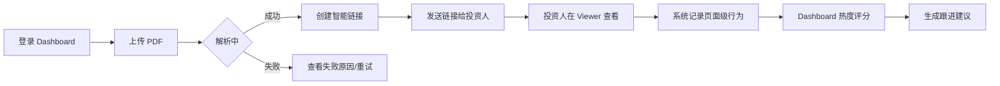
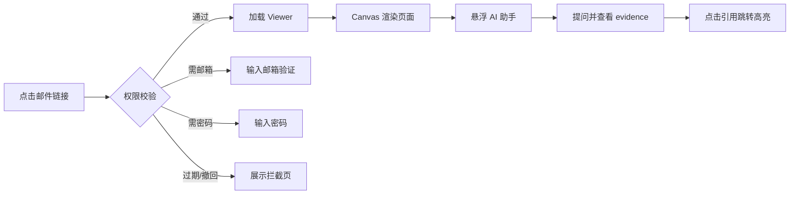

# DealSignal UI/UX 设计交付文档 v2.1.0

> **文档编号**：`UI-2024-001`  
> **版本**：`v2.1.0`  
> **模板版本**：`v1`  
> **状态**：`评审中`  
> **编写人/适用对象**：`产品设计师 / UX 设计师 / 交互设计师`  
> **编写日期**：`2026-06-20`  
> **关联文档**：  
> - `docs/PRD-v2.1.0.md`  
> - `docs/TDD-v2.1.0.md`  
> - `docs/API-SPEC-v2.1.0.md`  
> - `docs/templates/USER-RESEARCH-template-v1.md`  
> - `docs/templates/PRD-REVIEW-CHECKLIST-template-v1.md`  
> - `docs/templates/API-SPEC-template-v1.md`  
> **评审人**：`产品负责人、前端负责人、后端负责人、测试负责人`  
> **设计工具**：`Figma`  
> **原型链接**：`{待补充}`  
> **设计稿链接**：`{待补充}`  
> **交付状态（UI-DESIGN-DELIVERABLE 专用）**：`待开发`

---

## 0. 文档使用说明

本文档是 **DealSignal** 的 UI/UX 设计交付文档（Design Deliverable），用于记录从用户研究到高保真设计稿、交互原型、设计标注的完整交付内容。

**目标**：
- 向开发团队清晰传达界面结构、视觉样式和交互行为。
- 作为产品、设计、开发、测试四方对齐的共同依据。
- 确保设计稿与 PRD 需求一致，并支撑后续前端实现与 QA 验收。

**交付物清单**：
- [ ] 低保真/中保真线框图
- [ ] 高保真视觉设计稿
- [ ] 可交互原型
- [ ] 设计标注与切图
- [ ] 设计系统/组件库说明
- [ ] 交互说明文档
- [ ] 响应式适配方案
- [ ] 动效与微交互说明

> **当前状态说明**：本 v2.1.0 设计交付文档基于 PRD 第 11 节「交互与体验」编制，作为设计排期与页面范围基线。高保真设计稿与 Figma 原型计划于 **2026-07-09** 前完成并补充链接。

---

## 1. 文档控制信息

### 1.1 变更日志

| 版本 | 日期 | 修改人 | 修改内容 | 影响范围 |
|------|------|--------|----------|----------|
| v2.1.0 | 2026-06-20 | 产品设计师 | 按 UI-DESIGN-DELIVERABLE-template-v1 创建 DealSignal v2.1.0 设计交付基线文档，明确信息架构、关键页面、状态规范、响应式策略 | 全文档 |

### 1.2 相关设计资产

| 资产 | 链接 | 说明 |
|------|------|------|
| Figma 设计稿 | `{待补充}` | 高保真设计源文件 |
| Figma 原型 | `{待补充}` | 可点击交互原型 |
| 设计系统 | `{待补充}` | 组件库与样式库 |
| 用户研究摘要 | `docs/PRD-v2.1.0.md 第 5 节` | 设计输入来源 |
| 竞品分析 | `docs/PRD-v2.1.0.md 第 3 节` | 竞品截图与洞察 |

---

## 2. 设计背景与目标

### 2.1 设计目标

1. **降低首次上传与分享的学习成本**：通过清晰的拖拽上传、实时解析状态、一键创建链接，让创始人在 2 分钟内完成第一份材料分享。
2. **建立专业可信的品牌感知**：Viewer 页面需呈现企业级安全感与精致感，使接收方（投资人/客户）愿意阅读并信任内容。
3. **提升交易信号的可读性与行动力**：Dashboard 通过热度分层、页面级分析、跟进建议，帮助发件人快速识别高意向对象并采取行动。

### 2.2 目标用户

| 用户角色 | 描述 | 核心诉求 | 设计重点 |
|----------|------|----------|----------|
| 融资创始人 | 上传 pitch deck、financial model，追踪投资人兴趣 | 安全、专业、能判断谁感兴趣 | 上传流程、Viewer、Dashboard 热度 |
| 投资机构 IR | 向 LP 分发报告、募集材料 | 可控、可追踪、合规 | 链接权限、数据室、访问日志 |
| B2B 销售 AE | 发送提案、报价单，追踪客户行为 | 快速跟进、提高成交率 | 跟进建议、CRM 集成入口 |
| 接收方（投资人/LP/客户） | 在浏览器/邮件中打开链接查看文档 | 打开顺畅、阅读舒适、不泄露隐私 | Viewer、AI 助手、移动端适配 |

### 2.3 设计原则

| 原则 | 说明 | 在设计中的体现 |
|------|------|----------------|
| **安全可视化但不增加摩擦** | 权限设置要直观，默认低摩擦，高安全选项逐步展开 | 权限强度滑块、实时安全提示 |
| **接收方体验优先** | Viewer 页面是增长飞轮，必须专业顺滑 | 简洁 Canvas、悬浮 AI、清晰水印 |
| **数据驱动决策** | 分析结果要可解释、可行动 | 热度评分、页面停留、跟进建议 |
| **一致性与可预测性** | 统一设计系统，相同元素在不同页面行为一致 | shadcn/ui 组件库、统一状态规范 |

### 2.4 关键用户任务

| 任务编号 | 任务描述 | 优先级 | 对应 PRD |
|----------|----------|--------|----------|
| TASK-01 | 上传第一份文档并创建分享链接 | P0 | FR-01 ~ FR-02 |
| TASK-02 | 在 Viewer 中查看文档并使用 AI 问答 | P0 | FR-03 ~ FR-06 |
| TASK-03 | 在 Dashboard 查看热度与跟进建议 | P0 | FR-10 ~ FR-11 |
| TASK-04 | 创建数据室并管理访问权限 | P1 | FR-12 ~ FR-13 |
| TASK-05 | 配置 Workspace 品牌与集成 | P2 | FR-15 ~ FR-16 |

---

## 3. 信息架构

### 3.1 站点/应用地图

```text
DealSignal
├── Dashboard（交易雷达）
│   ├── 最近文档
│   ├── 最近链接
│   ├── 高热度提醒
│   └── 快速上传入口
├── Documents（文档库）
│   ├── 文档列表
│   ├── 文档详情
│   └── 上传新文档
├── Links（链接管理）
│   ├── 链接列表
│   ├── 链接权限设置
│   └── 访问日志
├── Deal Rooms（数据室）
│   ├── 数据室列表
│   ├── 数据室详情（文件夹/文档/成员）
│   └── 访问审批
├── Contacts（访问者）
│   ├── 访问者列表
│   └── 访问者详情
├── Insights（洞察）
│   ├── 热度分析
│   ├── 页面分析
│   └── 跟进建议
└── Settings（设置）
    ├── Workspace 信息
    ├── 品牌定制
    ├── 成员管理
    ├── 集成（CRM / Slack）
    └── 账单
```

### 3.2 导航结构

| 导航层级 | 名称 | 入口位置 | 说明 |
|----------|------|----------|------|
| 一级导航 | Dashboard / Documents / Links / Deal Rooms / Contacts / Insights / Settings | 侧边栏 | 7 个核心模块 |
| 二级导航 | 模块内子页面 | 侧边栏或页面内 Tab | 如 Documents / Links / Deal Rooms 列表 |
| 快捷入口 | 上传文档 / 创建链接 / 创建数据室 | Dashboard 首屏 + 全局顶部 | 快速发起核心动作 |
| Workspace 切换 | Settings → Switch Workspace | 侧边栏底部设置子菜单 | 切换后 URL 变为 `/{workspaceSlug}/...` |

### 3.3 页面清单

| 页面编号 | 页面名称 | 路径/入口 | 优先级 | 对应 PRD | 设计稿链接 |
|----------|----------|-----------|--------|----------|------------|
| P-01 | Dashboard（交易雷达） | `/{workspaceSlug}/dashboard` | P0 | FR-10 ~ FR-11 | `{待补充}` |
| P-02 | 文档上传页 | `/{workspaceSlug}/documents/upload` | P0 | FR-01 ~ FR-02 | `{待补充}` |
| P-03 | 文档列表页 | `/{workspaceSlug}/documents` | P0 | FR-02 | `{待补充}` |
| P-04 | 文档详情页 | `/{workspaceSlug}/documents/:id` | P0 | FR-02 | `{待补充}` |
| P-05 | 链接权限设置 | `/{workspaceSlug}/links/new` 或弹窗 | P0 | FR-07 ~ FR-09 | `{待补充}` |
| P-06 | 链接列表页 | `/{workspaceSlug}/links` | P0 | FR-07 ~ FR-09 | `{待补充}` |
| P-07 | Viewer 阅读页 | `{publicDomain}/?token=xxx` | P0 | FR-03 ~ FR-04 | `{待补充}` |
| P-08 | AI 问答对话框 | Viewer 内悬浮组件 | P0 | FR-05 ~ FR-06 | `{待补充}` |
| P-09 | 数据分析页 | `/{workspaceSlug}/insights` | P0 | FR-10 ~ FR-11 | `{待补充}` |
| P-10 | 数据室页 | `/{workspaceSlug}/deal-rooms/:id` | P1 | FR-12 ~ FR-13 | `{待补充}` |
| P-11 | 设置页 | `/{workspaceSlug}/settings` | P2 | 第 11 节 | `{待补充}` |

---

## 4. 用户流程图

### 4.1 核心流程：创始人上传 deck 并追踪投资人兴趣



**说明**：
- 上传后实时展示解析进度，失败时保留文件并允许重试。
- 创建链接时默认低摩擦权限，用户可通过滑块提升安全强度。
- Dashboard 热度按 Hot/Warm/Cold 分层，点击可查看访问者详情。

### 4.2 核心流程：接收方查看文档并使用 AI 问答



### 4.3 页面流程图

| 步骤 | 页面 | 用户操作 | 系统反馈 | 跳转目标 |
|------|------|----------|----------|----------|
| 1 | Dashboard | 点击「上传文档」 | 打开上传弹窗/页面 | P-02 |
| 2 | 上传页 | 拖拽/选择文件 | 显示进度条、解析状态 | P-03 |
| 3 | 文档列表 | 选择文档并点击「创建链接」 | 打开权限设置 | P-05 |
| 4 | 权限设置 | 配置权限并确认 | 生成短链接 | P-06 |
| 5 | Viewer | 接收方打开链接 | 校验权限并加载 Canvas | - |
| 6 | Dashboard | 发件人查看热度 | 展示评分与建议 | P-09 |

---

## 5. 设计系统

### 5.1 色彩系统

#### 主色

| 名称 | 色值 | 用途 |
|------|------|------|
| Primary-500 | `#0F172A` | 主按钮、链接、品牌强调 |
| Primary-600 | `#1E293B` | Hover 状态 |
| Primary-700 | `#334155` | Active/Pressed 状态 |

#### 中性色

| 名称 | 色值 | 用途 |
|------|------|------|
| Neutral-900 | `#0F172A` | 主文本 |
| Neutral-500 | `#64748B` | 次要文本 |
| Neutral-200 | `#E2E8F0` | 边框、分隔线 |
| Neutral-50 | `#F8FAFC` | 背景 |

#### 功能色

| 名称 | 色值 | 用途 |
|------|------|------|
| Success-500 | `#10B981` | 成功状态 |
| Warning-500 | `#F59E0B` | 警告状态 |
| Error-500 | `#EF4444` | 错误状态 |
| Info-500 | `#3B82F6` | 信息提示 |
| Hot-500 | `#EF4444` | 热度 Hot |
| Warm-500 | `#F59E0B` | 热度 Warm |
| Cold-500 | `#3B82F6` | 热度 Cold |

### 5.2 字体系统

| 样式 | 字号 | 字重 | 行高 | 用途 |
|------|------|------|------|------|
| Display | 32px | 700 | 40px | 页面大标题 |
| H1 | 24px | 600 | 32px | 页面标题 |
| H2 | 20px | 600 | 28px | 区块标题 |
| H3 | 16px | 600 | 24px | 小标题 |
| Body | 14px | 400 | 22px | 正文 |
| Caption | 12px | 400 | 18px | 辅助说明 |

### 5.3 间距系统

| Token | 值 | 用途 |
|-------|-----|------|
| space-1 | 4px | 极细间距 |
| space-2 | 8px | 小间距 |
| space-4 | 16px | 标准间距 |
| space-6 | 24px | 模块间距 |
| space-8 | 32px | 大间距 |
| space-12 | 48px | 区块间距 |

### 5.4 圆角与阴影

| Token | 值 | 用途 |
|-------|-----|------|
| radius-sm | 4px | 小标签、输入框 |
| radius-md | 8px | 卡片、按钮 |
| radius-lg | 12px | 大卡片、弹窗 |
| shadow-sm | `0 1px 2px rgba(0,0,0,0.05)` | 悬停卡片 |
| shadow-md | `0 4px 6px rgba(0,0,0,0.07)` | 下拉菜单、弹窗 |
| shadow-lg | `0 10px 15px rgba(0,0,0,0.1)` | 模态框 |

### 5.5 组件库清单

| 组件 | 说明 | 状态 |
|------|------|------|
| Button | 按钮 | Default / Hover / Active / Disabled / Loading |
| Input | 输入框 | Default / Focus / Error / Disabled |
| Select / Dropdown | 下拉选择 | - |
| Modal / Dialog | 弹窗 | - |
| Table | 表格 | Default / Hover / Selected / Empty |
| Toast | 消息通知 | Success / Error / Warning / Info |
| Card | 卡片 | - |
| Skeleton | 加载骨架 | - |
| Progress | 进度条 | 上传/解析进度 |
| Uploader | 文件上传 | 拖拽/选择/上传中/完成/失败 |
| PermissionSlider | 权限强度滑块 | 低摩擦 / 中强度 / 高强度 |
| CanvasViewer | Canvas 文档渲染 | 缩放/翻页/高亮 |
| AIChat | 悬浮 AI 对话框 | 收起/展开/回答/引用 |
| HeatBadge | 热度标签 | Hot / Warm / Cold |

---

## 6. 高保真页面设计（待补充设计稿）

### 6.1 P-01 Dashboard（交易雷达）

#### 6.1.1 页面概述

| 属性 | 内容 |
|------|------|
| 页面编号 | P-01 |
| 页面名称 | Dashboard（交易雷达） |
| 页面路径 | `/{workspaceSlug}/dashboard` |
| 对应 PRD | FR-10 ~ FR-11 |
| 优先级 | P0 |
| 设计稿 | `{待补充}` |

#### 6.1.2 页面布局

```text
┌─────────────────────────────────────────────────────────────┐
│                        顶部全局导航栏                          │
│  Logo | 搜索 | 快速上传 | 通知 | 用户头像                      │
├───────────────┬─────────────────────────────────────────────┤
│               │                                             │
│   侧边栏       │              主内容区                        │
│  Dashboard    │  ┌─────────┐ ┌─────────┐ ┌─────────┐       │
│  Documents    │  │ 热度卡片 │ │ 最近文档 │ │ 最近链接 │       │
│  Links        │  └─────────┘ └─────────┘ └─────────┘       │
│  Deal Rooms   │                                             │
│  Contacts     │  ┌─────────────────────────────────────┐   │
│  Insights     │  │         高热度提醒列表               │   │
│  Settings     │  └─────────────────────────────────────┘   │
│               │                                             │
└───────────────┴─────────────────────────────────────────────┘
```

#### 6.1.3 区域说明

| 区域 | 内容 | 交互说明 |
|------|------|----------|
| 顶部导航 | Logo、全局搜索、快速上传、通知、用户头像 | 点击快速上传打开上传弹窗 |
| 侧边栏 | 7 个一级模块入口 + Workspace 切换 | 当前模块高亮 |
| 热度卡片 | Hot / Warm / Cold 数量汇总 | 点击跳转 Insights 页 |
| 最近文档 | 最近上传/查看的文档 | 点击跳转文档详情或 Viewer |
| 最近链接 | 最近创建的分享链接 | 点击跳转链接详情 |
| 高热度提醒 | 按热度排序的跟进提醒 | 点击展开跟进建议 |

#### 6.1.4 交互说明

| 元素 | 触发方式 | 交互行为 | 异常/边界 |
|------|----------|----------|-----------|
| 快速上传按钮 | 点击 | 打开上传弹窗 | - |
| 热度卡片 | 点击 | 跳转 Insights 页 | 无数据时展示空态 |
| 高热度提醒 | 点击 | 展开建议与邮件草稿 | - |
| Workspace 切换 | 点击侧边栏 Settings → Switch Workspace | 展开 workspace 列表，切换后刷新 | 仅展示有权限的 workspace |

#### 6.1.5 空状态

- 首次使用：展示引导上传的插画 + 示例文档。
- 无热度数据：展示「分享第一份文档即可看到热度分析」提示。

#### 6.1.6 异常状态

| 异常场景 | 设计处理 |
|----------|----------|
| 无权限 | 展示 403 页面，提示联系 Workspace 管理员 |
| 加载失败 | Toast 提示 + 重试按钮 |
| 数据为空 | 空态插画 + 引导操作 |

---

### 6.2 P-02 文档上传页

#### 6.2.1 页面概述

| 属性 | 内容 |
|------|------|
| 页面编号 | P-02 |
| 页面名称 | 文档上传页 |
| 页面路径 | `/{workspaceSlug}/documents/upload` |
| 对应 PRD | FR-01 ~ FR-02 |
| 优先级 | P0 |

#### 6.2.2 页面布局

```text
┌─────────────────────────────────────────────────────────────┐
│  顶部导航 + 侧边栏                                           │
├───────────────┬─────────────────────────────────────────────┤
│               │                                             │
│   侧边栏       │         拖拽上传区                          │
│               │    ┌─────────────────────────────┐         │
│               │    │     📄 拖拽文件到这里        │         │
│               │    │     或点击选择文件            │         │
│               │    │     支持 PDF / Word / PPT / Excel │     │
│               │    └─────────────────────────────┘         │
│               │                                             │
│               │         上传进度列表                        │
│               │    ┌─────────────────────────────┐         │
│               │    │ Acme Pitch.pdf  解析中...   │         │
│               │    │ Financial Model.xlsx  完成  │         │
│               │    └─────────────────────────────┘         │
│               │                                             │
└───────────────┴─────────────────────────────────────────────┘
```

#### 6.2.3 交互说明

| 元素 | 触发方式 | 交互行为 | 异常/边界 |
|------|----------|----------|-----------|
| 拖拽区 | 拖拽文件进入 | 高亮边框，释放后上传 | 不支持类型/大小超限时提示 |
| 文件项 | 上传中 | 进度条 + 解析状态 | 失败时显示原因 + 重试 |
| 完成项 | 点击 | 跳转文档详情或创建链接 | - |

---

### 6.3 P-05 链接权限设置

#### 6.3.1 页面概述

| 属性 | 内容 |
|------|------|
| 页面编号 | P-05 |
| 页面名称 | 链接权限设置 |
| 页面路径 | 弹窗或 `/{workspaceSlug}/links/new` |
| 对应 PRD | FR-07 ~ FR-09 |
| 优先级 | P0 |

#### 6.3.2 页面布局

```text
┌─────────────────────────────────────────┐
│  创建分享链接                            │
├─────────────────────────────────────────┤
│  文档：Acme Pitch Deck.pdf              │
│                                         │
│  权限强度滑块                            │
│  低摩擦 ○────○────○ 高强度               │
│                                         │
│  [ ] 需要邮箱验证                        │
│  [ ] 白名单邮箱/域名                     │
│  [ ] 访问密码                            │
│  [ ] 允许下载                            │
│  [ ] 动态水印                            │
│                                         │
│  有效期：7天 / 30天 / 自定义             │
│  最大访问次数：无限制 / 自定义            │
│                                         │
│  [取消]  [创建链接]                      │
└─────────────────────────────────────────┘
```

#### 6.3.3 交互说明

| 元素 | 触发方式 | 交互行为 |
|------|----------|----------|
| 权限强度滑块 | 拖动/点击 | 实时更新推荐配置与安全提示 |
| 安全选项 | 勾选 | 动态显示对应输入框 |
| 创建链接 | 点击 | 生成短链接并展示复制按钮 |

---

### 6.4 P-07 Viewer 阅读页

#### 6.4.1 页面概述

| 属性 | 内容 |
|------|------|
| 页面编号 | P-07 |
| 页面名称 | Viewer 阅读页 |
| 页面路径 | `{publicDomain}/?token=xxx` |
| 对应 PRD | FR-03 ~ FR-04 |
| 优先级 | P0 |

#### 6.4.2 页面布局

```text
┌─────────────────────────────────────────────────────────────┐
│  品牌 Logo | 文档标题 | 页码切换 | 缩放 | 下载（若允许）      │
├─────────────────────────────────────────────────────────────┤
│                                                             │
│                    Canvas 页面渲染区                        │
│                    （水印覆盖层）                            │
│                                                             │
├─────────────────────────────────────────────────────────────┤
│  🤖 AI 助手（右下角悬浮，默认收起）                          │
└─────────────────────────────────────────────────────────────┘
```

#### 6.4.3 交互说明

| 元素 | 触发方式 | 交互行为 |
|------|----------|----------|
| AI 助手图标 | 点击 | 展开对话框 |
| 页码切换 | 点击/键盘左右 | 切换页面 |
| 缩放 | 点击/滚轮 | 放大/缩小 Canvas |
| Evidence 引用 | 点击 | 跳转对应页面并高亮 |

---

### 6.5 P-10 数据室页

#### 6.5.1 页面概述

| 属性 | 内容 |
|------|------|
| 页面编号 | P-10 |
| 页面名称 | 数据室页 |
| 页面路径 | `/{workspaceSlug}/deal-rooms/:id` |
| 对应 PRD | FR-12 ~ FR-13 |
| 优先级 | P1 |

#### 6.5.2 页面布局

```text
┌─────────────────────────────────────────────────────────────┐
│  顶部导航 + 侧边栏                                           │
├───────────────┬─────────────────────────────────────────────┤
│               │  数据室标题 | NDA 状态 | 访问审批 Tab        │
│   侧边栏       │                                             │
│               │  ┌─────────────────┬─────────────────────┐  │
│               │  │   文件夹树       │   文档列表/成员     │  │
│               │  │   /Financials   │   Financial Model   │  │
│               │  │   /Legal        │   Term Sheet        │  │
│               │  │   /Team         │   Cap Table         │  │
│               │  └─────────────────┴─────────────────────┘  │
│               │                                             │
└───────────────┴─────────────────────────────────────────────┘
```

---

## 7. 核心组件详细设计

### 7.1 PermissionSlider（权限强度滑块）

#### 7.1.1 组件概述

| 属性 | 内容 |
|------|------|
| 组件名 | PermissionSlider |
| 用途 | 在创建链接时快速选择安全级别 |
| 使用页面 | P-05 |

#### 7.1.2 状态设计

| 状态 | 视觉表现 | 触发条件 |
|------|----------|----------|
| 低摩擦 | 绿色，显示「公开/邮箱验证」 | 默认 |
| 中强度 | 黄色，显示「白名单/密码」 | 拖动到中间 |
| 高强度 | 红色，显示「NDA/白名单+密码」 | 拖动到最右 |

### 7.2 AIChat（悬浮 AI 对话框）

#### 7.2.1 组件概述

| 属性 | 内容 |
|------|------|
| 组件名 | AIChat |
| 用途 | Viewer 内 AI 问答 |
| 使用页面 | P-07 |

#### 7.2.2 状态设计

| 状态 | 视觉表现 | 触发条件 |
|------|----------|----------|
| 收起 | 右下角圆形图标 | 默认 |
| 展开 | 底部侧边面板 | 点击图标 |
| 加载中 | 输入框上方 Skeleton | 发送问题后 |
| 有答案 | 答案 + Evidence 列表 | 收到响应 |

---

## 8. 交互原型说明

### 8.1 原型覆盖范围

| 流程 | 页面数 | 交互点 | 原型链接 |
|------|--------|--------|----------|
| 上传 → 创建链接 → 查看 | 5 | 12 | `{待补充}` |
| AI 问答与高亮跳转 | 2 | 6 | `{待补充}` |
| 数据室访问申请与审批 | 3 | 8 | `{待补充}` |

### 8.2 关键交互定义

#### 交互 1：权限强度滑块

| 属性 | 内容 |
|------|------|
| 触发 | 拖动/点击 |
| 来源 | PermissionSlider |
| 目标 | 下方权限选项 |
| 动画 | 无 |
| 说明 | 拖动到不同档位自动勾选/取消对应选项 |

#### 交互 2：AI 引用跳转

| 属性 | 内容 |
|------|------|
| 触发 | 点击 evidence 卡片 |
| 来源 | AIChat |
| 目标 | Canvas 对应页面 |
| 动画 | Canvas 淡入切换 + 高亮框 fade-in |
| 时长 | 300ms |
| 缓动 | ease-in-out |

### 8.3 全局交互规则

| 场景 | 规则 |
|------|------|
| 页面跳转 | 内部跳转使用客户端路由，保留侧边栏 |
| 表单提交 | 提交后按钮进入 Loading，成功后 Toast |
| 加载状态 | 列表用 Skeleton，页面用 Progress/Spinner |
| 错误提示 | Toast 顶部居中，5 秒自动消失 |
| 确认操作 | 破坏性操作使用二次确认弹窗 |
| 无限滚动/分页 | 列表默认分页，每页 20 条 |

---

## 9. 响应式与适配

### 9.1 断点定义

| 断点 | 宽度范围 | 设备类型 | 布局策略 |
|------|----------|----------|----------|
| xs | < 576px | 手机竖屏 | 单列堆叠，侧边栏收起为底部 tab |
| sm | 576px - 767px | 手机横屏/小平板 | 单列/双列 |
| md | 768px - 991px | 平板 | 双列，侧边栏可折叠 |
| lg | 992px - 1199px | 小桌面 | 完整布局 |
| xl | ≥ 1200px | 大桌面 | 完整布局，更宽内容区 |

### 9.2 关键页面适配说明

| 页面 | xs 适配 | md 适配 | xl 适配 |
|------|---------|---------|---------|
| Dashboard | 卡片单列堆叠 | 双列卡片 | 三列卡片 |
| Viewer | 全屏 Canvas，底部控制栏 | 侧边缩略图 | 完整工具栏 |
| AI 对话框 | 底部全屏 sheet | 右侧固定面板 | 右侧固定面板 |
| 数据室 | 文件夹树变为下拉选择 | 左右分栏 | 左右分栏 |

### 9.3 移动端特殊处理

| 场景 | 处理方式 |
|------|----------|
| 导航 | 底部 tab 或汉堡菜单 |
| 表格 | 卡片化 |
| 上传 | 调用原生文件选择 |
| 弹窗 | 底部 sheet |
| Viewer | 手势缩放/翻页 |

---

## 10. 动效与微交互

### 10.1 动效原则

- 动效应服务于用户理解，避免炫技。
- 保持统一时长和缓动曲线。
- 尊重用户减少动效偏好（`prefers-reduced-motion`）。

### 10.2 微交互清单

| 编号 | 场景 | 触发 | 动画 | 时长 | 缓动 |
|------|------|------|------|------|------|
| ANI-01 | 上传完成 | 文件解析完成 | 进度条完成 + 对勾 | 300ms | ease-out |
| ANI-02 | AI 回答出现 | 收到响应 | 消息滑入 | 200ms | ease-in-out |
| ANI-03 | Evidence 跳转 | 点击引用 | Canvas 淡入 + 高亮框绘制 | 300ms | ease-in-out |
| ANI-04 | 热度变化 | 数据更新 | 数字滚动 | 400ms | ease-out |

---

## 11. 可访问性（Accessibility）

### 11.1 设计目标

- 符合 WCAG 2.1 AA 标准。
- 支持键盘导航。
- 支持屏幕阅读器。
- 支持高对比度模式。

### 11.2 焦点与键盘

| 组件 | 焦点样式 | 键盘操作 |
|------|----------|----------|
| 按钮 | 2px 轮廓线 | Enter/Space 触发 |
| 输入框 | 边框高亮 | Tab 聚焦 |
| 下拉菜单 | 背景高亮 | 方向键选择，Enter 确认 |
| Viewer | 页面焦点 | 左右方向翻页，+/- 缩放 |
| AI 对话框 | 输入框焦点 | Enter 发送，Esc 收起 |

---

## 12. 切图与资源交付

### 12.1 图标

| 图标名称 | 尺寸 | 格式 | 用途 |
|----------|------|------|------|
| upload | 24x24 | SVG | 上传 |
| link | 24x24 | SVG | 链接 |
| eye | 24x24 | SVG | 查看 |
| lock | 24x24 | SVG | 权限 |
| robot | 24x24 | SVG | AI 助手 |
| flame | 24x24 | SVG | 热度 |

### 12.2 导出规范

- 图标：SVG，可调整颜色。
- 图片：WebP/PNG，提供 1x 和 2x 版本。
- Logo：SVG + PNG，提供反色版本。

---

## 13. 设计走查与验收

### 13.1 设计走查清单

- [ ] 所有页面与 PRD 功能需求一一对应
- [ ] 所有页面有 Default / Hover / Active / Disabled / Error / Empty 状态
- [ ] 文字内容无占位符
- [ ] 色彩使用符合设计系统
- [ ] 间距使用符合 spacing token
- [ ] 字体层级清晰一致
- [ ] 图标、图片已正确导出
- [ ] 交互说明覆盖所有可交互元素
- [ ] 响应式适配方案完整
- [ ] 可访问性要求已满足
- [ ] 设计稿已按页面/组件命名整理

### 13.2 开发交付 checklist

- [ ] Figma 文件权限已开放给开发团队
- [ ] 设计标注工具已启用（Figma Dev Mode）
- [ ] 切图资源已导出并上传
- [ ] 设计系统组件已同步到前端组件库
- [ ] 交互原型已分享给测试团队

### 13.3 QA 验收 checklist

- [ ] 视觉还原度达到 95% 以上
- [ ] 所有交互行为符合设计说明
- [ ] 响应式布局在各断点正常
- [ ] 动效时长和缓动符合规范
- [ ] 可访问性测试通过

---

## 14. 附录

### 附录 A：页面状态规范

| 状态 | 说明 | 设计处理 |
|------|------|----------|
| 加载中 | 上传/解析/页面加载 | Skeleton / 进度条 |
| 空态 | 无文档/无链接 | 引导上传/创建 |
| 错误态 | 加载失败/接口错误 | 错误插画 + 重试 |
| 权限不足 | 无访问权限 | 403 拦截页 |
| 处理中 | 文档解析中 | 进度条 + 预计时间 |
| 成功态 | 操作完成 | Toast + 对勾 |

### 附录 B：术语表

| 术语 | 说明 |
|------|------|
| Canvas | HTML5 Canvas，用于渲染文档页面 |
| Evidence | AI 回答引用的原文片段与位置 |
| Heat Score | 热度评分 |
| Deal Room | 数据室 |

---

## 15. 审批记录

| 角色 | 姓名 | 审批日期 | 意见 |
|------|------|----------|------|
| 产品负责人 | | | |
| 设计负责人 | | | |
| 前端负责人 | | | |
| 测试负责人 | | | |

---

## 16. 检查清单（文档发布前）

- [x] 所有 `{占位符}` 已替换为实际内容或明确标注待补充
- [ ] Figma 链接可正常访问
- [ ] 高保真设计稿覆盖所有 P0 页面
- [ ] 交互原型覆盖所有核心流程
- [ ] 设计系统 token 与组件已定义
- [ ] 响应式方案已明确
- [ ] 动效与微交互已记录
- [ ] 可访问性要求已纳入
- [ ] 切图资源已准备
- [ ] 已获得必要审批

---

> **模板版本**：v1  
> **UI-DESIGN-DELIVERABLE 版本**：v2.1.0  
> **状态**：评审中  
> **最后更新**：2026-06-20
