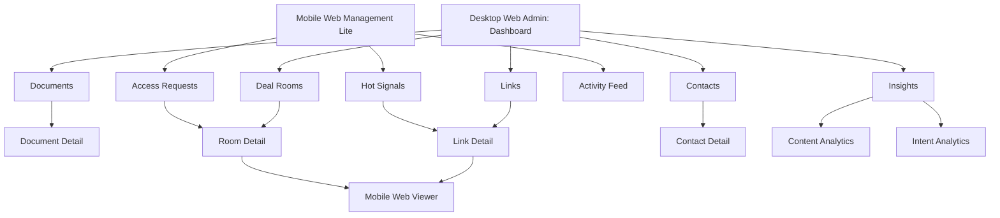

# DealSignal UI Page Prototypes

## 1. UI Strategy

DealSignal's UI should feel like a focused operating surface for active deals, not a generic file manager.

The first screen should answer:

- Who is showing intent right now?
- Which document or room needs action?
- What should the user do next?
- Is anything risky or blocked?

Design tone:

- Professional
- Calm
- Dense enough for repeated daily use
- Low-friction for recipients
- Clear about security states

Primary navigation:

1. Dashboard
2. Documents
3. Links
4. Deal Rooms
5. Contacts
6. Insights
7. Content Library
8. Settings

## 2. Experience Surfaces

DealSignal is web-first, with three distinct responsive surfaces. The product should not require native mobile or desktop apps for the MVP.

### 2.1 Desktop Web Admin

Primary users:

- Founders
- Sales and BD teams
- Investment firm operators, partners, and IR teams

Primary jobs:

- Upload and manage documents.
- Create Smart Links.
- Configure access, download, watermark, and expiration policies.
- Build and operate Deal Rooms.
- Review analytics and intent scores.
- Manage contacts, accounts, content library, CRM integrations, and workspace settings.

Design priority:

- Information density
- Fast scanning
- Table and dashboard workflows
- Multi-panel analytics
- Bulk operations

Pages included:

- Dashboard
- Documents
- Document Detail
- Create Smart Link
- Link Detail
- Deal Rooms
- Room Detail
- Contacts
- Insights
- Content Library
- Settings

### 2.2 Mobile Web Viewer

Primary users:

- Investors
- Customers
- LPs
- Buyers
- Partners

Primary jobs:

- Open a link from email, Slack, LinkedIn, SMS, or mobile browser.
- Verify access if required.
- Read the document quickly.
- Download when allowed.
- Request access when blocked.
- Ask a question or contact the sender.

Design priority:

- No account requirement unless explicitly required by sender policy.
- Fast first document render.
- Thumb-friendly page navigation.
- Clear blocked-state recovery.
- Minimal UI chrome around the document.

Pages included:

- Link landing / access check
- Email verification
- NDA or approval gate
- Document viewer
- Download confirmation
- Access blocked / expired / request access
- Room mobile viewer

### 2.3 Mobile Web Management Lite

Primary users:

- Founders, sales reps, partners, and IR users who are away from their desk.

Primary jobs:

- Check first-open and hot-intent alerts.
- See who is active right now.
- Review one recipient, account, link, or room.
- Send a quick follow-up.
- Revoke a risky link.
- Approve or deny an access request.

Design priority:

- Alert-first workflow
- No heavy table management
- No complex room building
- No document upload requirement for MVP
- One-hand actions: call, email, copy link, revoke, approve

Pages included:

- Mobile Activity Feed
- Hot Signals
- Link Summary
- Room Summary
- Contact Summary
- Access Requests
- Notification Settings

## 3. Page IA



## 4. Global Layout

Desktop layout:

- Left sidebar navigation.
- Top bar with workspace switcher, search, create button, alerts, user menu.
- Main content area with contextual filters.
- Optional right-side action panel for recommendations.

Mobile Web Management Lite layout:

- Bottom navigation for Dashboard, Documents, Rooms, Contacts.
- Create action as fixed button.
- Analytics pages should simplify to cards and stacked timelines.
- Heavy document upload, full settings, and bulk table operations are hidden or deferred to desktop.

Mobile Web Viewer layout:

- No app navigation.
- Sender brand and document title in a compact top bar.
- Primary document content takes most of the screen.
- Bottom actions are limited to page navigation, download when allowed, outline, and contact sender.

Global create menu:

- Upload document
- Create Smart Link
- Create Deal Room
- Invite contact
- Import from Drive / Dropbox

Global search:

- Search documents
- Search links
- Search rooms
- Search contacts
- Search companies / accounts

## 5. Desktop Web Admin: Dashboard

Purpose:

Give users a live radar of deal activity.

Primary components:

- Today’s hot signals
- Recommended follow-ups
- Recent opens
- Active rooms
- Risk alerts
- Top performing content

Wireframe:

```text
┌────────────────────────────────────────────────────────────────────┐
│ DealSignal                         Search        + Create   Alerts │
├──────────────┬─────────────────────────────────────────────────────┤
│ Dashboard    │ Today                                                    │
│ Documents    │ ┌────────────┐ ┌────────────┐ ┌────────────┐             │
│ Links        │ │ Hot Signals │ │ Opens      │ │ Risks      │             │
│ Deal Rooms   │ │ 8           │ │ 34         │ │ 2          │             │
│ Contacts     │ └────────────┘ └────────────┘ └────────────┘             │
│ Insights     │                                                         │
│ Library      │ Recommended Follow-ups                                  │
│ Settings     │ ┌─────────────────────────────────────────────────────┐ │
│              │ │ Sequoia viewed financials 3x       Send follow-up   │ │
│              │ │ Acme proposal forwarded to 4 users  Schedule call    │ │
│              │ │ LP A returned to Q4 report          Notify IR        │ │
│              │ └─────────────────────────────────────────────────────┘ │
│              │ Recent Activity                    Active Rooms         │
└──────────────┴─────────────────────────────────────────────────────┘
```

Key states:

- Empty state: upload first document and create first Smart Link.
- Loading state: skeleton cards.
- Alert state: risk panel surfaces expired, suspicious, or blocked access.

Primary actions:

- Create Smart Link
- View analytics
- Send follow-up
- Open room
- Review risk

Segment variations:

- Founder dashboard uses "Investors", "Fundraising Room", "Investor Intent".
- Fund dashboard uses "LPs", "Deal Rooms", "Engagement".
- Sales dashboard uses "Deals", "Accounts", "Deal Intent".

## 6. Desktop Web Admin: Documents List

Purpose:

Manage uploaded assets and create links.

Primary columns:

- Document name
- Type
- Status
- Owner
- Last updated
- Active links
- Total opens
- Best-performing page
- Actions

Filters:

- Status: Draft, Approved, Archived
- Type
- Owner
- Used in rooms
- Has active links

Actions:

- Upload
- Create Smart Link
- View analytics
- Replace version
- Archive

Wireframe:

```text
Documents
┌────────────────────────────────────────────────────────────────────┐
│ Search documents...           Status ▼ Type ▼ Owner ▼      Upload │
├────────────────────────────────────────────────────────────────────┤
│ Name                  Status     Links   Opens   Updated   Actions │
│ Series A Deck.pdf     Approved   14      238     Jun 17    Link    │
│ Financial Model.xlsx  Private    5       42      Jun 15    Link    │
│ Security Packet.pdf   Approved   22      801     Jun 12    Link    │
└────────────────────────────────────────────────────────────────────┘
```

## 7. Desktop Web Admin: Document Detail

Purpose:

Show document performance and link management.

Tabs:

- Overview
- Pages
- Links
- Versions
- Settings

Overview:

- Total opens
- Unique recipients
- Average read time
- Downloads
- Top pages
- Drop-off page

Pages tab:

- Page thumbnail
- Average time
- Re-read rate
- Drop-off rate
- Notes

Links tab:

- Link name
- Recipient / account
- Security mode
- Intent score
- Last activity
- Status

Actions:

- Create Smart Link
- Replace document
- Compare versions
- Export analytics

## 8. Desktop Web Admin: Create Smart Link Flow

Purpose:

Create a controlled link without overwhelming the user.

Steps:

1. Choose document
2. Name link and recipient
3. Choose access mode
4. Choose download and watermark policy
5. Review recipient friction
6. Copy or send link

Access presets:

- Fast Share
  - Anyone with link
  - Downloads on
  - No watermark
- Balanced
  - Email verification
  - Downloads on
  - Dynamic watermark
- High Security
  - Allowlist
  - NDA
  - Downloads off
  - Dynamic watermark
  - Expiration

Wireframe:

```text
Create Smart Link
┌─────────────────────────────────────────────────────┐
│ Document: Series A Deck.pdf                         │
│ Link name: Sequoia - Sarah Chen                     │
│ Recipient email: sarah@sequoiacap.com               │
├─────────────────────────────────────────────────────┤
│ Access Preset                                       │
│ ○ Fast Share     ● Balanced     ○ High Security      │
│                                                     │
│ Security controls                                  │
│ [x] Require email verification                      │
│ [x] Dynamic watermark                               │
│ [x] Allow download                                  │
│ [ ] Require NDA                                     │
│ Expiration: 30 days                                 │
├─────────────────────────────────────────────────────┤
│ Recipient friction: Medium                          │
│ Recommendation: Good for investor deck sharing.     │
├─────────────────────────────────────────────────────┤
│ Cancel                                      Create  │
└─────────────────────────────────────────────────────┘
```

## 9. Desktop Web Admin: Link Detail

Purpose:

Show the life of one shared link.

Header:

- Link name
- Document
- Status
- Security mode
- Copy link
- Revoke

Main sections:

- Intent score
- Recipient activity
- Page analytics
- Forwarding / new viewers
- Download events
- Action recommendations

Wireframe:

```text
Sequoia - Sarah Chen
Series A Deck.pdf        Balanced security       Copy Link  Revoke

┌───────────────┐ ┌───────────────┐ ┌─────────────────────────────┐
│ Intent Score  │ │ Last Activity │ │ Recommended Action          │
│ 84 Hot        │ │ 12 min ago    │ │ Send financial model note   │
└───────────────┘ └───────────────┘ └─────────────────────────────┘

Activity Timeline
09:41 Opened deck
09:42 Viewed team page for 48s
09:45 Viewed financials page for 2m 14s
09:52 Forwarded or opened by another recipient

Page Analytics
Page 1  22s
Page 2  48s
Page 8  2m 14s
```

## 10. Mobile Web Viewer

Purpose:

Let investors, customers, LPs, buyers, and partners open shared materials quickly from a mobile browser while enforcing sender policy.

This surface is optimized for recipients, not senders. It should not expose admin navigation, analytics, or workspace controls.

### 10.1 Mobile Viewer Entry States

Entry sources:

- Email
- Slack
- LinkedIn
- SMS
- CRM email
- Direct browser link

Access check sequence:

1. Resolve link slug.
2. Check revoked or expired status.
3. Check access mode.
4. Verify recipient email if required.
5. Check allowlist, domain, password, NDA, or approval status.
6. Open viewer when allowed.

Entry screens:

- Open document
- Verify email
- Enter password
- Complete NDA
- Request access
- Access pending
- Link expired
- Link revoked

### 10.2 Mobile Document Viewer Layout

Top bar:

- Sender logo or avatar
- Document title
- Security label when useful, such as "Watermarked"
- More menu

Main area:

- Single-page document view
- Pinch zoom
- Double tap to fit width
- Swipe or buttons for next and previous page
- Page number indicator

Bottom action bar:

- Previous page
- Page selector
- Next page
- Outline
- Download, only when allowed
- Ask / contact sender

Secondary drawer:

- Document outline
- Sender note
- Files in room, when viewing a room
- Privacy note

Mobile viewer wireframe:

```text
┌─────────────────────────────┐
│ Acme Capital   Series A Deck│
├─────────────────────────────┤
│                             │
│                             │
│       Document Page         │
│                             │
│                             │
│                             │
├─────────────────────────────┤
│  ‹     Page 4 / 16     ›    │
├─────────────────────────────┤
│ Outline   Download   Ask    │
└─────────────────────────────┘
```

### 10.3 Mobile Room Viewer

Purpose:

Let recipients browse a Deal Room from mobile without turning it into a full admin interface.

Layout:

- Room title and sender brand
- Search files
- Folder list
- Recently viewed files
- Required / requested files
- Q&A entry point

Room mobile wireframe:

```text
┌─────────────────────────────┐
│ Northstar Fund Data Room    │
├─────────────────────────────┤
│ Search files                │
├─────────────────────────────┤
│ Recently viewed             │
│ Series A Deck.pdf           │
│ Financial Model.xlsx        │
├─────────────────────────────┤
│ Folders                     │
│ 01 Pitch                    │
│ 02 Financials               │
│ 03 Legal                    │
│ 04 Customers                │
├─────────────────────────────┤
│ Ask a question              │
└─────────────────────────────┘
```

### 10.4 Mobile Viewer Blocked States

Blocked states:

- Expired link
- Email not allowed
- Password required
- NDA required
- Access pending approval

Blocked-state actions:

- Request access
- Try another email
- Contact sender
- Return later

Important copy principles:

- Explain the state plainly.
- Provide a path forward.
- Avoid making the recipient feel blamed.

Example:

> This link is restricted to approved recipients. Request access and the sender will be notified.

### 10.5 Mobile Viewer Non-Goals

- No workspace dashboard.
- No sender analytics.
- No document upload.
- No room setup.
- No account creation unless a sender policy or enterprise workspace requires it.

## 11. Mobile Web Management Lite

Purpose:

Give senders a lightweight mobile command center for alerts, hot signals, quick follow-ups, and risk control.

This is not a full mobile admin app. Complex setup remains desktop-first.

### 11.1 Mobile Management Navigation

Bottom tabs:

- Activity
- Hot
- Links
- Rooms
- Me

Primary actions:

- Send follow-up
- Copy link
- Approve access
- Deny access
- Revoke link
- Open desktop

### 11.2 Activity Feed

Purpose:

Show what happened recently across links and rooms.

Feed items:

- First open
- Repeat open
- Hot score reached
- Page re-read
- Document downloaded
- Link forwarded or new recipient detected
- Access request
- Risk alert

Wireframe:

```text
┌─────────────────────────────┐
│ Activity              Today │
├─────────────────────────────┤
│ HOT  Sarah viewed financials│
│      Series A Deck          │
│      12m ago     Follow up  │
├─────────────────────────────┤
│ OPEN Acme viewed proposal   │
│      31m ago       View     │
├─────────────────────────────┤
│ RISK Unknown email blocked  │
│      1h ago       Review    │
└─────────────────────────────┘
```

### 11.3 Hot Signals

Purpose:

Prioritize who needs action now.

Card fields:

- Recipient or account name
- Segment label
- Score
- Explanation
- Last activity
- Suggested action

Actions:

- Send email
- Copy suggested follow-up
- Mark done
- Snooze

### 11.4 Link Summary

Purpose:

Let senders quickly inspect one link from mobile.

Content:

- Link name
- Document name
- Status
- Intent score
- Last open
- Top pages
- Recent activity
- Security settings summary

Actions:

- Copy link
- Send follow-up
- Revoke
- Open full analytics on desktop

### 11.5 Room Summary

Purpose:

Let senders check a room without operating its full folder and permission model.

Content:

- Room engagement score
- Active recipients
- New access requests
- Hot recipients
- Recent questions
- Risk alerts

Actions:

- Approve access
- Answer later
- Notify owner
- Open desktop room

### 11.6 Access Requests

Purpose:

Allow fast approval or denial when a recipient is blocked.

Card fields:

- Requesting email
- Contact or account match
- Requested link or room
- Reason blocked
- Request time

Actions:

- Approve
- Deny
- Approve domain
- Ask sender / owner

### 11.7 Mobile Management Non-Goals

- No full document upload in MVP.
- No bulk permission editing.
- No full content library management.
- No workspace billing.
- No complex CRM mapping.
- No full page analytics table.

## 12. Desktop Web Admin: Deal Rooms List

Purpose:

Manage active rooms for fundraising, LP reporting, diligence, and enterprise sales.

Columns:

- Room name
- Template
- Owner
- Active recipients
- Hot recipients
- Last activity
- Risk status

Actions:

- Create room
- Invite recipients
- View activity
- Archive room

## 13. Desktop Web Admin: Create Deal Room Flow

Steps:

1. Choose template
2. Name room
3. Add documents or import from Drive / Dropbox
4. Configure default permissions
5. Invite recipients
6. Publish

Templates:

- Seed Fundraising
- Series A Fundraising
- LP Update
- M&A Diligence
- Enterprise Sales
- Partner Enablement

Template preview:

- Default folders
- Suggested permissions
- Recommended security settings

## 14. Desktop Web Admin: Room Detail

Purpose:

Operate a live data room.

Tabs:

- Overview
- Files
- Recipients
- Activity
- Q&A
- Settings

Overview:

- Room engagement score
- Active recipients
- New access requests
- Most viewed files
- Unanswered questions
- Risk alerts

Files:

- Folder tree
- File list
- Permission indicators
- Upload action

Recipients:

- Recipient name
- Organization
- Role
- Access level
- Room activity
- Last activity
- Score

Activity:

- Timeline by person
- Timeline by file
- Filter by event

Q&A:

- Question
- Asked by
- Assigned owner
- Status
- Linked document

## 15. Desktop Web Admin: Contacts

Purpose:

Show engagement history across all documents and rooms.

Contact detail:

- Name
- Email
- Organization
- Segment type: Investor, LP, Buyer, Customer, Partner
- Overall engagement score
- Documents viewed
- Rooms accessed
- Timeline
- Recommended next action

Company / account detail:

- All associated contacts
- Account-level engagement score
- Buying committee or investment committee map
- Related links and rooms
- CRM sync status

## 16. Desktop Web Admin: Insights

Purpose:

Help users improve content and prioritize opportunities.

Views:

- Intent Analytics
- Content Performance
- Page Performance
- Team Performance
- Risk and Audit

Content Performance:

- Top converting documents
- Drop-off pages
- Highest-engagement pages
- Lowest-performing versions

Intent Analytics:

- Hot recipients
- Warm recipients
- Stalled recipients
- Accounts with increasing engagement

Risk and Audit:

- Blocked access
- Unusual locations
- Download events
- Revoked links
- Expired links

## 17. Desktop Web Admin: Content Library

Purpose:

Standardize team materials.

Sections:

- Approved
- Drafts
- Archived
- Templates

Document status:

- Draft
- In Review
- Approved
- Archived

Admin actions:

- Approve document
- Restrict sharing to approved content
- Replace version
- Lock edits
- View performance

## 18. Desktop Web Admin: Settings

Sections:

- Workspace
- Members
- Roles and permissions
- Branding
- Security defaults
- Integrations
- Billing
- Data and privacy

Security defaults:

- Default access mode
- Default download policy
- Default watermark policy
- Default expiration
- Require email verification
- Data retention

Branding:

- Logo
- Viewer theme
- Sender profile
- Custom domain

## 19. Segment-Specific UI Language

Founder mode:

- Investors
- Fundraising Room
- Investor Intent Score
- Partner forwarded
- Follow up

Investment firm mode:

- LPs
- Buyers
- Deal Rooms
- Engagement Score
- Audit trail
- IR follow-up

Sales mode:

- Accounts
- Deals
- Proposal
- Deal Intent Score
- Buying committee
- CRM task

The data model can remain shared, but labels and templates should adapt to the selected workspace mode.

## 20. Empty States

Dashboard:

- "Upload your first deck or proposal to start tracking engagement."
- Primary action: Upload document
- Secondary action: Create from template

Documents:

- "Your approved materials will appear here."

Deal Rooms:

- "Create a secure room for fundraising, diligence, LP updates, or enterprise sales."

Insights:

- "Insights appear after recipients start viewing your links."

## 21. Visual QA Checklist

Before shipping UI:

- Text fits in cards and buttons at mobile and desktop widths.
- Desktop Web Admin supports dense dashboard, table, and setup workflows.
- Mobile Web Viewer loads a document quickly without requiring an app install.
- Mobile Web Management Lite supports alert triage and quick follow-up without exposing heavy admin workflows.
- Viewer loads a document on mobile and desktop browser widths.
- Security states are visually distinct.
- Dashboard is useful with 0, 5, and 100 activity events.
- Tables handle long names and emails.
- Revoked and expired links are impossible to mistake for active links.
- Recipient blocked pages include a clear next action.
