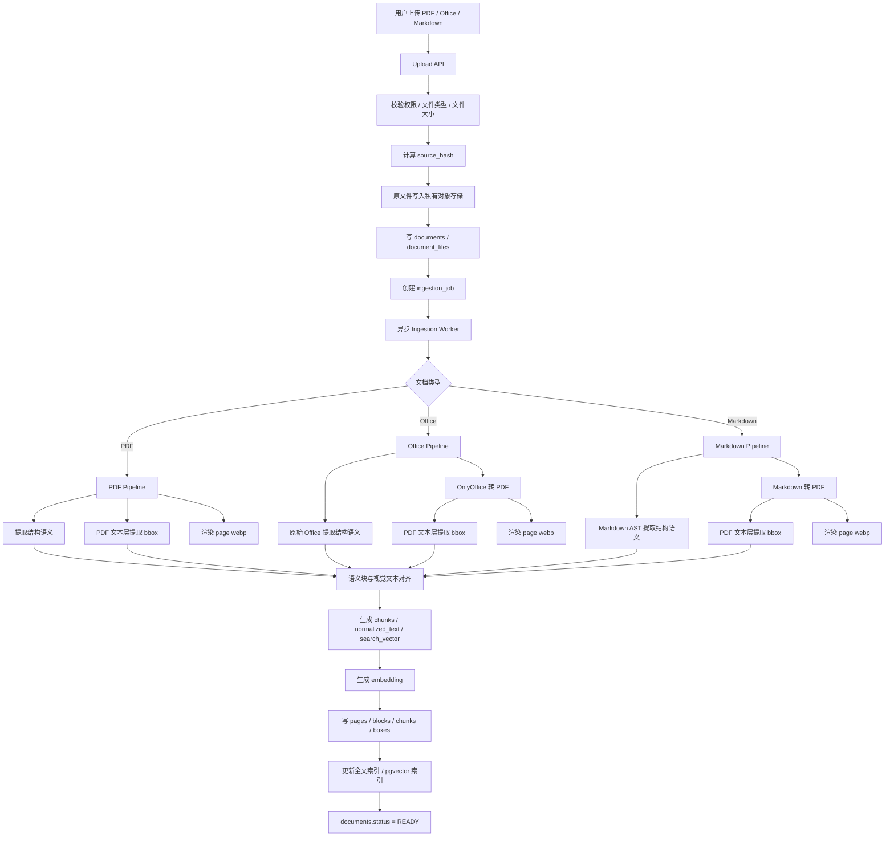
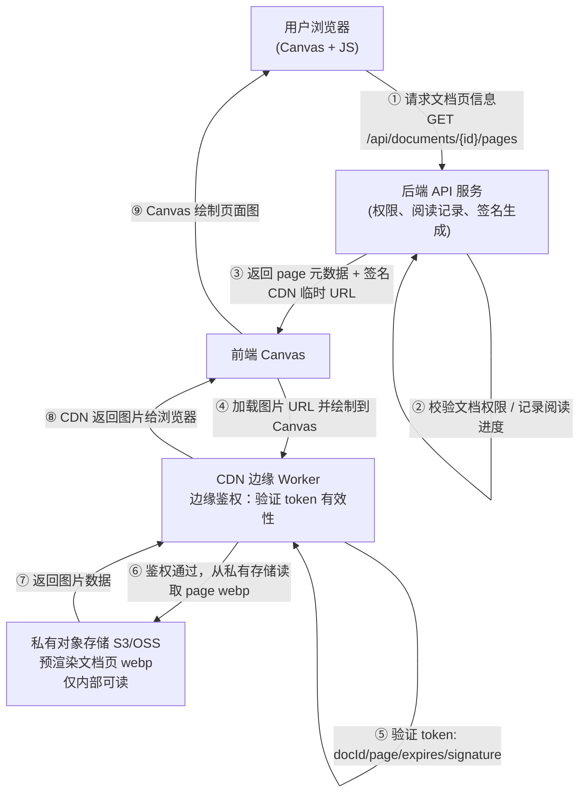
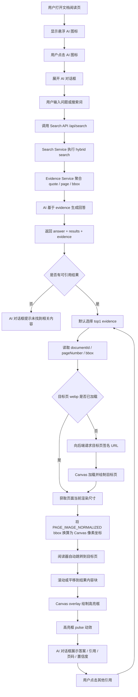
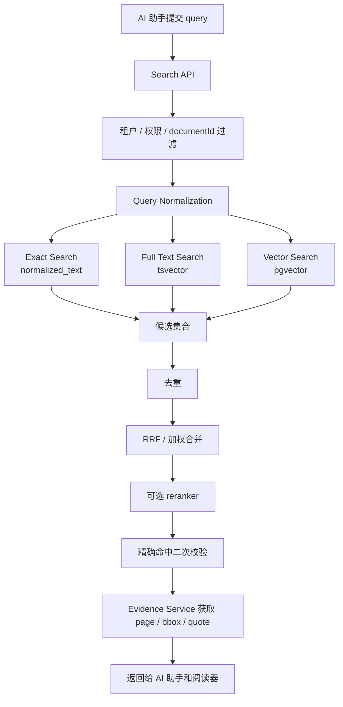
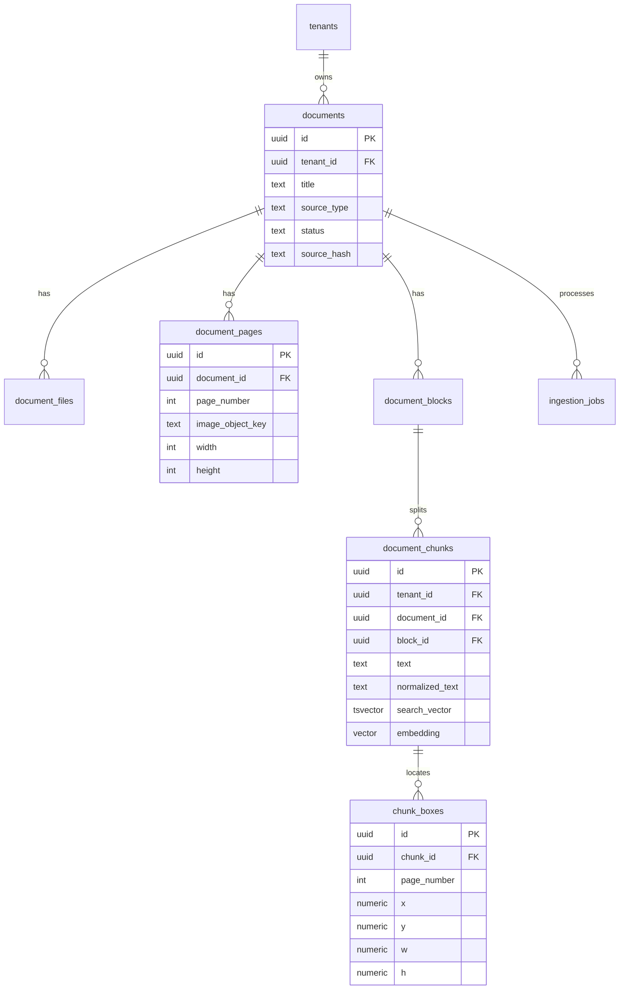

下面是整合后的完整版本：**上传处理、文档查看、AI 悬浮助手问答、自动定位框选**都放进同一套架构里。

**一、核心原则**

```text
PDF：原始 PDF 提取结构语义，PDF 文本层提取视觉定位
Office：原始 Office 提取结构语义，OnlyOffice 转 PDF，PDF 文本层提取视觉定位
Markdown：原始 Markdown AST 提取结构语义，Markdown 转 PDF，PDF 文本层提取视觉定位

最终前端统一展示：
page webp + canvas 绘制 + normalized bbox overlay
```

**二、上传处理流程**



**三、查看文档流程**



签名 URL 示例：

```text
https://cdn.xxx.com/documents/{documentId}/pages/3.webp?token=...&expires=...
```

token 建议包含：

```json
{
  "tenantId": "t1",
  "userId": "u1",
  "documentId": "doc1",
  "pageNumber": 3,
  "purpose": "DOCUMENT_PAGE_READ",
  "expiresAt": 1730000000
}
```

**四、AI 悬浮助手问答与自动定位流程**



前端定位计算：

```ts
function toCanvasRect(box, pageRenderRect) {
  return {
    left: pageRenderRect.left + box.x * pageRenderRect.width,
    top: pageRenderRect.top + box.y * pageRenderRect.height,
    width: box.w * pageRenderRect.width,
    height: box.h * pageRenderRect.height,
  };
}
```

**五、检索流程**



**六、数据库模型**



**七、核心 SQL**

```sql
CREATE EXTENSION IF NOT EXISTS pgcrypto;
CREATE EXTENSION IF NOT EXISTS pg_trgm;
CREATE EXTENSION IF NOT EXISTS vector;

CREATE TABLE documents (
  id uuid PRIMARY KEY DEFAULT gen_random_uuid(),
  tenant_id uuid NOT NULL,
  title text NOT NULL,
  source_type text NOT NULL CHECK (source_type IN ('PDF', 'OFFICE', 'MARKDOWN')),
  mime_type text NOT NULL,
  status text NOT NULL CHECK (status IN ('UPLOADED', 'PROCESSING', 'READY', 'FAILED')),
  source_hash text NOT NULL,
  parser_version text NOT NULL DEFAULT 'v1',
  render_version text NOT NULL DEFAULT 'v1',
  created_at timestamptz NOT NULL DEFAULT now(),
  updated_at timestamptz NOT NULL DEFAULT now(),
  UNIQUE (tenant_id, source_hash)
);

CREATE TABLE document_files (
  id uuid PRIMARY KEY DEFAULT gen_random_uuid(),
  document_id uuid NOT NULL REFERENCES documents(id) ON DELETE CASCADE,
  file_role text NOT NULL CHECK (file_role IN ('ORIGINAL', 'SEMANTIC_JSON', 'PDF_CANONICAL', 'PAGE_WEBP', 'THUMBNAIL')),
  page_number int,
  object_key text NOT NULL,
  byte_size bigint,
  checksum text,
  created_at timestamptz NOT NULL DEFAULT now()
);

CREATE TABLE document_pages (
  id uuid PRIMARY KEY DEFAULT gen_random_uuid(),
  document_id uuid NOT NULL REFERENCES documents(id) ON DELETE CASCADE,
  page_number int NOT NULL,
  page_type text NOT NULL CHECK (page_type IN ('PDF_PAGE', 'OFFICE_RENDERED_PDF_PAGE', 'MARKDOWN_RENDERED_PDF_PAGE')),
  image_object_key text NOT NULL,
  width int NOT NULL,
  height int NOT NULL,
  rotation int NOT NULL DEFAULT 0,
  UNIQUE (document_id, page_number)
);

CREATE TABLE document_chunks (
  id uuid PRIMARY KEY DEFAULT gen_random_uuid(),
  tenant_id uuid NOT NULL,
  document_id uuid NOT NULL REFERENCES documents(id) ON DELETE CASCADE,
  block_id uuid,
  chunk_index int NOT NULL,
  chunk_type text NOT NULL,
  text text NOT NULL,
  normalized_text text NOT NULL,
  search_vector tsvector NOT NULL,
  embedding vector(1536),
  embedding_model text,
  source_confidence numeric(5,4) NOT NULL DEFAULT 1,
  UNIQUE (document_id, chunk_index)
);

CREATE TABLE chunk_boxes (
  id uuid PRIMARY KEY DEFAULT gen_random_uuid(),
  chunk_id uuid NOT NULL REFERENCES document_chunks(id) ON DELETE CASCADE,
  document_id uuid NOT NULL REFERENCES documents(id) ON DELETE CASCADE,
  page_number int NOT NULL,
  coordinate_space text NOT NULL DEFAULT 'PAGE_IMAGE_NORMALIZED',
  x numeric(8,6) NOT NULL,
  y numeric(8,6) NOT NULL,
  w numeric(8,6) NOT NULL,
  h numeric(8,6) NOT NULL,
  source text NOT NULL,
  confidence numeric(5,4) NOT NULL DEFAULT 1
);
```

关键索引：

```sql
CREATE INDEX documents_tenant_status_idx ON documents (tenant_id, status, created_at DESC);
CREATE INDEX document_pages_document_page_idx ON document_pages (document_id, page_number);
CREATE INDEX chunks_tenant_idx ON document_chunks (tenant_id);
CREATE INDEX chunks_fts_idx ON document_chunks USING gin (search_vector);
CREATE INDEX chunks_trgm_idx ON document_chunks USING gin (normalized_text gin_trgm_ops);
CREATE INDEX chunks_embedding_hnsw_idx ON document_chunks USING hnsw (embedding vector_cosine_ops);
CREATE INDEX chunk_boxes_chunk_idx ON chunk_boxes (chunk_id);
CREATE INDEX chunk_boxes_document_page_idx ON chunk_boxes (document_id, page_number);
```

**八、核心 API**

```http
POST /api/documents
GET  /api/documents/{documentId}
GET  /api/documents/{documentId}/pages
POST /api/documents/{documentId}/pages/signed-url
POST /api/search
POST /api/assistant/chat
```

`POST /api/search` 返回：

```json
{
  "query": "付款期限是多少",
  "mode": "HYBRID",
  "results": [
    {
      "documentId": "uuid",
      "chunkId": "uuid",
      "matchType": "VECTOR",
      "score": 0.91,
      "quote": "付款应在收到发票后30日内完成",
      "pageNumber": 2,
      "imageUrl": "https://cdn.xxx.com/page/2.webp?token=...",
      "boxes": [
        {
          "coordinateSpace": "PAGE_IMAGE_NORMALIZED",
          "x": 0.12,
          "y": 0.33,
          "w": 0.68,
          "h": 0.07,
          "source": "MARKDOWN_RENDERED_PDF_TEXT_LAYER",
          "confidence": 0.99
        }
      ]
    }
  ]
}
```

**九、模块边界**

```text
Upload Service：上传、校验、hash、创建处理任务
Object Storage Adapter：管理原文件、PDF、webp、缩略图
Ingestion Worker：调度 PDF / Office / Markdown pipeline
Office Pipeline：原始 Office 语义提取 + OnlyOffice 转 PDF
Markdown Pipeline：Markdown AST 语义提取 + Markdown 转 PDF
PDF Pipeline：PDF 文本层 bbox + webp 渲染
Search Service：exact / full-text / vector / hybrid search
Evidence Service：quote + page + bbox 聚合
Assistant Service：基于 evidence 生成回答
Reader Frontend：Canvas 绘制页面、悬浮 AI、自动定位、高亮框
CDN Worker：校验临时 token，代理私有对象存储
```

最终闭环是：

```text
上传解析 → 统一转 PDF → 渲染 webp → 提取 bbox → 建索引
阅读页 Canvas 加载签名 webp
AI 悬浮助手搜索 → 返回 evidence → 自动跳页 → Canvas overlay 框选
```

这样前端体验是“用户正在读文档，点悬浮 AI 问问题，AI 直接把答案对应的原文位置框出来”，信任感会比普通聊天式问答强很多。