# DealSignal 数据库模型资源 v2.1.0

> **资源编号**：`DBM-2024-001`  
> **版本**：`v2.1.0`  
> **模板版本**：`v1`  
> **状态**：`已批准`  
> **编写人/适用对象**：`后端架构师 / 数据工程师`  
> **编写日期**：`2026-06-20`  
> **关联资源**：
> - `docs/TDD-v2.1.0.md`
> - `docs/PRD-v2.1.0.md`
> - `docs/ARCHITECTURE-v2.1.0.md`
> - `docs/templates/API-SPEC-template-v1.md`
> - `docs/templates/EVENT-TRACKING-template-v1.md`
> **评审人**：`CTO、后端负责人、DBA、安全负责人`

---

## 0. 资源使用说明

本资源是 DealSignal v2.1.0 的数据库模型设计资源（Database Model Resource），用于记录核心业务领域的数据实体、关系、约束和索引设计。

**目标**：
- 为所有数据表建立统一、可维护的设计规范。
- 明确表与表之间的关系（1:1、1:N、M:N）。
- 记录主键、外键、索引、约束、分区、软删除等关键设计。
- 作为后端开发、DBA、数据团队、安全审计的共同参考。

**适用范围**：
- 应用主数据库：PostgreSQL 15+（含 pgvector 扩展）
- 缓存层：Redis 7
- 对象存储：S3 兼容存储（AWS S3 / 阿里云 OSS / MinIO）
- 搜索引擎：pgvector + PostgreSQL tsvector 为主，Elasticsearch 为可选全文搜索补充

---

## 1. 资源控制信息

### 1.1 变更日志

| 版本 | 日期 | 修改人 | 修改内容 | 影响范围 |
|------|------|--------|----------|----------|
| v2.1.0 | 2026-06-20 | 后端架构师 | 按 PRD-v2.1.0 第 10.1 节数据模型初始版本 | 全资源 |

### 1.2 相关 ADR

| ADR 编号 | 标题 | 影响表/字段 |
|----------|------|-------------|
| D-13 | 租户隔离采用"子域名 + Workspace"混合模式 | 全部业务表增加 tenant_id + workspace_id |
| D-05 | 搜索采用 hybrid（exact + fts + vector） | document_chunks.search_vector / embedding |
| D-03 | 使用 PAGE_IMAGE_NORMALIZED 坐标 | chunk_boxes.bbox / document_blocks.bbox |
| D-16 | 支持企业自定义域名 | tenant_domains |

### 1.3 评审记录

| 轮次 | 日期 | 参与人 | 结论 | 待办 |
|------|------|--------|------|------|
| DBA 评审 | 2026-06-20 | DBA | 通过 | 索引与分区策略已确认 |
| 安全评审 | 2026-06-20 | 安全负责人 | 通过 | PII 标记与加密方案已确认 |
| 后端评审 | 2026-06-20 | 后端负责人 | 通过 | sqlc queries / migrations 已确认 |
| 合规评审 | 2026-06-20 | 合规负责人 | 通过 | 数据保留与审计日志策略已确认 |
| 性能评审 | 2026-06-20 | 后端负责人 + DBA | 通过 | 核心查询执行计划已确认 |
| 最终评审 | 2026-06-20 | 全体 | 已批准 | database-model-v2.1.0 进入实施阶段 |

---

## 2. 数据库选型与拓扑

### 2.1 数据库选型

| 用途 | 数据库 | 版本 | 部署方式 | 备注 |
|------|--------|------|----------|------|
| 主业务库 | PostgreSQL | 15+ | 阿里云 RDS / AWS RDS / 自建 | 事务一致性，JSONB，pgvector |
| 向量检索 | pgvector | 0.5+ | PostgreSQL 插件 | 1536 维 embedding，HNSW 索引 |
| 全文搜索 | PostgreSQL tsvector | 15+ | 内置 | 首选方案，GIN 索引 |
| 缓存 | Redis | 7.x | Cluster / 主从 | Session、锁、限流、队列 |
| 对象存储 | S3 兼容存储 | - | 多云 | 原文件、PDF、webp、缩略图 |
| 全文搜索（可选） | Elasticsearch | 8.x | 托管服务 | 超大规模全文场景备用 |
| 分析/数仓（可选） | ClickHouse | 24.x | 托管服务 | 行为分析、BI 报表 |

### 2.2 拓扑架构

```text
┌─────────────────────────────────────────────────────────────────────┐
│                            Application                              │
│   API / Worker / Viewer / Search / Assistant / Notification         │
└───────────────────────┬─────────────────────────────────────────────┘
                        │
        ┌───────────────┼───────────────┬──────────────────┐
        │               │               │                  │
   ┌────▼────┐     ┌────▼────┐    ┌─────▼──────┐    ┌──────▼──────┐
   │PostgreSQL│     │  Redis  │    │  S3 / OSS  │    │ Elasticsearch│
   │  +pgvector│     │ (缓存)  │    │ 对象存储   │    │  (可选全文)  │
   └─────────┘     └─────────┘    └────────────┘    └─────────────┘
```

### 2.3 命名规范

- **Schema**：使用 `public`。
- **表名**：小写、复数、`snake_case`，如 `workspace_members`。
- **字段名**：小写、`snake_case`，避免 SQL 关键字。
- **索引名**：`idx_{table}_{column}`，唯一索引 `uk_{table}_{column}`，复合索引按字段顺序命名。
- **外键名**：`fk_{table}_{referenced_table}`，多外键时加字段后缀。
- **主键**：使用 `uuid`（`gen_random_uuid()`），日志/事件类大表保留 `bigserial` 备选能力。
- **时间字段**：`created_at`、`updated_at`、`deleted_at`。
- **软删除**：统一使用 `deleted_at timestamptz NULL`；唯一索引必须带 `WHERE deleted_at IS NULL`。
- **JSONB 默认值**：统一使用 `'{}'::jsonb` 或 `'[]'::jsonb`。
- **CHECK 约束名**：`chk_{table}_{column}`。
- **分区表命名**：子分区名为 `{table}_yYYYmm`，如 `events_202607`。

---

## 3. 实体关系图（ERD）

```mermaid
erDiagram
    TENANTS ||--o{ TENANT_DOMAINS : has
    TENANTS ||--o{ WORKSPACES : contains
    TENANTS ||--o{ DOCUMENTS : owns
    TENANTS ||--o{ LINKS : owns
    TENANTS ||--o{ DEAL_ROOMS : owns
    TENANTS ||--o{ EVENTS : generates
    TENANTS ||--o{ AUDIT_LOGS : generates
    WORKSPACES ||--o{ WORKSPACE_MEMBERS : has
    WORKSPACES ||--o{ WORKSPACE_INVITATIONS : issues
    WORKSPACES ||--o{ DOCUMENTS : contains
    WORKSPACES ||--o{ LINKS : contains
    WORKSPACES ||--o{ DEAL_ROOMS : contains
    WORKSPACES ||--o{ EVENTS : generates
    WORKSPACES ||--o{ AUDIT_LOGS : generates
    WORKSPACES ||--o{ NOTIFICATION_JOBS : schedules
    WORKSPACES ||--o{ INTEGRATION_JOBS : schedules
    WORKSPACES ||--o{ ANALYTICS_JOBS : schedules
    WORKSPACES ||--o{ DEAD_LETTER_JOBS : retains
    USERS ||--o{ WORKSPACE_MEMBERS : belongs
    USERS ||--o{ WORKSPACE_INVITATIONS : invited
    USERS ||--o{ ASSISTANT_SESSIONS : chats
    DOCUMENTS ||--|{ DOCUMENT_FILES : has
    DOCUMENTS ||--o{ DOCUMENT_PAGES : contains
    DOCUMENTS ||--o{ DOCUMENT_BLOCKS : contains
    DOCUMENTS ||--o{ DOCUMENT_CHUNKS : splits_into
    DOCUMENTS ||--o{ INGESTION_JOBS : triggers
    DOCUMENTS ||--o{ LINKS : shared_via
    DOCUMENTS ||--o{ DEAL_ROOM_DOCUMENTS : added_to
    DOCUMENT_CHUNKS ||--o{ CHUNK_BOXES : locates
    DOCUMENT_PAGES ||--o{ DOCUMENT_BLOCKS : contains
    LINKS ||--o{ LINK_ACCESSES : receives
    LINKS ||--o{ PAGE_VIEWS : generates
    LINKS ||--o{ ASSISTANT_SESSIONS : enables
    DEAL_ROOMS ||--o{ ROOM_MEMBERS : has
    DEAL_ROOMS ||--o{ DEAL_ROOM_DOCUMENTS : contains
    DEAL_ROOMS ||--o{ ROOM_ACCESS_REQUESTS : receives
    DEAL_ROOMS ||--o{ ROOM_MEMBER_FOLDER_PERMISSIONS : controls
```



---

## 4. 核心领域数据模型

> **隔离原则**：除 `tenants`、`users`、`tenant_domains` 外，所有业务表必须包含 `tenant_id` + `workspace_id`；所有查询必须同时带这两个字段过滤。

### 4.1 领域：租户与用户域

#### 4.1.1 表：`tenants`

| 字段 | 类型 | 可空 | 默认值 | 说明 |
|------|------|------|--------|------|
| id | uuid | NOT NULL | gen_random_uuid() | 主键，租户不可变内部 ID |
| slug | varchar(64) | NOT NULL | - | 唯一子域名标识，如 `acme` |
| name | varchar(255) | NOT NULL | - | 租户名称 |
| status | varchar(32) | NOT NULL | 'active' | active / suspended / deleted |
| plan | varchar(32) | NOT NULL | 'free' | free / founder / pro / secure_room |
| settings | jsonb | NOT NULL | '{}' | 租户级配置：品牌、保留策略、域名等 |
| created_at | timestamptz | NOT NULL | now() | 创建时间 |
| updated_at | timestamptz | NOT NULL | now() | 更新时间 |
| deleted_at | timestamptz | NULL | - | 软删除 |

**主键**：`id`

**索引**：
```sql
CREATE UNIQUE INDEX uk_tenants_slug ON tenants(slug) WHERE deleted_at IS NULL;
CREATE INDEX idx_tenants_status ON tenants(status);
```

**约束**：
```sql
ALTER TABLE tenants ADD CONSTRAINT chk_tenants_status
  CHECK (status IN ('active', 'suspended', 'deleted'));
ALTER TABLE tenants ADD CONSTRAINT chk_tenants_plan
  CHECK (plan IN ('free', 'founder', 'pro', 'secure_room'));
```

#### 4.1.2 表：`tenant_domains`

| 字段 | 类型 | 可空 | 默认值 | 说明 |
|------|------|------|--------|------|
| id | uuid | NOT NULL | gen_random_uuid() | 主键 |
| tenant_id | uuid | NOT NULL | - | 所属租户 |
| domain | varchar(255) | NOT NULL | - | 域名，如 `acme.dealsignal.com` |
| domain_type | varchar(32) | NOT NULL | 'subdomain' | SUBDOMAIN / CUSTOM / PUBLIC_LINK |
| is_primary | boolean | NOT NULL | false | 是否主域名 |
| ssl_status | varchar(32) | NOT NULL | 'pending' | pending / issued / expired / error |
| ssl_expires_at | timestamptz | NULL | - | 证书过期时间 |
| verified_at | timestamptz | NULL | - | CNAME 验证时间 |
| created_at | timestamptz | NOT NULL | now() | 创建时间 |
| updated_at | timestamptz | NOT NULL | now() | 更新时间 |

**主键**：`id`

**索引**：
```sql
CREATE UNIQUE INDEX uk_tenant_domains_domain ON tenant_domains(domain);
CREATE INDEX idx_tenant_domains_tenant_id ON tenant_domains(tenant_id);
CREATE INDEX idx_tenant_domains_type ON tenant_domains(domain_type);
```

**外键**：
```sql
ALTER TABLE tenant_domains ADD CONSTRAINT fk_tenant_domains_tenants
  FOREIGN KEY (tenant_id) REFERENCES tenants(id) ON DELETE CASCADE;
```

**约束**：
```sql
ALTER TABLE tenant_domains ADD CONSTRAINT chk_tenant_domains_type
  CHECK (domain_type IN ('SUBDOMAIN', 'CUSTOM', 'PUBLIC_LINK'));
ALTER TABLE tenant_domains ADD CONSTRAINT chk_tenant_domains_ssl
  CHECK (ssl_status IN ('pending', 'issued', 'expired', 'error'));
```

#### 4.1.3 表：`users`

| 字段 | 类型 | 可空 | 默认值 | 说明 |
|------|------|------|--------|------|
| id | uuid | NOT NULL | gen_random_uuid() | 主键 |
| email | varchar(255) | NOT NULL | - | 全局唯一邮箱 |
| encrypted_password | varchar(255) | NULL | - | bcrypt/Argon2 哈希 |
| email_verified_at | timestamptz | NULL | - | 邮箱验证时间 |
| full_name | varchar(255) | NULL | - | 姓名 |
| avatar_url | text | NULL | - | 头像 URL |
| status | varchar(32) | NOT NULL | 'active' | active / inactive / deleted |
| timezone | varchar(64) | NULL | 'UTC' | 时区 |
| created_at | timestamptz | NOT NULL | now() | 创建时间 |
| updated_at | timestamptz | NOT NULL | now() | 更新时间 |
| deleted_at | timestamptz | NULL | - | 软删除 |

**主键**：`id`

**索引**：
```sql
CREATE UNIQUE INDEX uk_users_email ON users(email) WHERE deleted_at IS NULL;
CREATE INDEX idx_users_status ON users(status);
```

**约束**：
```sql
ALTER TABLE users ADD CONSTRAINT chk_users_status
  CHECK (status IN ('active', 'inactive', 'deleted'));
```

#### 4.1.4 表：`workspaces`

| 字段 | 类型 | 可空 | 默认值 | 说明 |
|------|------|------|--------|------|
| id | uuid | NOT NULL | gen_random_uuid() | 主键 |
| tenant_id | uuid | NOT NULL | - | 所属租户 |
| slug | varchar(64) | NOT NULL | - | Workspace URL 标识，租户内唯一 |
| name | varchar(255) | NOT NULL | - | Workspace 名称 |
| status | varchar(32) | NOT NULL | 'active' | active / archived / deleted |
| settings | jsonb | NOT NULL | '{}' | 工作空间配置 |
| created_at | timestamptz | NOT NULL | now() | 创建时间 |
| updated_at | timestamptz | NOT NULL | now() | 更新时间 |
| deleted_at | timestamptz | NULL | - | 软删除 |

**主键**：`id`

**索引**：
```sql
CREATE UNIQUE INDEX uk_workspaces_tenant_slug ON workspaces(tenant_id, slug) WHERE deleted_at IS NULL;
CREATE INDEX idx_workspaces_tenant_id ON workspaces(tenant_id);
CREATE INDEX idx_workspaces_status ON workspaces(status);
```

**外键**：
```sql
ALTER TABLE workspaces ADD CONSTRAINT fk_workspaces_tenants
  FOREIGN KEY (tenant_id) REFERENCES tenants(id) ON DELETE CASCADE;
```

**约束**：
```sql
ALTER TABLE workspaces ADD CONSTRAINT chk_workspaces_status
  CHECK (status IN ('active', 'archived', 'deleted'));
```


#### 4.1.5 表：`workspace_members`

用户与 Workspace 的多对多关系表。

| 字段 | 类型 | 可空 | 默认值 | 说明 |
|------|------|------|--------|------|
| tenant_id | uuid | NOT NULL | - | 所属租户 |
| workspace_id | uuid | NOT NULL | - | 关联 workspace |
| user_id | uuid | NOT NULL | - | 关联 user |
| role | varchar(32) | NOT NULL | 'member' | owner / admin / member / guest |
| joined_at | timestamptz | NOT NULL | now() | 加入时间 |
| created_at | timestamptz | NOT NULL | now() | 创建时间 |
| updated_at | timestamptz | NOT NULL | now() | 更新时间 |

**主键**：`(workspace_id, user_id)`

**索引**：
```sql
CREATE INDEX idx_workspace_members_user_id ON workspace_members(user_id);
CREATE INDEX idx_workspace_members_tenant_workspace ON workspace_members(tenant_id, workspace_id);
CREATE INDEX idx_workspace_members_role ON workspace_members(role);
```

**外键**：
```sql
ALTER TABLE workspace_members ADD CONSTRAINT fk_workspace_members_workspaces
  FOREIGN KEY (workspace_id) REFERENCES workspaces(id) ON DELETE CASCADE;
ALTER TABLE workspace_members ADD CONSTRAINT fk_workspace_members_users
  FOREIGN KEY (user_id) REFERENCES users(id) ON DELETE CASCADE;
```

**约束**：
```sql
ALTER TABLE workspace_members ADD CONSTRAINT chk_workspace_members_role
  CHECK (role IN ('owner', 'admin', 'member', 'guest'));
```

#### 4.1.6 表：`workspace_invitations`

| 字段 | 类型 | 可空 | 默认值 | 说明 |
|------|------|------|--------|------|
| id | uuid | NOT NULL | gen_random_uuid() | 主键 |
| tenant_id | uuid | NOT NULL | - | 所属租户 |
| workspace_id | uuid | NOT NULL | - | 关联 workspace |
| email | varchar(255) | NOT NULL | - | 被邀请人邮箱 |
| token | varchar(255) | NOT NULL | - | 邀请 token，唯一 |
| role | varchar(32) | NOT NULL | 'member' | owner / admin / member / guest |
| status | varchar(32) | NOT NULL | 'pending' | pending / accepted / expired / revoked |
| expires_at | timestamptz | NOT NULL | - | 过期时间 |
| invited_by | uuid | NOT NULL | - | 邀请人 |
| created_at | timestamptz | NOT NULL | now() | 创建时间 |
| updated_at | timestamptz | NOT NULL | now() | 更新时间 |

**主键**：`id`

**索引**：
```sql
CREATE UNIQUE INDEX uk_workspace_invitations_token ON workspace_invitations(token);
CREATE INDEX idx_workspace_invitations_workspace_email ON workspace_invitations(workspace_id, email);
CREATE INDEX idx_workspace_invitations_status ON workspace_invitations(status);
CREATE INDEX idx_workspace_invitations_expires_at ON workspace_invitations(expires_at);
```

**外键**：
```sql
ALTER TABLE workspace_invitations ADD CONSTRAINT fk_workspace_invitations_tenants
  FOREIGN KEY (tenant_id) REFERENCES tenants(id) ON DELETE CASCADE;
ALTER TABLE workspace_invitations ADD CONSTRAINT fk_workspace_invitations_workspaces
  FOREIGN KEY (workspace_id) REFERENCES workspaces(id) ON DELETE CASCADE;
ALTER TABLE workspace_invitations ADD CONSTRAINT fk_workspace_invitations_users
  FOREIGN KEY (invited_by) REFERENCES users(id) ON DELETE SET NULL;
```

**约束**：
```sql
ALTER TABLE workspace_invitations ADD CONSTRAINT chk_workspace_invitations_role
  CHECK (role IN ('owner', 'admin', 'member', 'guest'));
ALTER TABLE workspace_invitations ADD CONSTRAINT chk_workspace_invitations_status
  CHECK (status IN ('pending', 'accepted', 'expired', 'revoked'));
```

---

### 4.2 领域：文档域

#### 4.2.1 表：`documents`

| 字段 | 类型 | 可空 | 默认值 | 说明 |
|------|------|------|--------|------|
| id | uuid | NOT NULL | gen_random_uuid() | 主键 |
| tenant_id | uuid | NOT NULL | - | 所属租户 |
| workspace_id | uuid | NOT NULL | - | 所属 workspace |
| title | varchar(500) | NOT NULL | - | 文档标题 |
| source_type | varchar(32) | NOT NULL | - | PDF / DOCX / PPTX / XLSX |
| source_hash | varchar(128) | NOT NULL | - | 原始文件 hash，用于去重 |
| status | varchar(32) | NOT NULL | 'uploaded' | uploaded / processing / ready / failed / archived |
| page_count | int | NULL | - | 总页数 |
| metadata | jsonb | NOT NULL | '{}' | 文件元数据：大小、MIME、版本等 |
| created_by | uuid | NOT NULL | - | 创建人 |
| created_at | timestamptz | NOT NULL | now() | 创建时间 |
| updated_at | timestamptz | NOT NULL | now() | 更新时间 |
| deleted_at | timestamptz | NULL | - | 软删除 |

**主键**：`id`

**索引**：
```sql
CREATE INDEX idx_documents_tenant_workspace ON documents(tenant_id, workspace_id);
CREATE INDEX idx_documents_workspace_status ON documents(workspace_id, status);
CREATE INDEX idx_documents_created_by ON documents(created_by);
CREATE INDEX idx_documents_status ON documents(status);
CREATE INDEX idx_documents_source_hash ON documents(tenant_id, source_hash);
CREATE INDEX idx_documents_deleted_at ON documents(deleted_at) WHERE deleted_at IS NOT NULL;
```

**外键**：
```sql
ALTER TABLE documents ADD CONSTRAINT fk_documents_tenants
  FOREIGN KEY (tenant_id) REFERENCES tenants(id) ON DELETE CASCADE;
ALTER TABLE documents ADD CONSTRAINT fk_documents_workspaces
  FOREIGN KEY (workspace_id) REFERENCES workspaces(id) ON DELETE CASCADE;
ALTER TABLE documents ADD CONSTRAINT fk_documents_users
  FOREIGN KEY (created_by) REFERENCES users(id) ON DELETE SET NULL;
```

**约束**：
```sql
ALTER TABLE documents ADD CONSTRAINT chk_documents_source_type
  CHECK (source_type IN ('PDF', 'DOCX', 'PPTX', 'XLSX'));
ALTER TABLE documents ADD CONSTRAINT chk_documents_status
  CHECK (status IN ('uploaded', 'processing', 'ready', 'failed', 'archived'));
ALTER TABLE documents ADD CONSTRAINT chk_documents_page_count
  CHECK (page_count IS NULL OR page_count >= 0);
```

#### 4.2.2 表：`document_files`

| 字段 | 类型 | 可空 | 默认值 | 说明 |
|------|------|------|--------|------|
| id | uuid | NOT NULL | gen_random_uuid() | 主键 |
| tenant_id | uuid | NOT NULL | - | 所属租户 |
| workspace_id | uuid | NOT NULL | - | 所属 workspace |
| document_id | uuid | NOT NULL | - | 关联文档 |
| file_role | varchar(32) | NOT NULL | - | ORIGINAL / SEMANTIC_JSON / PDF_CANONICAL / PAGE_WEBP / THUMBNAIL |
| object_key | text | NOT NULL | - | 对象存储 key |
| file_size | bigint | NULL | - | 文件大小（字节） |
| mime_type | varchar(128) | NULL | - | MIME 类型 |
| metadata | jsonb | NOT NULL | '{}' | 文件元数据：bucket、region、page_number 等 |
| created_at | timestamptz | NOT NULL | now() | 创建时间 |

**主键**：`id`

**索引**：
```sql
CREATE INDEX idx_document_files_document_id ON document_files(document_id);
CREATE INDEX idx_document_files_tenant_workspace ON document_files(tenant_id, workspace_id);
CREATE INDEX idx_document_files_role ON document_files(document_id, file_role);
CREATE UNIQUE INDEX uk_document_files_unique_role ON document_files(document_id, file_role)
  WHERE file_role IN ('ORIGINAL', 'SEMANTIC_JSON', 'PDF_CANONICAL', 'THUMBNAIL');
```

**外键**：
```sql
ALTER TABLE document_files ADD CONSTRAINT fk_document_files_documents
  FOREIGN KEY (document_id) REFERENCES documents(id) ON DELETE CASCADE;
ALTER TABLE document_files ADD CONSTRAINT fk_document_files_tenants
  FOREIGN KEY (tenant_id) REFERENCES tenants(id) ON DELETE CASCADE;
ALTER TABLE document_files ADD CONSTRAINT fk_document_files_workspaces
  FOREIGN KEY (workspace_id) REFERENCES workspaces(id) ON DELETE CASCADE;
```

**约束**：
```sql
ALTER TABLE document_files ADD CONSTRAINT chk_document_files_role
  CHECK (file_role IN ('ORIGINAL', 'SEMANTIC_JSON', 'PDF_CANONICAL', 'PAGE_WEBP', 'THUMBNAIL'));
ALTER TABLE document_files ADD CONSTRAINT chk_document_files_size
  CHECK (file_size IS NULL OR file_size >= 0);
```

#### 4.2.3 表：`document_pages`

| 字段 | 类型 | 可空 | 默认值 | 说明 |
|------|------|------|--------|------|
| id | uuid | NOT NULL | gen_random_uuid() | 主键 |
| tenant_id | uuid | NOT NULL | - | 所属租户 |
| workspace_id | uuid | NOT NULL | - | 所属 workspace |
| document_id | uuid | NOT NULL | - | 关联文档 |
| page_number | int | NOT NULL | - | 页码，从 1 开始 |
| image_object_key | text | NOT NULL | - | webp 图片对象 key |
| width | int | NULL | - | 页面宽度（像素） |
| height | int | NULL | - | 页面高度（像素） |
| page_metadata | jsonb | NOT NULL | '{}' | 页面元数据 |
| created_at | timestamptz | NOT NULL | now() | 创建时间 |

**主键**：`id`

**索引**：
```sql
CREATE UNIQUE INDEX uk_document_pages_doc_page ON document_pages(document_id, page_number);
CREATE INDEX idx_document_pages_tenant_workspace ON document_pages(tenant_id, workspace_id);
```

**外键**：
```sql
ALTER TABLE document_pages ADD CONSTRAINT fk_document_pages_documents
  FOREIGN KEY (document_id) REFERENCES documents(id) ON DELETE CASCADE;
```

**约束**：
```sql
ALTER TABLE document_pages ADD CONSTRAINT chk_document_pages_number
  CHECK (page_number > 0);
ALTER TABLE document_pages ADD CONSTRAINT chk_document_pages_dimensions
  CHECK ((width IS NULL OR width > 0) AND (height IS NULL OR height > 0));
```

#### 4.2.4 表：`document_blocks`

| 字段 | 类型 | 可空 | 默认值 | 说明 |
|------|------|------|--------|------|
| id | uuid | NOT NULL | gen_random_uuid() | 主键 |
| tenant_id | uuid | NOT NULL | - | 所属租户 |
| workspace_id | uuid | NOT NULL | - | 所属 workspace |
| document_id | uuid | NOT NULL | - | 关联文档 |
| page_number | int | NOT NULL | - | 页码 |
| block_index | int | NOT NULL | - | 块序号 |
| block_type | varchar(32) | NOT NULL | - | text / heading / table / image / list |
| bbox | jsonb | NOT NULL | - | PAGE_IMAGE_NORMALIZED 边界框 |
| content | text | NULL | - | 文本内容 |
| parent_block_id | uuid | NULL | - | 父块 ID |
| metadata | jsonb | NOT NULL | '{}' | 块元数据 |
| created_at | timestamptz | NOT NULL | now() | 创建时间 |

**主键**：`id`

**索引**：
```sql
CREATE INDEX idx_document_blocks_document_page ON document_blocks(document_id, page_number);
CREATE INDEX idx_document_blocks_tenant_workspace ON document_blocks(tenant_id, workspace_id);
CREATE INDEX idx_document_blocks_parent ON document_blocks(parent_block_id);
```

**外键**：
```sql
ALTER TABLE document_blocks ADD CONSTRAINT fk_document_blocks_documents
  FOREIGN KEY (document_id) REFERENCES documents(id) ON DELETE CASCADE;
ALTER TABLE document_blocks ADD CONSTRAINT fk_document_blocks_parent
  FOREIGN KEY (parent_block_id) REFERENCES document_blocks(id) ON DELETE SET NULL;
```

**约束**：
```sql
ALTER TABLE document_blocks ADD CONSTRAINT chk_document_blocks_type
  CHECK (block_type IN ('text', 'heading', 'table', 'image', 'list'));
ALTER TABLE document_blocks ADD CONSTRAINT chk_document_blocks_bbox
  CHECK (jsonb_typeof(bbox) = 'object');
```

#### 4.2.5 表：`document_chunks`（AI 检索）

| 字段 | 类型 | 可空 | 默认值 | 说明 |
|------|------|------|--------|------|
| id | uuid | NOT NULL | gen_random_uuid() | 主键 |
| tenant_id | uuid | NOT NULL | - | 所属租户 |
| workspace_id | uuid | NOT NULL | - | 所属 workspace |
| document_id | uuid | NOT NULL | - | 关联文档 |
| chunk_index | int | NOT NULL | - | chunk 序号 |
| normalized_text | text | NOT NULL | - | 归一化文本 |
| search_vector | tsvector | NULL | - | PostgreSQL 全文搜索向量 |
| embedding | vector(1536) | NULL | - | OpenAI-compatible embedding |
| embedding_model | varchar(128) | NULL | - | 生成 embedding 的模型 |
| metadata | jsonb | NOT NULL | '{}' | 额外元数据 |
| created_at | timestamptz | NOT NULL | now() | 创建时间 |

**主键**：`id`

**索引**：
```sql
CREATE UNIQUE INDEX uk_document_chunks_doc_index ON document_chunks(document_id, chunk_index);
CREATE INDEX idx_document_chunks_tenant_workspace ON document_chunks(tenant_id, workspace_id);
CREATE INDEX idx_document_chunks_search_vector ON document_chunks USING gin(search_vector);
CREATE INDEX idx_document_chunks_embedding ON document_chunks USING hnsw (embedding vector_cosine_ops);
```

**外键**：
```sql
ALTER TABLE document_chunks ADD CONSTRAINT fk_document_chunks_documents
  FOREIGN KEY (document_id) REFERENCES documents(id) ON DELETE CASCADE;
```

**约束**：
```sql
ALTER TABLE document_chunks ADD CONSTRAINT chk_document_chunks_index
  CHECK (chunk_index >= 0);
```

#### 4.2.6 表：`chunk_boxes`（页面定位框）

| 字段 | 类型 | 可空 | 默认值 | 说明 |
|------|------|------|--------|------|
| id | uuid | NOT NULL | gen_random_uuid() | 主键 |
| tenant_id | uuid | NOT NULL | - | 所属租户 |
| workspace_id | uuid | NOT NULL | - | 所属 workspace |
| chunk_id | uuid | NOT NULL | - | 关联 chunk |
| document_id | uuid | NOT NULL | - | 关联文档 |
| page_number | int | NOT NULL | - | 页码 |
| item_index | int | NOT NULL | - | 同一 chunk 内框序号 |
| box_type | varchar(32) | NOT NULL | 'text' | text / heading / table / image / list |
| bbox | jsonb | NOT NULL | - | PAGE_IMAGE_NORMALIZED 坐标 {x, y, w, h} |
| created_at | timestamptz | NOT NULL | now() | 创建时间 |

**主键**：`id`

**索引**：
```sql
CREATE INDEX idx_chunk_boxes_chunk_id ON chunk_boxes(chunk_id);
CREATE INDEX idx_chunk_boxes_document_page ON chunk_boxes(document_id, page_number);
CREATE INDEX idx_chunk_boxes_tenant_workspace ON chunk_boxes(tenant_id, workspace_id);
```

**外键**：
```sql
ALTER TABLE chunk_boxes ADD CONSTRAINT fk_chunk_boxes_document_chunks
  FOREIGN KEY (chunk_id) REFERENCES document_chunks(id) ON DELETE CASCADE;
ALTER TABLE chunk_boxes ADD CONSTRAINT fk_chunk_boxes_documents
  FOREIGN KEY (document_id) REFERENCES documents(id) ON DELETE CASCADE;
```

**约束**：
```sql
ALTER TABLE chunk_boxes ADD CONSTRAINT chk_chunk_boxes_type
  CHECK (box_type IN ('text', 'heading', 'table', 'image', 'list'));
ALTER TABLE chunk_boxes ADD CONSTRAINT chk_chunk_boxes_bbox
  CHECK (jsonb_typeof(bbox) = 'object');
ALTER TABLE chunk_boxes ADD CONSTRAINT chk_chunk_boxes_page_number
  CHECK (page_number > 0);
```

#### 4.2.7 表：`ingestion_jobs`

| 字段 | 类型 | 可空 | 默认值 | 说明 |
|------|------|------|--------|------|
| id | uuid | NOT NULL | gen_random_uuid() | 主键 |
| tenant_id | uuid | NOT NULL | - | 所属租户 |
| workspace_id | uuid | NOT NULL | - | 所属 workspace |
| document_id | uuid | NOT NULL | - | 关联文档 |
| job_type | varchar(32) | NOT NULL | 'full' | full / reindex / reconvert |
| status | varchar(32) | NOT NULL | 'pending' | pending / running / completed / failed / cancelled |
| error_message | text | NULL | - | 错误信息 |
| retry_count | int | NOT NULL | 0 | 重试次数 |
| worker_id | varchar(128) | NULL | - | 执行 worker 标识 |
| started_at | timestamptz | NULL | - | 开始时间 |
| completed_at | timestamptz | NULL | - | 完成时间 |
| created_at | timestamptz | NOT NULL | now() | 创建时间 |
| updated_at | timestamptz | NOT NULL | now() | 更新时间 |

**主键**：`id`

**索引**：
```sql
CREATE INDEX idx_ingestion_jobs_document_id ON ingestion_jobs(document_id);
CREATE INDEX idx_ingestion_jobs_status ON ingestion_jobs(status);
CREATE INDEX idx_ingestion_jobs_tenant_workspace ON ingestion_jobs(tenant_id, workspace_id);
CREATE INDEX idx_ingestion_jobs_created_at ON ingestion_jobs(created_at);
```

**外键**：
```sql
ALTER TABLE ingestion_jobs ADD CONSTRAINT fk_ingestion_jobs_documents
  FOREIGN KEY (document_id) REFERENCES documents(id) ON DELETE CASCADE;
```

**约束**：
```sql
ALTER TABLE ingestion_jobs ADD CONSTRAINT chk_ingestion_jobs_type
  CHECK (job_type IN ('full', 'reindex', 'reconvert'));
ALTER TABLE ingestion_jobs ADD CONSTRAINT chk_ingestion_jobs_status
  CHECK (status IN ('pending', 'running', 'completed', 'failed', 'cancelled'));
ALTER TABLE ingestion_jobs ADD CONSTRAINT chk_ingestion_jobs_retry
  CHECK (retry_count >= 0);
```


---

### 4.3 领域：链接与权限域

#### 4.3.1 表：`links`

| 字段 | 类型 | 可空 | 默认值 | 说明 |
|------|------|------|--------|------|
| id | uuid | NOT NULL | gen_random_uuid() | 主键 |
| tenant_id | uuid | NOT NULL | - | 所属租户 |
| workspace_id | uuid | NOT NULL | - | 所属 workspace |
| document_id | uuid | NOT NULL | - | 关联文档 |
| public_token | varchar(255) | NOT NULL | - | 公开 token，唯一 |
| name | varchar(255) | NULL | - | 链接名称 |
| permission_type | varchar(32) | NOT NULL | 'public' | public / email_required / whitelist / password |
| allowed_emails | jsonb | NOT NULL | '[]' | 白名单邮箱/域名列表 |
| password_hash | varchar(255) | NULL | - | 密码哈希 |
| expires_at | timestamptz | NULL | - | 过期时间 |
| max_access_count | int | NULL | - | 最大访问次数 |
| access_count | int | NOT NULL | 0 | 已访问次数 |
| download_enabled | boolean | NOT NULL | false | 是否允许下载 |
| watermark_enabled | boolean | NOT NULL | false | 是否启用水印 |
| notification_settings | jsonb | NOT NULL | '{}' | 提醒配置 |
| status | varchar(32) | NOT NULL | 'active' | active / disabled / revoked |
| created_by | uuid | NOT NULL | - | 创建人 |
| created_at | timestamptz | NOT NULL | now() | 创建时间 |
| updated_at | timestamptz | NOT NULL | now() | 更新时间 |
| deleted_at | timestamptz | NULL | - | 软删除 |

**主键**：`id`

**索引**：
```sql
CREATE UNIQUE INDEX uk_links_public_token ON links(public_token);
CREATE INDEX idx_links_document_id ON links(document_id);
CREATE INDEX idx_links_tenant_workspace ON links(tenant_id, workspace_id);
CREATE INDEX idx_links_status ON links(status);
CREATE INDEX idx_links_expires_at ON links(expires_at);
CREATE INDEX idx_links_created_by ON links(created_by);
```

**外键**：
```sql
ALTER TABLE links ADD CONSTRAINT fk_links_documents
  FOREIGN KEY (document_id) REFERENCES documents(id) ON DELETE CASCADE;
ALTER TABLE links ADD CONSTRAINT fk_links_users
  FOREIGN KEY (created_by) REFERENCES users(id) ON DELETE SET NULL;
```

**约束**：
```sql
ALTER TABLE links ADD CONSTRAINT chk_links_permission_type
  CHECK (permission_type IN ('public', 'email_required', 'whitelist', 'password'));
ALTER TABLE links ADD CONSTRAINT chk_links_status
  CHECK (status IN ('active', 'disabled', 'revoked'));
ALTER TABLE links ADD CONSTRAINT chk_links_access_count
  CHECK (access_count >= 0);
ALTER TABLE links ADD CONSTRAINT chk_links_max_access
  CHECK (max_access_count IS NULL OR max_access_count > 0);
```

#### 4.3.2 表：`link_accesses`

| 字段 | 类型 | 可空 | 默认值 | 说明 |
|------|------|------|--------|------|
| id | uuid | NOT NULL | gen_random_uuid() | 主键 |
| tenant_id | uuid | NOT NULL | - | 所属租户 |
| workspace_id | uuid | NOT NULL | - | 所属 workspace |
| link_id | uuid | NOT NULL | - | 关联链接 |
| visitor_id | varchar(255) | NULL | - | 匿名访问者 ID |
| visitor_email | varchar(255) | NULL | - | 访问者邮箱 |
| visitor_name | varchar(255) | NULL | - | 访问者姓名 |
| ip_address | inet | NULL | - | IP 地址 |
| user_agent | text | NULL | - | User Agent |
| device | varchar(64) | NULL | - | 设备类型 |
| region | varchar(64) | NULL | - | 地区 |
| access_status | varchar(32) | NOT NULL | 'granted' | granted / denied / expired / password_required |
| access_method | varchar(32) | NULL | - | email / password / public |
| created_at | timestamptz | NOT NULL | now() | 创建时间 |

**主键**：`id`

**索引**：
```sql
CREATE INDEX idx_link_accesses_link_id ON link_accesses(link_id);
CREATE INDEX idx_link_accesses_visitor ON link_accesses(visitor_id);
CREATE INDEX idx_link_accesses_email ON link_accesses(visitor_email);
CREATE INDEX idx_link_accesses_tenant_workspace ON link_accesses(tenant_id, workspace_id);
CREATE INDEX idx_link_accesses_created_at ON link_accesses(created_at);
```

**外键**：
```sql
ALTER TABLE link_accesses ADD CONSTRAINT fk_link_accesses_links
  FOREIGN KEY (link_id) REFERENCES links(id) ON DELETE CASCADE;
```

**约束**：
```sql
ALTER TABLE link_accesses ADD CONSTRAINT chk_link_accesses_status
  CHECK (access_status IN ('granted', 'denied', 'expired', 'password_required'));
```

---

### 4.4 领域：分析与事件域

#### 4.4.1 表：`page_views`

按 `created_at` 范围分区，详见第 7 节。

| 字段 | 类型 | 可空 | 默认值 | 说明 |
|------|------|------|--------|------|
| id | uuid | NOT NULL | gen_random_uuid() | 主键 |
| tenant_id | uuid | NOT NULL | - | 所属租户 |
| workspace_id | uuid | NOT NULL | - | 所属 workspace |
| link_id | uuid | NOT NULL | - | 关联链接 |
| access_id | uuid | NULL | - | 关联 link_accesses |
| visitor_id | varchar(255) | NULL | - | 匿名访问者 ID |
| page_number | int | NOT NULL | - | 页码 |
| duration_ms | int | NOT NULL | 0 | 停留时长（毫秒） |
| scroll_depth | decimal(5,2) | NULL | - | 滚动深度 0.00-1.00 |
| event_timestamp | timestamptz | NOT NULL | now() | 事件发生时间 |
| created_at | timestamptz | NOT NULL | now() | 记录时间（分区键） |

**主键**：`(id, created_at)`

**索引**：
```sql
CREATE INDEX idx_page_views_link_page ON page_views(link_id, page_number);
CREATE INDEX idx_page_views_visitor ON page_views(visitor_id);
CREATE INDEX idx_page_views_event_timestamp ON page_views(event_timestamp);
```

**外键**（仅引用同分区内数据，生产环境谨慎使用或应用层保证）：
```sql
ALTER TABLE page_views ADD CONSTRAINT fk_page_views_links
  FOREIGN KEY (link_id) REFERENCES links(id) ON DELETE CASCADE;
```

**约束**：
```sql
ALTER TABLE page_views ADD CONSTRAINT chk_page_views_duration
  CHECK (duration_ms >= 0);
ALTER TABLE page_views ADD CONSTRAINT chk_page_views_scroll_depth
  CHECK (scroll_depth IS NULL OR (scroll_depth >= 0 AND scroll_depth <= 1));
ALTER TABLE page_views ADD CONSTRAINT chk_page_views_page_number
  CHECK (page_number > 0);
```

#### 4.4.2 表：`events`

按 `created_at` 范围分区，详见第 7 节。

| 字段 | 类型 | 可空 | 默认值 | 说明 |
|------|------|------|--------|------|
| id | uuid | NOT NULL | gen_random_uuid() | 主键 |
| tenant_id | uuid | NOT NULL | - | 所属租户 |
| workspace_id | uuid | NOT NULL | - | 所属 workspace |
| event_type | varchar(64) | NOT NULL | - | 事件类型，如 `page_viewed` |
| resource_type | varchar(64) | NULL | - | 对象类型：document / link / room |
| resource_id | uuid | NULL | - | 对象 ID |
| visitor_id | varchar(255) | NULL | - | 匿名访问者 ID |
| user_id | uuid | NULL | - | 登录用户 ID |
| session_id | varchar(255) | NULL | - | 会话 ID |
| payload | jsonb | NOT NULL | '{}' | 事件属性 |
| event_timestamp | timestamptz | NOT NULL | now() | 事件发生时间 |
| created_at | timestamptz | NOT NULL | now() | 记录时间（分区键） |

**主键**：`(id, created_at)`

**索引**：
```sql
CREATE INDEX idx_events_tenant_workspace ON events(tenant_id, workspace_id);
CREATE INDEX idx_events_type ON events(event_type);
CREATE INDEX idx_events_resource ON events(resource_type, resource_id);
CREATE INDEX idx_events_event_timestamp ON events(event_timestamp);
CREATE INDEX idx_events_payload ON events USING gin(payload);
```

**约束**：
```sql
ALTER TABLE events ADD CONSTRAINT chk_events_payload
  CHECK (jsonb_typeof(payload) = 'object');
```

#### 4.4.3 表：`audit_logs`

按 `created_at` 范围分区，详见第 7 节。

| 字段 | 类型 | 可空 | 默认值 | 说明 |
|------|------|------|--------|------|
| id | uuid | NOT NULL | gen_random_uuid() | 主键 |
| tenant_id | uuid | NOT NULL | - | 所属租户 |
| workspace_id | uuid | NOT NULL | - | 所属 workspace |
| actor_type | varchar(32) | NOT NULL | 'user' | user / system / visitor |
| actor_id | varchar(255) | NULL | - | 操作者 ID |
| action | varchar(64) | NOT NULL | - | 操作：create / update / delete / access / login |
| resource_type | varchar(64) | NOT NULL | - | 资源类型 |
| resource_id | varchar(255) | NULL | - | 资源 ID |
| ip_address | inet | NULL | - | IP 地址 |
| user_agent | text | NULL | - | User Agent |
| before_state | jsonb | NULL | - | 变更前状态 |
| after_state | jsonb | NULL | - | 变更后状态 |
| created_at | timestamptz | NOT NULL | now() | 记录时间（分区键） |

**主键**：`(id, created_at)`

**索引**：
```sql
CREATE INDEX idx_audit_logs_tenant_workspace ON audit_logs(tenant_id, workspace_id);
CREATE INDEX idx_audit_logs_action ON audit_logs(action);
CREATE INDEX idx_audit_logs_resource ON audit_logs(resource_type, resource_id);
CREATE INDEX idx_audit_logs_actor ON audit_logs(actor_type, actor_id);
CREATE INDEX idx_audit_logs_created_at ON audit_logs(created_at);
```

**约束**：
```sql
ALTER TABLE audit_logs ADD CONSTRAINT chk_audit_logs_actor_type
  CHECK (actor_type IN ('user', 'system', 'visitor'));
```

---

### 4.5 领域：AI 助手域

#### 4.5.1 表：`assistant_sessions`

| 字段 | 类型 | 可空 | 默认值 | 说明 |
|------|------|------|--------|------|
| id | uuid | NOT NULL | gen_random_uuid() | 主键 |
| tenant_id | uuid | NOT NULL | - | 所属租户 |
| workspace_id | uuid | NOT NULL | - | 所属 workspace |
| link_id | uuid | NOT NULL | - | 关联链接 |
| document_id | uuid | NOT NULL | - | 关联文档 |
| visitor_id | varchar(255) | NULL | - | 匿名访问者 ID |
| user_id | uuid | NULL | - | 登录用户 ID |
| session_context | jsonb | NOT NULL | '{}' | 会话上下文与历史 |
| created_at | timestamptz | NOT NULL | now() | 创建时间 |
| updated_at | timestamptz | NOT NULL | now() | 更新时间 |

**主键**：`id`

**索引**：
```sql
CREATE INDEX idx_assistant_sessions_link ON assistant_sessions(link_id);
CREATE INDEX idx_assistant_sessions_visitor ON assistant_sessions(visitor_id);
CREATE INDEX idx_assistant_sessions_user ON assistant_sessions(user_id);
CREATE INDEX idx_assistant_sessions_tenant_workspace ON assistant_sessions(tenant_id, workspace_id);
```

**外键**：
```sql
ALTER TABLE assistant_sessions ADD CONSTRAINT fk_assistant_sessions_links
  FOREIGN KEY (link_id) REFERENCES links(id) ON DELETE CASCADE;
ALTER TABLE assistant_sessions ADD CONSTRAINT fk_assistant_sessions_documents
  FOREIGN KEY (document_id) REFERENCES documents(id) ON DELETE CASCADE;
```

**约束**：
```sql
ALTER TABLE assistant_sessions ADD CONSTRAINT chk_assistant_sessions_context
  CHECK (jsonb_typeof(session_context) = 'object');
ALTER TABLE assistant_sessions ADD CONSTRAINT chk_assistant_sessions_identity
  CHECK (visitor_id IS NOT NULL OR user_id IS NOT NULL);
```

---

### 4.6 领域：数据室域

#### 4.6.1 表：`deal_rooms`

| 字段 | 类型 | 可空 | 默认值 | 说明 |
|------|------|------|--------|------|
| id | uuid | NOT NULL | gen_random_uuid() | 主键 |
| tenant_id | uuid | NOT NULL | - | 所属租户 |
| workspace_id | uuid | NOT NULL | - | 所属 workspace |
| slug | varchar(64) | NOT NULL | - | 数据室标识，租户内唯一 |
| name | varchar(255) | NOT NULL | - | 数据室名称 |
| description | text | NULL | - | 描述 |
| template_type | varchar(64) | NULL | - | Seed / SeriesA / LP_Update / Sales_Proposal |
| settings | jsonb | NOT NULL | '{}' | 数据室配置：NDA、审批等 |
| status | varchar(32) | NOT NULL | 'active' | active / archived / deleted |
| created_by | uuid | NOT NULL | - | 创建人 |
| created_at | timestamptz | NOT NULL | now() | 创建时间 |
| updated_at | timestamptz | NOT NULL | now() | 更新时间 |
| deleted_at | timestamptz | NULL | - | 软删除 |

**主键**：`id`

**索引**：
```sql
CREATE UNIQUE INDEX uk_deal_rooms_tenant_slug ON deal_rooms(tenant_id, slug) WHERE deleted_at IS NULL;
CREATE INDEX idx_deal_rooms_tenant_workspace ON deal_rooms(tenant_id, workspace_id);
CREATE INDEX idx_deal_rooms_status ON deal_rooms(status);
CREATE INDEX idx_deal_rooms_created_by ON deal_rooms(created_by);
```

**外键**：
```sql
ALTER TABLE deal_rooms ADD CONSTRAINT fk_deal_rooms_users
  FOREIGN KEY (created_by) REFERENCES users(id) ON DELETE SET NULL;
```

**约束**：
```sql
ALTER TABLE deal_rooms ADD CONSTRAINT chk_deal_rooms_status
  CHECK (status IN ('active', 'archived', 'deleted'));
```

#### 4.6.2 表：`room_members`

| 字段 | 类型 | 可空 | 默认值 | 说明 |
|------|------|------|--------|------|
| id | uuid | NOT NULL | gen_random_uuid() | 主键 |
| tenant_id | uuid | NOT NULL | - | 所属租户 |
| workspace_id | uuid | NOT NULL | - | 所属 workspace |
| room_id | uuid | NOT NULL | - | 关联数据室 |
| email | varchar(255) | NOT NULL | - | 成员邮箱，准入标识 |
| user_id | uuid | NULL | - | 注册用户 ID |
| role | varchar(32) | NOT NULL | 'viewer' | owner / admin / contributor / viewer |
| nda_status | varchar(32) | NOT NULL | 'not_required' | not_required / pending / signed |
| nda_signed_at | timestamptz | NULL | - | NDA 签署时间 |
| status | varchar(32) | NOT NULL | 'pending' | pending / active / revoked |
| created_at | timestamptz | NOT NULL | now() | 创建时间 |
| updated_at | timestamptz | NOT NULL | now() | 更新时间 |

**主键**：`id`

**索引**：
```sql
CREATE UNIQUE INDEX uk_room_members_room_email ON room_members(room_id, email);
CREATE INDEX idx_room_members_room_id ON room_members(room_id);
CREATE INDEX idx_room_members_user_id ON room_members(user_id);
CREATE INDEX idx_room_members_tenant_workspace ON room_members(tenant_id, workspace_id);
CREATE INDEX idx_room_members_status ON room_members(status);
```

**外键**：
```sql
ALTER TABLE room_members ADD CONSTRAINT fk_room_members_deal_rooms
  FOREIGN KEY (room_id) REFERENCES deal_rooms(id) ON DELETE CASCADE;
ALTER TABLE room_members ADD CONSTRAINT fk_room_members_users
  FOREIGN KEY (user_id) REFERENCES users(id) ON DELETE SET NULL;
```

**约束**：
```sql
ALTER TABLE room_members ADD CONSTRAINT chk_room_members_role
  CHECK (role IN ('owner', 'admin', 'contributor', 'viewer'));
ALTER TABLE room_members ADD CONSTRAINT chk_room_members_nda
  CHECK (nda_status IN ('not_required', 'pending', 'signed'));
ALTER TABLE room_members ADD CONSTRAINT chk_room_members_status
  CHECK (status IN ('pending', 'active', 'revoked'));
```

#### 4.6.3 表：`deal_room_documents`

| 字段 | 类型 | 可空 | 默认值 | 说明 |
|------|------|------|--------|------|
| id | uuid | NOT NULL | gen_random_uuid() | 主键 |
| tenant_id | uuid | NOT NULL | - | 所属租户 |
| workspace_id | uuid | NOT NULL | - | 所属 workspace |
| room_id | uuid | NOT NULL | - | 关联数据室 |
| document_id | uuid | NOT NULL | - | 关联文档 |
| folder_path | varchar(512) | NOT NULL | '/' | 文件夹路径 |
| sort_order | int | NOT NULL | 0 | 排序权重 |
| created_at | timestamptz | NOT NULL | now() | 创建时间 |

**主键**：`id`

**索引**：
```sql
CREATE UNIQUE INDEX uk_deal_room_documents_room_doc ON deal_room_documents(room_id, document_id);
CREATE INDEX idx_deal_room_documents_room_folder ON deal_room_documents(room_id, folder_path);
CREATE INDEX idx_deal_room_documents_tenant_workspace ON deal_room_documents(tenant_id, workspace_id);
```

**外键**：
```sql
ALTER TABLE deal_room_documents ADD CONSTRAINT fk_deal_room_documents_deal_rooms
  FOREIGN KEY (room_id) REFERENCES deal_rooms(id) ON DELETE CASCADE;
ALTER TABLE deal_room_documents ADD CONSTRAINT fk_deal_room_documents_documents
  FOREIGN KEY (document_id) REFERENCES documents(id) ON DELETE CASCADE;
```

**约束**：
```sql
ALTER TABLE deal_room_documents ADD CONSTRAINT chk_deal_room_documents_sort
  CHECK (sort_order >= 0);
```

#### 4.6.4 表：`room_member_folder_permissions`

| 字段 | 类型 | 可空 | 默认值 | 说明 |
|------|------|------|--------|------|
| id | uuid | NOT NULL | gen_random_uuid() | 主键 |
| tenant_id | uuid | NOT NULL | - | 所属租户 |
| workspace_id | uuid | NOT NULL | - | 所属 workspace |
| room_id | uuid | NOT NULL | - | 关联数据室 |
| email | varchar(255) | NOT NULL | - | 成员邮箱 |
| folder_path | varchar(512) | NOT NULL | - | 文件夹路径 |
| permission | varchar(32) | NOT NULL | 'allow' | allow / deny |
| created_at | timestamptz | NOT NULL | now() | 创建时间 |
| updated_at | timestamptz | NOT NULL | now() | 更新时间 |

**主键**：`id`

**索引**：
```sql
CREATE UNIQUE INDEX uk_room_folder_permissions_room_email_path ON room_member_folder_permissions(room_id, email, folder_path);
CREATE INDEX idx_room_folder_permissions_room_email ON room_member_folder_permissions(room_id, email);
CREATE INDEX idx_room_folder_permissions_tenant_workspace ON room_member_folder_permissions(tenant_id, workspace_id);
```

**外键**：
```sql
ALTER TABLE room_member_folder_permissions ADD CONSTRAINT fk_room_folder_permissions_deal_rooms
  FOREIGN KEY (room_id) REFERENCES deal_rooms(id) ON DELETE CASCADE;
```

**约束**：
```sql
ALTER TABLE room_member_folder_permissions ADD CONSTRAINT chk_room_folder_permissions
  CHECK (permission IN ('allow', 'deny'));
```

#### 4.6.5 表：`room_access_requests`

| 字段 | 类型 | 可空 | 默认值 | 说明 |
|------|------|------|--------|------|
| id | uuid | NOT NULL | gen_random_uuid() | 主键 |
| tenant_id | uuid | NOT NULL | - | 所属租户 |
| workspace_id | uuid | NOT NULL | - | 所属 workspace |
| room_id | uuid | NOT NULL | - | 关联数据室 |
| email | varchar(255) | NOT NULL | - | 申请者邮箱 |
| reason | text | NULL | - | 申请理由 |
| status | varchar(32) | NOT NULL | 'pending' | pending / approved / rejected |
| reviewed_by | uuid | NULL | - | 审批人 |
| reviewed_at | timestamptz | NULL | - | 审批时间 |
| created_at | timestamptz | NOT NULL | now() | 创建时间 |
| updated_at | timestamptz | NOT NULL | now() | 更新时间 |

**主键**：`id`

**索引**：
```sql
CREATE INDEX idx_room_access_requests_room ON room_access_requests(room_id);
CREATE INDEX idx_room_access_requests_email ON room_access_requests(email);
CREATE INDEX idx_room_access_requests_status ON room_access_requests(status);
CREATE INDEX idx_room_access_requests_tenant_workspace ON room_access_requests(tenant_id, workspace_id);
```

**外键**：
```sql
ALTER TABLE room_access_requests ADD CONSTRAINT fk_room_access_requests_deal_rooms
  FOREIGN KEY (room_id) REFERENCES deal_rooms(id) ON DELETE CASCADE;
ALTER TABLE room_access_requests ADD CONSTRAINT fk_room_access_requests_users
  FOREIGN KEY (reviewed_by) REFERENCES users(id) ON DELETE SET NULL;
```

**约束**：
```sql
ALTER TABLE room_access_requests ADD CONSTRAINT chk_room_access_requests_status
  CHECK (status IN ('pending', 'approved', 'rejected'));
```


---

### 4.7 领域：异步任务域

> 支撑 Go channel + DB job table 的异步任务模型，对应 TDD-v2.1.0 第 8.3 节异步处理。

#### 4.7.1 表：`notification_jobs`

| 字段 | 类型 | 可空 | 默认值 | 说明 |
|------|------|------|--------|------|
| id | uuid | NOT NULL | gen_random_uuid() | 主键 |
| tenant_id | uuid | NOT NULL | - | 所属租户 |
| workspace_id | uuid | NOT NULL | - | 所属 workspace |
| event_type | varchar(64) | NOT NULL | - | 触发事件类型，如 link_first_opened、forward_signal、hot_lead |
| recipient_type | varchar(32) | NOT NULL | 'email' | email / user / slack_channel |
| recipient_id | uuid | NULL | - | 关联用户 ID（recipient_type=user 时） |
| recipient_address | varchar(255) | NULL | - | 邮箱地址或 Slack 频道 |
| payload | jsonb | NOT NULL | '{}' | 事件 payload |
| status | varchar(32) | NOT NULL | 'pending' | pending / running / completed / failed / cancelled |
| scheduled_at | timestamptz | NOT NULL | now() | 计划发送时间 |
| retry_count | int | NOT NULL | 0 | 已重试次数 |
| max_retries | int | NOT NULL | 3 | 最大重试次数 |
| error_message | text | NULL | - | 错误信息 |
| sent_at | timestamptz | NULL | - | 实际发送时间 |
| created_at | timestamptz | NOT NULL | now() | 创建时间 |
| updated_at | timestamptz | NOT NULL | now() | 更新时间 |

**主键**：`id`

**索引**：
```sql
CREATE INDEX idx_notification_jobs_tenant_workspace ON notification_jobs(tenant_id, workspace_id);
CREATE INDEX idx_notification_jobs_status ON notification_jobs(status);
CREATE INDEX idx_notification_jobs_scheduled_at ON notification_jobs(scheduled_at);
CREATE INDEX idx_notification_jobs_recipient ON notification_jobs(recipient_address);
CREATE INDEX idx_notification_jobs_event_status ON notification_jobs(event_type, status);
```

**外键**：
```sql
ALTER TABLE notification_jobs ADD CONSTRAINT fk_notification_jobs_workspaces
  FOREIGN KEY (workspace_id) REFERENCES workspaces(id) ON DELETE CASCADE;
ALTER TABLE notification_jobs ADD CONSTRAINT fk_notification_jobs_recipient
  FOREIGN KEY (recipient_id) REFERENCES users(id) ON DELETE SET NULL;
```

**约束**：
```sql
ALTER TABLE notification_jobs ADD CONSTRAINT chk_notification_jobs_status
  CHECK (status IN ('pending', 'running', 'completed', 'failed', 'cancelled'));
ALTER TABLE notification_jobs ADD CONSTRAINT chk_notification_jobs_recipient_type
  CHECK (recipient_type IN ('email', 'user', 'slack_channel'));
ALTER TABLE notification_jobs ADD CONSTRAINT chk_notification_jobs_retry
  CHECK (retry_count >= 0 AND retry_count <= max_retries);
```

#### 4.7.2 表：`integration_jobs`

| 字段 | 类型 | 可空 | 默认值 | 说明 |
|------|------|------|--------|------|
| id | uuid | NOT NULL | gen_random_uuid() | 主键 |
| tenant_id | uuid | NOT NULL | - | 所属租户 |
| workspace_id | uuid | NOT NULL | - | 所属 workspace |
| provider | varchar(32) | NOT NULL | - | hubspot / salesforce / slack |
| action | varchar(64) | NOT NULL | - | 具体动作，如 create_contact、update_deal、send_message |
| target_id | varchar(255) | NULL | - | 外部系统目标 ID（如 contact ID） |
| payload | jsonb | NOT NULL | '{}' | 请求 payload |
| status | varchar(32) | NOT NULL | 'pending' | pending / running / completed / failed / cancelled |
| retry_count | int | NOT NULL | 0 | 已重试次数 |
| max_retries | int | NOT NULL | 3 | 最大重试次数 |
| error_message | text | NULL | - | 错误信息 |
| executed_at | timestamptz | NULL | - | 实际执行时间 |
| created_at | timestamptz | NOT NULL | now() | 创建时间 |
| updated_at | timestamptz | NOT NULL | now() | 更新时间 |

**主键**：`id`

**索引**：
```sql
CREATE INDEX idx_integration_jobs_tenant_workspace ON integration_jobs(tenant_id, workspace_id);
CREATE INDEX idx_integration_jobs_status ON integration_jobs(status);
CREATE INDEX idx_integration_jobs_provider_status ON integration_jobs(provider, status);
CREATE INDEX idx_integration_jobs_created_at ON integration_jobs(created_at);
```

**外键**：
```sql
ALTER TABLE integration_jobs ADD CONSTRAINT fk_integration_jobs_workspaces
  FOREIGN KEY (workspace_id) REFERENCES workspaces(id) ON DELETE CASCADE;
```

**约束**：
```sql
ALTER TABLE integration_jobs ADD CONSTRAINT chk_integration_jobs_status
  CHECK (status IN ('pending', 'running', 'completed', 'failed', 'cancelled'));
ALTER TABLE integration_jobs ADD CONSTRAINT chk_integration_jobs_provider
  CHECK (provider IN ('hubspot', 'salesforce', 'slack'));
ALTER TABLE integration_jobs ADD CONSTRAINT chk_integration_jobs_retry
  CHECK (retry_count >= 0 AND retry_count <= max_retries);
```

#### 4.7.3 表：`analytics_jobs`

| 字段 | 类型 | 可空 | 默认值 | 说明 |
|------|------|------|--------|------|
| id | uuid | NOT NULL | gen_random_uuid() | 主键 |
| tenant_id | uuid | NOT NULL | - | 所属租户 |
| workspace_id | uuid | NOT NULL | - | 所属 workspace |
| link_id | uuid | NULL | - | 关联链接（NULL 表示 workspace 级聚合） |
| job_type | varchar(32) | NOT NULL | - | score / aggregate / report |
| payload | jsonb | NOT NULL | '{}' | 计算参数 |
| result | jsonb | NULL DEFAULT '{}' | - | 计算结果 |
| status | varchar(32) | NOT NULL | 'pending' | pending / running / completed / failed / cancelled |
| retry_count | int | NOT NULL | 0 | 已重试次数 |
| error_message | text | NULL | - | 错误信息 |
| created_at | timestamptz | NOT NULL | now() | 创建时间 |
| updated_at | timestamptz | NOT NULL | now() | 更新时间 |

**主键**：`id`

**索引**：
```sql
CREATE INDEX idx_analytics_jobs_tenant_workspace ON analytics_jobs(tenant_id, workspace_id);
CREATE INDEX idx_analytics_jobs_status ON analytics_jobs(status);
CREATE INDEX idx_analytics_jobs_link_id ON analytics_jobs(link_id);
CREATE INDEX idx_analytics_jobs_type_status ON analytics_jobs(job_type, status);
```

**外键**：
```sql
ALTER TABLE analytics_jobs ADD CONSTRAINT fk_analytics_jobs_workspaces
  FOREIGN KEY (workspace_id) REFERENCES workspaces(id) ON DELETE CASCADE;
ALTER TABLE analytics_jobs ADD CONSTRAINT fk_analytics_jobs_links
  FOREIGN KEY (link_id) REFERENCES links(id) ON DELETE CASCADE;
```

**约束**：
```sql
ALTER TABLE analytics_jobs ADD CONSTRAINT chk_analytics_jobs_status
  CHECK (status IN ('pending', 'running', 'completed', 'failed', 'cancelled'));
ALTER TABLE analytics_jobs ADD CONSTRAINT chk_analytics_jobs_type
  CHECK (job_type IN ('score', 'aggregate', 'report'));
ALTER TABLE analytics_jobs ADD CONSTRAINT chk_analytics_jobs_retry
  CHECK (retry_count >= 0);
```

#### 4.7.4 表：`dead_letter_jobs`

| 字段 | 类型 | 可空 | 默认值 | 说明 |
|------|------|------|--------|------|
| id | uuid | NOT NULL | gen_random_uuid() | 主键 |
| tenant_id | uuid | NOT NULL | - | 所属租户 |
| workspace_id | uuid | NOT NULL | - | 所属 workspace |
| queue_name | varchar(32) | NOT NULL | - | ingestion / notification / integration / analytics |
| original_job_id | uuid | NOT NULL | - | 原始任务 ID |
| payload | jsonb | NOT NULL | '{}' | 原始任务 payload |
| error_message | text | NOT NULL | - | 失败原因 |
| retry_count_at_failure | int | NOT NULL | 0 | 失败时重试次数 |
| created_at | timestamptz | NOT NULL | now() | 创建时间 |

**主键**：`id`

**索引**：
```sql
CREATE INDEX idx_dead_letter_jobs_queue ON dead_letter_jobs(queue_name);
CREATE INDEX idx_dead_letter_jobs_original ON dead_letter_jobs(original_job_id);
CREATE INDEX idx_dead_letter_jobs_tenant_workspace ON dead_letter_jobs(tenant_id, workspace_id);
```

**外键**：
```sql
ALTER TABLE dead_letter_jobs ADD CONSTRAINT fk_dead_letter_jobs_workspaces
  FOREIGN KEY (workspace_id) REFERENCES workspaces(id) ON DELETE CASCADE;
```

**约束**：
```sql
ALTER TABLE dead_letter_jobs ADD CONSTRAINT chk_dead_letter_jobs_queue
  CHECK (queue_name IN ('ingestion', 'notification', 'integration', 'analytics'));
ALTER TABLE dead_letter_jobs ADD CONSTRAINT chk_dead_letter_jobs_retry
  CHECK (retry_count_at_failure >= 0);
```

---

## 5. 关联关系模型

### 5.1 多对多关系表

| 关系 | 关联表 | 主键 | 说明 |
|------|--------|------|------|
| User ↔ Workspace | `workspace_members` | `(workspace_id, user_id)` | 用户属于多个 Workspace |
| DealRoom ↔ Document | `deal_room_documents` | `id`（唯一 room_id+document_id） | 数据室包含多个文档 |
| RoomMember ↔ Folder | `room_member_folder_permissions` | `id`（唯一 room_id+email+folder_path） | folder 级权限控制 |

### 5.2 1:N 关系清单

| 父表 | 子表 | 外键字段 | 级联策略 |
|------|------|----------|----------|
| tenants | workspaces | workspace.tenant_id | CASCADE |
| tenants | tenant_domains | tenant_domains.tenant_id | CASCADE |
| tenants | documents | documents.tenant_id | CASCADE |
| tenants | links | links.tenant_id | CASCADE |
| tenants | deal_rooms | deal_rooms.tenant_id | CASCADE |
| workspaces | documents | documents.workspace_id | CASCADE |
| workspaces | links | links.workspace_id | CASCADE |
| workspaces | deal_rooms | deal_rooms.workspace_id | CASCADE |
| workspaces | workspace_members | workspace_members.workspace_id | CASCADE |
| workspaces | workspace_invitations | workspace_invitations.workspace_id | CASCADE |
| users | workspace_members | workspace_members.user_id | CASCADE |
| users | workspace_invitations | workspace_invitations.invited_by | SET NULL |
| users | documents | documents.created_by | SET NULL |
| users | links | links.created_by | SET NULL |
| users | deal_rooms | deal_rooms.created_by | SET NULL |
| users | room_members | room_members.user_id | SET NULL |
| documents | document_files | document_files.document_id | CASCADE |
| documents | document_pages | document_pages.document_id | CASCADE |
| documents | document_blocks | document_blocks.document_id | CASCADE |
| documents | document_chunks | document_chunks.document_id | CASCADE |
| documents | ingestion_jobs | ingestion_jobs.document_id | CASCADE |
| documents | links | links.document_id | CASCADE |
| documents | deal_room_documents | deal_room_documents.document_id | CASCADE |
| document_chunks | chunk_boxes | chunk_boxes.chunk_id | CASCADE |
| links | link_accesses | link_accesses.link_id | CASCADE |
| links | page_views | page_views.link_id | CASCADE |
| links | assistant_sessions | assistant_sessions.link_id | CASCADE |
| deal_rooms | room_members | room_members.room_id | CASCADE |
| deal_rooms | deal_room_documents | deal_room_documents.room_id | CASCADE |
| deal_rooms | room_member_folder_permissions | room_member_folder_permissions.room_id | CASCADE |
| deal_rooms | room_access_requests | room_access_requests.room_id | CASCADE |
| workspaces | notification_jobs | notification_jobs.workspace_id | CASCADE |
| workspaces | integration_jobs | integration_jobs.workspace_id | CASCADE |
| workspaces | analytics_jobs | analytics_jobs.workspace_id | CASCADE |
| workspaces | dead_letter_jobs | dead_letter_jobs.workspace_id | CASCADE |
| links | analytics_jobs | analytics_jobs.link_id | CASCADE |

---

## 6. 索引策略

### 6.1 索引设计原则

1. 所有外键字段必须建索引。
2. 所有查询必须同时带 `tenant_id` + `workspace_id` 过滤，优先建立复合索引 `(tenant_id, workspace_id)`。
3. 频繁用于 WHERE、JOIN、ORDER BY 的字段建索引。
4. 复合索引遵循最左前缀原则，高选择率字段在前。
5. 全文搜索使用 GIN 索引（`tsvector`）。
6. 向量检索使用 HNSW 索引（pgvector）。
7. JSONB 查询使用 GIN 索引（针对频繁查询的 key 可建函数索引）。
8. 软删除表唯一索引必须带 `WHERE deleted_at IS NULL`。
9. 定期使用 `EXPLAIN ANALYZE` 验证索引效果。

### 6.2 索引清单

| 表名 | 索引名 | 字段 | 类型 | 用途 |
|------|--------|------|------|------|
| tenants | uk_tenants_slug | slug | B-tree | 子域名唯一标识 |
| tenant_domains | uk_tenant_domains_domain | domain | B-tree | 域名唯一查找 |
| users | uk_users_email | email | B-tree | 登录邮箱唯一 |
| workspaces | uk_workspaces_tenant_slug | tenant_id, slug | B-tree | Workspace URL 唯一 |
| workspace_members | pk_workspace_members | workspace_id, user_id | B-tree | 复合主键 |
| workspace_members | idx_workspace_members_user_id | user_id | B-tree | 用户 Workspace 列表 |
| workspace_members | idx_workspace_members_tenant_workspace | tenant_id, workspace_id | B-tree | 租户 Workspace 成员查询 |
| workspace_invitations | uk_workspace_invitations_token | token | B-tree | 邀请链接校验 |
| documents | idx_documents_tenant_workspace | tenant_id, workspace_id | B-tree | 列表查询 |
| documents | idx_documents_workspace_status | workspace_id, status | B-tree | 按状态筛选 |
| documents | idx_documents_source_hash | tenant_id, source_hash | B-tree | 去重查询 |
| document_files | idx_document_files_document_id | document_id | B-tree | 文档文件列表 |
| document_files | uk_document_files_unique_role | document_id, file_role | B-tree | 单角色文件唯一 |
| document_pages | uk_document_pages_doc_page | document_id, page_number | B-tree | 页面唯一 |
| document_blocks | idx_document_blocks_document_page | document_id, page_number | B-tree | 页面块查询 |
| document_chunks | uk_document_chunks_doc_index | document_id, chunk_index | B-tree | chunk 唯一 |
| document_chunks | idx_document_chunks_search_vector | search_vector | GIN | 全文搜索 |
| document_chunks | idx_document_chunks_embedding | embedding | HNSW | 向量相似度搜索 |
| chunk_boxes | idx_chunk_boxes_chunk_id | chunk_id | B-tree | chunk 定位框 |
| chunk_boxes | idx_chunk_boxes_document_page | document_id, page_number | B-tree | 页面定位查询 |
| ingestion_jobs | idx_ingestion_jobs_document_id | document_id | B-tree | 文档任务查询 |
| ingestion_jobs | idx_ingestion_jobs_status | status | B-tree | 任务状态筛选 |
| notification_jobs | idx_notification_jobs_tenant_workspace | tenant_id, workspace_id | B-tree | 租户任务过滤 |
| notification_jobs | idx_notification_jobs_status | status | B-tree | 任务状态筛选 |
| notification_jobs | idx_notification_jobs_scheduled_at | scheduled_at | B-tree | 计划发送时间 |
| integration_jobs | idx_integration_jobs_tenant_workspace | tenant_id, workspace_id | B-tree | 租户任务过滤 |
| integration_jobs | idx_integration_jobs_status | status | B-tree | 任务状态筛选 |
| integration_jobs | idx_integration_jobs_provider_status | provider, status | B-tree | 按 provider 筛选 |
| analytics_jobs | idx_analytics_jobs_tenant_workspace | tenant_id, workspace_id | B-tree | 租户任务过滤 |
| analytics_jobs | idx_analytics_jobs_status | status | B-tree | 任务状态筛选 |
| analytics_jobs | idx_analytics_jobs_link_id | link_id | B-tree | 链接评分任务 |
| dead_letter_jobs | idx_dead_letter_jobs_queue | queue_name | B-tree | 死信队列分类 |
| dead_letter_jobs | idx_dead_letter_jobs_original | original_job_id | B-tree | 原始任务追踪 |
| links | uk_links_public_token | public_token | B-tree | 公开链接 token 查找 |
| links | idx_links_document_id | document_id | B-tree | 文档链接列表 |
| link_accesses | idx_link_accesses_link_id | link_id | B-tree | 链接访问记录 |
| link_accesses | idx_link_accesses_visitor | visitor_id | B-tree | 访问者追踪 |
| page_views | idx_page_views_link_page | link_id, page_number | B-tree | 页面阅读统计 |
| page_views | idx_page_views_event_timestamp | event_timestamp | B-tree | 时间范围查询 |
| events | idx_events_tenant_workspace | tenant_id, workspace_id | B-tree | 租户事件过滤 |
| events | idx_events_type | event_type | B-tree | 事件类型分析 |
| events | idx_events_resource | resource_type, resource_id | B-tree | 资源事件查询 |
| events | idx_events_payload | payload | GIN | JSONB 属性查询 |
| audit_logs | idx_audit_logs_tenant_workspace | tenant_id, workspace_id | B-tree | 审计查询 |
| audit_logs | idx_audit_logs_resource | resource_type, resource_id | B-tree | 资源审计追踪 |
| deal_rooms | uk_deal_rooms_tenant_slug | tenant_id, slug | B-tree | 数据室 URL 唯一 |
| room_members | uk_room_members_room_email | room_id, email | B-tree | 成员邮箱唯一 |
| room_members | idx_room_members_user_id | user_id | B-tree | 用户数据室列表 |
| deal_room_documents | uk_deal_room_documents_room_doc | room_id, document_id | B-tree | 文档唯一 |
| room_member_folder_permissions | uk_room_folder_permissions_room_email_path | room_id, email, folder_path | B-tree | folder 权限唯一 |
| room_access_requests | idx_room_access_requests_room | room_id | B-tree | 审批列表 |
| assistant_sessions | idx_assistant_sessions_link | link_id | B-tree | 链接会话查询 |
| assistant_sessions | idx_assistant_sessions_visitor | visitor_id | B-tree | 访问者会话 |

---

## 7. 分区分片策略

### 7.1 分区表

| 表名 | 分区键 | 分区方式 | 默认保留策略 | 清理方式 |
|------|--------|----------|--------------|----------|
| events | created_at | 按月范围分区 | 12 个月 | 定时任务 detach/drop 旧分区 |
| page_views | created_at | 按月范围分区 | 24 个月 | 定时任务 detach/drop 旧分区 |
| audit_logs | created_at | 按季度范围分区 | 7 年 | 归档到冷存储后 detach |

### 7.2 分区实现示例

```sql
-- events 表分区（按月）
CREATE TABLE events (
  id uuid NOT NULL DEFAULT gen_random_uuid(),
  tenant_id uuid NOT NULL,
  workspace_id uuid NOT NULL,
  event_type varchar(64) NOT NULL,
  resource_type varchar(64),
  resource_id uuid,
  visitor_id varchar(255),
  user_id uuid,
  session_id varchar(255),
  payload jsonb NOT NULL DEFAULT '{}',
  event_timestamp timestamptz NOT NULL DEFAULT now(),
  created_at timestamptz NOT NULL DEFAULT now(),
  PRIMARY KEY (id, created_at)
) PARTITION BY RANGE (created_at);

-- 创建初始分区
CREATE TABLE events_202607 PARTITION OF events
  FOR VALUES FROM ('2026-07-01') TO ('2026-08-01');
CREATE TABLE events_202608 PARTITION OF events
  FOR VALUES FROM ('2026-08-01') TO ('2026-09-01');

-- page_views 表分区（按月）
CREATE TABLE page_views (
  id uuid NOT NULL DEFAULT gen_random_uuid(),
  tenant_id uuid NOT NULL,
  workspace_id uuid NOT NULL,
  link_id uuid NOT NULL,
  access_id uuid,
  visitor_id varchar(255),
  page_number int NOT NULL,
  duration_ms int NOT NULL DEFAULT 0,
  scroll_depth decimal(5,2),
  event_timestamp timestamptz NOT NULL DEFAULT now(),
  created_at timestamptz NOT NULL DEFAULT now(),
  PRIMARY KEY (id, created_at)
) PARTITION BY RANGE (created_at);

-- audit_logs 表分区（按季度）
CREATE TABLE audit_logs (
  id uuid NOT NULL DEFAULT gen_random_uuid(),
  tenant_id uuid NOT NULL,
  workspace_id uuid NOT NULL,
  actor_type varchar(32) NOT NULL DEFAULT 'user',
  actor_id varchar(255),
  action varchar(64) NOT NULL,
  resource_type varchar(64) NOT NULL,
  resource_id varchar(255),
  ip_address inet,
  user_agent text,
  before_state jsonb,
  after_state jsonb,
  created_at timestamptz NOT NULL DEFAULT now(),
  PRIMARY KEY (id, created_at)
) PARTITION BY RANGE (created_at);
```

### 7.3 分区维护策略

- 使用 `pg_partman` 或定时任务（crontab / Kubernetes CronJob）每月预创建未来 3 个月分区。
- 超过保留期的分区先 `DETACH` 到归档表，再视合规要求删除或转存对象存储。
- 分区表上的全局唯一约束无法直接建立，需在应用层保证 `public_token`、`token`、`domain` 等唯一性，或使用包含分区键的复合唯一索引。
- 外键：分区表上的外键限制较多，生产环境建议在应用层保证 `link_id` 等引用完整性。

### 7.4 分片策略

当前阶段采用单库 + 行级隔离（`tenant_id` + `workspace_id`）。当日数据量达到单库瓶颈（预计 tenant 数 > 10,000 或 events 日写入 > 1,000 万）时，按 `tenant_id` 哈希分片到多个 PostgreSQL 实例，上层通过网关路由。


---

## 8. 数据安全与合规

### 8.1 敏感数据字段

| 表名 | 字段 | 敏感级别 | 处理方式 |
|------|------|----------|----------|
| users | email | PII | 唯一索引，TLS 传输，访问审计 |
| users | encrypted_password | 高 | bcrypt/Argon2 哈希，不可逆 |
| users | full_name | PII | TLS 传输，访问审计 |
| links | password_hash | 高 | bcrypt 哈希 |
| links | allowed_emails | 中 | JSONB 存储，租户隔离 |
| link_accesses | visitor_email | PII | TLS 传输，按保留策略清理 |
| link_accesses | ip_address | 中 | 匿名化或按策略保留 |
| assistant_sessions | session_context | 中 | 不用于模型训练，租户隔离 |
| events | payload | 中 | 不包含敏感正文，按保留策略清理 |
| audit_logs | before_state / after_state | 高 | 不可删除，仅授权角色可查询 |

### 8.2 租户与 Workspace 隔离

- 所有业务表必须包含 `tenant_id` + `workspace_id`。
- 应用层查询必须同时附加 `tenant_id` 与 `workspace_id` 过滤，禁止跨租户/跨 Workspace 查询。
- 网关层将子域名/自定义域名解析为 `tenant_id`，URL 路径 `/{workspaceSlug}` 解析为 `workspace_id`。
- 数据库连接不采用按租户 schema 隔离，统一使用 `public` schema + 行级过滤。
- 对 `tenant_id` + `workspace_id` 复合索引优先，避免租户越权扫描。
- 所有数据导出、删除、权限变更操作记录审计日志。

### 8.3 加密

- **传输加密**：全站 TLS 1.2+，数据库连接启用 SSL。
- **静态加密**：对象存储启用服务端加密（SSE-S3/SSE-KMS）；RDS/云数据库启用磁盘加密。
- **字段加密**：密码、密码哈希使用 bcrypt/Argon2；API token、CRM token 使用应用层对称加密后存储。
- **备份加密**：数据库备份与对象存储跨区域复制启用加密。

### 8.4 审计与合规

- 遵循 GDPR / CCPA / 数据安全法要求。
- 支持用户数据导出与删除请求；删除走软删除 + 30 天后硬删除流程。
- 审计日志保留 7 年，不可篡改、不可删除。
- AI 问答上下文不用于模型训练，记录问答日志用于质量分析与审计。
- Viewer 页面展示追踪说明与隐私政策入口。

---

## 9. 数据保留与合规

### 9.1 数据保留表

| 数据类型 | 默认保留周期 | 可配置周期 | 删除方式 | 说明 |
|----------|--------------|------------|----------|------|
| 用户账号数据 | 账户存续期 | - | 软删除 + 30 天后硬删除 | 含 users、workspace_members |
| 原始文档与渲染文件 | 永久 | 90 天 / 1 年 / 永久 | 对象存储生命周期策略 | 租户可配置 |
| 文档元数据与 chunks | 永久 | 90 天 / 1 年 / 永久 | 级联删除 | 租户可配置 |
| 阅读行为事件 | 1 年 | 90 天 / 1 年 / 永久 | 分区 detach/drop | events / page_views |
| AI 问答日志 | 1 年 | 90 天 / 1 年 / 永久 | 分区 detach/drop | assistant_sessions |
| 审计日志 | 永久 | 不可缩短 | 归档到冷存储 | audit_logs |
| 链接访问记录 | 1 年 | 90 天 / 1 年 / 永久 | 分区 detach/drop | link_accesses |
| 邀请记录 | 90 天 | - | 硬删除 | workspace_invitations 过期/已接受 |

### 9.2 数据清理任务

- 每日运行清理任务：
  - 软删除超过 30 天的用户/文档执行硬删除。
  - 过期 workspace_invitations 标记为 expired 并清理。
  - 按租户配置清理对象存储中过期文件。
- 每月运行分区维护任务：
  - 预创建未来 3 个月分区。
  - detach 并归档超过保留期的 `events`、`page_views`、`audit_logs` 分区。

---

## 10. 数据字典

### 10.1 通用字段说明

| 字段名 | 类型 | 说明 |
|--------|------|------|
| id | uuid | 主键，默认 gen_random_uuid() |
| created_at | timestamptz | 创建时间，默认 now() |
| updated_at | timestamptz | 更新时间，默认 now() |
| deleted_at | timestamptz | 软删除时间，NULL 表示未删除 |
| tenant_id | uuid | 租户 ID，业务表必需 |
| workspace_id | uuid | Workspace ID，业务表必需 |
| status | varchar | 状态字段，具体枚举见各表 |
| metadata | jsonb | 扩展元数据，默认 '{}' |

### 10.2 枚举值字典

#### 10.2.1 tenant.status

| 值 | 说明 |
|----|------|
| active | 活跃 |
| suspended | 暂停 |
| deleted | 已删除 |

#### 10.2.2 tenant.plan

| 值 | 说明 |
|----|------|
| free | 免费版 |
| founder | 创始人版 |
| pro | 专业版 |
| secure_room | 安全数据室版 |

#### 10.2.3 workspace.status

| 值 | 说明 |
|----|------|
| active | 活跃 |
| archived | 已归档 |
| deleted | 已删除 |

#### 10.2.4 workspace_members.role

| 值 | 说明 |
|----|------|
| owner | 拥有者 |
| admin | 管理员 |
| member | 成员 |
| guest | 访客 |

#### 10.2.5 workspace_invitations.status

| 值 | 说明 |
|----|------|
| pending | 待接受 |
| accepted | 已接受 |
| expired | 已过期 |
| revoked | 已撤回 |

#### 10.2.6 documents.status

| 值 | 说明 |
|----|------|
| uploaded | 已上传 |
| processing | 解析中 |
| ready | 可查看 |
| failed | 解析失败 |
| archived | 已归档 |

#### 10.2.7 documents.source_type

| 值 | 说明 |
|----|------|
| PDF | PDF 文件 |
| DOCX | Word 文档 |
| PPTX | PowerPoint 文档 |
| XLSX | Excel 文档 |

#### 10.2.8 document_files.file_role

| 值 | 说明 |
|----|------|
| ORIGINAL | 原始上传文件 |
| SEMANTIC_JSON | 语义提取 JSON |
| PDF_CANONICAL | 标准化 PDF |
| PAGE_WEBP | 页面 webp 渲染图 |
| THUMBNAIL | 文档缩略图 |

#### 10.2.9 document_blocks.block_type / chunk_boxes.box_type

| 值 | 说明 |
|----|------|
| text | 文本 |
| heading | 标题 |
| table | 表格 |
| image | 图片 |
| list | 列表 |

#### 10.2.10 ingestion_jobs.status

| 值 | 说明 |
|----|------|
| pending | 待执行 |
| running | 执行中 |
| completed | 已完成 |
| failed | 失败 |
| cancelled | 已取消 |

#### 10.2.11 links.permission_type

| 值 | 说明 |
|----|------|
| public | 公开访问 |
| email_required | 需邮箱验证 |
| whitelist | 白名单邮箱/域名 |
| password | 密码访问 |

#### 10.2.12 links.status

| 值 | 说明 |
|----|------|
| active | 生效中 |
| disabled | 已禁用 |
| revoked | 已撤回 |

#### 10.2.13 link_accesses.access_status

| 值 | 说明 |
|----|------|
| granted | 已授权 |
| denied | 拒绝 |
| expired | 已过期 |
| password_required | 需密码 |

#### 10.2.14 room_members.role

| 值 | 说明 |
|----|------|
| owner | 数据室拥有者 |
| admin | 管理员 |
| contributor | 贡献者 |
| viewer | 查看者 |

#### 10.2.15 room_members.status / room_access_requests.status

| 值 | 说明 |
|----|------|
| pending | 待处理 |
| active / approved | 已激活 / 已通过 |
| revoked / rejected | 已撤销 / 已拒绝 |

#### 10.2.16 room_members.nda_status

| 值 | 说明 |
|----|------|
| not_required | 无需 NDA |
| pending | 待签署 |
| signed | 已签署 |

---

## 11. 迁移与版本控制

### 11.1 迁移工具

- **数据库访问层**：sqlc（基于 SQL 生成类型安全 Go 代码）+ pgx（PostgreSQL 驱动）
- **迁移工具**：golang-migrate（推荐）或 Atlas
- **迁移脚本位置**：`apps/api/migrations/`
- **迁移命名**：`{timestamp}_{description}.up.sql` / `{timestamp}_{description}.down.sql`
- **环境**：本地 / staging / production 分别通过 `make migrate-up` / `atlas migrate apply` 执行；sqlc 查询文件位于 `apps/api/internal/db/queries/`

### 11.2 sqlc 配置示例

`sqlc.yaml`：

```yaml
# apps/api/sqlc.yaml
version: "2"
sql:
  - engine: "postgresql"
    queries: "./internal/db/queries/"
    schema: "./migrations/"
    gen:
      go:
        package: "db"
        out: "./internal/db"
        sql_package: "pgx/v5"
        emit_json_tags: true
        emit_prepared_queries: false
        emit_interface: true
```

Go 调用示例：

```go
// apps/api/internal/service/document_service.go（示意）
import (
    "context"
    "github.com/dealsignal/api/internal/db"
)

func (s *DocumentService) GetDocument(ctx context.Context, tenantID, workspaceID, docID uuid.UUID) (*db.Document, error) {
    return s.queries.GetDocumentByID(ctx, db.GetDocumentByIDParams{
        TenantID:    tenantID,
        WorkspaceID: workspaceID,
        ID:          docID,
    })
}
```

### 11.3 向量扩展初始化

```sql
-- 在首次迁移或数据库初始化时执行
CREATE EXTENSION IF NOT EXISTS vector;
CREATE EXTENSION IF NOT EXISTS pg_trgm;  -- 可选，用于模糊匹配
```

### 11.4 变更流程

1. 更新本数据库模型资源文档。
2. 在 SQL 迁移文件（`apps/api/migrations/*.sql`）中修改表/字段/索引/关系；同步更新 sqlc 查询文件（`apps/api/internal/db/queries/*.sql`）。
3. 运行 `make migrate-create name=<description>`（golang-migrate）或 `atlas migrate diff` 生成迁移 SQL。
4. 人工审查生成的 SQL，确认包含 `tenant_id` + `workspace_id`、外键、CHECK 约束、索引。
5. 在本地执行 `make migrate-up` 并运行 `go test ./...`。
6. 在 staging 环境执行迁移，验证数据一致性。
7. 提交 PR 并通过 Code Review。
8. 在生产环境维护窗口执行迁移；大表加字段/建索引使用 `CONCURRENTLY`。
9. 迁移后校验索引生效、分区正常、应用无异常。

### 11.5 回滚策略

- golang-migrate 要求每个 up 迁移对应一个 down 迁移；重大变更前需人工审查 down 脚本。
- 生产迁移前对目标库做快照备份。
- 破坏性变更（如删除列）分两步：先弃用，再删除。
- 分区表变更失败时，可 detach 问题分区并重建。


---

## 12. 核心表 DDL SQL

> 以下 DDL 基于 PostgreSQL 15+ 与 pgvector 0.5+ 编写，可直接在目标数据库执行。生产环境建议使用 `golang-migrate` 执行并审查后应用。

### 12.1 扩展与基础设置

```sql
-- 启用必要扩展
CREATE EXTENSION IF NOT EXISTS "uuid-ossp";
CREATE EXTENSION IF NOT EXISTS vector;
CREATE EXTENSION IF NOT EXISTS pg_trgm;

-- 设置默认时区（应用层优先处理时区）
SET timezone = 'UTC';
```

### 12.2 租户与用户域 DDL

```sql
-- tenants
CREATE TABLE tenants (
  id uuid PRIMARY KEY DEFAULT gen_random_uuid(),
  slug varchar(64) NOT NULL,
  name varchar(255) NOT NULL,
  status varchar(32) NOT NULL DEFAULT 'active',
  plan varchar(32) NOT NULL DEFAULT 'free',
  settings jsonb NOT NULL DEFAULT '{}',
  created_at timestamptz NOT NULL DEFAULT now(),
  updated_at timestamptz NOT NULL DEFAULT now(),
  deleted_at timestamptz NULL,
  CONSTRAINT chk_tenants_status CHECK (status IN ('active', 'suspended', 'deleted')),
  CONSTRAINT chk_tenants_plan CHECK (plan IN ('free', 'founder', 'pro', 'secure_room'))
);

CREATE UNIQUE INDEX uk_tenants_slug ON tenants(slug) WHERE deleted_at IS NULL;
CREATE INDEX idx_tenants_status ON tenants(status);

-- tenant_domains
CREATE TABLE tenant_domains (
  id uuid PRIMARY KEY DEFAULT gen_random_uuid(),
  tenant_id uuid NOT NULL,
  domain varchar(255) NOT NULL,
  domain_type varchar(32) NOT NULL DEFAULT 'SUBDOMAIN',
  is_primary boolean NOT NULL DEFAULT false,
  ssl_status varchar(32) NOT NULL DEFAULT 'pending',
  ssl_expires_at timestamptz NULL,
  verified_at timestamptz NULL,
  created_at timestamptz NOT NULL DEFAULT now(),
  updated_at timestamptz NOT NULL DEFAULT now(),
  CONSTRAINT chk_tenant_domains_type CHECK (domain_type IN ('SUBDOMAIN', 'CUSTOM', 'PUBLIC_LINK')),
  CONSTRAINT chk_tenant_domains_ssl CHECK (ssl_status IN ('pending', 'issued', 'expired', 'error')),
  CONSTRAINT fk_tenant_domains_tenants FOREIGN KEY (tenant_id) REFERENCES tenants(id) ON DELETE CASCADE
);

CREATE UNIQUE INDEX uk_tenant_domains_domain ON tenant_domains(domain);
CREATE INDEX idx_tenant_domains_tenant_id ON tenant_domains(tenant_id);
CREATE INDEX idx_tenant_domains_type ON tenant_domains(domain_type);

-- users
CREATE TABLE users (
  id uuid PRIMARY KEY DEFAULT gen_random_uuid(),
  email varchar(255) NOT NULL,
  encrypted_password varchar(255) NULL,
  email_verified_at timestamptz NULL,
  full_name varchar(255) NULL,
  avatar_url text NULL,
  status varchar(32) NOT NULL DEFAULT 'active',
  timezone varchar(64) NULL DEFAULT 'UTC',
  created_at timestamptz NOT NULL DEFAULT now(),
  updated_at timestamptz NOT NULL DEFAULT now(),
  deleted_at timestamptz NULL,
  CONSTRAINT chk_users_status CHECK (status IN ('active', 'inactive', 'deleted'))
);

CREATE UNIQUE INDEX uk_users_email ON users(email) WHERE deleted_at IS NULL;
CREATE INDEX idx_users_status ON users(status);

-- workspaces
CREATE TABLE workspaces (
  id uuid PRIMARY KEY DEFAULT gen_random_uuid(),
  tenant_id uuid NOT NULL,
  slug varchar(64) NOT NULL,
  name varchar(255) NOT NULL,
  status varchar(32) NOT NULL DEFAULT 'active',
  settings jsonb NOT NULL DEFAULT '{}',
  created_at timestamptz NOT NULL DEFAULT now(),
  updated_at timestamptz NOT NULL DEFAULT now(),
  deleted_at timestamptz NULL,
  CONSTRAINT chk_workspaces_status CHECK (status IN ('active', 'archived', 'deleted')),
  CONSTRAINT fk_workspaces_tenants FOREIGN KEY (tenant_id) REFERENCES tenants(id) ON DELETE CASCADE
);

CREATE UNIQUE INDEX uk_workspaces_tenant_slug ON workspaces(tenant_id, slug) WHERE deleted_at IS NULL;
CREATE INDEX idx_workspaces_tenant_id ON workspaces(tenant_id);
CREATE INDEX idx_workspaces_status ON workspaces(status);

-- workspace_members
CREATE TABLE workspace_members (
  tenant_id uuid NOT NULL,
  workspace_id uuid NOT NULL,
  user_id uuid NOT NULL,
  role varchar(32) NOT NULL DEFAULT 'member',
  joined_at timestamptz NOT NULL DEFAULT now(),
  created_at timestamptz NOT NULL DEFAULT now(),
  updated_at timestamptz NOT NULL DEFAULT now(),
  PRIMARY KEY (workspace_id, user_id),
  CONSTRAINT chk_workspace_members_role CHECK (role IN ('owner', 'admin', 'member', 'guest')),
  CONSTRAINT fk_workspace_members_tenants FOREIGN KEY (tenant_id) REFERENCES tenants(id) ON DELETE CASCADE,
  CONSTRAINT fk_workspace_members_workspaces FOREIGN KEY (workspace_id) REFERENCES workspaces(id) ON DELETE CASCADE,
  CONSTRAINT fk_workspace_members_users FOREIGN KEY (user_id) REFERENCES users(id) ON DELETE CASCADE
);

CREATE INDEX idx_workspace_members_user_id ON workspace_members(user_id);
CREATE INDEX idx_workspace_members_tenant_workspace ON workspace_members(tenant_id, workspace_id);
CREATE INDEX idx_workspace_members_role ON workspace_members(role);

-- workspace_invitations
CREATE TABLE workspace_invitations (
  id uuid PRIMARY KEY DEFAULT gen_random_uuid(),
  tenant_id uuid NOT NULL,
  workspace_id uuid NOT NULL,
  email varchar(255) NOT NULL,
  token varchar(255) NOT NULL,
  role varchar(32) NOT NULL DEFAULT 'member',
  status varchar(32) NOT NULL DEFAULT 'pending',
  expires_at timestamptz NOT NULL,
  invited_by uuid NOT NULL,
  created_at timestamptz NOT NULL DEFAULT now(),
  updated_at timestamptz NOT NULL DEFAULT now(),
  CONSTRAINT chk_workspace_invitations_role CHECK (role IN ('owner', 'admin', 'member', 'guest')),
  CONSTRAINT chk_workspace_invitations_status CHECK (status IN ('pending', 'accepted', 'expired', 'revoked')),
  CONSTRAINT fk_workspace_invitations_tenants FOREIGN KEY (tenant_id) REFERENCES tenants(id) ON DELETE CASCADE,
  CONSTRAINT fk_workspace_invitations_workspaces FOREIGN KEY (workspace_id) REFERENCES workspaces(id) ON DELETE CASCADE,
  CONSTRAINT fk_workspace_invitations_users FOREIGN KEY (invited_by) REFERENCES users(id) ON DELETE SET NULL
);

CREATE UNIQUE INDEX uk_workspace_invitations_token ON workspace_invitations(token);
CREATE INDEX idx_workspace_invitations_workspace_email ON workspace_invitations(workspace_id, email);
CREATE INDEX idx_workspace_invitations_status ON workspace_invitations(status);
CREATE INDEX idx_workspace_invitations_expires_at ON workspace_invitations(expires_at);
```

### 12.3 文档域 DDL

```sql
-- documents
CREATE TABLE documents (
  id uuid PRIMARY KEY DEFAULT gen_random_uuid(),
  tenant_id uuid NOT NULL,
  workspace_id uuid NOT NULL,
  title varchar(500) NOT NULL,
  source_type varchar(32) NOT NULL,
  source_hash varchar(128) NOT NULL,
  status varchar(32) NOT NULL DEFAULT 'uploaded',
  page_count int NULL,
  metadata jsonb NOT NULL DEFAULT '{}',
  created_by uuid NOT NULL,
  created_at timestamptz NOT NULL DEFAULT now(),
  updated_at timestamptz NOT NULL DEFAULT now(),
  deleted_at timestamptz NULL,
  CONSTRAINT chk_documents_source_type CHECK (source_type IN ('PDF', 'DOCX', 'PPTX', 'XLSX')),
  CONSTRAINT chk_documents_status CHECK (status IN ('uploaded', 'processing', 'ready', 'failed', 'archived')),
  CONSTRAINT chk_documents_page_count CHECK (page_count IS NULL OR page_count >= 0),
  CONSTRAINT fk_documents_tenants FOREIGN KEY (tenant_id) REFERENCES tenants(id) ON DELETE CASCADE,
  CONSTRAINT fk_documents_workspaces FOREIGN KEY (workspace_id) REFERENCES workspaces(id) ON DELETE CASCADE,
  CONSTRAINT fk_documents_users FOREIGN KEY (created_by) REFERENCES users(id) ON DELETE SET NULL
);

CREATE INDEX idx_documents_tenant_workspace ON documents(tenant_id, workspace_id);
CREATE INDEX idx_documents_workspace_status ON documents(workspace_id, status);
CREATE INDEX idx_documents_created_by ON documents(created_by);
CREATE INDEX idx_documents_status ON documents(status);
CREATE INDEX idx_documents_source_hash ON documents(tenant_id, source_hash);

-- document_files
CREATE TABLE document_files (
  id uuid PRIMARY KEY DEFAULT gen_random_uuid(),
  tenant_id uuid NOT NULL,
  workspace_id uuid NOT NULL,
  document_id uuid NOT NULL,
  file_role varchar(32) NOT NULL,
  object_key text NOT NULL,
  file_size bigint NULL,
  mime_type varchar(128) NULL,
  metadata jsonb NOT NULL DEFAULT '{}',
  created_at timestamptz NOT NULL DEFAULT now(),
  CONSTRAINT chk_document_files_role CHECK (file_role IN ('ORIGINAL', 'SEMANTIC_JSON', 'PDF_CANONICAL', 'PAGE_WEBP', 'THUMBNAIL')),
  CONSTRAINT chk_document_files_size CHECK (file_size IS NULL OR file_size >= 0),
  CONSTRAINT fk_document_files_documents FOREIGN KEY (document_id) REFERENCES documents(id) ON DELETE CASCADE,
  CONSTRAINT fk_document_files_tenants FOREIGN KEY (tenant_id) REFERENCES tenants(id) ON DELETE CASCADE,
  CONSTRAINT fk_document_files_workspaces FOREIGN KEY (workspace_id) REFERENCES workspaces(id) ON DELETE CASCADE
);

CREATE INDEX idx_document_files_document_id ON document_files(document_id);
CREATE INDEX idx_document_files_tenant_workspace ON document_files(tenant_id, workspace_id);
CREATE INDEX idx_document_files_role ON document_files(document_id, file_role);
CREATE UNIQUE INDEX uk_document_files_unique_role ON document_files(document_id, file_role)
  WHERE file_role IN ('ORIGINAL', 'SEMANTIC_JSON', 'PDF_CANONICAL', 'THUMBNAIL');

-- document_pages
CREATE TABLE document_pages (
  id uuid PRIMARY KEY DEFAULT gen_random_uuid(),
  tenant_id uuid NOT NULL,
  workspace_id uuid NOT NULL,
  document_id uuid NOT NULL,
  page_number int NOT NULL,
  image_object_key text NOT NULL,
  width int NULL,
  height int NULL,
  page_metadata jsonb NOT NULL DEFAULT '{}',
  created_at timestamptz NOT NULL DEFAULT now(),
  CONSTRAINT chk_document_pages_number CHECK (page_number > 0),
  CONSTRAINT chk_document_pages_dimensions CHECK ((width IS NULL OR width > 0) AND (height IS NULL OR height > 0)),
  CONSTRAINT fk_document_pages_documents FOREIGN KEY (document_id) REFERENCES documents(id) ON DELETE CASCADE
);

CREATE UNIQUE INDEX uk_document_pages_doc_page ON document_pages(document_id, page_number);
CREATE INDEX idx_document_pages_tenant_workspace ON document_pages(tenant_id, workspace_id);

-- document_blocks
CREATE TABLE document_blocks (
  id uuid PRIMARY KEY DEFAULT gen_random_uuid(),
  tenant_id uuid NOT NULL,
  workspace_id uuid NOT NULL,
  document_id uuid NOT NULL,
  page_number int NOT NULL,
  block_index int NOT NULL,
  block_type varchar(32) NOT NULL,
  bbox jsonb NOT NULL,
  content text NULL,
  parent_block_id uuid NULL,
  metadata jsonb NOT NULL DEFAULT '{}',
  created_at timestamptz NOT NULL DEFAULT now(),
  CONSTRAINT chk_document_blocks_type CHECK (block_type IN ('text', 'heading', 'table', 'image', 'list')),
  CONSTRAINT chk_document_blocks_bbox CHECK (jsonb_typeof(bbox) = 'object'),
  CONSTRAINT fk_document_blocks_documents FOREIGN KEY (document_id) REFERENCES documents(id) ON DELETE CASCADE,
  CONSTRAINT fk_document_blocks_parent FOREIGN KEY (parent_block_id) REFERENCES document_blocks(id) ON DELETE SET NULL
);

CREATE INDEX idx_document_blocks_document_page ON document_blocks(document_id, page_number);
CREATE INDEX idx_document_blocks_tenant_workspace ON document_blocks(tenant_id, workspace_id);
CREATE INDEX idx_document_blocks_parent ON document_blocks(parent_block_id);

-- document_chunks
CREATE TABLE document_chunks (
  id uuid PRIMARY KEY DEFAULT gen_random_uuid(),
  tenant_id uuid NOT NULL,
  workspace_id uuid NOT NULL,
  document_id uuid NOT NULL,
  chunk_index int NOT NULL,
  normalized_text text NOT NULL,
  search_vector tsvector NULL,
  embedding vector(1536) NULL,
  embedding_model varchar(128) NULL,
  metadata jsonb NOT NULL DEFAULT '{}',
  created_at timestamptz NOT NULL DEFAULT now(),
  CONSTRAINT chk_document_chunks_index CHECK (chunk_index >= 0),
  CONSTRAINT fk_document_chunks_documents FOREIGN KEY (document_id) REFERENCES documents(id) ON DELETE CASCADE
);

CREATE UNIQUE INDEX uk_document_chunks_doc_index ON document_chunks(document_id, chunk_index);
CREATE INDEX idx_document_chunks_tenant_workspace ON document_chunks(tenant_id, workspace_id);
CREATE INDEX idx_document_chunks_search_vector ON document_chunks USING gin(search_vector);
CREATE INDEX idx_document_chunks_embedding ON document_chunks USING hnsw (embedding vector_cosine_ops);

-- chunk_boxes
CREATE TABLE chunk_boxes (
  id uuid PRIMARY KEY DEFAULT gen_random_uuid(),
  tenant_id uuid NOT NULL,
  workspace_id uuid NOT NULL,
  chunk_id uuid NOT NULL,
  document_id uuid NOT NULL,
  page_number int NOT NULL,
  item_index int NOT NULL,
  box_type varchar(32) NOT NULL DEFAULT 'text',
  bbox jsonb NOT NULL,
  created_at timestamptz NOT NULL DEFAULT now(),
  CONSTRAINT chk_chunk_boxes_type CHECK (box_type IN ('text', 'heading', 'table', 'image', 'list')),
  CONSTRAINT chk_chunk_boxes_bbox CHECK (jsonb_typeof(bbox) = 'object'),
  CONSTRAINT chk_chunk_boxes_page_number CHECK (page_number > 0),
  CONSTRAINT fk_chunk_boxes_document_chunks FOREIGN KEY (chunk_id) REFERENCES document_chunks(id) ON DELETE CASCADE,
  CONSTRAINT fk_chunk_boxes_documents FOREIGN KEY (document_id) REFERENCES documents(id) ON DELETE CASCADE
);

CREATE INDEX idx_chunk_boxes_chunk_id ON chunk_boxes(chunk_id);
CREATE INDEX idx_chunk_boxes_document_page ON chunk_boxes(document_id, page_number);
CREATE INDEX idx_chunk_boxes_tenant_workspace ON chunk_boxes(tenant_id, workspace_id);

-- ingestion_jobs
CREATE TABLE ingestion_jobs (
  id uuid PRIMARY KEY DEFAULT gen_random_uuid(),
  tenant_id uuid NOT NULL,
  workspace_id uuid NOT NULL,
  document_id uuid NOT NULL,
  job_type varchar(32) NOT NULL DEFAULT 'full',
  status varchar(32) NOT NULL DEFAULT 'pending',
  error_message text NULL,
  retry_count int NOT NULL DEFAULT 0,
  worker_id varchar(128) NULL,
  started_at timestamptz NULL,
  completed_at timestamptz NULL,
  created_at timestamptz NOT NULL DEFAULT now(),
  updated_at timestamptz NOT NULL DEFAULT now(),
  CONSTRAINT chk_ingestion_jobs_type CHECK (job_type IN ('full', 'reindex', 'reconvert')),
  CONSTRAINT chk_ingestion_jobs_status CHECK (status IN ('pending', 'running', 'completed', 'failed', 'cancelled')),
  CONSTRAINT chk_ingestion_jobs_retry CHECK (retry_count >= 0),
  CONSTRAINT fk_ingestion_jobs_documents FOREIGN KEY (document_id) REFERENCES documents(id) ON DELETE CASCADE
);

CREATE INDEX idx_ingestion_jobs_document_id ON ingestion_jobs(document_id);
CREATE INDEX idx_ingestion_jobs_status ON ingestion_jobs(status);
CREATE INDEX idx_ingestion_jobs_tenant_workspace ON ingestion_jobs(tenant_id, workspace_id);
CREATE INDEX idx_ingestion_jobs_created_at ON ingestion_jobs(created_at);
```


### 12.4 链接与权限域 DDL

```sql
-- links
CREATE TABLE links (
  id uuid PRIMARY KEY DEFAULT gen_random_uuid(),
  tenant_id uuid NOT NULL,
  workspace_id uuid NOT NULL,
  document_id uuid NOT NULL,
  public_token varchar(255) NOT NULL,
  name varchar(255) NULL,
  permission_type varchar(32) NOT NULL DEFAULT 'public',
  allowed_emails jsonb NOT NULL DEFAULT '[]',
  password_hash varchar(255) NULL,
  expires_at timestamptz NULL,
  max_access_count int NULL,
  access_count int NOT NULL DEFAULT 0,
  download_enabled boolean NOT NULL DEFAULT false,
  watermark_enabled boolean NOT NULL DEFAULT false,
  notification_settings jsonb NOT NULL DEFAULT '{}',
  status varchar(32) NOT NULL DEFAULT 'active',
  created_by uuid NOT NULL,
  created_at timestamptz NOT NULL DEFAULT now(),
  updated_at timestamptz NOT NULL DEFAULT now(),
  deleted_at timestamptz NULL,
  CONSTRAINT chk_links_permission_type CHECK (permission_type IN ('public', 'email_required', 'whitelist', 'password')),
  CONSTRAINT chk_links_status CHECK (status IN ('active', 'disabled', 'revoked')),
  CONSTRAINT chk_links_access_count CHECK (access_count >= 0),
  CONSTRAINT chk_links_max_access CHECK (max_access_count IS NULL OR max_access_count > 0),
  CONSTRAINT fk_links_documents FOREIGN KEY (document_id) REFERENCES documents(id) ON DELETE CASCADE,
  CONSTRAINT fk_links_users FOREIGN KEY (created_by) REFERENCES users(id) ON DELETE SET NULL
);

CREATE UNIQUE INDEX uk_links_public_token ON links(public_token);
CREATE INDEX idx_links_document_id ON links(document_id);
CREATE INDEX idx_links_tenant_workspace ON links(tenant_id, workspace_id);
CREATE INDEX idx_links_status ON links(status);
CREATE INDEX idx_links_expires_at ON links(expires_at);
CREATE INDEX idx_links_created_by ON links(created_by);

-- link_accesses
CREATE TABLE link_accesses (
  id uuid PRIMARY KEY DEFAULT gen_random_uuid(),
  tenant_id uuid NOT NULL,
  workspace_id uuid NOT NULL,
  link_id uuid NOT NULL,
  visitor_id varchar(255) NULL,
  visitor_email varchar(255) NULL,
  visitor_name varchar(255) NULL,
  ip_address inet NULL,
  user_agent text NULL,
  device varchar(64) NULL,
  region varchar(64) NULL,
  access_status varchar(32) NOT NULL DEFAULT 'granted',
  access_method varchar(32) NULL,
  created_at timestamptz NOT NULL DEFAULT now(),
  CONSTRAINT chk_link_accesses_status CHECK (access_status IN ('granted', 'denied', 'expired', 'password_required')),
  CONSTRAINT fk_link_accesses_links FOREIGN KEY (link_id) REFERENCES links(id) ON DELETE CASCADE
);

CREATE INDEX idx_link_accesses_link_id ON link_accesses(link_id);
CREATE INDEX idx_link_accesses_visitor ON link_accesses(visitor_id);
CREATE INDEX idx_link_accesses_email ON link_accesses(visitor_email);
CREATE INDEX idx_link_accesses_tenant_workspace ON link_accesses(tenant_id, workspace_id);
CREATE INDEX idx_link_accesses_created_at ON link_accesses(created_at);
```

### 12.5 分析与事件域 DDL

```sql
-- page_views（按月分区）
CREATE TABLE page_views (
  id uuid NOT NULL DEFAULT gen_random_uuid(),
  tenant_id uuid NOT NULL,
  workspace_id uuid NOT NULL,
  link_id uuid NOT NULL,
  access_id uuid NULL,
  visitor_id varchar(255) NULL,
  page_number int NOT NULL,
  duration_ms int NOT NULL DEFAULT 0,
  scroll_depth decimal(5,2) NULL,
  event_timestamp timestamptz NOT NULL DEFAULT now(),
  created_at timestamptz NOT NULL DEFAULT now(),
  PRIMARY KEY (id, created_at),
  CONSTRAINT chk_page_views_duration CHECK (duration_ms >= 0),
  CONSTRAINT chk_page_views_scroll_depth CHECK (scroll_depth IS NULL OR (scroll_depth >= 0 AND scroll_depth <= 1)),
  CONSTRAINT chk_page_views_page_number CHECK (page_number > 0),
  CONSTRAINT fk_page_views_links FOREIGN KEY (link_id) REFERENCES links(id) ON DELETE CASCADE
) PARTITION BY RANGE (created_at);

CREATE TABLE page_views_202607 PARTITION OF page_views
  FOR VALUES FROM ('2026-07-01') TO ('2026-08-01');
CREATE TABLE page_views_202608 PARTITION OF page_views
  FOR VALUES FROM ('2026-08-01') TO ('2026-09-01');
CREATE TABLE page_views_202609 PARTITION OF page_views
  FOR VALUES FROM ('2026-09-01') TO ('2026-10-01');

CREATE INDEX idx_page_views_link_page ON page_views(link_id, page_number);
CREATE INDEX idx_page_views_visitor ON page_views(visitor_id);
CREATE INDEX idx_page_views_event_timestamp ON page_views(event_timestamp);

-- events（按月分区）
CREATE TABLE events (
  id uuid NOT NULL DEFAULT gen_random_uuid(),
  tenant_id uuid NOT NULL,
  workspace_id uuid NOT NULL,
  event_type varchar(64) NOT NULL,
  resource_type varchar(64) NULL,
  resource_id uuid NULL,
  visitor_id varchar(255) NULL,
  user_id uuid NULL,
  session_id varchar(255) NULL,
  payload jsonb NOT NULL DEFAULT '{}',
  event_timestamp timestamptz NOT NULL DEFAULT now(),
  created_at timestamptz NOT NULL DEFAULT now(),
  PRIMARY KEY (id, created_at),
  CONSTRAINT chk_events_payload CHECK (jsonb_typeof(payload) = 'object')
) PARTITION BY RANGE (created_at);

CREATE TABLE events_202607 PARTITION OF events
  FOR VALUES FROM ('2026-07-01') TO ('2026-08-01');
CREATE TABLE events_202608 PARTITION OF events
  FOR VALUES FROM ('2026-08-01') TO ('2026-09-01');
CREATE TABLE events_202609 PARTITION OF events
  FOR VALUES FROM ('2026-09-01') TO ('2026-10-01');

CREATE INDEX idx_events_tenant_workspace ON events(tenant_id, workspace_id);
CREATE INDEX idx_events_type ON events(event_type);
CREATE INDEX idx_events_resource ON events(resource_type, resource_id);
CREATE INDEX idx_events_event_timestamp ON events(event_timestamp);
CREATE INDEX idx_events_payload ON events USING gin(payload);

-- audit_logs（按季度分区）
CREATE TABLE audit_logs (
  id uuid NOT NULL DEFAULT gen_random_uuid(),
  tenant_id uuid NOT NULL,
  workspace_id uuid NOT NULL,
  actor_type varchar(32) NOT NULL DEFAULT 'user',
  actor_id varchar(255) NULL,
  action varchar(64) NOT NULL,
  resource_type varchar(64) NOT NULL,
  resource_id varchar(255) NULL,
  ip_address inet NULL,
  user_agent text NULL,
  before_state jsonb NULL,
  after_state jsonb NULL,
  created_at timestamptz NOT NULL DEFAULT now(),
  PRIMARY KEY (id, created_at),
  CONSTRAINT chk_audit_logs_actor_type CHECK (actor_type IN ('user', 'system', 'visitor'))
) PARTITION BY RANGE (created_at);

CREATE TABLE audit_logs_2026q3 PARTITION OF audit_logs
  FOR VALUES FROM ('2026-07-01') TO ('2026-10-01');
CREATE TABLE audit_logs_2026q4 PARTITION OF audit_logs
  FOR VALUES FROM ('2026-10-01') TO ('2027-01-01');

CREATE INDEX idx_audit_logs_tenant_workspace ON audit_logs(tenant_id, workspace_id);
CREATE INDEX idx_audit_logs_action ON audit_logs(action);
CREATE INDEX idx_audit_logs_resource ON audit_logs(resource_type, resource_id);
CREATE INDEX idx_audit_logs_actor ON audit_logs(actor_type, actor_id);
CREATE INDEX idx_audit_logs_created_at ON audit_logs(created_at);
```

### 12.6 AI 助手域 DDL

```sql
-- assistant_sessions
CREATE TABLE assistant_sessions (
  id uuid PRIMARY KEY DEFAULT gen_random_uuid(),
  tenant_id uuid NOT NULL,
  workspace_id uuid NOT NULL,
  link_id uuid NOT NULL,
  document_id uuid NOT NULL,
  visitor_id varchar(255) NULL,
  user_id uuid NULL,
  session_context jsonb NOT NULL DEFAULT '{}',
  created_at timestamptz NOT NULL DEFAULT now(),
  updated_at timestamptz NOT NULL DEFAULT now(),
  CONSTRAINT chk_assistant_sessions_context CHECK (jsonb_typeof(session_context) = 'object'),
  CONSTRAINT chk_assistant_sessions_identity CHECK (visitor_id IS NOT NULL OR user_id IS NOT NULL),
  CONSTRAINT fk_assistant_sessions_links FOREIGN KEY (link_id) REFERENCES links(id) ON DELETE CASCADE,
  CONSTRAINT fk_assistant_sessions_documents FOREIGN KEY (document_id) REFERENCES documents(id) ON DELETE CASCADE
);

CREATE INDEX idx_assistant_sessions_link ON assistant_sessions(link_id);
CREATE INDEX idx_assistant_sessions_visitor ON assistant_sessions(visitor_id);
CREATE INDEX idx_assistant_sessions_user ON assistant_sessions(user_id);
CREATE INDEX idx_assistant_sessions_tenant_workspace ON assistant_sessions(tenant_id, workspace_id);
```

### 12.7 数据室域 DDL

```sql
-- deal_rooms
CREATE TABLE deal_rooms (
  id uuid PRIMARY KEY DEFAULT gen_random_uuid(),
  tenant_id uuid NOT NULL,
  workspace_id uuid NOT NULL,
  slug varchar(64) NOT NULL,
  name varchar(255) NOT NULL,
  description text NULL,
  template_type varchar(64) NULL,
  settings jsonb NOT NULL DEFAULT '{}',
  status varchar(32) NOT NULL DEFAULT 'active',
  created_by uuid NOT NULL,
  created_at timestamptz NOT NULL DEFAULT now(),
  updated_at timestamptz NOT NULL DEFAULT now(),
  deleted_at timestamptz NULL,
  CONSTRAINT chk_deal_rooms_status CHECK (status IN ('active', 'archived', 'deleted')),
  CONSTRAINT fk_deal_rooms_users FOREIGN KEY (created_by) REFERENCES users(id) ON DELETE SET NULL
);

CREATE UNIQUE INDEX uk_deal_rooms_tenant_slug ON deal_rooms(tenant_id, slug) WHERE deleted_at IS NULL;
CREATE INDEX idx_deal_rooms_tenant_workspace ON deal_rooms(tenant_id, workspace_id);
CREATE INDEX idx_deal_rooms_status ON deal_rooms(status);
CREATE INDEX idx_deal_rooms_created_by ON deal_rooms(created_by);

-- room_members
CREATE TABLE room_members (
  id uuid PRIMARY KEY DEFAULT gen_random_uuid(),
  tenant_id uuid NOT NULL,
  workspace_id uuid NOT NULL,
  room_id uuid NOT NULL,
  email varchar(255) NOT NULL,
  user_id uuid NULL,
  role varchar(32) NOT NULL DEFAULT 'viewer',
  nda_status varchar(32) NOT NULL DEFAULT 'not_required',
  nda_signed_at timestamptz NULL,
  status varchar(32) NOT NULL DEFAULT 'pending',
  created_at timestamptz NOT NULL DEFAULT now(),
  updated_at timestamptz NOT NULL DEFAULT now(),
  CONSTRAINT chk_room_members_role CHECK (role IN ('owner', 'admin', 'contributor', 'viewer')),
  CONSTRAINT chk_room_members_nda CHECK (nda_status IN ('not_required', 'pending', 'signed')),
  CONSTRAINT chk_room_members_status CHECK (status IN ('pending', 'active', 'revoked')),
  CONSTRAINT fk_room_members_deal_rooms FOREIGN KEY (room_id) REFERENCES deal_rooms(id) ON DELETE CASCADE,
  CONSTRAINT fk_room_members_users FOREIGN KEY (user_id) REFERENCES users(id) ON DELETE SET NULL
);

CREATE UNIQUE INDEX uk_room_members_room_email ON room_members(room_id, email);
CREATE INDEX idx_room_members_room_id ON room_members(room_id);
CREATE INDEX idx_room_members_user_id ON room_members(user_id);
CREATE INDEX idx_room_members_tenant_workspace ON room_members(tenant_id, workspace_id);
CREATE INDEX idx_room_members_status ON room_members(status);

-- deal_room_documents
CREATE TABLE deal_room_documents (
  id uuid PRIMARY KEY DEFAULT gen_random_uuid(),
  tenant_id uuid NOT NULL,
  workspace_id uuid NOT NULL,
  room_id uuid NOT NULL,
  document_id uuid NOT NULL,
  folder_path varchar(512) NOT NULL DEFAULT '/',
  sort_order int NOT NULL DEFAULT 0,
  created_at timestamptz NOT NULL DEFAULT now(),
  CONSTRAINT chk_deal_room_documents_sort CHECK (sort_order >= 0),
  CONSTRAINT fk_deal_room_documents_deal_rooms FOREIGN KEY (room_id) REFERENCES deal_rooms(id) ON DELETE CASCADE,
  CONSTRAINT fk_deal_room_documents_documents FOREIGN KEY (document_id) REFERENCES documents(id) ON DELETE CASCADE
);

CREATE UNIQUE INDEX uk_deal_room_documents_room_doc ON deal_room_documents(room_id, document_id);
CREATE INDEX idx_deal_room_documents_room_folder ON deal_room_documents(room_id, folder_path);
CREATE INDEX idx_deal_room_documents_tenant_workspace ON deal_room_documents(tenant_id, workspace_id);

-- room_member_folder_permissions
CREATE TABLE room_member_folder_permissions (
  id uuid PRIMARY KEY DEFAULT gen_random_uuid(),
  tenant_id uuid NOT NULL,
  workspace_id uuid NOT NULL,
  room_id uuid NOT NULL,
  email varchar(255) NOT NULL,
  folder_path varchar(512) NOT NULL,
  permission varchar(32) NOT NULL DEFAULT 'allow',
  created_at timestamptz NOT NULL DEFAULT now(),
  updated_at timestamptz NOT NULL DEFAULT now(),
  CONSTRAINT chk_room_folder_permissions CHECK (permission IN ('allow', 'deny')),
  CONSTRAINT fk_room_folder_permissions_deal_rooms FOREIGN KEY (room_id) REFERENCES deal_rooms(id) ON DELETE CASCADE
);

CREATE UNIQUE INDEX uk_room_folder_permissions_room_email_path ON room_member_folder_permissions(room_id, email, folder_path);
CREATE INDEX idx_room_folder_permissions_room_email ON room_member_folder_permissions(room_id, email);
CREATE INDEX idx_room_folder_permissions_tenant_workspace ON room_member_folder_permissions(tenant_id, workspace_id);

-- room_access_requests
CREATE TABLE room_access_requests (
  id uuid PRIMARY KEY DEFAULT gen_random_uuid(),
  tenant_id uuid NOT NULL,
  workspace_id uuid NOT NULL,
  room_id uuid NOT NULL,
  email varchar(255) NOT NULL,
  reason text NULL,
  status varchar(32) NOT NULL DEFAULT 'pending',
  reviewed_by uuid NULL,
  reviewed_at timestamptz NULL,
  created_at timestamptz NOT NULL DEFAULT now(),
  updated_at timestamptz NOT NULL DEFAULT now(),
  CONSTRAINT chk_room_access_requests_status CHECK (status IN ('pending', 'approved', 'rejected')),
  CONSTRAINT fk_room_access_requests_deal_rooms FOREIGN KEY (room_id) REFERENCES deal_rooms(id) ON DELETE CASCADE,
  CONSTRAINT fk_room_access_requests_users FOREIGN KEY (reviewed_by) REFERENCES users(id) ON DELETE SET NULL
);

CREATE INDEX idx_room_access_requests_room ON room_access_requests(room_id);
CREATE INDEX idx_room_access_requests_email ON room_access_requests(email);
CREATE INDEX idx_room_access_requests_status ON room_access_requests(status);
CREATE INDEX idx_room_access_requests_tenant_workspace ON room_access_requests(tenant_id, workspace_id);
```

### 12.8 异步任务域 DDL

```sql
-- notification_jobs
CREATE TABLE notification_jobs (
  id uuid PRIMARY KEY DEFAULT gen_random_uuid(),
  tenant_id uuid NOT NULL,
  workspace_id uuid NOT NULL,
  event_type varchar(64) NOT NULL,
  recipient_type varchar(32) NOT NULL DEFAULT 'email',
  recipient_id uuid NULL,
  recipient_address varchar(255) NULL,
  payload jsonb NOT NULL DEFAULT '{}',
  status varchar(32) NOT NULL DEFAULT 'pending',
  scheduled_at timestamptz NOT NULL DEFAULT now(),
  retry_count int NOT NULL DEFAULT 0,
  max_retries int NOT NULL DEFAULT 3,
  error_message text NULL,
  sent_at timestamptz NULL,
  created_at timestamptz NOT NULL DEFAULT now(),
  updated_at timestamptz NOT NULL DEFAULT now(),
  CONSTRAINT chk_notification_jobs_status CHECK (status IN ('pending', 'running', 'completed', 'failed', 'cancelled')),
  CONSTRAINT chk_notification_jobs_recipient_type CHECK (recipient_type IN ('email', 'user', 'slack_channel')),
  CONSTRAINT chk_notification_jobs_retry CHECK (retry_count >= 0 AND retry_count <= max_retries),
  CONSTRAINT fk_notification_jobs_workspaces FOREIGN KEY (workspace_id) REFERENCES workspaces(id) ON DELETE CASCADE,
  CONSTRAINT fk_notification_jobs_recipient FOREIGN KEY (recipient_id) REFERENCES users(id) ON DELETE SET NULL
);

CREATE INDEX idx_notification_jobs_tenant_workspace ON notification_jobs(tenant_id, workspace_id);
CREATE INDEX idx_notification_jobs_status ON notification_jobs(status);
CREATE INDEX idx_notification_jobs_scheduled_at ON notification_jobs(scheduled_at);
CREATE INDEX idx_notification_jobs_recipient ON notification_jobs(recipient_address);
CREATE INDEX idx_notification_jobs_event_status ON notification_jobs(event_type, status);

-- integration_jobs
CREATE TABLE integration_jobs (
  id uuid PRIMARY KEY DEFAULT gen_random_uuid(),
  tenant_id uuid NOT NULL,
  workspace_id uuid NOT NULL,
  provider varchar(32) NOT NULL,
  action varchar(64) NOT NULL,
  target_id varchar(255) NULL,
  payload jsonb NOT NULL DEFAULT '{}',
  status varchar(32) NOT NULL DEFAULT 'pending',
  retry_count int NOT NULL DEFAULT 0,
  max_retries int NOT NULL DEFAULT 3,
  error_message text NULL,
  executed_at timestamptz NULL,
  created_at timestamptz NOT NULL DEFAULT now(),
  updated_at timestamptz NOT NULL DEFAULT now(),
  CONSTRAINT chk_integration_jobs_status CHECK (status IN ('pending', 'running', 'completed', 'failed', 'cancelled')),
  CONSTRAINT chk_integration_jobs_provider CHECK (provider IN ('hubspot', 'salesforce', 'slack')),
  CONSTRAINT chk_integration_jobs_retry CHECK (retry_count >= 0 AND retry_count <= max_retries),
  CONSTRAINT fk_integration_jobs_workspaces FOREIGN KEY (workspace_id) REFERENCES workspaces(id) ON DELETE CASCADE
);

CREATE INDEX idx_integration_jobs_tenant_workspace ON integration_jobs(tenant_id, workspace_id);
CREATE INDEX idx_integration_jobs_status ON integration_jobs(status);
CREATE INDEX idx_integration_jobs_provider_status ON integration_jobs(provider, status);
CREATE INDEX idx_integration_jobs_created_at ON integration_jobs(created_at);

-- analytics_jobs
CREATE TABLE analytics_jobs (
  id uuid PRIMARY KEY DEFAULT gen_random_uuid(),
  tenant_id uuid NOT NULL,
  workspace_id uuid NOT NULL,
  link_id uuid NULL,
  job_type varchar(32) NOT NULL,
  payload jsonb NOT NULL DEFAULT '{}',
  result jsonb NULL DEFAULT '{}',
  status varchar(32) NOT NULL DEFAULT 'pending',
  retry_count int NOT NULL DEFAULT 0,
  error_message text NULL,
  created_at timestamptz NOT NULL DEFAULT now(),
  updated_at timestamptz NOT NULL DEFAULT now(),
  CONSTRAINT chk_analytics_jobs_status CHECK (status IN ('pending', 'running', 'completed', 'failed', 'cancelled')),
  CONSTRAINT chk_analytics_jobs_type CHECK (job_type IN ('score', 'aggregate', 'report')),
  CONSTRAINT chk_analytics_jobs_retry CHECK (retry_count >= 0),
  CONSTRAINT fk_analytics_jobs_workspaces FOREIGN KEY (workspace_id) REFERENCES workspaces(id) ON DELETE CASCADE,
  CONSTRAINT fk_analytics_jobs_links FOREIGN KEY (link_id) REFERENCES links(id) ON DELETE CASCADE
);

CREATE INDEX idx_analytics_jobs_tenant_workspace ON analytics_jobs(tenant_id, workspace_id);
CREATE INDEX idx_analytics_jobs_status ON analytics_jobs(status);
CREATE INDEX idx_analytics_jobs_link_id ON analytics_jobs(link_id);
CREATE INDEX idx_analytics_jobs_type_status ON analytics_jobs(job_type, status);

-- dead_letter_jobs
CREATE TABLE dead_letter_jobs (
  id uuid PRIMARY KEY DEFAULT gen_random_uuid(),
  tenant_id uuid NOT NULL,
  workspace_id uuid NOT NULL,
  queue_name varchar(32) NOT NULL,
  original_job_id uuid NOT NULL,
  payload jsonb NOT NULL DEFAULT '{}',
  error_message text NOT NULL,
  retry_count_at_failure int NOT NULL DEFAULT 0,
  created_at timestamptz NOT NULL DEFAULT now(),
  CONSTRAINT chk_dead_letter_jobs_queue CHECK (queue_name IN ('ingestion', 'notification', 'integration', 'analytics')),
  CONSTRAINT chk_dead_letter_jobs_retry CHECK (retry_count_at_failure >= 0),
  CONSTRAINT fk_dead_letter_jobs_workspaces FOREIGN KEY (workspace_id) REFERENCES workspaces(id) ON DELETE CASCADE
);

CREATE INDEX idx_dead_letter_jobs_queue ON dead_letter_jobs(queue_name);
CREATE INDEX idx_dead_letter_jobs_original ON dead_letter_jobs(original_job_id);
CREATE INDEX idx_dead_letter_jobs_tenant_workspace ON dead_letter_jobs(tenant_id, workspace_id);
```


---

## 13. 检查清单

### 13.1 设计检查清单

- [x] 所有表都有主键
- [x] 所有外键字段都有索引
- [x] 所有表都有 `created_at`、`updated_at`（除纯关联/日志表至少含 `created_at`）
- [x] 需要软删除的表都有 `deleted_at`
- [x] 所有业务表都有 `tenant_id` + `workspace_id`
- [x] 枚举字段有 CHECK 约束
- [x] JSONB 字段有合理的默认值 `'{}'` 或 `'[]'`
- [x] 敏感字段已标记并设计保护措施
- [x] 大表已规划分区/归档策略（events / page_views / audit_logs）
- [x] 迁移脚本与模型资源一致
- [x] 软删除表唯一索引带 `WHERE deleted_at IS NULL`
- [x] 向量表已创建 HNSW 索引
- [x] 全文搜索字段已创建 GIN 索引
- [x] 分区表主键包含分区键
- [x] 对象存储文件通过签名 URL 访问，数据库不存明文密钥

### 13.2 评审检查清单

- [x] DBA 评审索引与分区策略
- [x] 安全负责人评审 PII 标记与加密方案
- [x] 后端负责人评审 sqlc queries / migrations
- [x] 合规负责人评审数据保留与审计日志策略
- [x] 性能测试验证核心查询执行计划
- [x] 租户/Workspace 越权测试用例通过

### 13.3 迁移上线检查清单

- [ ] 本地环境迁移成功
- [ ] Staging 环境迁移成功
- [ ] 生产数据库已做快照备份
- [ ] pgvector 扩展已在目标实例启用
- [ ] 分区维护任务已配置
- [ ] 对象存储 bucket policy 禁止公开读取
- [ ] 应用层所有查询已验证带 `tenant_id` + `workspace_id`

---

> **文档版本**：v2.1.0  
> **状态**：已批准  
> **下次评审日期**：2026-07-02

