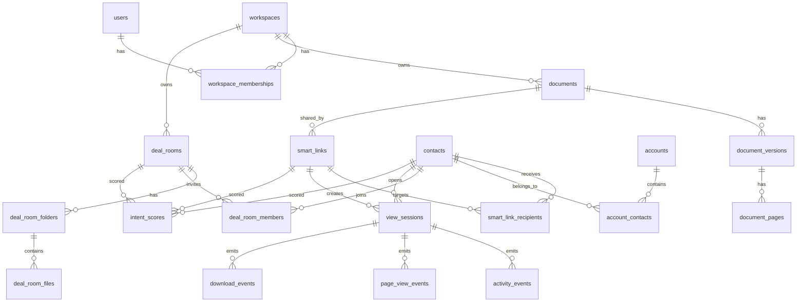

# DealSignal Database Entity Model

## 1. Scope

This document translates the DealSignal PRD into a relational database model.

Assumptions:

- Database: PostgreSQL 15+
- Architecture: multi-tenant SaaS
- Tenant boundary: `workspaces`
- Authentication users are stored in `users`
- Files are stored in object storage; the database stores metadata and storage keys
- Analytics events are append-only
- Intent scores are materialized snapshots derived from events

## 2. Entity Groups

### 2.1 Identity and Tenant

Core entities:

- `users`
- `workspaces`
- `workspace_memberships`

Purpose:

- Represent product accounts.
- Support team workspaces.
- Enforce tenant-level access boundaries.
- Support role-based permissions.

Key relationships:

- A user can belong to many workspaces.
- A workspace can have many users.
- Membership role controls administrative permissions.

### 2.2 Contacts and Accounts

Core entities:

- `contacts`
- `accounts`
- `account_contacts`

Purpose:

- Represent investors, LPs, buyers, customers, partners, and external recipients.
- Group contacts under firms, companies, funds, or customer accounts.

Key relationships:

- A contact belongs to one workspace.
- A contact can belong to multiple accounts.
- An account can have many contacts.

Segment labels:

- `investor`
- `lp`
- `buyer`
- `customer`
- `partner`
- `other`

### 2.3 Documents and Files

Core entities:

- `documents`
- `document_versions`
- `document_pages`

Purpose:

- Store uploaded document metadata.
- Preserve version history.
- Enable page-level analytics.

Key relationships:

- A document belongs to a workspace.
- A document has many versions.
- A version has many pages.
- Smart Links point to a specific document and usually the active version.

Important design decision:

`documents.current_version_id` is nullable during initial upload, then points to the active version after processing succeeds.

### 2.4 Smart Links

Core entities:

- `smart_links`
- `smart_link_recipients`
- `access_grants`

Purpose:

- Represent shareable controlled links.
- Store security settings.
- Track intended recipients and actual verified recipients.

Access model:

- `access_mode = public`: anyone with link can open.
- `access_mode = email_verification`: recipient must verify email.
- `access_mode = allowlist`: email must match allowlist.
- `access_mode = password`: recipient must provide password.
- `access_mode = approval_required`: sender must approve recipient.
- `access_mode = nda_required`: recipient must complete NDA before viewing.

Download policy:

- `download_policy = allowed`
- `download_policy = disabled`
- `download_policy = watermarked`

### 2.5 Deal Rooms

Core entities:

- `deal_rooms`
- `deal_room_folders`
- `deal_room_files`
- `deal_room_members`
- `deal_room_access_rules`
- `deal_room_questions`

Purpose:

- Support fundraising rooms, LP update portals, M&A diligence rooms, and enterprise sales rooms.
- Allow folder-level permissions.
- Track room activity.
- Support Q&A.

Key relationships:

- A room belongs to a workspace.
- A room has folders.
- Folders contain document versions.
- External contacts are invited as room members.
- Rules can be scoped by folder, document, contact, or account.

### 2.6 Analytics Events

Core entities:

- `view_sessions`
- `activity_events`
- `page_view_events`
- `download_events`

Purpose:

- Capture recipient behavior.
- Power dashboards, timelines, alerts, and scores.

Design principles:

- Event records are append-only.
- Analytical rollups can be materialized separately later.
- Raw event tables should preserve enough context to debug access and scoring.

### 2.7 Intent Scores and Recommendations

Core entities:

- `intent_scores`
- `recommendations`

Purpose:

- Store latest and historical score snapshots.
- Explain why a score changed.
- Store recommended next actions.

Score types:

- `investor_intent`
- `lp_engagement`
- `buyer_engagement`
- `deal_intent`
- `room_engagement`

Score labels:

- `cold`
- `warm`
- `hot`

### 2.8 Notifications and Integrations

Core entities:

- `notification_preferences`
- `notifications`
- `integrations`
- `crm_mappings`

Purpose:

- Send email, Slack, and CRM alerts.
- Store integration connections.
- Map DealSignal objects to CRM contacts, accounts, and deals.

### 2.9 Content Library

Core entities:

- `library_collections`
- `library_items`

Purpose:

- Manage approved materials.
- Support sales content governance.
- Track template and approved-content usage.

Document status:

- `draft`
- `in_review`
- `approved`
- `archived`

## 3. Relationship Overview



## 4. Core Tables

### `users`

Stores product users who can log in.

Important fields:

- `id`
- `email`
- `name`
- `avatar_url`
- `created_at`
- `updated_at`

### `workspaces`

Stores tenant-level organization data.

Important fields:

- `id`
- `name`
- `slug`
- `mode`
- `default_security_preset`
- `created_at`
- `updated_at`

`mode` values:

- `founder`
- `investment_firm`
- `sales`
- `mixed`

### `workspace_memberships`

Joins users to workspaces.

Role values:

- `owner`
- `admin`
- `member`
- `viewer`

### `documents`

Logical document container across versions.

Status values:

- `draft`
- `processing`
- `ready`
- `archived`
- `failed`

### `document_versions`

Physical uploaded version metadata.

Processing status values:

- `uploaded`
- `processing`
- `ready`
- `failed`

Storage fields:

- `storage_bucket`
- `storage_key`
- `file_size_bytes`
- `mime_type`
- `checksum_sha256`

### `document_pages`

Page-level metadata for analytics and thumbnails.

Important fields:

- `page_number`
- `thumbnail_storage_key`
- `text_excerpt`

### `smart_links`

Controlled share link.

Important fields:

- `slug`
- `document_id`
- `document_version_id`
- `created_by_user_id`
- `access_mode`
- `download_policy`
- `watermark_enabled`
- `expires_at`
- `revoked_at`
- `recipient_friction_level`

### `smart_link_recipients`

Intended or discovered recipients for a link.

Important fields:

- `smart_link_id`
- `contact_id`
- `email`
- `status`
- `verified_at`
- `last_opened_at`

Status values:

- `invited`
- `verified`
- `approved`
- `blocked`
- `revoked`

### `access_grants`

Stores access approvals for links or rooms.

Scope values:

- `smart_link`
- `deal_room`

Status values:

- `pending`
- `approved`
- `denied`
- `revoked`

### `deal_rooms`

Top-level room.

Room type values:

- `seed_fundraising`
- `series_a_fundraising`
- `lp_update`
- `ma_diligence`
- `enterprise_sales`
- `partner_enablement`
- `custom`

### `deal_room_folders`

Nested folders within rooms.

Uses `parent_folder_id` for hierarchy.

### `deal_room_files`

Joins room folders to document versions.

### `deal_room_members`

External participants invited to a room.

Role values:

- `viewer`
- `questioner`
- `collaborator`

### `deal_room_access_rules`

Folder or document-level access rules.

Principal types:

- `contact`
- `account`
- `domain`
- `role`

### `deal_room_questions`

Q&A inside a room.

Status values:

- `open`
- `answered`
- `closed`

### `view_sessions`

One recipient viewing session for a link or room file.

Important fields:

- `smart_link_id`
- `deal_room_id`
- `contact_id`
- `recipient_email`
- `ip_address`
- `user_agent`
- `started_at`
- `ended_at`

### `activity_events`

Generic append-only event stream.

Event examples:

- `link_created`
- `link_opened`
- `email_verified`
- `access_denied`
- `document_opened`
- `document_closed`
- `room_opened`
- `question_asked`
- `link_revoked`

### `page_view_events`

Page-specific view duration.

Important fields:

- `document_version_id`
- `page_number`
- `duration_ms`
- `visible_started_at`
- `visible_ended_at`

### `download_events`

Download attempts and successful downloads.

Important fields:

- `download_status`
- `watermarked`
- `blocked_reason`

### `intent_scores`

Score snapshots.

Important fields:

- `score_type`
- `score`
- `label`
- `explanation`
- `factors`
- `calculated_at`

`factors` is JSONB so scoring can evolve without schema churn.

### `recommendations`

Action recommendations from behavior.

Status values:

- `open`
- `dismissed`
- `completed`

### `notifications`

Delivery queue and history.

Channel values:

- `email`
- `slack`
- `crm`
- `in_app`

### `integrations`

Stores workspace-level integrations.

Provider values:

- `slack`
- `hubspot`
- `salesforce`
- `gmail`
- `outlook`
- `google_drive`
- `dropbox`

### `crm_mappings`

Maps DealSignal objects to external CRM IDs.

Object types:

- `contact`
- `account`
- `smart_link`
- `deal_room`
- `document`

## 5. Indexing Strategy

Tenant filters:

- Every tenant-scoped table should index `workspace_id`.

Dashboard queries:

- `activity_events(workspace_id, occurred_at DESC)`
- `intent_scores(workspace_id, score_type, calculated_at DESC)`
- `smart_links(workspace_id, status, created_at DESC)`
- `deal_rooms(workspace_id, status, updated_at DESC)`

Recipient lookup:

- `contacts(workspace_id, email)`
- `smart_link_recipients(smart_link_id, email)`

Viewer access:

- `smart_links(slug)`
- `smart_links(workspace_id, slug)`
- `access_grants(scope_type, scope_id, email, status)`

Analytics:

- `view_sessions(smart_link_id, started_at DESC)`
- `page_view_events(document_version_id, page_number)`
- `download_events(workspace_id, occurred_at DESC)`

## 6. Event Design

Use typed event names and JSONB metadata.

Example event:

```json
{
  "event_type": "page_viewed",
  "metadata": {
    "page_number": 8,
    "duration_ms": 134000,
    "source": "viewer"
  }
}
```

Raw events should not be rewritten after ingestion. Derived values such as session duration, score, and recommendations should be stored separately.

## 7. Security and Privacy Notes

- Recipient IP addresses should have a retention policy.
- Passwords and access tokens must be stored hashed or encrypted.
- Integration credentials must be encrypted using an application-level key management system.
- Deleted documents should be soft-deleted first, then asynchronously removed from object storage.
- Analytics disclosure should be shown in the recipient viewer.

## 8. Future Tables

Future needs not included in the first SQL draft:

- `nda_templates`
- `nda_acceptances`
- `audit_log_exports`
- `saved_views`
- `billing_subscriptions`
- `feature_entitlements`
- `team_groups`
- `webhook_endpoints`
- `webhook_deliveries`
