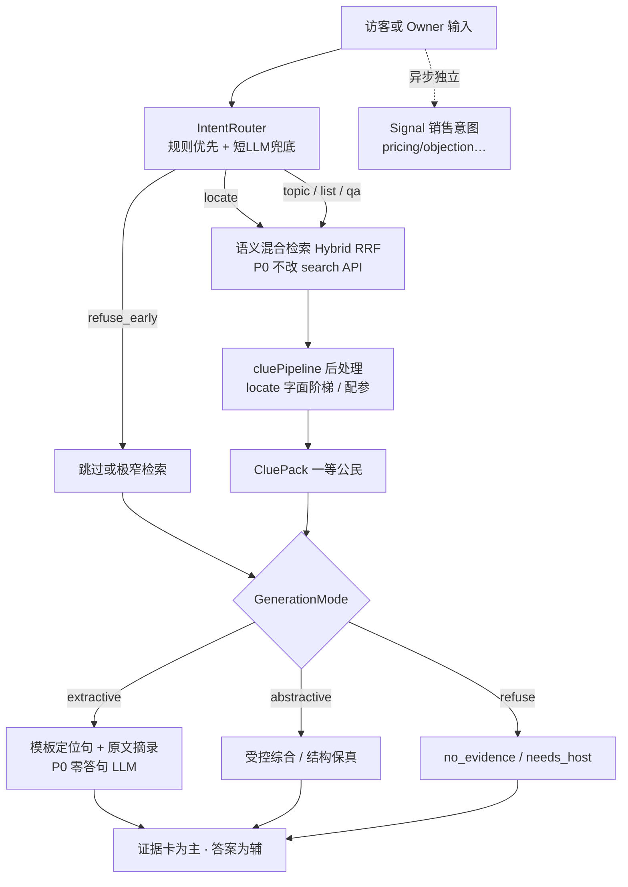

# Ask Docs Intent-First 线索引擎：产品与架构扩展方案

> 版本：v1.14  
> 日期：2026-07-24  
> 状态：**P0–P1 行为项完成**；**production Intent-first 默认开**；**P2 + P2.1（含可选 out_of_corpus/query rewrite）+ P2.2 + P3 完成**；**D8–D18 收口完成**；**P3.1a 表块摄入已实现**（`ASK_DOCS_TABULAR` 仍关；产品面未交）；extractive 润色仍关；prod `ASK_DOCS_DD_COVERAGE` / `ASK_DOCS_PORTFOLIO` / `ASK_DOCS_QUERY_REWRITE` / `ASK_DOCS_TABLE_INGEST` / `ASK_DOCS_TABULAR` 默认关
> 作者视角：资深架构师 × 数据室高级产品总监  
> 关联：  
>
> - 设计：`docs/designs/plan/visitor-ask-knowledge-base.md`（V1 已落地；§八 Future / V1.x+）  
> - 规格：`docs/designs/plan/SPEC-visitor-ask-knowledge-base.md`（Ask Docs retrieval Post-V1 + OOS 澄清）  
> - 债务：`docs/designs/plan/PLAN-visitor-ask-v1-debt.md`（批次 **F** / F0–F4）  
> - 法务润色流程：`docs/designs/plan/ask-docs-pack-legal-review.md`（D18）  
> - **边界**：本文不取消 Ask Docs / Ask Host 显式通道；不重开 V1 Gate-0/Sec-0/KB 红线；DocIntent ≠ Signal 销售意图  
> 范围：Ask Docs 从「通用 RAG 问答」演进为「尽职调查线索引擎」；意图路由、线索一等公民、模式化生成、垂直作业扩展  
> **拍板**：§12（含 D8–D18；**P3.1a = K1–K12**）；Pack 全文案见 **§15.1 / §15.2**  
> **进度**：见 §8.1「落地进度」
---

## 0. 一句话定位

Ask Docs 的业务承诺不是「像 ChatGPT 一样回答」，而是：

> **在 Access∩KB 安全边界内，按访客真实作业目标选轨，交付可跳页核验的线索；答案是可选的受控层，不是唯一产品面。**

架构承诺：

> **意图在检索前 → 线索管线可配参 → 生成分模式；高层「作业类型（Job）」可扩展，而不推翻 V1 安全红线。**

---

## 1. 背景与问题

### 1.1 V1 已具备的能力（不可破坏）


| 能力      | 现状落点                                | 红线                                    |
| ------- | ----------------------------------- | ------------------------------------- |
| 作用域     | `KB ∩ LinkAuthorizedDocuments`      | 空 scope fail-closed，禁止 workspace-wide |
| 通道      | Ask Docs / Ask Host 分通道             | 与看页同构门禁                               |
| 证据      | quote + page + bbox，访客 quote≤320    | 不可变长倾销                                |
| 拒答      | `no_evidence` + 可引导 Ask Host        | 无线索不编造                                |
| 审计      | 会话投影 + 归档                           | 可证明授权范围                               |
| 雷达      | 问题→Signal（销售意图）                     | **与文档意图分离**                           |
| 检索      | hybrid：vector + FTS + trigram + RRF | 可增强，不可无意图乱扩                           |
| 后处理 WIP | `scoreRerank` + 可选 LLM filter       | 只能减噪，不能纠正生成角色                         |


### 1.2 两类同源失败（为何不能继续堆后处理）


| 场景        | 失败表现             | 缺的一环                                        |
| --------- | ---------------- | ------------------------------------------- |
| 粘贴整句条款    | 邻句一起出、答句改写过度     | 意图=`locate`，字面优先 + Top‑1 + extractive       |
| 裸词「财务数据」  | 部分–整体颠倒、模型去「下定义」 | 意图=`topic`（概念探查），**语义召回** + extractive，禁止释义 |
| 「有哪些财务指标」 | 若当 topic 只丢摘录    | 意图=`list`，语义召回 + 受控列举生成                     |


后置过滤只能减噪；**检索目标错误**与**生成角色错误**必须在分流点纠正。

### 1.3 关键订正（相对早期「keyword 字面」草案）

数据室里短裸词的真实目标通常是：

> 找 **财务相关材料**（topic），不是 FTS 抠死「财务数据」四字，也不是给词下定义。


| 错误默认                | 正确默认                               |
| ------------------- | ---------------------------------- |
| 短裸词 → `keyword` 字面轨 | 短裸词 → `**topic` 语义轨 + extractive** |
| 用「禁止释义」推出「只做精确匹配」   | **禁止释义**只约束生成；检索仍走语义混合             |


精确词命中若产品需要，另开显式能力（如引号/`term_exact`），**不得**作为裸词默认路径。

---

## 2. 业务场景与产品价值

目标垂直（Deal Room 主航道）：


| 场景        | 典型材料                           | Ask Docs 价值主张               |
| --------- | ------------------------------ | --------------------------- |
| 创业融资 / 募集 | Deck、财务模型、NDA、条款清单             | 快速定位披露范围与条款，降低补料往返          |
| A 轮及以后    | SPA/SHA、cap table、ESOP、DD list | 条款定位 + 清单核对 + 与 Host 补齐缺口   |
| 并购尽调      | SPA、disclosure schedules、合同、诉讼 | 红旗初筛、义务/条件定位、跨文件一致性（进阶）     |
| 地产交易      | CIM、租约、rent roll、权属            | 面积/租金/到期日定位，表结构保真（进阶）       |
| 基金管理      | LPA、PPM、side letter            | 关键人/费用/waterfall 条款定位       |
| 投资组合管理    | 多 deal 报告与条款                   | 单室定位为主；跨室聚合为独立产品面           |
| 项目管理      | SOW、里程碑、验收                     | 范围与交付物列举                    |
| 销售数据室     | 方案、报价、安全问卷                     | 材料定位 + 高意向问题进 Signal（非文档意图） |


### 2.1 产品分层承诺


| 层级                 | 对访客               | 对所有者                 |
| ------------------ | ----------------- | -------------------- |
| L0 线索引擎（本方案 P0–P1） | 找得到、跳得进、不胡说       | 审计可信、scope 不破        |
| L1 作业加速（P1–P2）     | 列举/判断有结构          | 少被问重复定位题             |
| L2 垂直工作台（P2+）      | Checklist 扫描、缺口可见 | 尽调进度与风险卡片            |
| L3 平台智能（远期）        | 跨文件冲突/组合视图        | 与 Host/Signal/请求文件闭环 |


---

## 3. 目标架构

### 3.1 总览



> **P0 注**：架构上的「字面优先」落在 **CluePipeline 后处理**（对 hybrid Top‑K 做 contain/Jaccard 提升与截断），**不改** `internal/search` API。检索侧 FTS-first 字面增强属 P1。


### 3.2 设计原则（不可妥协）

1. **意图在检索前**：同一输入不得共用一套 Top‑K 与同一 system prompt。
2. **线索 ≠ 答案**：`CluePack` 是主交付；答案是可选层。
3. **生成分模式**：extractive / abstractive / refuse；禁止单一 helpful assistant。
4. **LLM 拆开用**：Intent（短 JSON）→（可选）EvidenceFilter → Answer；不绑死一次 Chat。
5. **安全边界不动**：Access∩KB；无线索必拒；quote≤320；限额与门禁同构。
6. **文档意图 ≠ Signal 意图**：两套枚举、两套消费方。
7. **扩展靠 JobProfile，不靠无限堆 Intent 名**：一级意图保持少数；高阶语义用作业配置与槽位。

### 3.3 两层语义模型（扩展性核心）

```text
DocIntent（稳定、少、可路由）
  locate | topic | list | qa | refuse_early
  〔可选演进〕absence | term_exact

       ↓ 映射

JobProfile（可扩展、垂直可插拔）
  evidence_shape · retrieval_ops · max_evidence
  generation_mode · prompt_id · render_schema
  slots: party / doc_type / checklist_id / …
```

P0 仅实现 DocIntent → **未导出** `jobProfile` 表（同包常量 map）。  
P1 **导出** `CluePipeline` / `JobProfile` / `Registry`；仍无垂直插件目录。  
P2 增加 `assistant/jobs/`（如 `financing_dd_v1`）经 Registry 注册；**不改** `runDocsTurn` 主状态机（coverage 走独立 scan 服务）。

---

## 4. DocIntent 规格

### 4.1 枚举与默认映射


| Intent         | 典型输入                    | 用户目标        | 检索（P0）                      | GenerationMode | TopK | MaxEvidence（P0 锁定） |
| -------------- | ----------------------- | ----------- | ---------------------------- | -------------- | ---- | ----------------- |
| `locate`       | 整句粘贴、条款号、`§`/`第X条`、整句引号 | 找回原文位置      | hybrid 同调；**后处理**字面阶梯         | `extractive`   | 8    | 1（阶梯内；降级 topic 则 3） |
| `topic`        | 「财务数据」「估值」「竞业」          | 找相关材料（概念探查） | **语义混合**                     | `extractive`   | 8    | **3**             |
| `list`         | 「有哪些…」「包括哪些信息」          | 汇总成清单       | 语义混合                         | `abstractive`  | 8    | **5**             |
| `qa`           | 「是否可转让」「例外怎么规定」         | 有依据的判断/说明   | 语义混合 + 条件 filter             | `abstractive`  | 8    | **5**             |
| `refuse_early` | 空意图、明显越权、要市场法律意见        | 不答或不检索      | 跳过/极窄                        | `refuse`       | —    | 0                 |


### 4.2 IntentRouter 策略

**输入范围（P0 锁定）**：仅当前 user message；不带会话历史、不做多轮承接（P1+ Job/slot）。

**规则优先（可测、低延迟）**

- `refuse_early`：空/无义；明显越出语料（「市场惯例是否…」「请给投资建议」等 **代码内置词表**）  
- `locate`：长度阈值（默认 ≥40 CJK runes / ≥20 whitespace words，**env 可调**）、条款号正则、整句引号包裹  
- `list`：有哪些 / 包括哪些 / which|what … include|list 等（词表代码内置）  
- `qa`：是否 / 能否 / 怎么 / 如何 / whether|can|how|does 等疑问结构（词表代码内置）  
- 短裸词/名词短语且无疑问结构 → `topic`  
- 规则未命中 → 短 JSON LLM（**复用同一 `ChatCompleter`**，timeout ~2s）；失败/超时/坏 JSON 默认 `qa`  
- 规则已命中 → **不调** Intent LLM

**输出结构（建议）**

```go
type IntentDecision struct {
    Intent        DocIntent
    Mode          GenerationMode // extractive | abstractive | refuse
    TopK          int
    MaxEvidence   int
    PreferLiteral bool
    SkipLLMFilter bool
    Source        string // rule | llm | default
    FallbackFrom  string // e.g. locate→topic；空表示无降级
    // P1 slots
    Absence       bool   // qa + absence：「有没有 X」
    Party         string // buyer|seller|gp|investor|founder|…
    JobHint       string // 映射 JobProfile id
}
```

### 4.3 生成契约

**extractive（`locate` / `topic`）— P0 锁定**

- **零答句 LLM**：仅 i18n 定位模板 + `CluePack.quote`；不走 `complete()`。  
- 留润色 hook；P1 再评估是否允许轻量 LLM 写定位句（摘录仍强制来自线索）。  
- `topic` **硬禁**：是指 / 定义为 / 通常包括 等释义句式（模板层即可保证）。  
- `locate`：单主线索 + 短定位（硬/软字面档）；降级 `topic` 后 MaxEvidence=3。

**abstractive（`list` / `qa`）**

- **分 prompt**，禁止共用一条。  
- `list`：仅列证据中出现的项；保留原文层级；禁止子项升格为父类。  
- `qa`：仅依据证据；不足则走无依据路径（与 `no_evidence` 对齐）。  
- LLM 上下文可用较长摘录；返回与落库访客 quote 仍 ≤320。

**refuse（owner / visitor 对齐）**

- 共用 `result_status` / 拒答码语义。  
- 访客：可保留 Ask Host CTA（现网）。  
- owner：无 Ask Host 通道 → 中性 i18n（「请补充材料或人工判断」），**不**编造答案。  
- P1 起细分拒答原因码展示（见 §6.3）。
---

## 5. CluePipeline 与证据模型

### 5.1 P0/P1：CluePack（兼容现网）

与现有 `search.Evidence` 对齐并扩展元数据：


| 字段                           | 说明                                          |
| ---------------------------- | ------------------------------------------- |
| `document_id` / `chunk_id`   | 定位                                          |
| `page_number` / `bbox`       | 跳页高亮                                        |
| `quote`                      | ≤320 runes（访客）                              |
| `score`                      | 融合/重排分                                      |
| `match_type`                 | vector / fts / trigram / literal_boost（可多值） |
| `intent` / `generation_mode` | P0 写入现有审计快照；P1 正式列化/报表                     |


**按意图配参（P0 锁定；来自未导出 `jobProfile` 表）**


| Intent   | TopK | MaxEvidence | PreferLiteral | LLM EvidenceFilter（默认） | 说明                                |
| -------- | ---- | ----------- | ------------- | ---------------------- | --------------------------------- |
| `locate` | 8    | 1           | true          | off                    | 见下方字面阶梯                           |
| `topic`  | 8    | 3           | false         | off                    | **不得**因缺精确词砍语义命中                  |
| `list`   | 8    | 5           | false         | off                    | 保覆盖                               |
| `qa`     | 8    | 5           | false         | on（失败回退 rerank）        | 若本轮已调 Intent LLM → **跳过** filter |


**P0 `locate` 字面阶梯（CluePipeline 内，不改 search API）**

1. **硬字面**：归一化后 `contains(query, chunk)` → 提至 Top‑1，截断 MaxEvidence=1，Intent 保持 `locate`。  
2. **软字面**：rune Jaccard ≥ `0.72`（沿用现网 `scoreRerankEvidence`）→ 同上 Top‑1×1。  
3. **否则降级 `topic`**：MaxEvidence=3，仍 extractive；审计 `FallbackFrom=locate`。  
4. **LCS**：**纳入软字面档**（与 Jaccard 并列；默认 LCS ratio≥0.85，env `ASK_DOCS_INTENT_LCS_RATIO` 可调）。

> 在「不改检索 API」前提下把字面优先做满（P0）：对 hybrid Top‑K 做 literal boost / 截断 / 平滑降级。  
> **P1**：search 增加可选 `SearchOptions{PreferLiteral}`——**RRF 内 FTS/trigram 权重 ×α**（默认 **α=1.75**，env `ASK_DOCS_INTENT_LITERAL_RRF_WEIGHT`）；opts 零值=现网；pipeline 软档含 LCS。

**EvidenceFilter 与 LLM 预算（P0 锁定）**

- 默认：仅 `qa` 开 filter；`locate`/`topic`/`list` 关。  
- 另设 env（如 `ASK_DOCS_EVIDENCE_FILTER`）可 **强制全关**（回滚/对比）。  
- **硬预算 ≤2 次 LLM / 轮**：若本轮已调用 Intent LLM，则跳过 EvidenceFilter（即使意图为 `qa`）。  
- extractive 路径答句 LLM = 0；abstractive 另计 answer `complete`。

现有 `scoreRerankEvidence` / `filterEvidenceByLLM` / `refineEvidence` **收进** 同包私有 `cluePipeline.run(ctx, query, hits, decision)`（P0 未导出）；避免再叠一层无意图后处理。P1 再导出正式 `CluePipeline` 类型。

### 5.2 P2：ClaimPack（coverage 行容器；已拍板）

P2 **首发楔子**是融资 DD Checklist，不开放通用跨文件辩论。ClaimPack 仅作为 **checklist 行执行结果容器**：

```text
ClaimPack  (persisted: latest snapshot per room|link + run metadata)
  pack_id / pack_version      # e.g. financing_dd_v1
  scope                       # room | link_id；UI 必须标明
  run: { id, status, triggered_by, started_at, finished_at, stale? }
  coverage_rows[]:
    item_id
    status                    # P2: supported | absent_in_scope | insufficient
                              # P2.1+: 边界 LLM 可改写 status；可附 extracted_value
    clues[]
  # P2.2 Owner 双文档比对可产生 claims[] 含 conflict；P2 聊天路径不暴露
```

**原则**：换证据形状服务 coverage，而不是只换 prompt。  
**消费方**：Owner Deal Room **独立「尽调」页**；访客仅可选 **建议核查 chips**（label），不看缺口汇总表。

---

## 6. 高阶作业类型（Job）与盲区规划

`locate/topic/list/qa` 覆盖「单次问句 → 材料定位/综合」。垂直场景下的盲区用 **Job** 表达，按阶段挂载。

### 6.1 Job 目录


| Job ID                  | 业务含义                  | 证据形状                         | 建议阶段  | 入口 Intent/槽位            |
| ----------------------- | --------------------- | ---------------------------- | ----- | ----------------------- |
| `clue.locate`           | 原文定位                  | CluePack                     | P0    | `locate`                |
| `clue.topic`            | 主题探查                  | CluePack                     | P0    | `topic`                 |
| `answer.list`           | 列举综合                  | CluePack                     | P0    | `list`                  |
| `answer.qa`             | 判断/说明                 | CluePack                     | P0    | `qa`                    |
| `answer.absence`        | 「有没有 X」               | CluePack + `not_found_in_scope` | P1    | `qa` + **absence slot**（非新 Intent） |
| `answer.party_list`     | 按主体义务/权利              | CluePack + party slot        | P1    | `list` + `party`        |
| `rel.cross_check`       | 跨文件/条款一致性             | ClaimPack                    | **P2.2** | Owner 显式双文档比对；非访客自由聊天     |
| `rel.compare`           | 版本/范本 diff            | ClaimPack                    | **P3.1+** | 依赖版本模型论证后再做                 |
| `meta.coverage`         | 相对 checklist 缺什么      | coverage_rows / ClaimPack    | **P2** | Owner 尽调页；垂直 Pack            |
| `struct.numeric`        | 金额/比例/稀释              | 结构化字段+线索                     | **P2.1** | 仅 Pack `value_type` 从 clues 抽 |
| `struct.tabular`        | rent roll / cap table | 表结构保真                        | **P3.1+** | **P3.1a** 先表块摄入前置；产品 Job 另 grill |
| `struct.condition_tree` | 交割/终止条件树              | 树形 claim                     | **P3.1+** | 重 UI；不挡 P3 portfolio         |
| `batch.scan`            | Checklist 批量扫描         | ClaimPack                    | **P2** | Owner 异步 Job；P2.1 可加边界 LLM   |
| `meta.room_index`       | 室文件/权限元问答             | 非 chunk RAG                  | P3.1+ | 受限白名单；P3.1a 非目标                       |
| `platform.portfolio`    | 跨 Room 聚合             | 快照摘要 + 下钻                    | **P3** | **独立产品面**；禁跨室 chunk 进单室 Ask |
| `handoff.host`          | 越出语料 → Host           | 拒答码                          | P0–P1 | `refuse` / `needs_host` |
| `handoff.signal`        | 销售高意向                 | Signal                       | 已有    | **独立分类器**               |


### 6.2 垂直 × Job 优先级（产品路线）


| 垂直       | P0 必达                | P1 增强                | P2 差异化                             |
| -------- | -------------------- | -------------------- | ---------------------------------- |
| 融资 / A轮+ | topic/locate/list/qa | absence、party（投资人权利） | **P2 coverage** → **P2.1** numeric/边界 LLM/fork 编辑 |
| 并购       | 同上                   | absence、party（买卖方义务） | **P2.2** 红旗 Pack + 有限 cross_check           |
| 地产       | 同上                   | temporal 日期抽取（可挂 qa） | **P3.1+** tabular / 权属 coverage              |
| 基金       | 同上                   | party（GP/LP）         | P3.1+ compare（世代 LPA）、scan（key man 等）    |
| 组合管理     | 单室四意图                | —                    | **P3 portfolio 摘要**（独立面）                  |
| 项目 / 销售室 | 四意图                  | —                    | coverage 可复用引擎；Signal 已有                  |


### 6.3 拒答与交接码（产品可运营）


| Code                 | 含义                 | 访客体验              | Owner   |
| -------------------- | ------------------ | ----------------- | ------- |
| `no_evidence`        | 作用域内未找到依据          | 现有拒答 + 可 Ask Host | 审计      |
| `not_found_in_scope` | absence 作业：扩大检索后仍无 | 「在授权材料中未发现该条款」    | 区别于检索故障 |
| `out_of_corpus`      | 要市场/法律意见等          | 引导 Host，不编造       | —       |
| `needs_host`         | 需人工确认/补料           | 一键切 Ask Host      | Host 线程 |
| `out_of_allowlist`   | 权限/门禁              | 同访问失败             | 安全事件    |
| `feature_disabled`   | 通道关闭               | 403 文案            | —       |


---

## 7. 与现网模块的集成边界


| 模块                   | 关系                                                                                         | 约束                                      |
| -------------------- | ------------------------------------------------------------------------------------------ | --------------------------------------- |
| `internal/assistant` | 主改动面：IntentRouter、私有 cluePipeline、extractive、分 prompt、`runDocsTurn`；**Chat + PublicChat 同步** | Public/Owner **响应 shape 可先不变**（不暴露 intent） |
| `internal/search`    | P0 仅配参 TopK；P1 可选 `SearchOptions{PreferLiteral}`                                         | 意图不进 search；opts 零值=现网行为 |
| KB / dealroom        | 语料与双世代                                                                                     | Ask Docs 只读 live∩Access；owner 仍 workspace scope |
| Ask Host             | 仅访客交接与补料                                                                                   | owner 拒答无 Host CTA                      |
| Signal / suggestions | 异步销售意图                                                                                     | **枚举与模型隔离**                             |
| Audit                | P0/P1 扩现有审计**快照 JSON**（不加 DB 真列）：intent / mode / source / fallback；Owner 详情 UI 展示     | 聊天 API 仍不暴露 intent                 |
| i18n                 | extractive 模板、拒答码、owner 中性拒答                                                               | en + zh-CN 同步                           |
| Feature flags        | Intent-first；EvidenceFilter；locate/LCS 阈值；**P2 `ASK_DOCS_DD_COVERAGE`**                 | 见 §7.2                                  |
| DD Coverage（P2）      | `jobs/` Pack + 异步 scan + ClaimPack 快照；Deal Room 尽调页；link 级访客 chips                     | 门闩见 §8.3；与 Ask Docs 聊天 flag 解耦           |


### 7.1 建议代码落点（实现指引）

```text
apps/api/internal/assistant/
  intent.go / job_profile.go / clue_pipeline.go / turn.go / …
  jobs/
    register.go                 # Registry 挂载
    financing_dd_v1.yaml|.go    # ~20 items：id、query 模板、en/zh label
  coverage/
    scan_service.go             # batch.scan 编排
    snapshot_store.go           # 最新 ClaimPack 快照 + run 元数据
    worker.go                   # Redis queue 风格异步 Job
apps/web/
  deal-room DiligencePage（独立「尽调」导航）
  Ask Docs 建议核查 chips（link 开关控制）
```

主路径伪代码：

```text
# Chat / PublicChat
if !intentFirstEnabled(env):  # prod 默认关直至单独 PR 翻开；dev/staging 默认开
    return legacyPath(...)

decision = IntentRouter(currentUserMessageOnly)  # P1: 可填 absence/party slots
if decision.Mode == refuse && decision.Intent == refuse_early:
    return refuse(..., hostCTA=isVisitor)

opts = SearchOptions{PreferLiteral: decision.PreferLiteral}  # P1；P0 可无此参
hits = search(scope, query, topK=decision.TopK, opts)
# absence slot: 若首趟空 → 规则剥壳改写 query 再搜一趟（零额外 LLM）
hits = filterEvidenceToDocuments(...)            # Public only
pack = CluePipeline.Run(hits, decision)          # P1 导出 API；含 LCS 软档
# audit snapshot JSON ← intent, mode, source, fallback_from, slots

if len(pack)==0:
    if decision.AbsenceSlot: return not_found_in_scope(..., hostCTA=isVisitor)
    return no_evidence(..., hostCTA=isVisitor)
switch decision.Mode:
  extractive  -> buildExtractiveAnswer(pack, decision)   # 零答句 LLM
  abstractive -> complete(promptFor(decision), pack)     # party 约束 prompt
```

P2 coverage 伪代码（独立于聊天）：

```text
# Owner DiligencePage
enqueue ScanJob(room|link, pack=financing_dd_v1) → 202 job_id
worker:
  for item in pack.items:
    hits = search(scope, item.query_template, topK=8)
    row = supported+clues if hits else absent_in_scope
  persist latest ClaimPack snapshot; mark previous stale if KB changed
```

### 7.2 环境开关（**D8 已锁定命名**；经 `config.Load` → `Config.AskDocs` / `.env.example`）


| 环境变量 | 语义 | 默认 |
| -------- | ---- | ---- |
| `ASK_DOCS_INTENT_FIRST` | Intent-first 总开关；空则 **全环境默认开**（含 production）；`false`/`0`/`off` 关闭 | 见左 |
| `ASK_DOCS_EVIDENCE_FILTER` | `off`=强制全关 LLM filter；`auto`=按 jobProfile | `auto` |
| `ASK_DOCS_INTENT_LOCATE_MIN_RUNES` | locate 规则：CJK/rune 长度阈值 | `40` |
| `ASK_DOCS_INTENT_LOCATE_MIN_WORDS` | locate 规则：whitespace 词数阈值 | `20` |
| `ASK_DOCS_INTENT_LCS_RATIO` | locate 软字面 LCS ratio | `0.85` |
| `ASK_DOCS_INTENT_LITERAL_RRF_WEIGHT` | PreferLiteral 时 FTS/trigram RRF 权重倍数 α | `1.75` |
| `ASK_DOCS_DD_COVERAGE` | DD coverage 工作台总开关 | staging 开 / prod 关 |
| `ASK_DOCS_DD_BOUNDARY_LLM_MAX` | 单次 scan 边界 LLM 上限 K | `8` |
| `ASK_DOCS_DD_BOUNDARY_SCORE_LOW` | 边界相对分带下沿 | `0.35` |
| `ASK_DOCS_DD_BOUNDARY_SCORE_HIGH` | 边界相对分带上沿 | `0.75` |
| `ASK_DOCS_DD_BOUNDARY_MIN_JACCARD` | 低于此 Jaccard 且有命中 → 边界 | `0.5` |
| `ASK_DOCS_PORTFOLIO` | 跨 Room portfolio | prod 默认关 |
| `ASK_DOCS_PORTFOLIO_MAX_VIEWS` | 每 workspace 组合视图上限 | `5` |
| `ASK_DOCS_PORTFOLIO_MAX_ROOMS` | 每视图 room 上限 | `20` |
| `ASK_DOCS_QUERY_REWRITE` | qa/list 查询改写（禁 locate/topic） | 关 |
| `ASK_DOCS_TABLE_INGEST` | xlsx/csv → `table_row` chunk 切分（P3.1a） | staging 开 / prod 关 |
| `ASK_DOCS_TABULAR` | 未来 `struct.tabular` 召回表行（P3.1a 仅预留） | **关**；开前须另 grill 产品面 |

Redis stream（D11）：**`askdocs:dd_scan`**（ScanQueue，仿 mailer，不与邮件共消费者）。

落地：`apps/api/internal/config/ask_docs.go`（`AskDocsFromEnv`）→ `Config.AskDocs`；`routes.go` 经 `*OptionsFromConfig(s.cfg.AskDocs)` 注入。  
P3.1a flags：见 §12.9；已挂入 `config.AskDocs` / `.env.example` / `routes` → `ingestion.WithTableIngest`。`ASK_DOCS_TABULAR` 预留；召回仍 SQL 排除 `table_row`，待产品 grill。


---

## 8. 分期落地与验收

### 8.1 P0 — 行为纠偏（建议首发）

**落地进度（2026-07-24）**

| # | 范围项 | 状态 | 落点 |
| - | ------ | ---- | ---- |
| 1 | IntentRouter（规则 + 短 LLM；当前句；失败→`qa`） | **完成** | `apps/api/internal/assistant/intent.go` |
| 2 | 未导出 `jobProfile` + 私有 `cluePipeline`（locate 阶梯 + LCS shadow） | **完成** | `job_profile.go` / `clue_pipeline.go`；locate **先阶梯后 rerank**（软字面不被 `scoreRerank` 截断） |
| 3 | `topic`/`locate` → extractive 零答句 LLM（含 polish hook 恒等） | **完成** | `generate_extractive.go` |
| 4 | `list`/`qa` → 分 prompt abstractive | **完成** | `generate_prompts.go` |
| 5 | EvidenceFilter：默认仅 `qa`；Intent LLM 已调则跳过；可强制关 | **完成** | `clue_pipeline.go` + `ASK_DOCS_EVIDENCE_FILTER` |
| 6 | `runDocsTurn`；Owner Chat + Visitor PublicChat 同步接线 | **完成** | `turn.go` / `service.go` |
| 7 | Intent 写入审计快照信封；聊天 API 不暴露 | **完成** | Evidence JSON envelope；归档保留 meta；`AskDocsAuditDetail` 可读 |
| 8 | 环境 flag（§7.2 P0 子集） | **完成** | `.env.example` + `AskDocsOptionsFromEnv`（经 routes；未进 `config.Load` 结构体） |
| 9 | 黄金单测 + 回归；拒答 i18n | **完成** | `go test ./internal/assistant` |
| 10 | Playwright MSW 端到端（§8.1 验收表） | **完成** | `apps/web/e2e/ask-docs-intent-first-p0.spec.ts`（visitor 全意图 + locate→topic + owner 拒答/topic） |
| 11 | 后端 AI 集成（`e2e-ai.sh` / `RUN_AI=1`） | **完成** | `e2e-test.sh` 增补 owner refuse + topic 不泄漏 intent |

**P0 合并判定**：范围项 1–11 均完成；下列缺口为已知 follow-up，**不挡** P0 合并。

**已知缺口（不挡 P0 合并，记入 follow-up）**

- flag 关时检索 TopK 走 `retrieveTopK=8`（与改前部分路径的 5 不完全字节级一致）
- `ASK_DOCS_*` 未挂入 `config.Load` 字段表（仍 `os.Getenv` + `.env.example`）
- 真实后端 + 真 LLM 的 Playwright（`test:e2e:real`）未覆盖 Intent-first（MSW + `e2e-ai` 覆盖验收主路径）
- G10「qa + Intent LLM 则跳过 filter」缺独立 turn 级单测（管线逻辑已实现）
- MSW 与 Go router 词表双份维护，存在漂移风险

**范围**

1. IntentRouter（规则 + 短 LLM 兜底；仅当前句；失败→`qa`）
2. 未导出 `jobProfile` + 私有 `cluePipeline.run`（locate 字面阶梯 + LCS shadow）
3. `topic`/`locate` → extractive **零答句 LLM**
4. `list`/`qa` → 分 prompt abstractive
5. EvidenceFilter：默认仅 `qa`；Intent LLM 已调用则跳过；可选强制全关
6. 私有 `runDocsTurn`；**owner Chat + visitor PublicChat 同步接线**
7. Intent 等写入现有审计快照；API 不暴露
8. 环境 flag（§7.2）
9. 黄金单测 + 回归现有 assistant 测试；owner/visitor 拒答 i18n

**验收用例**


| 输入            | Intent       | 期望                                      |
| ------------- | ------------ | --------------------------------------- |
| 粘贴整句条款        | `locate`     | 硬/软字面 → 1 主线索；答句为模板定位+摘录（无答句 LLM）        |
| 粘贴句无强字面       | `locate`→topic | 降级 topic；≤3 线索；审计记 fallback             |
| 「财务数据」        | `topic`      | 语义相关线索；答句无「是指/定义为」                      |
| 「有哪些财务指标」     | `list`       | 受控清单，非纯摘录堆砌                             |
| 「是否可转让」       | `qa`         | 有依据则判断；不足则拒；若经 Intent LLM 则本轮无 filter  |
| Intent LLM 超时 | default `qa` | 不 500                                   |
| 空 scope / 无命中 | —            | `no_evidence`；visitor 可 Host CTA，owner 中性文案 |
| flag 关闭       | —            | 行为回退旧路径                                 |


**非目标（P0）**：ClaimPack、checklist UI、改 search 包 API、审计 DB 新列、查询改写、absence、API 暴露 intent、extractive 润色、LCS 进软档、多轮 Intent 承接。

### 8.2 P1 — 可观测与作业槽位（已拍板）

**门闩**：可与 P0 **后半重叠**——审计/评测基建可并行；`absence` / `party` / `SearchOptions` / LCS 软档等**行为项**等 P0 管线稳定后再合。

**落地进度（2026-07-24）— P1 完成（含 production Intent-first 默认开）**

| # | 范围项 | 状态 | 落点 |
| - | ------ | ---- | ---- |
| 1 | 导出 `CluePipeline` / `JobProfile` / `Registry`；`runDocsTurn` 走导出 API | **完成** | `clue_pipeline.go` / `job_profile.go` / `registry.go`；`turn.go` → `NewCluePipeline().Run` |
| 2 | Owner 审计详情 UI 展示 intent/mode/source/fallback；聊天 API 不暴露 | **完成** | `AskDocsAuditPanel` + i18n；类型字段；MSW detail 路由 |
| 8 | 评测 ~20 CI 黄金集 | **完成** | `intent_golden_test.go`（规则轨 ≥20） |
| 3 | `absence` 槽位（qa + 规则剥壳二趟 + `not_found_in_scope`） | **完成** | `absence.go`；`turn.go` 两趟检索；专用 i18n；审计 `absence`；访客 Host CTA / owner 无 |
| 4 | `party` 槽位（词典抽槽 → 审计 + 仅约束 abstractive prompt） | **完成** | `party.go`；`systemPromptForDecision`；审计 `party`；检索 query 不变 |
| 5 | search `SearchOptions{PreferLiteral}` → RRF 内 FTS/trigram ×α（默认 1.75） | **完成** | `search.SearchOptions` + `rrfFuseWeighted`；locate 传 opts；零值=现网；`ASK_DOCS_INTENT_LITERAL_RRF_WEIGHT` |
| 6 | LCS 纳入 pipeline 软档（与 Jaccard 并列；默认 ratio≥0.85） | **完成** | `applyLocateLiteralLadder`：soft = Jaccard≥0.72 **或** LCS≥阈值；`ASK_DOCS_INTENT_LCS_RATIO` |
| 7 | extractive 润色仍关（hook 保留） | **保持关** | 非本切片 |
| 9 | production Intent-first 默认开 | **完成** | `AskDocsOptionsFromEnv`：空 env → 全环境开；显式 `false`/`0`/`off` 可关 |

**范围**

1. **导出** `CluePipeline` / `JobProfile` / `Registry`；`runDocsTurn` 走导出 API；**无**垂直 Pack 插件目录（`jobs/` 仍 P2）  
2. 审计：**不加 DB 真列**；稳定扩展快照 JSON；**Owner 审计详情 UI** 展示 intent / mode / source / fallback；聊天 API 仍不暴露  
3. **`absence` 槽位**（非新一级 Intent）：挂在 `qa` 上；两趟检索——首趟空则 **规则剥壳改写** 再搜（零额外 LLM）；仍空 → **`not_found_in_scope`**（专用 i18n；访客可 Host CTA；owner 无 Host CTA）  
4. **`party` 槽位**：规则/词典抽取 → 审计 + **仅约束 abstractive prompt**；不改检索 query  
5. **search 最小改动**：`SearchOptions{PreferLiteral}` → RRF 内 FTS/trigram **×1.75**（D9）  
6. **LCS 纳入 pipeline 软档**（与 Jaccard 并列；默认 ratio≥0.85，env 可调）  
7. extractive **润色仍关**（hook 保留）  
8. 评测：仓内 **~20 条 CI 必过** + **50–100 定期大盘**；主垂直 **融资**，并购少量对照  
9. **production Intent-first 默认开**：单独 PR 翻（不与 absence/search 行为 PR 绑死）

**验收用例（增量）**


| 输入 | 期望 |
| ---- | ---- |
| 「有没有竞业限制」（scope 内无） | absence 槽；二趟后仍空 → `not_found_in_scope` + 专用文案 |
| 「有没有竞业限制」（有条款） | 有依据短判定；不标 absent |
| 「投资人有哪些权利」 | party≈investor；list/qa prompt 受约束；检索 query 不强制拼 party |
| locate + PreferLiteral | search opts 生效；软档含 LCS；邻句污染仍 →0 |
| Owner 打开审计详情 | 可见 intent/mode/source/fallback |
| 聊天 Public/Owner API | 响应 **无** intent 字段 |
| CI 黄金集 ~20 | Intent + 禁释义等门禁绿 |


**非目标（P1）**：DB 审计真列、extractive 默认润色、垂直 Pack/`jobs/` 插件、通用 LLM 查询改写（非 absence 规则剥壳）、ClaimPack/Checklist UI、聊天 API 暴露 intent。

### 8.3 P2 — 融资 DD Coverage 工作台（已拍板）

**门闩**：P1 行为稳定 **且** production Intent-first **已开** 后，再合 P2 行为；另设 `ASK_DOCS_DD_COVERAGE`（staging 开 / prod 默认关，**单独 PR** 翻开）。

**楔子**：融资 DD Checklist（`financing_dd_v1`，内置只读 **~20** 项）→ `meta.coverage` + `batch.scan`。

**实现进度（P2a–P2b — 2026-07-24）**

| 项 | 状态 |
| -- | ---- |
| `ASK_DOCS_DD_COVERAGE`（空：非 prod 开 / prod 关） | 完成 |
| `jobs/financing_dd_v1` 20 项 + PackRegistry | 完成 |
| 行引擎三态 + extractive clues（无 per-row abstractive） | 完成 |
| `ask_docs_dd_runs` / `ask_docs_dd_snapshots` + sqlc | 完成 |
| Redis stream `askdocs:dd_scan` + worker | 完成 |
| Owner API：`POST …/dd-coverage/scans`（202+job_id）、`GET …/scans/:runId`、`GET …/snapshot` | 完成 |
| 单 room 同时仅 1 scan；flag 关 → API 404 | 完成 |
| KB create/rebuild/stale → 快照标 stale | 完成 |
| Owner「尽调」页 UI（tab + scope + scan + stale + 跳页 clues） | **完成（P2b）** |
| 访客建议核查 chips | **完成（P2c；默认关）** |
| P2.1a 边界行 LLM | **完成**（分数带/弱 Jaccard；≤8/scan；失败回退规则） |
| P2.1b numeric | **完成**（`value_type` 项从 clues 规则抽 `extracted_value`；Owner 尽调行可见） |
| P2.1c fork 可编辑清单 | **完成**（室级 fork；PUT/reset；scan 钉副本；访客 chips 跟 fork） |

**范围**

1. **ClaimPack** 仅作 checklist **行结果容器**（无开放 `rel.cross_check` 聊天 Job；无 conflict 态）  
2. **行引擎**：每项规则/模板查询 → 语义检索 → 无命中 `absent_in_scope`；有命中挂 extractive clues → `supported`；系统故障 → `insufficient`；**无每行 abstractive**  
3. **Owner**：Deal Room **独立「尽调」页**；显式触发 scan；**异步 Job**（Redis queue 风格，202 + job_id）；单 room 同时仅 1 scan  
4. **作用域**：尽调页可选 **room 或 link**；**默认 room**；UI **必须标明**当前作用域（room 缺口 ≠ 某 link 访客可见面）  
5. **持久化**：按 room|link 存 **最新快照** + run 元数据；重跑覆盖；KB/授权变更 → 标 **stale** 提示重跑  
6. **访客**：不可 batch；link 级开关（**默认关**）控制「建议核查」chips（仅 label）；点击预填 absence/qa 并审计 `checklist_item_id`；**不**展示 Owner 缺口汇总  
7. Pack：`assistant/jobs/` 版本化注册；P2 Owner **不可**编辑（**P2.1** fork 可编辑）  
8. **明确不做（P2）**：numeric/tabular、通用查询改写、并购红旗 Pack、开放 cross_check/compare、访客看全量缺口、Owner 可编辑清单（→ P2.1+）

**验收用例（增量）**


| 场景 | 期望 | P2a |
| ---- | ---- | --- |
| Owner 在尽调页对默认 room 触发 scan | 202；完成后快照含 ~20 行三态 + clues；可跳页 | **完成**（MSW/单元测覆盖 UI；引擎 20 行） |
| 切换 scope=某 link 再扫 | 结果仅 Access∩KB；UI 标明 link | **完成** |
| 重跑 | 覆盖最新快照；保留 run 元数据 | 完成 |
| KB 重建后 | 快照 stale，提示重跑 | **完成**（后端标 stale + UI banner） |
| 访客 link chips 关 | 无建议核查 UI | **完成（P2c）** |
| 访客 chips 开 + 点某项 | 走 absence/qa；审计带 item_id；不见全表 absent 汇总 | **完成（P2c）** |
| coverage flag 关 | 尽调页/scan API 不可用 | **完成**（API 404 + UI disabled） |


### 8.4 P2.1 / P2.2 / P3（已拍板）

#### P2.1 — 加深融资楔子

**门闩**：P2 coverage **production 已开**且误标/评测可接受。

**顺序（强制）**：① 边界行 LLM → ② numeric 瘦切 → ③ Owner fork 可编辑清单。

**范围**

1. **边界行 LLM**：top 分落在分数带或弱 overlap → 短 JSON `supported|absent|insufficient` + clue 下标；失败回退 P2 规则结果；单次 scan 额外 LLM **≤8**（与聊天 ≤2 预算分离）  
2. **numeric**：仅 Pack 项声明 `value_type`（money/percent/share）时，从已召回 clues **规则抽取** `extracted_value`；无表块索引；不进通用聊天 Job  
3. **Owner 可编辑**：室级 **fork** `financing_dd_v1`；可增删改 label/query/`value_type`；可重置回内置；run 钉副本版本  
4. **`out_of_corpus` 加码**：扩中英词表/规则；命中则拒答并跳过检索；禁止「市场通常…」式生成  
5. **可选（P2.1 末）**：qa/list **查询改写** flag（默认关；禁 locate/topic）  
6. **仍关**：extractive 润色（须单独评测后再议）；tabular

#### P2.2 — 并购垂直

**门闩**：P2.1（含可编辑）稳定后。

1. 内置只读 **`ma_redflag_v1`（~15–20）**，复用 coverage 引擎  
2. **有限 cross_check**：Owner 在尽调页选两个 document → ClaimPack（可含 conflict）；**不**开放访客聊天自由入口  

#### P3 — 跨 Room portfolio

**门闩**：**P2.2 完成后**；另设 `ASK_DOCS_PORTFOLIO`（prod 默认关，单独 PR 翻）。

1. workspace admin 建组合视图，勾选 N 个 room  
2. **只读**各室 coverage **最新快照**摘要（缺口计数/关键 absent）；**摘要 + 下钻**单室尽调页  
3. **禁止**跨室 chunk 检索进入单室 Ask Docs  
4. **不**默认对勾选 room 批量重扫（可另做显式高级动作，非 P3 必达）  
5. **P3 不做**：版本钉扎 / `rel.compare` / `condition_tree` / tabular → **P3.1+** 独立论证  

**验收要点（增量）**

| 阶段 | 期望 |
| ---- | ---- |
| P2.1a 边界 | 弱命中行经 LLM 后可降为 absent/insufficient；超 K 次则剩余行保持规则结果；LLM 失败回退 | **完成** |
| P2.1b numeric | 期权池% 等项行上可见抽取值 + 线索 | **完成** |
| P2.1c fork | 改 query 后重扫反映新模板；重置恢复内置 | **完成** |
| P2.1 可选 | out_of_corpus 词表加码拒答跳检索；`ASK_DOCS_QUERY_REWRITE`（默认关，仅 qa/list） | **完成** |
| P2.2 | 并购 Pack 可扫；双文档比对可出 conflict | **完成** |
| P3 | 组合视图只聚合快照；下钻进单室；无跨室 RAG | **完成** |

#### P3.1a — 表块摄入前置（**已实现**）

**门闩**：P3 已收口；本阶段 **不交** 产品楔子（无 `struct.tabular` Job/UI）。

**范围（K1–K12）**

1. **平台前置优先表块**（非文档版本谱系）；版本/`rel.compare` 另开  
2. 源格式第一刀：**xlsx / csv**；PDF 表格检测另里程碑  
3. 落点：`chunk_type=table_row` + 结构化旁路（bbox JSON：sheet/row/headers/cells）；复用 embedding/FTS/KB 世代  
4. **一行一 chunk**；每 sheet 独立；默认第 1 行表头；空行跳过  
5. **上传 ingestion 即切表**；KB 创建/重建仍按现规则选文档 embed  
6. Ask Docs hybrid **默认排除** `table_row`（SQL）；`ASK_DOCS_TABULAR` 预留，产品面另 grill 后再召回  
7. 证据第一刀：sheet 名 + 行号 + 表头映射 quote 存于 meta；打开原文件（深链可选）  
8. 软上限：≤**20** sheets/文件；≤**5 000** rows/sheet；≤**20 000** rows/文件；超出跳过 + ingestion warning log  
9. Flag：`ASK_DOCS_TABLE_INGEST`（stg 开 / prod 关）；`ASK_DOCS_TABULAR` 预留默认关  

**非目标**：`rel.compare`/版本谱系；PDF 抽表；`struct.tabular` 产品面；`condition_tree`；`meta.room_index`；表行混入通用 Ask；单元格深链必达。

**验收（实现后）**

| # | 期望 | 状态 |
| - | ---- | ---- |
| 1 | xlsx/csv 上传后产生 `table_row` chunks（flag 开时） | **完成** |
| 2 | 通用 Ask / coverage scan 召回不到 `table_row`（SQL 排除） | **完成** |
| 3 | 超上限截断 + warning 可观测（log） | **完成** |
| 4 | 证据 meta 含 sheet/row + quote；无假 PDF bbox | **完成** |

**落点**：`ingestion/spreadsheet.go`；`migrations/100_ask_docs_table_ingest`；search SQL 排除；`config.AskDocs` flags。

**下一刀**：真实室表摄入可观测达标后，再单独 grill `struct.tabular` 产品面。

---
## 9. 产品体验原则（总监视角）

1. **证据卡永远在**：即使 abstractive 很漂亮，没有可跳页线索就不算完成交付。
2. **宁拒勿幻**：融资/并购信任成本高于「看起来聪明」。
3. **聊天是入口，工作台是归宿**：P2 Checklist 把高频尽调问题产品化，降低对自然语言分类的依赖。
4. **销售雷达不污染尽调**：报价异议进 Signal；条款位置进 Ask Docs。
5. **Host 是二号能力不是失败坑**：缺材料、要判断、越语料 → 清晰交接。
6. **双语一等**：所有新模板与拒答码走 i18n。

---

## 10. 明确不推荐 / 非目标


| 不推荐                                           | 原因                |
| --------------------------------------------- | ----------------- |
| 只加更大 Top‑K / 更重 reranker，仍单一 assistant prompt | 不纠正检索目标与生成角色      |
| 一次 LLM「又筛证据又写答案」                              | 可控性与评测双崩          |
| 短裸词默认字面 `keyword`                             | 误伤 topic（如「财务数据」） |
| 把 Signal 意图与 DocIntent 混表                     | 销售 vs 尽调目标冲突      |
| P3.1a 未开 `ASK_DOCS_TABULAR` 却让 `table_row` 进通用 Ask | 半成品表行污染 locate/topic/qa |
| 第一刀承诺 PDF 表格保真或单元格高亮必达                         | 缺平台能力；与 K3/K7 冲突 |
| 无限增加一级 Intent 名                               | 表面分类，作业目标丢失       |
| 单室 Ask Docs 偷偷做跨 Room 聚合                      | 权限/审计/产品边界爆炸      |
| 用 Ask Docs 替代法律意见                             | 合规与信任风险           |


**非目标（本方案文档）**

- 替换 V1 KB 创建/重建模型  
- 改变 Access 门禁语义  
- 访客侧重做整套聊天 UI（P0 可仅改答句与证据质量）  
- 自动生成对外法律意见书

---

## 11. 成功指标


| 指标                 | 定义                    | P0 目标感              |
| ------------------ | --------------------- | ------------------- |
| 释义幻觉率              | topic 类问题答句含定义句式占比    | 显著下降（黄金集 → 0）       |
| locate 邻句污染        | locate 答句引入非主命中块      | → 0（Top‑1）          |
| Intent 准确率（规则+LLM） | 人工标注集                 | ≥90% 规则可覆盖题；整体 ≥85% |
| no_evidence 误拒     | 语料内应有线索却拒答            | 不劣于改前               |
| Scope 违规           | 出圈证据                  | 保持 0（红线）            |
| Owner 信任           | 审计可解释 intent/mode     | P0 快照；P1 Owner 详情 UI 可见 |
| DD coverage 可用     | Owner 能跑融资 Pack 并看到缺口行 | P2：三态行 + 可跳页 clues     |
| Scope 误判           | room 扫描结果被当成 link 可见面 | UI 强制标明作用域；保持 0 事故   |
| 边界误标下降           | P2.1 后弱命中误标 supported 率 | 相对 P2 显著下降              |
| Portfolio 边界       | 无跨室 chunk 进单室 Ask Docs | 保持 0（红线）                |


---

## 12. 决策记录

### 12.1 P0 已拍板（2026-07-24 grill）


| # | 议题 | 决议 |
| - | ---- | ---- |
| G1 | 生效面 | owner `Chat` + visitor `PublicChat` **同步切** |
| G2 | 产品契约 | **全对齐**（差异仅 scope / 审计 / Signal / Host-CTA 可见性） |
| G3 | extractive | P0 **零答句 LLM**；留润色 hook |
| G4 | 字面优先层级 | P0 **仅 CluePipeline 后处理**；不改 search API；阶梯内做满 |
| G5 | locate 阶梯 | 硬字面 → Top‑1×1；软字面（Jaccard≥0.72 **或** LCS≥阈值）→ Top‑1×1；否则 → `topic`(MaxEv=3)；LCS **已进软档**（H9） |
| G6 | 代码形态 | P0：私有 pipeline + 未导出 profile + `runDocsTurn`；**P1：导出 CluePipeline/JobProfile/Registry** |
| G7 | Intent-first flag | 全局 env；**全环境默认开**（含 production）；显式 `false`/`0`/`off` 可关 |
| G8 | Intent LLM | 共用 Completer；2s；失败→`qa`；规则命中不调；**仅当前句** |
| G9 | MaxEvidence | topic=3，list=5，qa=5，locate=1；TopK 皆 8 |
| G10 | EvidenceFilter | 默认仅 qa；可强制全关；**若已调 Intent LLM 则跳过（≤2 LLM/轮）** |
| G11 | Intent 可见性 | 写入**现有审计快照**；API **不暴露** |
| G12 | owner 拒答 | 同 status；无 Host CTA；中性 i18n |
| G13 | 规则阈值 | 长度 **env 可调**，默认 40/20；词表代码内置 |
| G14 | absence / API intent | **不进 P0**（见 §12.2 P1） |


### 12.2 P1 已拍板（2026-07-24 grill）


| # | 议题 | 决议 |
| - | ---- | ---- |
| H1 | 与 P0 关系 | **可重叠**：审计/评测基建并行；行为项等 P0 稳定 |
| H2 | 审计存储 | **不加 DB 真列**；扩快照 JSON + 审计 API |
| H3 | Owner UI | 审计**详情**展示 intent/mode/source/fallback；聊天 API 仍不暴露 |
| H4 | absence 模型 | **`qa` + slot**，不新增一级 Intent |
| H5 | absence 检索 | **两趟**；二趟 = **规则剥壳改写**（零额外 LLM）；预算仍 ≤2；首趟有命中不二趟 |
| H6 | 空结果码 | **`not_found_in_scope`** + 专用 i18n；访客可 Host CTA；owner 无 |
| H7 | party | 规则抽槽 → 审计 + **仅约束 abstractive prompt**；不改检索 |
| H8 | search API | **`SearchOptions{PreferLiteral}`**；零值=现网 |
| H9 | LCS | **纳入软档**；默认 ratio≥0.85，env 可调 |
| H10 | extractive 润色 | **P1 仍关**；hook 保留 |
| H11 | 导出面 | 导出 `CluePipeline` / `JobProfile` / `Registry`；无垂直插件目录 |
| H12 | 评测 | **~20 CI** + **50–100 定期**；主垂直 **融资** |
| H13 | prod 默认开 | **单独 PR** 翻开（不与行为改动绑死） |


### 12.3 P2 已拍板（2026-07-24 grill）


| # | 议题 | 决议 |
| - | ---- | ---- |
| I1 | 楔子 | **融资 DD Checklist**（coverage + batch.scan）；并购等推后 |
| I2 | 触发/权限 | Owner **显式异步 scan**；访客不可 batch；可 **chips→单项 absence** |
| I3 | Pack | 内置只读 **~20** 项（`financing_dd_v1`）；Owner 不可编辑 |
| I4 | ClaimPack | **仅行结果容器**；无开放 cross_check 聊天 Job |
| I5 | 行引擎 | 检索 + extractive clues；有=`supported` / 无=`absent_in_scope`；故障=`insufficient`；无每行 abstractive |
| I6 | 持久化 | **最新快照** + run 元数据；重跑覆盖；KB 变 → stale |
| I7 | 执行 | **Redis 风格异步 Job**；单 room 同时 1 scan |
| I8 | 访客 UX | 建议核查 **chips（label）**；不展示 Owner 缺口表 |
| I9 | 非目标 | **不做** numeric/tabular/通用查询改写 |
| I10 | Owner UI | Deal Room **独立「尽调」页**（非审计页签） |
| I11 | 作用域 | 可选 room \| link；**默认 room**；UI 必须标明 |
| I12 | 代码 | `assistant/jobs/` + Registry 注册 Pack |
| I13 | 行 status | **三态**（无 conflict） |
| I14 | 门闩/flag | P1 稳定 + **prod Intent-first 已开**；独立 `ASK_DOCS_DD_COVERAGE` |
| I15 | chips 开关 | **link 级**，默认关 |


### 12.4 P2.1 / P2.2 / P3 已拍板（2026-07-24 grill）


| # | 议题 | 决议 |
| - | ---- | ---- |
| J1 | P2.1 vs P3 切分 | P2.1=加深融资；并购/cross_check=P2.2；跨 Room/condition_tree=P3/P3.1 |
| J2 | P2.1 顺序 | **边界 LLM → numeric → fork 可编辑** |
| J3 | 边界 LLM | 分数带触发；短 JSON；失败回退；**≤8**/scan；与聊天预算分离 |
| J4 | numeric | 仅 `value_type` 项从 clues 规则抽取；无表块索引 |
| J5 | 可编辑清单 | 室级 **fork 内置 Pack**；可重置；run 钉副本版本 |
| J6 | out_of_corpus | **P2.1 起**加码词表/规则；禁市场惯例生成 |
| J7 | 改写/润色/tabular | P2.1 末 **可选改写 flag**；润色仍关；tabular→P3.1+ |
| J8 | P2.2 | **`ma_redflag_v1`** + Owner **双文档有限 cross_check**（可 conflict） |
| J9 | P3 楔子 | **portfolio 快照摘要** + 下钻；禁跨室 chunk 进 Ask Docs |
| J10 | portfolio 权限/数据 | admin 建视图；**只读**各室最新 coverage；独立 flag；不默认跨室重扫 |
| J11 | 版本/compare/树 | **P3.1+** |
| J12 | 门闩 | P2.1←P2 prod；P2.2←P2.1；**P3←P2.2**（串行，不跳过并购） |


### 12.5 D8–D14 已拍板（2026-07-24 grill）


| # | 议题 | 决议 | 落地 |
| - | ---- | ---- | ---- |
| D8 | env 命名 | 开关 `ASK_DOCS_*`；意图阈值 `ASK_DOCS_INTENT_*`；`EVIDENCE_FILTER=off\|auto`；全表见 §7.2 | **完成**：`config.AskDocs` + `*OptionsFromConfig` |
| D9 | PreferLiteral | RRF **权重倾斜** FTS/trigram ×**1.75**（非 FTS-first） | **完成**：`search` + `LiteralRRFWeight` |
| D10 | 融资 Pack | `financing_dd_v1` **20** 项 id 骨架 → **§15.1** | **完成**：YAML + id 锁测 |
| D11 | scan 队列 | 新 stream **`askdocs:dd_scan`** + ScanQueue（仿 mailer，隔离消费者） | **完成**：`coverage.StreamName` |
| D12 | 边界分数带 | 相对分 ∈\[**0.35**, **0.75**\]×globalMax **或** 词级 Jaccard&lt;**0.5**（关键词 Pack query；非 rune Jaccard） | **完成**：`coverage/boundary.go` |
| D13 | 并购 Pack | `ma_redflag_v1` **18** 项 id 骨架 → **§15.2** | **完成**：YAML + id 锁测 |
| D14 | portfolio 配额 | flag + 软配额 **5** 视图 / **20** room；计费另案 | **完成**：`portfolio/options.go` |


### 12.6 D15–D16 已拍板（2026-07-24 grill）


| # | 议题 | 决议 | 落地 |
| - | ---- | ---- | ---- |
| D15 | 融资 Pack 文案 | 仅钉 `financing_dd_v1`；中英 label + **关键词串** query（非问句）；全文见 §15.1；并购文案 P2.2 | **完成**：YAML + 禁 `?` 校验 |
| D16 | 边界带标定 | P2 后用 **≥3** 真实融资室快照离线标定再改 §7.2 默认；机制不变；未标定前用 0.35/0.75/0.5 | **完成**：`cmd/askdocs-boundary-calibrate` + `testdata/ask_docs_eval/`（阈值未改，待真实室） |


### 12.7 D17–D18 已拍板（2026-07-24 grill）


| # | 议题 | 决议 | 落地 |
| - | ---- | ---- | ---- |
| D17 | 并购 Pack 文案 | `ma_redflag_v1` 18 项中英 label + 关键词 query；全文见 §15.2 | **完成**：YAML + 禁问句 |
| D18 | 法务润色流程 | 现稿可进 YAML；润色走独立 PR（只改 label/query，**禁改** item_id / value_type）；P2 上线前完成融资包审阅 | **完成**：`ask-docs-pack-legal-review.md` + id/`value_type` 锁测 |


### 12.8 仍开放（P3.1a 拍板后）


| # | 议题 | 说明 |
| - | ---- | ---- |
| — | `struct.tabular` 产品面 | 待 P3.1a 摄入可观测后另 grill |
| — | 文档版本谱系 / `rel.compare` | 另前置；本阶段不做 |
| — | PDF 表格检测 | 另里程碑 |
| — | `condition_tree` / `room_index` | 仍后续 |
| — | D16 真实室标定 | ≥3 融资室后再调边界默认 |


### 12.9 P3.1a 已拍板（2026-07-24 grill）


| # | 议题 | 决议 |
| - | ---- | ---- |
| K1 | P3.1 策略 | **平台前置优先**；本阶段不交产品楔子 |
| K2 | 前置选择 | **表块摄入**优先（非版本谱系） |
| K3 | 源格式 | 第一刀 **xlsx/csv**；PDF 抽表另里程碑 |
| K4 | 存储模型 | **`chunk_kind=table_row` + 结构化旁路**；复用 embedding/FTS/KB |
| K5 | 检索策略 | 摄入后 Ask hybrid **默认排除** `table_row`；待 `ASK_DOCS_TABULAR` |
| K6 | 粒度 | **一行一 chunk** |
| K7 | 证据跳转 | 第一刀 sheet+行号+quote+打开原文件；OnlyOffice 深链可选 |
| K8 | 切分时机 | **上传 ingestion 即切**；KB embed 仍现规则 |
| K9 | sheet/表头 | 每 sheet；默认第 1 行表头；空行跳过 |
| K10 | 软上限 | 20 sheets / 5k rows·sheet / 20k rows·文件 + warning |
| K11 | flags | `ASK_DOCS_TABLE_INGEST`（stg 开/prod 关）；`ASK_DOCS_TABULAR` 预留默认关 |
| K12 | 非目标 | compare/版本谱系；PDF table；tabular 产品；tree；room_index；混入 Ask；深链必达 |


---

## 13. 文档修订记录


| 版本     | 日期         | 说明                                                |
| ------ | ---------- | ------------------------------------------------- |
| v1.0   | 2026-07-23 | 初稿：Intent-first 双轨、topic 订正、Job 扩展层、垂直路线、P0–P3 分期 |
| v1.0.1 | 2026-07-23 | 与 SPEC / V1 设计 / 债务计划批次 F 双向链回；标明相对 V1 的边界        |
| v1.1   | 2026-07-24 | P0 grill：双表面同步切、字面阶梯、零 LLM extractive、flag/LLM 预算、重构落点 |
| v1.2   | 2026-07-24 | P1 grill：审计 JSON+Owner UI、absence/party、SearchOptions、LCS、Registry、评测分层 |
| v1.3   | 2026-07-24 | P2 grill：融资 DD coverage 楔子、异步 scan、ClaimPack 行容器、独立尽调页、访客 chips |
| v1.4   | 2026-07-24 | P2.1/P2.2/P3 grill：融资加深、并购比对、portfolio、门闩串行 |
| v1.5   | 2026-07-24 | D8–D14：env 命名、PreferLiteral×1.75、两 Pack id 表、dd_scan 队列、边界带、portfolio 软配额 |
| v1.6   | 2026-07-24 | D15–D16：financing_dd_v1 中英 label+关键词 query；边界带离线标定流程 |
| v1.7   | 2026-07-24 | D17–D18：ma_redflag_v1 全文案；法务润色独立 PR 流程 |
| v1.8   | 2026-07-24 | P2.1 落地收口（边界 LLM / numeric / fork） |
| v1.9   | 2026-07-24 | P2.2 落地：ma_redflag_v1 可扫；Owner 双文档 cross_check（conflict） |
| v1.10  | 2026-07-24 | P3 落地：portfolio 视图 CRUD + 快照摘要聚合 + 下钻；禁跨室 RAG |
| v1.11  | 2026-07-24 | P2.1 可选收口：out_of_corpus 词表加码；ASK_DOCS_QUERY_REWRITE（qa/list，默认关） |
| v1.12  | 2026-07-24 | D8–D18 收口：AskDocs 进 config.Load；边界标定 CLI；Pack id/value_type/禁问句锁；D18 流程文 |
| v1.13  | 2026-07-24 | P3.1a grill（K1–K12）：xlsx/csv→table_row 摄入前置；默认不进 Ask；双 flag；非目标清单 |
| v1.14  | 2026-07-24 | P3.1a 实现：table_row 摄入 + search 排除 + csv 源类型 + 软上限 warning |


---

## 14. 附录：与「财务数据」相关的因果说明

```text
用户目标：找财务相关材料
  ✓ Intent = topic → 语义混合召回 → extractive 线索
  ✗ Intent = keyword/locate 字面 → 只报精确四字命中（检索目标错）
  ✗ Intent = qa + 单一 assistant → 容易下定义（生成角色错）

用户目标：有哪些财务指标
  ✓ Intent = list → 语义召回 → 受控列举
  ✗ Intent = topic → 只有摘录、不兑现「清单」交付
```

单文件短 NDA 语料下，topic 与字面结果可能外观相似——那是 **语料窄**，不是意图模型可省略的理由；多文档财务材料时分流收益才会显著。

---

## 15. 附录：垂直 Pack（D10 / D13 / D15）

> **item_id 稳定**。融资/并购全文案已按 D15/D17 锁定；实现写入 `assistant/jobs/*.yaml`。法务润色按 **D18**（只改字符串，禁改 id / value_type）。

### 15.1 `financing_dd_v1`（20）— 全文案


| item_id | label_en | label_zh | query_en | query_zh | value_type |
| ------- | -------- | -------- | -------- | -------- | ---------- |
| `cap_table` | Cap table | 股权结构表 / Cap table | capitalization table cap table share ownership | 股权结构表 股本结构 cap table 持股 | — |
| `option_pool` | Option / ESOP pool | 期权池 / ESOP | option pool ESOP equity incentive plan percentage | 期权池 ESOP 员工激励 池比例 | percent |
| `outstanding_equity` | Outstanding / fully diluted shares | 已发行 / 完全稀释股本 | outstanding shares fully diluted share capital | 已发行股份 完全稀释 股本总数 | share |
| `preferred_rights` | Preferred / investor rights | 优先股 / 投资人权利 | preferred stock investor rights liquidation participation | 优先股 投资人权利 优先权 | — |
| `liquidation_preference` | Liquidation preference | 清算优先权 | liquidation preference multiple seniority | 清算优先权 清算倍数 | — |
| `anti_dilution` | Anti-dilution | 反稀释 | anti-dilution weighted average full ratchet | 反稀释 加权平均 完全棘轮 | — |
| `board_composition` | Board composition | 董事会构成 | board of directors composition observer seats | 董事会 组成 观察员席位 | — |
| `protective_provisions` | Protective provisions | 保护性条款 / 否决权 | protective provisions veto consent rights | 保护性条款 一票否决 同意权 | — |
| `transfer_restrictions` | Transfer restrictions | 股权转让限制 | transfer restrictions lock-up share transfer | 股权转让限制 锁定期 转让 | — |
| `roa_co_sale` | ROFR / co-sale | 优先购买权 / 共售权 | right of first refusal ROFR co-sale | 优先购买权 共售权 ROFR | — |
| `drag_tag` | Drag / tag along | 拖售 / 随售权 | drag-along tag-along | 拖售权 随售权 跟随权 | — |
| `ip_ownership` | IP ownership / assignment | 知识产权归属 | intellectual property assignment ownership invention | 知识产权 权属 转让 职务发明 | — |
| `material_contracts` | Material contracts | 重大合同 | material contracts key agreements customers | 重大合同 重要协议 客户合同 | — |
| `litigation` | Litigation / disputes | 诉讼 / 争议 | litigation dispute arbitration claim proceeding | 诉讼 仲裁 争议 索赔 | — |
| `debt_liens` | Debt / liens | 债务 / 担保物权 | indebtedness liens security interest encumbrance | 债务 担保 质押 抵押 留置 | — |
| `related_party` | Related-party transactions | 关联交易 | related party transaction affiliate | 关联交易 关联方 | — |
| `key_employees` | Key employees / retention | 关键员工 / 留任 | key employee retention non-solicit employment | 关键员工 留任 竞业 雇佣 | — |
| `nda_confidentiality` | NDA / confidentiality | 保密 / NDA | confidentiality non-disclosure NDA | 保密协议 NDA 保密义务 | — |
| `financial_statements` | Financial statements | 财务报表 | financial statements audit balance sheet P&L | 财务报表 审计报告 资产负债表 损益 | — |
| `revenue_metrics` | Revenue / ARR metrics | 收入 / ARR 等指标 | revenue ARR MRR financial metrics | 收入 营收 ARR MRR 财务指标 | money |

**约定**：`query_*` 为空格分隔关键词串（非完整问句）；`batch.scan` 与访客 chips→absence 共用。chips 展示 `label_*`；点选可生成「有没有 {label}」类用户句再走 absence 剥壳。

### 15.1.1 D16 边界带标定流程

1. P2 coverage 在 ≥3 个真实融资室跑通并保留快照。  
2. 离线脚本：对「规则 `supported` 但人工判误标」样本，统计 topScore/globalMax 与 Jaccard 分布。  
3. 若建议阈值异于 0.35 / 0.75 / 0.5，提 PR 改 §7.2 默认（机制不变）。  
4. 产出一页短报告（可放 `docs/` 或 `testdata/ask_docs_eval/`）。

工具：`apps/api/cmd/askdocs-boundary-calibrate`；说明与样例：`apps/api/testdata/ask_docs_eval/README.md`。

### 15.2 `ma_redflag_v1`（18）— 全文案（D17）


| item_id | label_en | label_zh | query_en | query_zh |
| ------- | -------- | -------- | -------- | -------- |
| `change_of_control` | Change of control | 控制权变更 | change of control assignment consent | 控制权变更 转让 同意 |
| `mac_mae` | MAC / MAE | 重大不利变化 | material adverse change MAC MAE effect | 重大不利变化 MAC MAE |
| `reps_warranty_survival` | Reps & warranty survival | 陈述保证存续 | representations warranties survival basket deductible | 陈述与保证 存续期 篮筐 免赔 |
| `indemnity_cap` | Indemnity cap / escrow | 赔偿上限 / 托管 | indemnity cap escrow holdback limitation of liability | 赔偿上限 托管 扣留 责任限制 |
| `closing_conditions` | Closing conditions | 交割条件 | closing conditions conditions precedent | 交割条件 先决条件 |
| `termination_fees` | Termination / break fees | 终止费 / 分手费 | termination fee break-up fee reverse break fee | 终止费 分手费 反向分手费 |
| `non_compete` | Non-compete / non-solicit | 竞业 / 禁止招揽 | non-compete non-solicitation restrictive covenant | 竞业限制 禁止招揽 限制性条款 |
| `key_customer_concentration` | Customer concentration | 客户集中度 | key customer concentration top customers revenue | 客户集中度 主要客户 收入占比 |
| `key_supplier` | Key suppliers | 关键供应商 | key supplier sole source dependency | 关键供应商 单一来源 依赖 |
| `litigation_disputes` | Material litigation | 重大诉讼 | material litigation dispute arbitration claim | 重大诉讼 争议 仲裁 索赔 |
| `regulatory_approvals` | Regulatory approvals | 监管 / 反垄断审批 | regulatory approval antitrust HSR competition | 监管审批 反垄断 经营者集中 |
| `ip_infringement` | IP infringement / licenses | IP 侵权 / 许可 | intellectual property infringement license dispute | 知识产权侵权 许可 争议 |
| `data_privacy` | Data privacy / security | 数据隐私 / 安全事件 | data privacy security breach personal information GDPR | 数据隐私 安全事件 个人信息 泄露 |
| `employment_claims` | Employment claims | 劳动争议 / 工会 | employment claim labor union collective bargaining | 劳动争议 工会 集体协商 |
| `environmental` | Environmental liabilities | 环境责任 | environmental liability contamination remediation | 环境责任 污染 修复 |
| `debt_change_terms` | Debt change-of-control | 债务控制权变更条款 | debt change of control acceleration default | 债务 控制权变更 加速到期 违约 |
| `related_party_ma` | Related-party (deal) | 关联交易（交易语境） | related party transaction affiliate deal | 关联交易 关联方 |
| `disclosure_schedules` | Disclosure schedules | 披露函 / 附表 | disclosure schedule exception schedule annex | 披露函 披露附表 例外清单 |

**约定**：同 §15.1（关键词串 query；scan 与 chips 共用 label）。

### 15.3 D18 法务润色流程

1. 实现可先将 §15.1 / §15.2 现稿落入 `assistant/jobs/*.yaml`。  
2. 法务/产品润色：**独立 PR**，仅修改 `label_*` / `query_*` 字符串。  
3. **禁止**修改 `item_id`、`value_type`、Pack 版本号语义（发新版 Pack 另议）。  
4. P2 coverage 生产开启前：融资包至少完成一轮审阅（记录在 PR 或短 changelog）。  
5. 并购包：P2.2 上线前完成同等审阅。

检查清单：`docs/designs/plan/ask-docs-pack-legal-review.md`。CI 锁测：`jobs/pack_test.go`（id 表 + value_type + 禁问句）。
