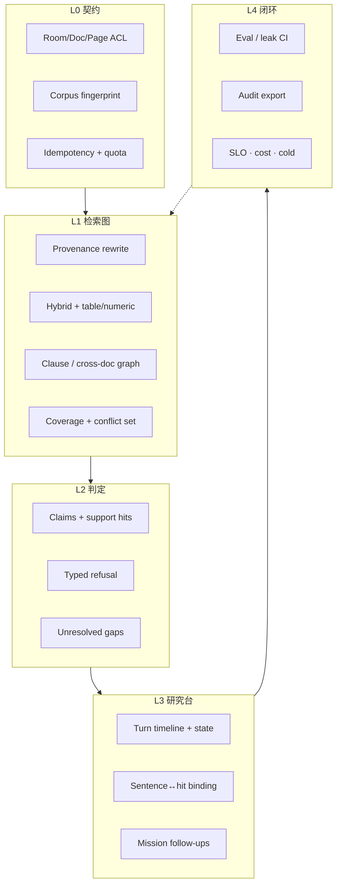

# 数据室知识库 · 行业绝对天花板设计

> 承接 [Grounded Chat 产品哲学](./deal-room-grounded-chat-philosophy.md) 与 [会话/审计里程碑](./deal-room-knowledge-qa-session-audit.md)。  
> 今日 A/B/C 是**契约内生产级**；本文定义相对本产品的**行业绝对天花板**——不是全网 Perplexity，而是机构级「可证明的本室判断系统」。

状态：**Phase Z（拆位追问）**；Y 冻结的 L0–L4 契约仍有效；追问主职从「任务包占满 chip」改为 **slot0 接续本轮 + slot1–2 可改写清单**  

范围：数据室 Knowledge 研究台（owner/editor）；组件可复用到 Viewer，**通道契约分离**  
非范围：全网搜索、人格化助手、A2UI 任意生成 UI、Visitor Ask 复辟、docling **原生** token 流

---

## 1. 天花板定义

### 1.1 一句话

在本室 ACL 与已同步语料指纹内，用最短路径给出**可核对、可回放、可追责**的判断；任何续问、追问、rewrite 都不得逃出语料契约。

### 1.2 相对今日的升维


| 维度  | 今日（A/B/C 已落地）            | 天花板                                     |
| --- | ------------------------ | --------------------------------------- |
| 信任  | 范围文案 + 拒答藏轨 + 页级打开       | **语料指纹 + 句子↔hit 绑定 + 可导出审计包**           |
| 检索  | hybrid + rewrite 门禁      | **检索图**（条款→定义→附件）+ 表/数字专路 + 冲突集         |
| 多轮  | 审计原文 + rewrite           | **可证明会话状态机**（实体/缺口），禁止闲聊记忆污染检索          |
| 追问  | top-1 模板 → mission 短路 → LLM | **拆位**：slot0 接续本轮 Q+A；slot1–2 接续或改写未覆盖 pack；**出室 CI 门禁** |
| 闭环  | 三选一反馈                    | 反馈→金标→发布门禁；错引抽样人审                       |
| 运维  | RPM/配额/FE 幂等/kill-switch | **强制幂等**、SLO/成本归因、多副本一致性说明              |


### 1.3 仍明确不做（天花板也不做）

- 全网知识 / 模型常识冒充本室答案  
- ChatGPT 气泡墙、人格、「副驾驶」隐喻  
- 用更强模型代替证据契约  
- Host 研究台与 Visitor Ask 混为同一产品面（可共享组件白名单）

哲学 **P1–P5** 全程不可妥协。

---

## 2. 五层架构

```
L0 契约     ACL · corpus fingerprint · entitlement · idempotency
L1 检索图   provenance rewrite · hybrid/table lanes · multi-hop · conflict/coverage
L2 判定     evidence-bound claims · typed refusal · unresolved gaps
L3 研究台   turn timeline · sentence↔hit UI · mission follow-ups
L4 闭环     feedback→eval · leak CI · SLO/cost · audit export · cold archive
```




---

## 3. 关键设计默认（天花板拍板）

### 3.1 多文件命中 · Coverage set

1. 对 turn.hits 按 `sourceName` 去重，保留检索序，最多 **N=3** 个文件进入 coverage set。
2. **固定模板**（FE i18n，仍为即时占位）：
  - Chip A：锚 **top-1**（责任/定义/例外类，沿用现有 keys）  
  - Chip B：若存在 top-2 → 锚 **top-2** 的「对照/例外」类一条  
  - Chip C：若 set≥2 →「这两份文件对同一事项是否一致？」；否则通用本室义务
3. **LLM chips**：每条必须点名 set 内某一文件名；禁止三条全挤在 top-1。
4. **答案**：冲突 → 并列表、不选边；单文件足够则不提及其他文件。

### 3.2 会话状态机（替代聊天记忆）

`knowledge_qa_sessions.state`（JSONB，可审计）：


| 字段                | 含义                                 |
| ----------------- | ---------------------------------- |
| `entities[]`      | name / type / firstTurnId / hitIds |
| `openQuestions[]` | 未覆盖问题文案 + 来源 turn                  |
| `coverageHints[]` | 最近 coverage set 摘要                 |


Rewrite **只许**消费：`state` + 上一 turn 的 question/answer/hits。  
禁止用不可审计的「对话摘要」做检索改写。

### 3.3 强制幂等与计费

- Session ask：`clientRequestId` **必填**；缺省 → `400 invalid_input`。  
- 计费/配额仅在**新 turn 写入**时发生；UNIQUE 冲突 replay → 零上游、零配额。  
- 探测路径 `POST …/knowledge/query`（answer=false）保持无会话、无答案计量（§7.1）。

### 3.4 绑定生成与句子溯源

生成契约（可与现 answer 并存，渐进）：

```json
{
  "answerText": "…",
  "claims": [
    { "text": "…", "hitIds": ["…"], "confidence": "grounded|weak" }
  ],
  "unresolved": ["…"]
}
```

UI：悬停/点击句子 ↔ 证据卡；无 `hitIds` 的断言不得使用「事实句」强样式（可降级为综合叙述）。

### 3.5 追问 = 本轮 EVI 拆位（Phase Z）

Composer 2–3 条 chip **不是纯接续，也不是纯清单**：

- **slot0（硬）**：verify / conflict / consequence，必须与本轮 `question` + `answer` + `claims` + `unresolved` 同源。  
- **slot1–2（可）**：继续接续，或取未覆盖 mission 项并 **改写成贴着本轮锚点** 的问句。禁止 YAML 原文进 composer。  
- 清单原文只留在 MissionProgressRail。  
- 拒答 / `no_hits` / 未接地：两条 narrow，不拆位、不走 LLM。  
- `source` ∈ `llm | gap | template`（composer 不再使用 `mission`）。  
- **发布门禁**：出室/对抗 golden 泄漏率超过阈值 → CI 失败；「未改写的清单原文」golden 必拒。

### 3.6 语料指纹与导出

- 每 turn 快照：`corpus_fingerprint`（room docs 版本/同步世代哈希）。  
- 导出「diligence 包」：session + turns + hits + retrieve_query + fingerprint（JSON；可选 PDF 封面）。  
- 热数据保留策略保持；冷归档：对象存储审计包 + DB 墓碑（§13 升级为 Phase H）。

### 3.7 观测与运维


| 信号                                         | 用途                                  |
| ------------------------------------------ | ----------------------------------- |
| `rewrite_total{rejected|disabled|applied}` | 已有；补 FE follow-up soft-fail counter |
| `followups_total{source}` / `followups_kind_total{source,kind}` | composer 拆位：`llm\|gap\|template` × `verify\|conflict\|consequence\|cover\|narrow` |
| follow-ups leak rate（CI）                   | 发版门禁；未改写清单原文 golden 必拒              |
| ask latency / token cost per workspace     | 成本归因                                |
| Redis admission key `scope`                | 滚动发布说明（混部双轨窗口）                      |


---

## 4. 分期路线图


| Phase  | 主题                          | 依赖         | 成功判据                                                    |
| ------ | --------------------------- | ---------- | ------------------------------------------------------- |
| **D**  | 多文件 coverage + 强制幂等 + 合同表补齐 | A/B/C      | 多 hit 模板见 top-2；无 clientRequestId 被拒；§6.2/§7 与代码一致      |
| **E**  | 会话状态机                       | D          | rewrite 可证明只读 state；实体跨 turn 复用                         |
| **F**  | 绑定生成 + 句子溯源                 | E          | 主路径 claims 可点回 hit；无绑定不强样式                              |
| **G**  | 任务追问 + 评测门禁                 | D（可与 E 并行） | pack chips；leak CI 挡合并                                  |
| **H**  | 机构交付                        | F/G        | 审计导出、冷归档、SLO 看板                                         |
| **I**  | L1 检索图 · 冲突集（首刀）            | D/F/H      | 多文件 hits 冲突可检出；答案并列表不选边；turn/API/FE 可回放                 |
| **I2** | L1 · table/numeric 双车道      | I + ingest | 数值/表意图走本地 `table_row`；与 hybrid 合并；sheet locus           |
| **I3** | L1 · multi-hop              | I + E      | 条款→定义→附件确定性二跳；`bound_answer.multiHop`；session-only      |
| **J**  | L2 · typed refusal + gaps   | F/I3       | `refusal.kind` 可审计；未绑定句 Gap 面板；回写 openQuestions         |
| **K**  | L2 · partial judgment       | J/F        | answered 盖章分级 `grounded                                 |
| **L**  | L3 · session state rail     | E/J        | 研究台露出 `session.state`；缺口可追问；ask/stream 透传               |
| **M**  | L4 · cost / SLO 归因          | H/J/K      | ops：p95、costUnits、refusal/judgment 分布；desk strip 露出     |
| **N**  | L3 · mission progress       | G/L        | checklist 相对会话状态进度露出；未覆盖可追问；pack 可切换                    |
| **O**  | L4 · feedback→金标门禁          | G/M        | wrong_citation 快照→人审→export；CI gold gate；ops pending 计数 |
| **P**  | L1 · rewrite 缓存/旁路          | E          | 确定性 deixis 旁路；provenance cache；命中仍 `rewriteIsGrounded`  |
| **Q**  | L4 · 金标人审台                  | O          | FE 待审队列；accept/reject；snapshot hits 露出；ops 刷新           |
| **R**  | L4 · 金标导出下载                 | Q/O        | accepted seeds JSON 浏览器下载；空队列仍可导出                       |
| **S**  | L4 · 金标闭环硬化                 | R          | MSW e2e：反馈→accept→export；ops 露出 accepted 计数             |
| **T**  | L3 · Owner Viewer 白名单复用     | S / 哲学§6   | `roomId` 续传；ViewerKnowledgeRail；JWT 通道；不碰 Visitor Ask   |
| **U**  | L4 · 冷归档只读恢复                | H          | 墓碑列表；打开 pack 预览；JSON 下载；不回写 live session                |
| **V**  | L3 · 统一 desk session 客户端    | T          | Tab 迁入 `useKnowledgeDeskSession`；cite_open 共享；消双路径漂移    |
| **W**  | L4 · 冷归档恢复契约门禁             | U/H        | `loadSessionArchiveDetail` 单测；e2e：404 / restored_readonly / pack |
| **X**  | L3 · Owner Viewer continuity 门禁 | T/V/W      | `roomId`+`ws`；persist；desk/ops 单测；rail e2e ±roomId；conflicts soft assert |
| **Y**  | Freeze / closeout               | X          | 产品 Phase 冻结；验收矩阵与门禁命令定稿；明确延后债；哲学/里程碑文档对齐 |
| **Z**  | L3 · 拆位追问（EVI + 改写 cover） | Y / G / N  | slot0 同源本轮；cover 必带锚点；YAML 原文禁进 chip；leak 仍 0；source≠mission |


---

## 5. Phase D · 可执行任务清单

> 历史刀：完成 D 即从「生产级里程碑」迈向天花板第一级（现已经 X，并由 Y 冻结）。

### D1 · Coverage set（模板）

- [x] FE `buildRoomFollowUps`：从 hits 提取有序去重 `sourceNames[]`（最多 3）  
- [x] 模板策略按 §3.1；i18n：`exceptionsInSecondSource` / `crossFileConsistency`（en + zh-CN）  
- [x] BE `templateFollowUps` 与 FE **同 ID / 同策略**  
- [x] 单测：多 `sourceName` hits → chip 含 top-1 与 top-2  

### D2 · Coverage set（LLM）

- [x] `generateLLMFollowUps` prompt：显式传入 `coverage_set`；set≥2 时集体覆盖 ≥2 文件  
- [x] 门禁 `filterCoverageDiverse`；golden「三条全挤 top-1」打回 template  
- [x] 指标 `dealsignal_knowledge_qa_followups_coverage_files` histogram  

### D3 · 强制 `clientRequestId`

- [x] Session query JSON + stream：缺省或空白 → `400 invalid_input`  
- [x] `parseClientRequestID` 单测；`e2e-knowledge.sh` 缺省被拒  
- [x] MSW 必填；FE 已发 UUID  

### D4 · 合同与观测对齐

- [x] 更新 [session-audit §6.2](./deal-room-knowledge-qa-session-audit.md)：列 `client_request_id` / `retrieve_query` / `rewrite_applied`  
- [x] §7 API 表增加 `POST …/turns/:turnId/follow-ups` 与 desk events  
- [x] FE follow-up `.catch` → `followups_upgrade_failed` desk event + Prometheus  
- [x] 文档注明 Redis admission key 含 `scope` 的滚动发布窗口  

### D5 · 验收

- [x] `go test ./internal/knowledge/`  
- [x] `vitest run src/lib/knowledge/`（27 passed）  
- [x] `BASE_URL=… ./e2e-knowledge.sh`（含 A5 409 + 缺 clientRequestId 400）  
- [x] 单测覆盖多文件 chip（FE `followUps.test.ts` + BE template/LLM diversity）  

---

## 6. Phase E–H 提纲（非本刀实现）

### E · 会话状态机

- [x] migration `117`：`knowledge_qa_sessions.state JSONB` + `knowledge_qa_turns.rewrite_basis`  
- [x] turn 完成后 `evolveSessionState`（entities / openQuestions / coverageHints）  
- [x] `maybeRewriteFollowUpQuery` 只读 state+prior turn；审计 `rewrite_basis: state|prior_only`  
- [x] API/FE 类型暴露 `session.state`；smoke 断言 openQuestions / coverage  

### F · 绑定生成

- [x] migration `118`：`bound_answer` JSONB；`bindAnswerClaims`（`[n]` → grounded，overlap → weak）  
- [x] 兼容旧 `answer` 字符串；API `claims` / `unresolved`  
- [x] `GroundedChatShell` 句子级溯源（无 hitIds 不强样式）  
- [x] stream `done.turn` 携带 claims；smoke 断言 answered+hits → claims  

### G · 任务追问 + CI

- [x] 内置 mission packs（`financing_dd_v1` / `ma_redflag_v1`）+ room 绑定 API  
- [x] follow-ups：`openQuestions` / unresolved / pack 缺口 → `source=mission` chips  
- [x] `TestKnowledgeOutOfRoomLeakGate`（leak rate ≤ 0）挡合并  
- [x] 负反馈 → `knowledge_qa_eval_candidates` + 手写 `testdata/knowledge_eval/seeds.json`  

### H · 机构交付

- [x] migration `120`：`corpus_fingerprint` / `duration_ms` + `knowledge_qa_session_archives`  
- [x] 每 turn 快照语料指纹；`GET …/sessions/:id/export` diligence JSON  
- [x] RetentionCleaner：对象存储冷归档 + DB 墓碑，再删热行；`GET …/archives` / `:id` 只读恢复  
- [x] `GET …/ops` workspace SLO/配额/冷归档看板；FE 导出按钮 + Ops strip  

### I · L1 检索图（首刀 = 冲突集）

> 表/数字专路与 multi-hop 为 I 的后续刀；本刀不新增 ingest、不依赖 docling 新契约。

- [x] `detectHitConflicts`：coverage set（≥2 source）上确定性数值冲突  
- [x] `applyConflictAnswerPolicy`：冲突时并列表、不选边；写入 `bound_answer.conflicts`  
- [x] API/stream `turn.conflicts`；FE `ConflictPanel` + i18n  
- [x] 单测（`conflict_test.go`）覆盖检出/改写/同值不冲突；smoke 仍走主路径  

### I2 · table/numeric 双车道

- [x] migration `121`：`table_row` 文档偏索引；`SearchTableRowsByDocuments`  
- [x] 意图门禁 `wantsTableLane` + 本地 ILIKE 检索（unlocked room docs）  
- [x] `Service.Query`：hybrid 后合并 table hits（去重、sheet locus、mode `hybrid+table`）  
- [x] `KNOWLEDGE_QA_TABLE_LANE_ENABLED`（默认 on）；Prometheus `table_lane_hits_total`  
- [x] 单测：意图 / ILIKE escape / merge / bbox→sheet  

### I3 · multi-hop（条款→定义→附件）

- [x] `extractHopAnchors` / `buildHopQueries`：首跳 hits + 审计 `session.state` 确定性锚点（无 LLM）  
- [x] `Service.Query`：session 路径 `MultiHop=true` 后跑 ≤2 次 `Answer:false` Search；probe 不 hop  
- [x] 合并去重、mode `…+hop`；审计写入 `bound_answer.multiHop`；API/stream `turn.multiHop`  
- [x] `KNOWLEDGE_QA_MULTI_HOP_ENABLED`（默认 on）；Prometheus `multi_hop_total`  
- [x] FE `MultiHopPanel` + i18n；clause/attachment 实体回写 state  

### J · L2 typed refusal + unresolved gaps

- [x] `RefusalInfo{kind,hadHits,hitCount}`：`ungrounded|no_hits|error`；写入 `bound_answer.refusal`  
- [x] `classifyTurnResult` 返回 typed envelope；空答案+hits → `no_hits`（保留 hits 供核对）  
- [x] API/stream `turn.refusal`；Prometheus `refusal_total{kind}`  
- [x] FE `RefusalPanel` + `UnresolvedGapsPanel`（可就缺口追问）；i18n en/zh-CN  
- [x] `evolveSessionState`：answered 的 `unresolved[]` → `openQuestions`  

### K · L2 partial judgment（盖章分级）

- [x] `JudgmentInfo{kind,reason,grounded/weak/unresolved counts}` → `bound_answer.judgment`  
- [x] `classifyJudgment`：`grounded` vs `partial`（`weak_only|has_unresolved|mixed`）  
- [x] API/stream `turn.judgment`；Prometheus `judgment_total{kind,reason}`  
- [x] FE `PartialJudgmentPanel` + i18n；不翻转 refused、不藏证据轨  
- [x] 出室 eval seeds 加压（错引/常识/跨文件）  

### L · L3 session state rail（研究台状态机露出）

- [x] `SessionQueryResponse.sessionState` + SSE `done.sessionState`（含幂等 replay）  
- [x] FE `SessionStateRail`：openQuestions / entities / coverageHints；缺口一键追问  
- [x] `knowledgeQueryStore.sessionState` 随 hydrate / ask / 开历史会话同步  
- [x] i18n en/zh-CN；MSW mock 回传 `sessionState`  

### M · L4 cost / SLO 归因

- [x] `estimateCostUnits`（答案+hits 千字元代理）→ `bound_answer.costUnits` / `turn.costUnits`  
- [x] ops SQL：p95 latency、SUM costUnits、refusalsByKind、judgmentsByKind  
- [x] `OpsSummary` + FE `KnowledgeOpsStrip`（p95 / cost / refusals）+ i18n  
- [x] Prometheus hints 含 refusal/judgment；e2e 断言新字段  

### N · L3 mission progress（任务引擎进度）

- [x] `buildMissionProgress` / `GetMissionProgress`：复用 `missionItemCovered` + session/latest turn corpus  
- [x] `GET …/knowledge/mission/progress?sessionId=`；route 先于 `mission`  
- [x] FE `MissionProgressRail`：covered/total、未覆盖一键追问、pack 切换  
- [x] i18n en/zh-CN；MSW mock；e2e 断言 progress 字段  

### O · L4 feedback→金标→发布门禁

- [x] migration `122`：candidate `snapshot` / `review_status` / `expect`；`(turn_id, feedback_kind)` upsert  
- [x] `wrong_citation` 反馈写入 hits+claims 快照；`GET/PATCH …/eval/candidates` + export  
- [x] `TestKnowledgeWrongCitationGoldGate`：seeds 结构化错引可检出；claim hitIds 完整  
- [x] ops `pendingEvalCandidates` + FE strip；e2e：反馈→候选→accept→export  

### P · L1 rewrite 可证明缓存/旁路

- [x] `tryDeterministicRewrite`：纯指代 + 唯一文档锚点 → 无 LLM 旁路（仍过 `rewriteIsGrounded`）  
- [x] provenance cache key（session/prior/user/state/evidence）；命中再 grounding；软失效不污染检索  
- [x] Redis KV（有则）/ memory fallback；`KNOWLEDGE_QA_REWRITE_CACHE_ENABLED`（默认 on）  
- [x] 指标 `rewrite_total{bypass|cached|…}`；单测覆盖旁路/缓存/拒陈旧未锚定  

### Q · L4 金标人审台（错引抽样人审）

- [x] FE `EvalGoldReviewPanel`：pending 队列、Q/A/note、snapshot hits  
- [x] accept → `reject_or_rebind` 默认 expect；reject 出队；刷新 ops strip  
- [x] 接入语料落地页（`DealRoomKnowledgeTab`）；i18n en/zh-CN；MSW snapshot  
- [x] 单测：空队列隐藏 / accept 回调  

### R · L4 金标导出下载

- [x] `downloadEvalSeedExport`：seeds.json 形浏览器下载  
- [x] 面板在 accepted>0 时保留导出入口（无 pending 也可导出）  
- [x] toast 成功/失败；i18n en/zh-CN；单测下载 helper + export 按钮  

### S · L4 金标闭环硬化

- [x] Playwright MSW：`wrong_citation` → 人审 accept → seeds JSON download  
- [x] `KnowledgeOpsStrip` 露出 `evalCandidatesByStatus.accepted`  
- [x] MSW ops 同步 accepted 计数  

### T · L3 Owner Viewer 白名单复用（通道分离）

- [x] `viewerPath(…, { roomId })`；cite 跳转携带本室 id  
- [x] `useKnowledgeDeskSession` + `ViewerKnowledgeRail`（GroundedChatShell / TrustChip）  
- [x] 认证 Viewer 挂载侧栏；同文档 cite→`setPage`；`publicToken` 路径忽略  
- [x] 白名单声明 `whitelist.ts`；e2e：cite → rail 可见；不接线 UnifiedQAPanel  

### U · L4 冷归档只读恢复

- [x] FE `ColdArchivePanel`：tombstone 列表、只读预览、diligence JSON 下载  
- [x] 打开标记 `restored_readonly`；**不**写入 `knowledgeQueryStore` live session  
- [x] 接入语料落地页；MSW 种子 + ops `coldArchiveCount`；i18n en/zh-CN  

### V · L3 统一 desk session 客户端

- [x] `DealRoomKnowledgeTab` ask/hydrate/stop/feedback 走 `useKnowledgeDeskSession`  
- [x] `allowAsk` 绑定语料就绪；`onActiveSessionHydrated` → 打开 desk  
- [x] `resolveCiteOpenOutcome` + `recordCiteOpen()` 共享 Tab/Viewer  
- [x] Tab 独有面保留：corpus/export/history/ops/gold/cold/mission  

### W · L4 冷归档恢复契约门禁

- [x] 抽出 `listSessionArchives` / `loadSessionArchiveDetail`（可单测）  
- [x] 单测：strip storageKey、`restored_readonly`、pack schema/turns、404/unavailable  
- [x] `e2e-knowledge.sh`：list 不泄 key；missing→404；有墓碑时 detail 契约  

### X · L3 Owner Viewer continuity 门禁

- [x] `viewerPath` 携带 `roomId` + `ws`；DocumentsDialog / Tab / Rail 透传  
- [x] Viewer `?ws=` 种子 + persist workspace（新标签 `/viewer` 可 API）  
- [x] `useKnowledgeDeskSession` + `KnowledgeOpsStrip` vitest  
- [x] Playwright：`/viewer/…?roomId=&ws=` 挂 rail；无 `roomId` 不挂  
- [x] `e2e-knowledge.sh`：`conflicts` 有则 shape soft assert  

### Y · Freeze / closeout

- [x] 状态句改为冻结；路线图登记 Phase **Y**（无新功能刀）  
- [x] §9 验收矩阵 / 门禁命令定稿  
- [x] §7 开放项全部标为「已归宿或明确不做」  
- [x] 哲学 §8：docling 原生流标为上游非目标  
- [x] session-audit §13 指向天花板冻结  

---

## 7. 与开放项对照


| session-audit §13   | 天花板归宿（Y 冻结后）                                      |
| ------------------- | --------------------------------------------------- |
| 冷归档分层               | **H** + **U** + **W**（已闭合）                          |
| 出室评测集持续加压           | **G** leak/gold CI（已闭合；加压属运维增量，非新 Phase）            |
| rewrite 缓存/旁路       | **P**（已闭合）                                          |
| Visitor / Viewer 复用 | Owner：**T** + **X**；Visitor Ask：**不做**（通道分离）         |
| docling 原生 token 流  | **不做**（上游）；服务端仍可对已审计答案切分 `token*`                    |


---

## 8. 文档修订


| 日期         | 变更                                                                                              |
| ---------- | ----------------------------------------------------------------------------------------------- |
| 2026-08-03 | 初稿：天花板定义、五层架构、§3 拍板、Phase D–H；D 期任务清单 D1–D5                                                     |
| 2026-08-03 | Phase D 落地：coverage 模板/LLM、强制幂等、合同/观测对齐                                                         |
| 2026-08-04 | Phase E 落地：session.state 状态机、rewrite 可证明只读 state、rewrite_basis                                  |
| 2026-08-04 | Phase F 落地：bound_answer claims、句子↔hit UI、stream/API 透传                                          |
| 2026-08-04 | Phase G 落地：mission packs/chips、leak CI 门禁、eval candidates                                       |
| 2026-08-04 | Phase H 落地：语料指纹、diligence 导出、冷归档墓碑、ops 看板                                                       |
| 2026-08-04 | Phase I 首刀落地：L1 数值冲突集、答案并列表不选边、ConflictPanel；I2 表车道 / I3 multi-hop 后置                           |
| 2026-08-04 | Phase I2 落地：本地 `table_row` 车道 + hybrid 合并、sheet locus、`KNOWLEDGE_QA_TABLE_LANE_ENABLED`         |
| 2026-08-04 | Phase I3 落地：确定性 multi-hop、`bound_answer.multiHop`、session-only、`KNOWLEDGE_QA_MULTI_HOP_ENABLED` |
| 2026-08-04 | Phase J 落地：L2 typed refusal + UnresolvedGapsPanel、`bound_answer.refusal`、gaps→openQuestions     |
| 2026-08-04 | Phase K 落地：L2 partial judgment、`bound_answer.judgment`、PartialJudgmentPanel；eval seeds 加压       |
| 2026-08-04 | Phase L 落地：L3 SessionStateRail、`sessionState` ask/stream 透传、desk store 同步                       |
| 2026-08-04 | Phase M 落地：L4 ops 成本/SLO 归因（p95、costUnits、refusal/judgment 分布）                                  |
| 2026-08-04 | Phase N 落地：L3 MissionProgressRail、`GET …/mission/progress`、pack 切换与追问                           |
| 2026-08-04 | Phase O 落地：L4 wrong_citation→金标人审/导出、CI gold gate、ops pending 计数                                |
| 2026-08-04 | Phase P 落地：L1 rewrite 确定性旁路 + provenance cache（命中再 grounding）                                   |
| 2026-08-04 | Phase Q 落地：L4 EvalGoldReviewPanel 金标人审台（accept/reject + snapshot）                               |
| 2026-08-04 | Phase R 落地：L4 accepted 金标 JSON 导出下载（人审→CI 交付）                                                   |
| 2026-08-04 | Phase S 落地：L4 金标闭环 e2e + ops accepted 计数                                                        |
| 2026-08-04 | Phase T 落地：Owner Viewer 白名单侧栏（通道分离；Visitor 不并入）                                                 |
| 2026-08-04 | Phase U 落地：L4 冷归档只读预览/下载（不回写 live session）                                                      |
| 2026-08-04 | Phase V 落地：Tab 迁入 useKnowledgeDeskSession（闭合 T 双客户端）                                            |
| 2026-08-04 | Phase W 落地：冷归档恢复契约门禁（单测 + e2e 404/restored_readonly/pack）                                      |
| 2026-08-04 | Phase X 落地：Owner Viewer continuity（`roomId`+`ws`、persist、desk/ops 单测、rail e2e、conflicts soft assert） |
| 2026-08-04 | Phase Y 冻结：产品 Phase 收官；§9 验收矩阵；开放项/哲学非目标对齐 |
| 2026-08-04 | Freeze 审查修复：P4 藏证、冲突禁选边、冷归档 fail-closed、CI 接线 MSW knowledge e2e |
| 2026-08-18 | Phase Z：composer 拆位追问（slot0 接续本轮；slot1–2 可改写 cover；mission 退出 chip） |


---

## 9. Freeze 验收契约（Phase Y）

> 合并/发版前对本室 Knowledge 天花板的最低门禁。通过即视为本里程碑可交付；**不得**再以「天花板下一刀」名义加产品 Phase。

### 9.1 门禁命令

```bash
# Backend unit + leak/gold gates（CI: backend-test 已覆盖 ./internal/knowledge/）
cd apps/api && go test ./internal/knowledge/

# Frontend MSW e2e（CI job: frontend-knowledge-e2e）
cd apps/web && pnpm exec playwright test e2e/deal-room-knowledge-qa.spec.ts

# Frontend unit（desk / viewer continuity 相关可按路径收窄）
cd apps/web && pnpm exec vitest run --coverage=false \
  src/hooks/useKnowledgeDeskSession.test.tsx \
  src/components/deal-rooms/knowledge/KnowledgeOpsStrip.test.tsx \
  src/components/deal-rooms/DealRoomDocumentsDialog.open.test.tsx \
  src/lib/knowledge/citations.path.test.ts \
  src/components/viewer/ViewerKnowledgeRail.test.tsx
```

可选 / 非 CI（需本地 API + docling-rag）：

```bash
cd apps/api && BASE_URL=http://localhost:8090 ./e2e-knowledge.sh
REAL_API_BASE_URL=http://localhost:8090 ./e2e-knowledge-real.sh
```

### 9.2 分层验收（对照 §2）

| 层 | 必须仍真 | 主要证据 |
| --- | -------- | -------- |
| L0 | ACL + fingerprint + 强制 `clientRequestId` + 配额/单飞 | e2e-knowledge；migration/ops |
| L1 | rewrite 门禁、table lane、multi-hop、conflicts 并列表 | knowledge 单测 + e2e soft assert |
| L2 | claims 绑定、typed refusal、partial judgment | bound_answer 单测 + FE 面板 |
| L3 | session/mission rail、统一 desk hook、Owner Viewer `roomId`+`ws` | Playwright desk/rail |
| L4 | leak/gold CI、ops 归因、金标人审导出、冷归档只读+恢复契约 | leak/gold tests；U/W e2e |

### 9.3 冻结规则

1. Y 冻结后的产品刀以 **新里程碑** 登记（本文件 Phase Z 为追问拆位）。缺陷修复与观测微调除外。  
2. 新能力（含 Visitor Ask 并入、原生 docling 流、全网检索）→ **新里程碑文档**，不回写本天花板为「未完成」。  
3. 出室评测集可继续加压，但属 **G 门禁运维**，不构成新 Phase。  
4. 哲学 **P1–P5** 与 §1.3 非目标在冻结后仍不可妥协。


