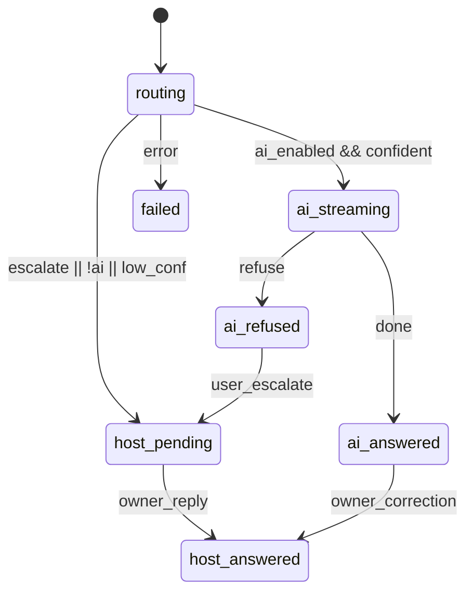

# 访客 Ask · 理想终态产品设计与技术方案

> **访客只看到一个 Ask；系统用 AI 先答、人兜底、Formal 可升级。**  
> Ask Host 与 Ask Docs 不是两个产品 Tab，而是同一 Ask 产品的两种执行引擎。

状态：设计定稿（待分阶段实施）  
范围：分享链接 / 数据室 **访客侧** Ask + **宿主侧** Ask Inbox + 商业化打包  
承接：[Grounded Chat 产品哲学](./deal-room-grounded-chat-philosophy.md)、[Knowledge Q&A 会话审计](./deal-room-knowledge-qa-session-audit.md)  
与成员 Knowledge Desk **分离**：后者是 owner/editor 本室研究台；本文是 **external visitor** 链路。

---

## 1. 背景与问题

### 1.1 现状（2026 Q3）

| 能力 | 状态 | 存储 / 路由 |
|------|------|-------------|
| **Ask Host** | 标准能力，分享链接默认开启 | `link_visitor_questions`；`POST /public/links/:token/questions` |
| **Ask Docs** | Premium 占位 UI；能力未对访客开放 | 旧 `ask_docs_*` 栈已删除（migration `106`）；成员侧 `knowledge_qa_*` 已落地 |
| **Knowledge Desk** | 成员本室研究台 | `knowledge_qa_sessions/turns`；workspace 鉴权 |
| **访客 Workspace UI** | 并行 Tab：Ask Host / Ask Docs | `VisitorWorkspacePanel` |

并行 Tab 适合 **教育市场** 与 **短期 upsell**，但不是数据室终态：尽调访客只有一件事——**「我有问题，要快、要准、要留痕」**。

### 1.2 产品判断

| 维度 | 并行 Tab | 理想终态（整合 UX + 并行引擎） |
|------|----------|--------------------------------|
| 访客认知 | 需选择「问人还是问文档」 | 单一 Composer |
| 宿主效率 | AI 无法挡重复问 | AI 消化常规问，人处理例外 |
| 商业化 | 功能名二元定价 | 按 outcome / 用量分层 |
| 合规 | 两条 audit 线 | 统一 Ask 时间线，lane 可区分 |
| 与 Slack | 易分裂 | Ask 为 system of record；Slack 仅通知 |

**决策：采用整合 UX、双引擎后端、分 lane 运营与计费。**

---

## 2. 北极星

**一句话**  
在分享链接 / 数据室 ACL 范围内，访客于 **一处 Ask** 提问；系统优先从已授权文档给出 **可引用即时答**；无法 grounded 或用户要求时 **升级给发起方**；全程 **可审计**。

**成功判据**

1. 访客无需理解 Ask Host / Ask Docs 产品名即可完成提问。
2. ≥60% 可文档化问题由 AI lane 闭环（Supervised 模式，上线 90 天后）。
3. 宿主 Inbox 中「待人工」条数相对全量 Ask 显著下降。
4. Premium 转化来自 **AI 配额 / Formal 工作流**，而非「解锁第二个 Tab」。
5. 每条 Ask 可回放：问题、路由决策、回答、引用或人工答复、操作者。

**反北极星**

- 两个并列 Tab 长期并存且无路由。
- Ask Docs 伪装成 Ask Host 的「AI 版聊天」。
- 访客被导向 Slack / 邮件作为提问入口。
- 与成员 Knowledge Desk 共用同一 UI 表面（角色混淆）。

---

## 3. 体验设计

### 3.1 访客：单一 `Ask` 入口

**位置**：Public Viewer / Deal Room Link Viewer 右侧 Workspace（取代当前 Ask Host + Ask Docs 双 Tab）。

**布局（遵循 Grounded Chat 白名单组件）**

Workspace Tab（沟通右侧为 FAQ Help Center；有至少 1 条 Pin 才显示 FAQ Tab，默认不落到 FAQ）：

`文档 | 沟通 | FAQ | 资料请求`

```
┌─────────────────────────────────────┐
│ Ask（沟通 Tab）                       │
│ Scoped to documents you can access  │  ← TrustChip（link ACL）
├─────────────────────────────────────┤
│ [ Turn 时间线：问 → 答 / 待回复 ]      │
├─────────────────────────────────────┤
│ Composer + 建议 chip（尽调向）         │
│ [ Ask ]  [ Stop ]                   │
└─────────────────────────────────────┘
```

FAQ Tab：搜索已 Pin 条目并展开阅读官方答；搜不到则「去提问」切回沟通并预填（不自动发送）。沟通 Tab **不再**内嵌 FAQ 目录。

**单轮交互**

```
访客输入问题
    │
    ▼
路由层（同步，<300ms 内给出 UX 分支）
    │
    ├─► Pin FAQ 命中（规范化全等或发起方配置的同义问法）
    │       → 新 turn 复制官方答；不跑 RAG / SSE；route_reason=pinned_faq
    │       → 不计 AI 月度配额；Formal / 访客主动 escalate 不拦截
    │
    ├─► AI 可答（grounded + 置信度 ≥ τ）
    │       → 流式 AnswerStream + EvidenceRail（引用页码）
    │       → Turn 标记 lane=ai
    │
    ├─► AI 不可答 / 低置信
    │       → 展示：「材料中未找到可靠依据」
    │       → CTA：「发送给发起方」→ lane=host（入队）
    │
    └─► 用户主动点「需要发起方确认」
            → 可选附带 AI 草稿（lane=hybrid）
```

**Turn 卡片状态（访客可见）**

| 状态 | 含义 | UI |
|------|------|-----|
| `ai_answered` | AI 已 grounded 回答 | 答案 + 引用 |
| `ai_refused` | 拒答（无假证据） | 拒答文案 + 「发给发起方」 |
| `host_pending` | 已转人工，待回复 | 排队提示 |
| `host_answered` | 发起方已回复 | 人工答案 |
| `host_escalated` | 从 AI 升级 | 显示 AI 草稿（灰）+ 正式答复 |
| `route_reason=pinned_faq` | FAQ 拦截回放 | 「常见问题」徽章；无升级 CTA、无 SSE |

### 3.2 宿主：统一 Ask Inbox，三 Lane

**入口**：Dashboard · Link Share · Deal Room → **Ask Inbox**（与 Signal Inbox 分离，文案已有 B7 约束）。

```
Ask Inbox
├── AI handled      — 可复核、纠正、Pin 为 FAQ
├── Needs host      — pending 人工队列（SLA 可选）
└── Formal queue    — Enterprise：定时发布、匿名化（Phase C）
```

**宿主动作**

- 回复 / 编辑 AI 纠正并发布  
- 将已答问 **人工 Pin** 为 FAQ（Help Center Tab 可检索；相同/同义提问拦截复用官方答、不再走 AI）。高频只 **建议** Pin（`repeat_count ≥ 3`），**禁止自动上架**  
- 可为每条 Pin 配置同义问法（规范化全等匹配，不做 embedding）  
- 批量「此类问题以后由 AI 答」（策略学习，Phase B+）  
- Analytics：主题、文档、访客、AI 解决率

### 3.3 三种 Room 模式（配置项，非 Tab）

| 模式 | 场景 | 默认路由 | 典型客户 |
|------|------|----------|----------|
| **Self-serve** | 材料包自助阅读 | AI 优先，极少升级 | Fund marketing、 teaser |
| **Supervised** | 融资 / 出售数据室 | AI 答 + 敏感类自动转 Host | Series B+、M&A sell-side |
| **Formal Q&A** | 竞价 / 监管 | 问题公示、统一答复、延迟发布 | 并购竞价、IPO 尽调 |

默认新数据室：**Supervised**。单文档分享链接：**Self-serve**（可升级 Supervised）。

---

## 4. 商业化

### 4.1 原则

- **不按「两个 Tab」卖**；按 **房间能力 + AI 用量 + Formal 工作流** 卖。
- Ask Host（人工）是 **Standard 合规底座**，不单独下架。
- Ask Docs 能力体现为 **AI lane 配额与深度**，不是独立 SKU 名（对外可说「Ask Docs powered by…」）。

### 4.2 套餐（建议）

| 层级 | 包含 | 计量 |
|------|------|------|
| **Standard** | 分享链接 + Ask Inbox + 人工 Q&A | 每 link N 条 host 问 / 月 |
| **Pro** | + AI grounded 答 + 引用 + 建议 chip | M AI turns / room / 月 |
| **Enterprise** | + Formal Q&A + 跨 room 组合问 + 导出 + SLA | Seat + room + overage |

### 4.3 产品内升级触发

| 触发 | 动作 |
|------|------|
| AI 配额用尽 | Paywall：「本月 AI 问答已达上限」 |
| Formal 模式 | Enterprise 销售 / 试用 |
| 同主题 ≥K 次重复 | 宿主提示：「发布为 FAQ / 正式 Q&A」 |
| AI refuse 率高 | 宿主侧：「语料未同步 / 缺文档」运营提示 |

### 4.4 集成（Slack 等）

- Slack：**仅** `Needs host` / Formal 事件通知；**不是**访客入口。  
- 归属 Pro+ 集成包；不改变 Ask 为 system of record。

---

## 5. 信息架构与命名

### 5.1 对外命名

| 内部引擎 | 对外叙事 |
|----------|----------|
| `host` lane | 「已发送给发起方」 |
| `ai` lane | 「基于您可访问的文档」 |
| Unified surface | **Ask**（en）/ **提问**（zh-CN） |

「Ask Host」「Ask Docs」退居 **宿主文档 / 计费说明**，不出现在访客 Tab 级导航。

### 5.2 与 Knowledge Desk 边界

| | Visitor Ask（本文） | Knowledge Desk |
|--|---------------------|----------------|
|  actor | `visitor` | `member` |
| 鉴权 | link session + ACL | workspace JWT |
| 语料范围 | link 可见文档 | 全 room 同步语料 |
| UI | Public Viewer Workspace | Deal Room Knowledge Tab |
| 审计 | link / visitor 维度 | room / member 维度 |

**复用**：Grounded 检索与生成管线、组件白名单、拒答策略；**不复用**：session 表直接混写（见 §6.2）。

---

## 6. 技术方案

### 6.1 架构总览

```
                    ┌─────────────────────────────────┐
                    │     Visitor Ask Composer (web)   │
                    └───────────────┬─────────────────┘
                                    │ POST /public/links/:token/ask
                                    ▼
                    ┌─────────────────────────────────┐
                    │   visitorask.Orchestrator        │
                    │   · verify link ACL              │
                    │   · policy (mode/quotas)         │
                    │   · route → ai | host | hybrid   │
                    └───────┬─────────────┬───────────┘
                            │             │
              ┌─────────────▼──┐    ┌─────▼──────────────┐
              │ AI engine      │    │ Host engine         │
              │ knowledge svc  │    │ link_visitor_q…     │
              │ (link-scoped)  │    │ + notifications     │
              └─────────────┬──┘    └─────┬──────────────┘
                            │             │
                            └──────┬──────┘
                                   ▼
                    ┌─────────────────────────────────┐
                    │ link_ask_turns (统一审计时间线)    │
                    └─────────────────────────────────┘
```

### 6.2 数据模型

#### 6.2.1 新增：`link_ask_sessions` / `link_ask_turns`

统一访客 Ask 时间线；**不**替换 `link_visitor_questions` 首日，而是 **双写 + 逐步迁移**。

```sql
-- session：每位 visitor 在 link 上的一条连续 Ask 线（可选，P0 可简化为单 turn 列表）
CREATE TABLE link_ask_sessions (
    id UUID PRIMARY KEY DEFAULT gen_random_uuid(),
    tenant_id UUID NOT NULL REFERENCES tenants(id) ON DELETE CASCADE,
    workspace_id UUID NOT NULL REFERENCES workspaces(id) ON DELETE CASCADE,
    link_id UUID NOT NULL REFERENCES links(id) ON DELETE CASCADE,
    visitor_id TEXT NOT NULL,
    visitor_email TEXT,
    created_at TIMESTAMPTZ NOT NULL DEFAULT now(),
    updated_at TIMESTAMPTZ NOT NULL DEFAULT now()
);

CREATE TABLE link_ask_turns (
    id UUID PRIMARY KEY DEFAULT gen_random_uuid(),
    session_id UUID NOT NULL REFERENCES link_ask_sessions(id) ON DELETE CASCADE,
    tenant_id UUID NOT NULL,
    workspace_id UUID NOT NULL,
    link_id UUID NOT NULL REFERENCES links(id) ON DELETE CASCADE,
    visitor_id TEXT NOT NULL,
    question TEXT NOT NULL,
    lane TEXT NOT NULL CHECK (lane IN ('ai', 'host', 'hybrid')),
    status TEXT NOT NULL CHECK (status IN (
        'routing', 'ai_streaming', 'ai_answered', 'ai_refused',
        'host_pending', 'host_answered', 'failed'
    )),
    -- AI 产物（JSON：answer, refused, citations[]）
    ai_payload JSONB,
    -- 人工产物
    host_question_id UUID REFERENCES link_visitor_questions(id) ON DELETE SET NULL,
    host_answer TEXT,
    answered_by UUID REFERENCES users(id) ON DELETE SET NULL,
    route_reason TEXT,  -- e.g. low_confidence, user_escalate, policy_formal
    created_at TIMESTAMPTZ NOT NULL DEFAULT now(),
    updated_at TIMESTAMPTZ NOT NULL DEFAULT now()
);

CREATE INDEX idx_link_ask_turns_link_visitor ON link_ask_turns(link_id, visitor_id, created_at DESC);
CREATE INDEX idx_link_ask_turns_host_pending ON link_ask_turns(link_id, status) WHERE status = 'host_pending';
```

#### 6.2.2 保留：`link_visitor_questions`

- Host lane 仍写入此表（兼容现有 Inbox API、action items、analytics）。
- `link_ask_turns.host_question_id` 指向关联行。
- 迁移完成后，Inbox 列表以 `link_ask_turns` 为主视图，`link_visitor_questions` 作 host 答复存储。

#### 6.2.3 Link / Room 策略字段

```sql
-- links 或 deal_room_access_policies 扩展
ask_mode TEXT NOT NULL DEFAULT 'supervised'
    CHECK (ask_mode IN ('self_serve', 'supervised', 'formal'));
ask_ai_enabled BOOLEAN NOT NULL DEFAULT false;  -- Pro+；Standard 仅 host
ask_ai_monthly_quota INT;  -- NULL = 套餐默认
```

`qa_enabled`（Ask Host baseline）**保持永远 true**；`ask_ai_enabled` 控制 AI lane。

#### 6.2.4 AI 审计

- 访客 AI turn 的 citations 快照存入 `ai_payload`（与 `knowledge_qa_turns` 结构对齐，便于复用 presenter）。
- **不**要求访客 turn 写入 `knowledge_qa_sessions`（成员 desk 隔离）。

### 6.3 API

#### 6.3.1 访客 Public API（新）

| Method | Path | 说明 |
|--------|------|------|
| `POST` | `/api/v1/public/links/:token/ask` | 统一提问；body: `{ question, escalate?: boolean }` |
| `GET` | `/api/v1/public/links/:token/ask/me` | 当前 visitor 的 session / turns |
| `GET` | `/api/v1/public/links/:token/ask/:turnId/stream` | AI lane SSE（phase/token/sources/done/refuse） |

**兼容期**

- 保留 `POST .../questions` → 内部转 `lane=host` 写 turn + legacy question。
- `GET .../questions/me` → 由 turns 聚合或双读。

#### 6.3.2 宿主 Workspace API

| Method | Path | 说明 |
|--------|------|------|
| `GET` | `/api/v1/workspaces/:slug/links/:id/ask` | Inbox（filter: lane, status） |
| `GET` | `/api/v1/workspaces/:slug/deal-rooms/:roomId/ask` | Room 级聚合 |
| `PATCH` | `.../ask/:turnId/host-answer` | 人工答复 |
| `POST` | `.../ask/:turnId/pin-faq` | Pin 为 FAQ（Help Center + 拦截） |
| `PATCH` | `.../ask/:turnId/faq-aliases` | 为已 Pin 条目设置同义问法（最多 10） |

### 6.4 路由与 AI 引擎

**Orchestrator 伪代码**

```go
func (o *Orchestrator) Ask(ctx, link, visitor, question string, escalate bool) (Turn, error) {
    policy := o.loadPolicy(link) // ask_mode, ask_ai_enabled, quota

    if escalate || policy.AskMode == "formal" {
        return o.routeHost(ctx, link, visitor, question, reasonUserEscalate)
    }
    // Pin FAQ intercept: same visibility as GET .../ask/faq. Fail closed.
    if faq, ok := o.matchPinnedFAQ(link, question); ok { // normalize key or owner aliases
        return o.replayPinnedFAQ(ctx, link, visitor, question, faq) // copy-on-write; no RAG
    }
    if !policy.AskAIEnabled || o.quotaExceeded(link) {
        return o.routeHost(ctx, link, visitor, question, reasonAINotEnabled)
    }

    hits, score := o.knowledge.RetrieveLinkScoped(ctx, link, question)
    if score < τ || len(hits) == 0 {
        turn := o.recordRefused(...)
        if policy.AskMode == "self_serve" {
            return turn, nil // 仅展示 refuse + CTA
        }
        return o.routeHost(ctx, link, visitor, question, reasonLowConfidence)
    }

    return o.streamAI(ctx, link, visitor, question, hits)
}
```

**Link-scoped retrieval**

- 新建 `knowledge.LinkScopedRetriever`：document IDs = link ACL ∩ ingested corpus。
- 复用 docling-rag 查询；**强制** P2 范围契约（与 [哲学文档 P2](./deal-room-grounded-chat-philosophy.md) 一致）。
- SSE 事件 schema 与成员 desk 相同（`phase | sources | token | done | refuse | error`）。

### 6.5 Rate limit 与安全

扩展 `apps/api/internal/visitorask`：

```go
const (
    ChannelAskHost Channel = "ask_host"  // 保留
    ChannelAskAI   Channel = "ask_ai"    // 新增
    ChannelAsk     Channel = "ask"       // 统一入口计量（可选）
)
```

- AI lane：更紧 RPM + 月度 quota（计费）。  
- Host lane：现有 Ask Host 限制。  
- Formal 模式：额外防刷 + 问题审核队列。

安全事件类型扩展：`ask_ai_rate_limited`、`ask_escalated`、`ask_formal_submitted`。

### 6.6 前端

| 模块 | 变更 |
|------|------|
| `VisitorWorkspacePanel` | 单 Ask **沟通** Tab + 有 Pin 时右侧 **FAQ** Tab；移除 Ask Host / Ask Docs 双 Tab |
| `UnifiedAskPanel`（新） | 合并 Composer + Turn 时间线 + SSE；FAQ 目录不内嵌于此 |
| 组件 | 复用 Grounded 白名单：`TrustChip`, `AnswerStream`, `EvidenceRail`, `Composer` |
| `UnifiedQAPanel` | 迁移为 host-only 历史视图或废弃 |
| `VisitorAskDocsPanel` | 废弃（upsell 改为 quota / 设置页） |
| i18n | 访客侧统一 `viewer.ask*`；Host/Docs 仅宿主/计费文案 |

**Feature flag**：`VISITOR_ASK_UNIFIED=1` 控制新旧 UI；API 双写期共用后端。

### 6.7 通知与 Action Items

- Host pending → 现有 action item / notification 管道（`action/syncer`）。  
- `target_surface` 区分 `ask_host` / `ask_ai_review`（可选）。  
- Slack webhook：仅 `host_pending` 与 Formal 事件。
- 雷达「回复」深链必须落到 Inbox，不能停在资料 Tab：数据室 `dealRoomAskPath` 带 `tab=qa`（与 `apps/web/src/lib/dealRoomAskPath.ts` 对齐）；文档库 `/links/:id?askInbox=` 在 `LinkDetail` 挂载 `OwnerAskInboxPanel`（不要求 `dealRoomId`）。真正关卡仍是 `AnswerAskTurnHostAnswer` → `resolveLinkQuestion`。

---

## 7. 分阶段实施

### Phase 0 — 文档与契约（当前）

- [x] 本文档定稿  
- [ ] OpenAPI / 内部 RFC 评审  
- [ ] 与 [Knowledge Q&A 文档 §非目标](./deal-room-knowledge-qa-session-audit.md) 交叉引用更新  

### Phase A — 统一 UX + Host 路径（4–6 周）

**目标**：访客单一 Ask UI；行为等价于今日 Ask Host；无 AI。

- 新建 `link_ask_*` 表；`POST /ask` 双写 `link_visitor_questions`  
- `VisitorWorkspacePanel` 单 Ask Tab  
- Inbox 读 turns（host lane）  
- Feature flag 灰度  

**不改**：AI 检索、计费。

### Phase B — AI Lane（6–8 周）

**目标**：Supervised 模式下 AI 先答 + 升级。

- `knowledge.LinkScopedRetriever` + public SSE  
- `ask_ai_enabled` + quota 字段与 Pro 门禁  
- `visitorask.ChannelAskAI`  
- AI handled / Needs host Inbox lanes  
- 指标：AI 解决率、refuse 率、升级率  

### Phase C — Formal Q&A + 商业化完整（8+ 周）

- Formal 模式工作流（公示、延迟发布、匿名化）  
- FAQ Pin = Help Center Tab + Ask 拦截（规范化键 + 同义问法；不自动 Pin、不做语义模糊）  
- Enterprise 导出与 SLA  
- Slack 通知集成  

### Phase D — 清理

- 移除 `POST /questions` 公开文档（保留 6 个月 deprecated）  
- 移除 Ask Docs 独立 Tab 与 locked panel  
- `qa_enabled` 字段保留 DB 列但文档标记 legacy（行为永远 true）  

---

## 8. 指标

| 指标 | 定义 | 目标（Supervised, 90d） |
|------|------|-------------------------|
| AI deflection rate | `ai_answered / (ai_answered + host_pending)` | ≥ 60% |
| Time to first answer | 访客首问 → 首条可见答 | AI P95 < 15s |
| Host SLA | pending → answered | P95 < 24h（可配置） |
| Upgrade conversion | 触发 quota paywall → 升级 | 基准 +20% vs 双 Tab |
| Refuse quality | 用户升级率 after refuse | < 40% |

---

## 9. 风险与缓解

| 风险 | 缓解 |
|------|------|
| AI 答错导致信任事故 | 低置信 refuse + 证据轨；Supervised 默认；宿主可纠正 |
| 与 Knowledge Desk 代码耦合 | LinkScoped 包装层；visitor turns 独立表 |
| 迁移 Inbox 回归 | Phase A 双写；E2E：public ask + owner reply |
| 计费争议 | UI 明示 AI 配额；turn 级 `lane` 审计 |
| Formal 合规 | Phase C 单独立项；法务 review 公示规则 |

---

## 10. 非目标

- 访客通用闲聊 / 无出处 ChatGPT 皮肤  
- Slack 作为访客提问入口  
- 与成员 Knowledge Desk 合并为同一 Session 表  
- Perplexity 式全网探索  
- Phase A 即上线 AI（Phase B 再做）  

---

## 11. 参考实现位置（现状）

| 领域 | 路径 |
|------|------|
| Ask Host API | `apps/api/internal/link/handler.go` — `PublicCreateVisitorQuestion` |
| Ask Host 默认开启 | `apps/api/internal/link/ask_host.go` |
| Rate limit | `apps/api/internal/visitorask/` |
| 成员 Knowledge | `apps/api/internal/knowledge/` |
| 访客 Workspace | `apps/web/src/components/viewer/VisitorWorkspacePanel.tsx` |
| Grounded 哲学 | `docs/designs/plan/deal-room-grounded-chat-philosophy.md` |

---

## 12. 附录：Turn 状态机



---

*文档版本：2026-08-18 · 作者：Product + Engineering 共识稿*
