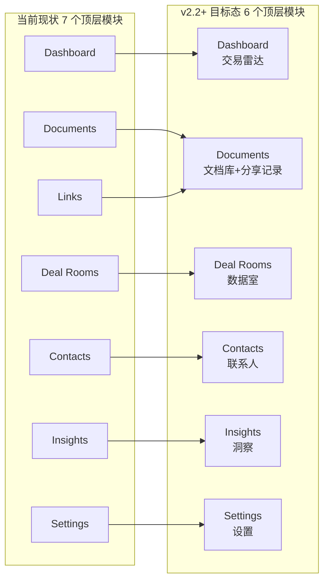

# DealSignal v2.2+ 产品形态与信息架构设计（6 模块目标态）

> **文档类型**：产品设计 / 产品形态定义  
> **版本**：v2.0.0  
> **状态**：目标态方案，待评审  
> **更新日期**：2026-06-29  
> **适用范围**：DealSignal v2.2+ 目标态  
> **关联文档**：`docs/PRD-v2.1.0.md`、`docs/PRODUCT-DESIGN-v2.1.1-REFINED.md`、`docs/上传-查看-AI问答设计文.md`、`docs/database-model-v2.1.0.md`

---

## 1. 设计目标

为 DealSignal v2.2+ 定义以“交易信号运营”为核心的产品形态与信息架构，确保：

1. **用户效率**：高频轻量场景（发 Deck、发 Proposal）不被数据室的重度流程拖慢。
2. **资产统一**：同一份交易材料不会散落在两个独立文档池中，避免重复解析、重复分析和权限黑洞。
3. **场景表达清晰**：文档库、数据室、联系人、洞察四者在界面与心智模型上各司其职，但底层互联互通。
4. **商业化自然**：从个人单文档使用平滑升级到团队/企业级数据室，形成清晰的 upsell 路径。
5. **工程可持续**：一套文档解析、 embedding、Viewer、AI 问答能力同时服务单文档与数据室场景。
6. **信息架构简洁**：顶层导航从 7 个模块收敛到 6 个，降低用户认知负荷。

---

## 2. 核心结论

**DealSignal v2.2+ 采用 6 模块目标态信息架构：`Dashboard / Documents / Deal Rooms / Contacts / Insights / Settings`。**

- **文档库（Documents）是默认且唯一的文档资产来源**；可追踪链接（Links）不再作为独立顶层导航，而是内嵌为文档库的“分享记录”。
- **数据室（Deal Room）是在文档库之上建立的“项目级共享容器”**，通过引用关系组织文档，并叠加文件夹、成员、NDA、审批、Q&A、访问日志等项目级能力。
- **不要完全独立**：独立的文档池会造成重复上传、AI / 分析 / 权限割裂。
- **不要混为一谈**：把所有上传都塞进数据室会拖重 Pitch Deck 这类高频轻量场景，降低激活率。
- **最佳形态**：**底层统一 + 上层场景化**。上传动作可以发生在任何场景，但文件实体首先进入文档库。

---

## 3. 方案对比与决策依据

### 3.1 三种候选方案

| 评估维度 | A. 完全独立（两个文档池） | B. 底层统一 + 上层场景化（推荐） | C. 全部围绕数据室上传 |
|----------|---------------------------|----------------------------------|------------------------|
| **用户激活摩擦** | 中（先选模块） | 低（默认单文档，需要时再组 Room） | 高（每次都要建 Room） |
| **工程成本** | 高（两套解析、存储、Viewer、AI） | 中（一套资产模型 + 集合层） | 中 |
| **资产复用** | 差，同一文件在两个池子各存一份 | 优，Room 只是文档的引用/集合 | 中，文件被 Room 绑定 |
| **AI / 搜索 / 分析一致性** | 差，数据孤岛 | 优，统一解析、embedding、搜索 | 优，但 scope 以 Room 为单位 |
| **版本控制** | 极易分叉 | 文档库是版本源头，Room 可选固定/跟随最新 | 版本被 Room 隔离 |
| **商业化 upsell** | 弱，难以从单文档引导升级 | 强，自然：单文档 → Room → 企业版 | 中，Room 一上来就是付费门槛 |
| **数据安全 / 合规审计** | 需两套审计日志 | 统一审计，暴露面可追踪 | 统一审计 |
| **长期可扩展性** | 差 | 优，可平滑扩展到 Workspace 文件系统 | 中 |
| **导航简洁度** | 中 | 优，6 个顶层模块 | 中 |

### 3.2 决策逻辑

- **排除 A**：DealSignal 的核心差异化在于“基于统一文档资产的 AI 问答、阅读分析和热度评分”。如果文档池独立，同一用户的 Pitch Deck 和 Room 中的财务模型无法共享 embedding、无法合并联系人画像，产品价值会显著下降。
- **排除 C**：创始人发送 Deck 是最高频、最轻的激活路径。如果强制先建 Room，激活流程会被拖重，与产品增长目标冲突。
- **选择 B**：兼顾轻量单文档场景和重度数据室场景，同时保证技术栈统一、数据可聚合、商业化路径自然。
- **Links 降级为 Documents 子视图**：Links 不是独立内容，而是文档的一次“分享实例”。将其从顶层导航移除，可减少内容模块数量，强化“文档库是唯一资产来源”的心智模型。

---

## 4. 用户画像与心智模型

### 4.1 三类核心用户的 JTBD

| 角色 | 主要任务 | 对“上传文档”的期待 | 对“数据室”的期待 |
|------|----------|--------------------|--------------------|
| **融资创始人** | 把 Pitch Deck 发给投资人，识别谁真正感兴趣 | 越轻越好：上传 → 创建链接 → 发送 | 投资人要求补充材料时，把多份资料打包成 Room |
| **投资机构 IR** | 向 LP 分发报告，或组织尽调资料 | 上传季度报告并追踪阅读 | 把尽调清单、财务报表、法律文件按文件夹分发给多个投资人 |
| **B2B 销售 AE** | 发送 Proposal，识别成交信号 | 快速发报价单并追踪 | 复杂项目时把方案、合同、案例打包给决策委员会 |

### 4.2 用户画像与模块使用频率

| 用户画像 | 核心目标 | 主要心智模型 | 高频模块 | 低频/配置型模块 |
|----------|----------|--------------|----------|------------------|
| **融资创始人** | 找到高意向投资人并推进融资 | “我的融资进展怎么样？谁最热？” | Dashboard、Deal Rooms、Contacts | Settings（配置）、Insights（复盘） |
| **投资机构 IR** | 安全分发材料并判断 LP / 投资人兴趣 | “我的 LP 是否看了报告？有没有风险？” | Dashboard、Deal Rooms、Contacts | Documents（素材库）、Settings（配置） |
| **B2B 销售 AE** | 识别成交信号并推进商机 | “这个客户到哪个阶段了？下一步该做什么？” | Dashboard、Documents、Contacts、Insights | Settings（配置） |

### 4.3 关键洞察

- 三类用户都先问“**谁**”和“**怎么样**”，而不是“**文件在哪里**”。
- 单文档分享和数据室是**两种不同的 Job**，但共享同一种“材料”。
- 用户不会说“我要把文档上传到数据室”，而会说“我要把尽调资料整理成一个 Room”。
- 大多数用户从**单文档场景**开始，随着交易深入，自然过渡到**数据室场景**。
- Links 在用户心智中是“**发材料的方式**”，不是“**需要单独管理的对象**”。

---

## 5. 概念模型与数据映射

### 5.1 概念模型：仓库 vs 展厅

> **文档库是仓库，数据室是展厅。所有展品必须先入库，但展厅决定谁来、怎么看、要不要签 NDA。**

| 概念 | 文档库（Documents） | 数据室（Deal Room） |
|------|---------------------|---------------------|
| **本质** | 原子资产库 | 项目级共享容器 |
| **包含内容** | PDF / Office 文档、解析结果、页面、chunks、embedding | 对文档库中文件的引用 + 文件夹结构 + 成员 + 权限 + NDA + Q&A |
| **主要操作** | 上传、解析、版本管理、创建链接、AI 问答 | 创建 Room、邀请成员、审批访问、管理文件夹、查看访问日志 |
| **权限粒度** | 文档级 / 链接级 | Room 级 / 文件夹级 / 成员级 |
| **生命周期** | 文档创建后长期存在，可被多个 Link 和 Room 引用 | 随交易/项目周期存在，可归档 |
| **AI / 分析** | 单文档问答、单文档阅读分析 | 跨文档问答、Room 级活跃度、成员行为聚合 |

### 5.2 数据模型映射

| 产品概念 | 数据表 / 关系 | 说明 |
|----------|---------------|------|
| 文档资产 | `documents` | 唯一真相来源，包含 source_hash、status、版本信息 |
| 文档文件 | `document_files` | 原始文件、渲染后的 PDF、页面 webp 等 |
| 文档页面 / 块 / chunk | `document_pages` / `document_blocks` / `document_chunks` / `chunk_boxes` | 统一解析结果，服务 Viewer 和 AI |
| 可追踪链接 | `links` | 对 `documents` 的一次分享实例；在 UI 中内嵌为“分享记录” |
| 数据室 | `deal_rooms` | 项目级容器，含模板、NDA、审批配置 |
| 数据室包含文档 | `deal_room_documents`（`room_id` + `document_id` + `folder_path`） | Room 对文档库的**引用关系**，非复制关系 |
| 数据室成员 | `room_members` | 成员角色、NDA 确认、审批状态 |
| 访问日志 | `analytics_events` / `access_logs` | 统一记录 Link 访问和 Room 访问，resource_type 区分 document / link / room |

**关键约束**：
- `deal_room_documents` 中不允许存在 `documents` 表里没有的 `document_id`。
- 任何“在数据室中上传文件”的交互，后端必须先完成 `documents` 写入，再完成 `deal_room_documents` 写入，两者在同一事务中提交。

---

## 6. 目标态产品信息架构（6 模块）

### 6.1 顶层导航

| 导航 | 中文名称 | 定位 | 说明 |
|------|----------|------|------|
| **Dashboard** | 交易雷达 | 每日作战室：信号、待办、风险 | 用户登录后的默认首页 |
| **Documents** | 文档库 | 唯一文档资产库 + 分享记录 | Links 从顶层导航移除，内嵌为“分享记录”Tab |
| **Deal Rooms** | 数据室 | 项目级多文档共享容器 | 面向交易/尽调/项目的高级共享 |
| **Contacts** | 联系人 | 以人为中心的互动与跟进枢纽 | 聚合 Link + Room 的所有触点 |
| **Insights** | 洞察 | 跨文档/跨 Room/跨人的分析与建议 | 输出可执行的结论 |
| **Settings** | 设置 | 工作区、品牌、安全、集成 | 配置底座 |

### 6.2 从 7 模块到 6 模块的演进



**演进说明**：
- Links 从顶层导航移除，其功能完全内嵌到 Documents 的“分享记录”中。
- 其余 5 个模块保留并升级，名称不变，以降低品牌、文案、URL 和用户习惯迁移成本。
- 迁移时需保留 `/links` 路由并 301 重定向到 `/documents?tab=shares`，避免已保存书签失效。

### 6.3 各模块升级后的产品功能描述

#### 6.3.1 交易雷达（Dashboard）

**定位**：用户每天打开产品的第一个页面，5 秒内识别今日最关键信号与行动。

**核心功能要求**：
- 首屏仅展示 3 类核心指标：**高热度信号数**、**待办行动数**、**风险提醒数**。
- 信号流按 `hot > risk > warm > cold` 排序，每条信号卡片包含：
  - 信号类型色条；
  - 信号标题与描述；
  - 来源上下文（来自哪个文档/数据室/联系人）；
  - 一个主行动按钮（如“查看详情”、“发送跟进”、“批准访问”）；
  - 可选的“忽略 / 稍后”次级操作。
- 待办行动区：
  - 基于信号自动生成可执行任务，例如“投资人 Sarah 看了价格页 3 次，建议今天跟进”；
  - 支持设置截止时间、完成状态、推迟/忽略。
- 风险提醒区：
  - 异常访问（非白名单邮箱打开、多次转发）；
  - 过期/即将过期链接；
  - 高敏感文件被下载；
  - 数据室待审批访问请求。
- 快捷创建区：常驻“上传文档”、“创建链接”、“创建数据室”三个主操作。
- 最近动态折叠区：最近文档、最近 Room、最近联系人，每项最多展示 3 条。

**与旧 Dashboard 的关键区别**：
- 旧 Dashboard 是“信息聚合板”，新 Dashboard 是“行动指挥中心”。
- 每个信号必须带一个主行动，不允许纯展示型卡片。

#### 6.3.2 文档库（Documents / Library）

**定位**：所有文档资产的唯一来源，以及这些文档所有分享记录的集中管理地。

**核心功能要求**：
- 文档列表支持以下视图：
  - 全部文档；
  - 最近访问；
  - 高热度文档；
  - 未共享文档；
  - 已归档文档。
- 每个文档卡片必须展示：
  - 文档标题与类型图标；
  - 热度徽章（hot/warm/cold）；
  - 生效中的 Link 数量；
  - 已加入的 Room 数量；
  - 最近访问时间。
- 文档详情页结构：
  - 页头：文档名 + 元信息 + 主操作（创建链接 / 升级为数据室 / 加入数据室）；
  - **暴露面板**：常驻于页头下方，展示所有生效 Link 和已加入 Room；
  - Tabs：
    - **总览**：关键信号 + 最近动作；
    - **内容**：页面缩略图 + heat bar；
    - **数据**：页面级分析图表；
    - **AI 洞察**：证据驱动的洞察；
    - **分享记录**：该文档的所有 Link 列表，支持创建/撤销/复制/批量操作。
- 全局搜索：
  - 搜索范围覆盖文档标题、Room 名称、联系人邮箱/姓名；
  - 搜索结果按类型分组，并展示最近互动时间。
- 版本管理：
  - 文档详情页提供版本历史列表；
  - 支持替换为新版本、回滚到旧版本、锁定当前 Room 使用的版本。

**与 Links 的整合方式**：
- Links 不再作为独立一级导航存在。
- 原 Links 列表页的功能迁移到文档库的“分享记录”Tab 和全局筛选器中。
- 在文档库列表行操作中，点击“分享”直接创建 Link，无需跳转。

#### 6.3.3 数据室（Deal Rooms）

**定位**：面向特定交易、项目或人群的“多文档共享容器”，强调受控、合规、可审计。在当前阶段，**数据室即交易容器**，不再额外引入 Pipeline/Opportunities 层级。

**核心功能要求**：
- Room 列表页卡片必须展示：
  - 模板标签；
  - Room 名称与描述；
  - 最近信号（如“投资人 A 刚刚访问”）；
  - 待审批数；
  - 最后访问时间。
- Room 详情页首屏：
  - 最近访问者列表；
  - Room 热度评分；
  - 待审批访问请求；
  - AI 建议的下一步行动。
- Room 文件区：
  - 文件夹 tree 展示 Room 中的文档；
  - 每个文件显示“来自文档库”标识；
  - 支持从文档库选择已有文件加入 Room；
  - 支持在 Room 内直接上传新文件（上传后自动进入文档库）。
- Room 成员区：
  - 展示成员角色、NDA 状态、最近访问时间；
  - 成员卡片可直接跳转联系人详情；
  - 支持按文件夹设置细粒度权限。
- Room Q&A：
  - 接收方可针对 Room 或具体文件提问；
  - Owner/Admin 可回复，AI 可基于 Room 内文件自动生成回复建议。
- Room 访问日志：
  - 记录每次访问的时间、IP、邮箱、浏览页数、下载行为；
  - 支持按成员/日期/文件筛选；
  - 日志不可删除，仅支持归档。

**与文档库的关系**：
- Room 中的文件都是文档库中文档的引用；Room 不拥有文件。
- 在 Room 内上传文件时，系统必须先写入文档库，再建立引用关系。

#### 6.3.4 联系人（Contacts）

**定位**：以人为中心的互动与跟进枢纽，回答“谁在看我的材料、热不热、下一步该做什么”。

**核心功能要求**：
- 联系人列表页：
  - 头像/首字母、姓名、邮箱、所属机构；
  - 热度分与热度徽章；
  - 最近互动时间；
  - 关联的文档/Room 数量；
  - Quick filter：“只看 hot”。
- 联系人详情页：
  - **Overview**：热度趋势、关键指标、最近 3-5 条活动、最新备注、AI 建议；
  - **活动时间线**：合并 Link 访问、Room 访问、邮件通知打开、Q&A 行为；
  - **浏览文档**：展示该联系人访问过的所有文档和 Room；
  - **备注与跟进**：支持添加备注、设置下次跟进时间、标记跟进状态；
  - **操作**：发送邮件、创建专属 Link、邀请到 Room。
- 机构/基金聚合：
  - 支持将多个联系人聚合到同一机构（如某 VC 的多个合伙人）；
  - 机构视图展示该机构下所有联系人的整体热度。
- 与 Dashboard 的联动：
  - 当某个联系人热度上升时，Dashboard 生成信号并推荐行动；
  - 用户可直接从 Dashboard 跳转到联系人详情。

**与旧 Contacts 的关键区别**：
- 旧 Contacts 是邮箱列表，新 Contacts 是“互动中心”。
- 每个联系人的所有触点（Link + Room）必须合并展示。

#### 6.3.5 洞察（Insights）

**定位**：跨文档、跨 Room、跨联系人的综合分析与建议中心，输出可执行的结论。

**核心功能要求**：
- 三类核心视图：
  - **内容表现**：哪些文档/页面被看得最多、停留最久、反复访问；
  - **人群表现**：哪些联系人/机构最活跃、热度趋势如何；
  - **交易漏斗**：从 Link 访问 → Room 访问 → Q&A → 跟进 → 转化的漏斗分析。
- AI 洞察卡片：
  - 每条洞察必须包含：结论、证据片段、样本量、置信度、建议行动；
  - 支持用户一键创建待办或发送跟进。
- 报告生成（v2.2+ 能力）：
  - 支持生成周度/月度 Engagement Report（PDF 格式）；
  - 报告可分享给团队或上级。
- 简报推送：
  - 每周一自动推送“本周最热信号简报”到用户邮箱；
  - 简报内容包括：Top 3 热信号、Top 3 活跃联系人、待办提醒。
- 与 Dashboard 的边界：
  - Dashboard 回答“**今天**我要做什么”；
  - Insights 回答“**这段时间**我的材料/人/交易表现如何”。

#### 6.3.6 设置（Settings）

**定位**：工作区、账户、品牌、安全、集成的配置中心。

**核心功能要求**：
- 工作区管理：
  - 切换工作区、创建工作区、邀请成员；
  - Workspace 角色：Owner、Admin、Member。
- 品牌化设置：
  - 自定义域名、Logo、主题色、分享页品牌文案；
  - 品牌化同时影响 Link 分享页和 Room 访问页。
- 安全与合规：
  - 全局水印策略；
  - 默认密码/过期策略；
  - NDA 模板管理；
  - 访问日志保留期配置。
- 通知与集成：
  - 邮件通知开关；
  - Slack / CRM 集成配置；
  - 每周简报开关。
- 语言与地区：
  - 支持 en / zh-CN；
  - 时间格式、时区设置。

### 6.4 跨模块统一设计原则

1. **统一搜索**：全局搜索同时返回文档、Room、联系人，结果按相关性和最近互动排序。
2. **统一联系人画像**：任何模块中看到联系人卡片，热度分和最近行为一致。
3. **统一行动按钮**：每个信号、洞察、提醒都必须带一个主行动，避免纯信息展示。
4. **统一空态**：无数据时给出明确原因和下一步行动，禁止伪造数据或占位图表。
5. **统一热度语言**：全站使用 `hot / warm / cold / risk` 四档热度语言，不混用其他表述。
6. **统一暴露面展示**：任何文档/ Room 的共享范围必须在详情页首屏可见。

---

## 7. 关键产品设计决策

### 7.1 文档是原子资产，Room 是引用关系

- 数据室不“拥有”文件，只“引用”文件（对应数据模型中的 `deal_room_documents` 关联表）。
- 同一份 Pitch Deck 可以同时出现在多个 Link 和多个 Room 中。
- 文档库是唯一的版本与解析真相来源。

### 7.2 版本策略：默认跟随最新，Room 可锁定版本

| 场景 | 行为 |
|------|------|
| 文档库更新文件 | 默认情况下，所有引用该文件的 Room 展示最新版 |
| Room owner 需要固定版本 | 可显式“锁定当前版本”，避免尽调过程中材料被替换 |
| 历史版本 | 保留旧版本，便于审计与回溯 |

### 7.3 删除/归档/替换生命周期决策

#### 7.3.1 文档库中更新文件

```text
文档库中更新文件
├── 未被任何 Room 锁定版本
│   └── 所有 Room 自动展示最新版
├── 某 Room 已锁定版本
│   └── 该 Room 保持锁定版本，其他 Room 跟随最新版
└── 历史版本
    └── 保留，便于审计与回滚
```

#### 7.3.2 文档库中删除文件

```text
文档库中删除文件
├── 文件未被任何 Link / Room 引用
│   └── 允许硬删除
├── 文件被 Link / Room 引用
│   ├── 默认行为：归档
│   │   └── 文件从文档库列表隐藏，但已发出去的 Link / Room 仍可访问
│   └── 可选行为：先从所有引用中移除，再删除
│       └── 需二次确认，并通知相关 Room owner
└── 历史版本保留策略：保留 90 天
```

#### 7.3.3 从 Room 中移除文档

- 从 Room 中移除文档不会删除文档库中的文件。
- 若该文档仅被当前 Room 引用且无生效 Link，文档在文档库中继续保留，但暴露面中不再显示该 Room。
- 若文档被多个 Room 引用，仅从当前 Room 的 `deal_room_documents` 中删除引用。

### 7.4 暴露面透明化

在文档详情页必须展示暴露面板：

```text
共享暴露面
├── 公开链接（1）
│   └── 创建于 2026-06-20 · 已查看 12 次 · [撤销]
├── 受限链接（2）
│   ├── 投资人尽调链接 · [管理]
│   └── LP 报告链接 · [管理]
└── 数据室（1）
    └── Series A Due Diligence · [查看数据室] [从 Room 移除]
```

**功能要求**：
- 暴露面板常驻于文档详情页页头下方，不折叠到 Tab 中。
- 每个 Link / Room 项展示创建时间、查看次数、最近访问时间。
- 支持单条撤销 Link、批量撤销所有公开 Link、从指定 Room 中移除文档。
- 当暴露面为空时，显示“此文档尚未共享”空态，并引导创建链接或加入 Room。

### 7.5 AI / 搜索 / 分析的跨场景统一

因为底层文档资产统一，AI 问答可以灵活切换 scope：

- **当前文档**：在单文档 Viewer 中提问，AI 基于当前文档回答。
- **当前数据室**：在 Room 内提问，AI 基于 Room 内所有可见文档回答。
- **整个工作区文档库**：在全局 Insights 或搜索中提问，基于 workspace 内所有用户有权限的文档回答（企业级能力）。

热度评分、联系人画像、访问分析也必须合并来自 Link 和 Room 的所有触点。

---

## 8. 权限与共享模型

### 8.1 两层权限并存

| 权限类型 | 控制范围 | 说明 |
|----------|----------|------|
| **文档级 Link 权限** | 谁可以通过这个 Link 看这份文档 | 内嵌于文档库，适合快速单文档分享 |
| **Room 级权限** | 谁可以进入 Room，以及能看到哪些文件夹 | 适合项目级、批量、受控分发 |

### 8.2 权限冲突决策矩阵

| 场景 | 产品规则 | 用户-facing 说明 |
|------|----------|------------------|
| 文档已通过 Link 公开分享，又被加入 Room | Link 仍然有效；Room 成员按 Room 权限访问 | “此文档已通过 1 个公开链接共享，加入数据室不会自动撤销该链接。” |
| 用户被移出 Room，但曾收到 Link | 仍可访问 Link（除非 Link 单独被撤销） | “您已被移出该数据室，但文档所有者发送给您的链接仍可访问。” |
| Room 内文件夹权限限制某成员访问某文件夹 | 该成员在 Room 内看不到该文件夹；不影响其通过 Link 看完整文档 | “该成员无法在此数据室中查看‘财务’文件夹。” |
| 文档 Owner 在文档库中撤销 Link | 所有通过该 Link 的访问失效，Room 成员不受影响 | “公开链接已撤销，数据室成员仍可正常访问。” |
| Room 被归档或删除 | Room 成员无法再访问 Room；但通过 Link 的访问仍然有效 | “该数据室已归档，但此前发送的链接仍可访问。” |
| Link 设置了过期时间 | 过期后 Link 访问失效；Room 成员访问不受影响 | “此链接已过期，数据室成员仍可通过 Room 访问。” |

### 8.3 角色设计

#### 文档库角色

- **Owner**：文档上传者，可管理版本、创建 Link、加入 Room、删除/归档。
- **Workspace Admin**：可管理 workspace 内所有文档。

#### 数据室角色

- **Owner**：Room 创建者，可管理成员、文件夹、权限、审批。
- **Admin**：可协助管理 Room，包括添加/移除成员、管理文件夹。
- **Contributor**：可上传/替换文件（文件进入文档库并加入 Room），但不能管理成员或权限。
- **Viewer**：只读访问。
- **Pending**：申请中，尚未获得访问权限。

### 8.4 权限校验优先级

1. 用户通过 Link 访问文档时，只校验 Link 本身的权限（白名单、密码、过期、下载控制、水印）。
2. 用户通过 Room 访问文档时，先校验 Room 成员身份和 NDA 确认状态，再校验文件夹级权限。
3. Link 权限与 Room 权限互不影响；任何权限变更必须通过暴露面板明确告知用户。

---

## 9. 场景化用户流程

### 9.1 上传入口：场景化但归宿统一

| 入口 | 用户意图 | 系统行为 |
|------|----------|----------|
| 全局“上传文档”按钮 | 先存文件，再决定怎么用 | 文件进入文档库 |
| 文档库页“上传” | 归档/管理文件 | 文件进入文档库 |
| 文档库行操作“创建链接” | 分享单文档 | 文件已在文档库，直接生成 Link |
| 数据室详情页“上传文件” | 补充 Room 资料 | 文件进入文档库，**同时自动加入当前 Room 的当前文件夹** |
| 数据室创建向导“选择/上传文档” | 批量建 Room | 文件先进文档库，再被选中加入 Room |

**原则：上传动作可以发生在任何场景，但文件实体首先进入文档库。**

### 9.2 典型用户旅程

#### 旅程 A：创始人发 Deck（轻量路径）

```text
登录 Dashboard
    ↓
上传 PDF pitch deck（进入文档库）
    ↓
在文档库中创建智能链接（邮箱验证 + 动态水印 + 可下载）
    ↓
发送给投资人
    ↓
在 Dashboard 查看阅读热度与 AI 洞察
```

#### 旅程 B：创始人升级到数据室（项目路径）

```text
投资人看完 Deck 后要求补充材料
    ↓
创始人从文档详情页点击“升级为数据室”
    ↓
选择模板（如 Series A Due Diligence）
    ↓
从文档库选择/上传补充文件，建立文件夹结构
    ↓
邀请投资人进入 Room
    ↓
管理访问审批、查看 Room 级活跃度、回答 Q&A
```

#### 旅程 C：IR 直接创建数据室（重度路径）

```text
登录 Dashboard
    ↓
创建数据室，选择 LP Update 模板
    ↓
在向导中上传/选择季度报告、财务报表等文件
    ↓
设置成员权限与 NDA
    ↓
发送 Room 邀请给 LP
    ↓
追踪 Room 访问日志与成员参与度
```

---

## 10. 商业化路径

| 计划 | 包含能力 | Upsell 路径 |
|------|----------|-------------|
| **免费 / 个人计划** | 单文档上传、基础 Link、单文档阅读分析、基础 AI 问答 | — |
| **创始人 / 专业计划** | 更多 Link、高级权限（水印、密码、过期）、AI 洞察 | 文档详情页“升级为数据室” |
| **团队 / 企业计划** | 数据室、文件夹权限、成员管理、NDA、审批、Q&A、访问日志、Workspace 管理 | 数据室创建向导、Dashboard 信号提示 |

**核心转化点**：当用户在文档详情页看到“投资人已多次查看，建议升级为数据室补充材料”时，提供一键升级入口。

**转化触发条件（可配置）**：
- 独立访客数 ≥ 2
- 平均停留时长 ≥ 30 秒
- 最近 7 天内有重复访问

---

## 11. 风险与缓解

| 风险 | 后果 | 缓解方式 |
|------|------|----------|
| Room 里的上传文件不在文档库显示 | 用户找不到源文件，AI 搜索遗漏 | 强制所有文件入库，Room 只是视图 |
| 文档删除后 Room 里变成死链 | 尽调资料突然缺失，信任崩塌 | 默认归档，删除前校验引用 |
| Link 权限与 Room 权限互相矛盾 | 用户以为撤了 Room 就安全了，其实 Link 还在 | 文档详情页统一展示“暴露面” |
| Room 被当成内部文件夹滥用 | 内部文件管理也建 Room，导致权限混乱 | 明确 Room 定位为“对外共享容器”；文档库后续可补内部文件夹功能 |
| 数据室创建步骤太重 | 创始人只想发 Deck，却被迫建 Room | 保留单文档 Link 的快速路径 |
| 用户对“仓库 vs 展厅”模型不理解 | 两个模块用法混乱 | onboarding 中通过模板和示例强化心智模型 |
| Links 从顶层导航移除导致老用户不适应 | 已保存书签失效、操作路径改变 | 保留 `/links` 路由 301 重定向到 `/documents?tab=shares`；首次登录弹窗提示 |

---

## 12. 验收指标与验证计划

### 12.1 产品指标

| 指标 | 目标 | 来源 / 校准方式 |
|------|------|-----------------|
| 单文档 Link → 数据室的转化率 | ≥ 15% | 引用 PRD H-04（数据室创建用户升级率 ≥ 15%）；上线 14 天后根据实际 baseline 调整 |
| 数据室中“从文档库选择已有文件”的比例 | ≥ 60% | 基于“统一资产模型”假设；若低于 40% 需重新审视上传路径 |
| 同一文件在 Link + Room 中的复用率 | ≥ 30% | 验证资产复用价值；低于 15% 说明用户未理解统一库模型 |
| 数据室创建成功率 | ≥ 80% | 可用性测试目标；低于 70% 需简化创建向导 |
| 文档删除/归档引发的客诉率 | < 1% | 验证删除策略是否安全 |
| 权限相关客诉率 | < 5% | 验证权限冲突决策矩阵是否被用户理解 |
| Links 移除顶层导航后的用户投诉率 | < 3% | 验证迁移策略是否平滑 |

### 12.2 可用性验证

- 邀请 5-8 名目标用户完成“发 Deck”和“建数据室”两个任务。
- 观察他们是否理解：
  - 上传后的文件在哪里找。
  - 数据室里的文件和文档库里的文件是什么关系。
  - 如何管理文档的共享暴露面。
  - Links 在哪里创建和管理。
- 根据反馈调整文案、引导、信息架构。

---

## 13. 设计假设与验证方法

| 设计决策 | 设计假设 | 验证方法 | 失败信号 |
|----------|----------|----------|----------|
| 所有文件先入库 | 用户能接受“数据室里的文件也在文档库” | 观察 Room 中选择已有文件的比例 | < 40% |
| 权限不互相覆盖 | 用户能区分 Link 和 Room 两种共享路径 | 可用性测试 + 权限相关客诉率 | 权限客诉 > 5% |
| 默认跟随最新版本 | 用户希望 Room 中的材料保持最新 | Room 中版本锁定功能使用率 | 锁定率 > 50% 说明默认策略需调整 |
| “升级为数据室”按钮 | 单文档热度高时用户愿意升级 | Link → Room 转化率 | < 5% |
| 暴露面板常驻 | 用户会主动管理共享暴露面 | 暴露面板点击率 + 撤销操作数 | 点击率 < 10% 说明位置或文案需优化 |
| Links 降级为子视图 | 用户能在文档库内找到并管理 Link | 分享记录 Tab 使用率 | < 40% |

---

## 14. 不做清单（Non-Goals）

本设计文档明确不解决以下问题，避免范围蔓延：

1. **文档库内部文件夹**：本期文档库不支持文件夹，避免与 Room 的文件夹概念混淆。未来根据用户反馈独立评估。
2. **Room 内文档协同编辑**：Room 中的文档为只读分享，不支持多人同时编辑。
3. **Room 内“仅 Room 可见”的隐藏文件**：违反统一资产原则，本期不支持。
4. **数据室作为独立 SKU 售卖**：数据室是平台能力的一部分，不是独立产品。
5. **法律级 DRM 保护**：超出本次范围，企业版可后续评估。
6. **Markdown / CSV 文档支持**：与 PRD 范围保持一致，不支持。
7. **交易 Pipeline / Opportunities 层级**：当前用 Deal Room 作为交易粒度容器，本期不引入更高层级的 Pipeline。

---

## 15. 后续待决策事项

1. **文档库是否支持内部文件夹？** 当前建议先不支持，避免与 Room 的文件夹概念混淆；后续根据用户反馈决定。
2. **Room 内文档是否支持“仅 Room 内可见”？** 如果支持，会模糊“仓库”边界，需要谨慎评估。
3. **Link 和 Room 的访问日志是否合并展示？** 推荐在联系人详情页合并，在文档详情页分开。
4. **免费用户是否能创建数据室？** 建议限制数量（如 1 个）或仅专业版可用，以保证转化。
5. **Room 封面、NDA 模板是否纳入文档库？** 需在产品实现前明确数据模型标记规则。
6. **Insights PDF 报告生成的技术方案**：若需支持，需单独评估 PDF 渲染与存储成本。

---

## 16. 下一步与责任人

| 事项 | 责任人 | 交付物 | 截止时间 |
|------|--------|--------|----------|
| 移除 Links 顶层导航，新增 Documents“分享记录”Tab | 前端负责人 | 技术方案 + UI 稿 + 实现 | T+10 |
| 保留 `/links` 路由并 301 重定向 | 后端负责人 | API 变更 + 重定向配置 | T+5 |
| 确认 Room 上传统一写 documents 表 | 后端负责人 | 代码走查报告 | T+2 |
| 设计文档详情页“暴露面”组件 | 设计负责人 | UI 稿 + 文案 | T+5 |
| 设计“升级为数据室”入口与创建向导预填充逻辑 | 产品负责人 + 设计负责人 | PRD 补充稿 + UI 稿 | T+5 |
| 制定权限冲突决策矩阵的测试用例 | QA 负责人 | 测试用例集 | T+7 |
| Dashboard 信号流合并 Link 与 Room 访问 | 前端负责人 | 技术方案 + 实现 | T+10 |
| 联系人画像合并 Link 与 Room 互动 | 后端负责人 | API 变更 + 实现 | T+10 |
| 5-8 人可用性测试 | 产品负责人 | 测试报告 | T+21 |

---

## 17. 总结

**DealSignal v2.2+ 采用 6 模块目标态信息架构：`Dashboard / Documents / Deal Rooms / Contacts / Insights / Settings`。**

- **文档库**是默认且唯一的文档资产来源。
- **可追踪链接（Links）**从顶层导航移除，内嵌为文档库的“分享记录”。
- **数据室**是面向交易场景的高级共享容器，与文档库通过引用关系连接。
- **联系人**是互动中心，必须合并 Link 与 Room 的所有触点。
- **洞察**是分析与建议中心，每条结论都必须可执行。
- **设置**是品牌、安全、集成的配置底座。

本设计文档定义了目标态的产品形态、信息架构、数据模型约束、权限规则、生命周期决策、商业化路径、验证指标和落地责任，可直接进入技术评审与排期阶段。
