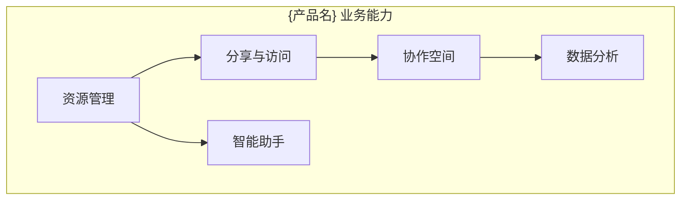
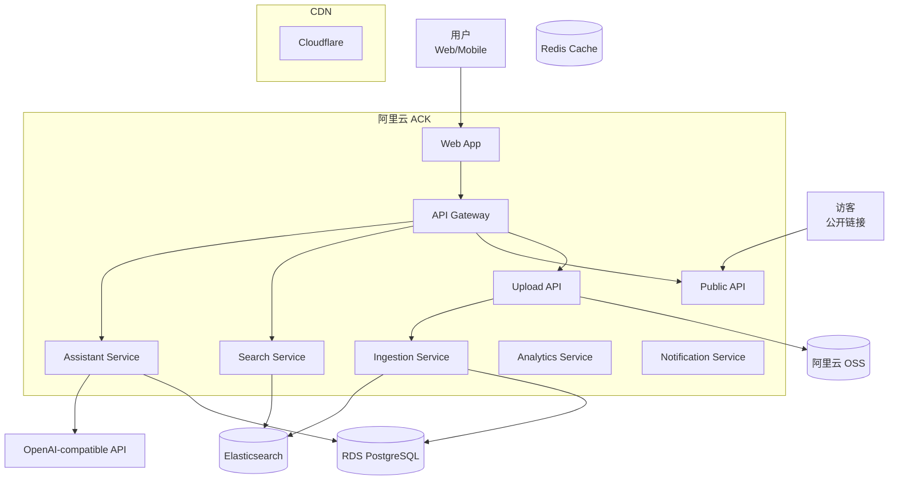
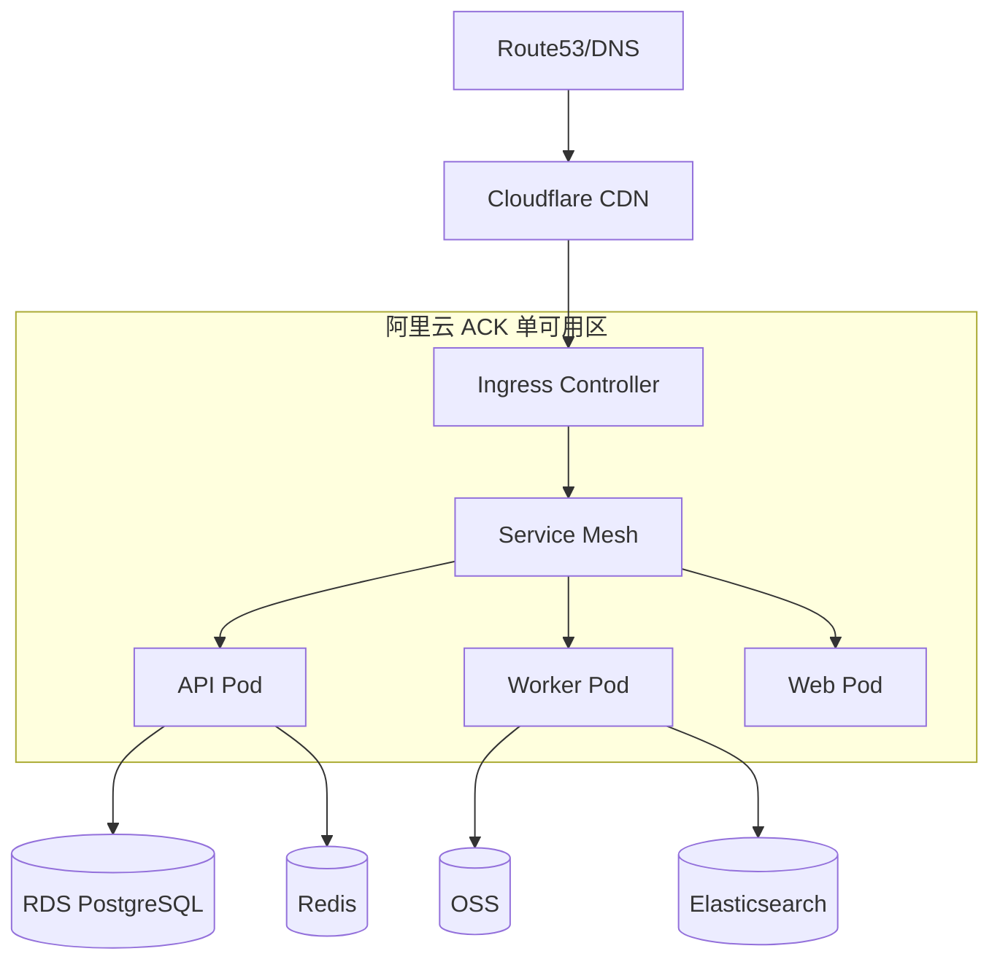
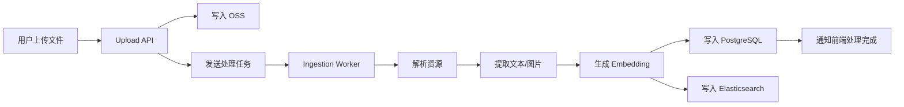
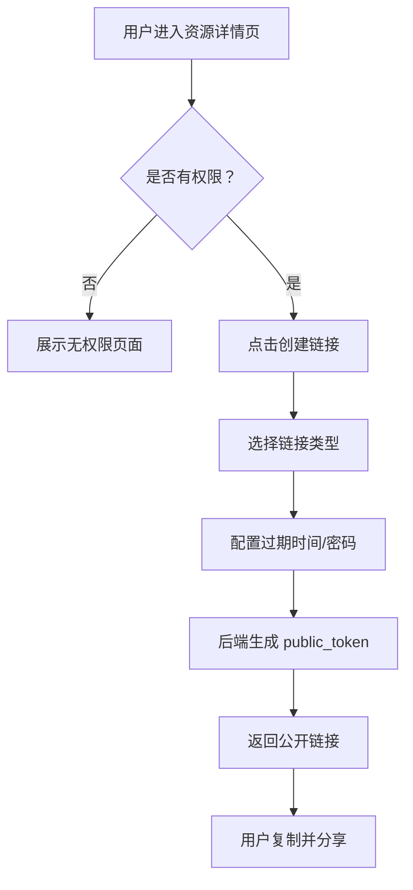
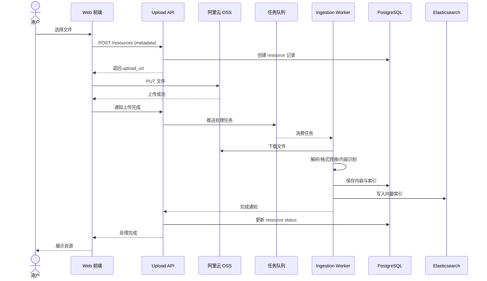
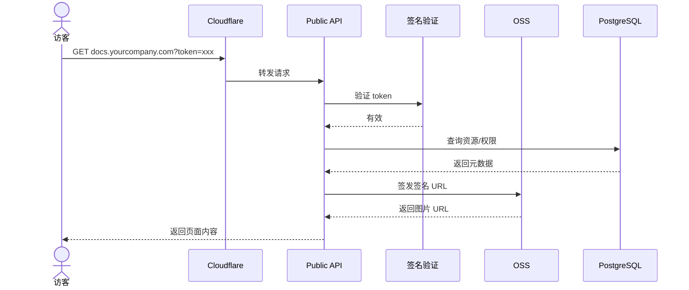
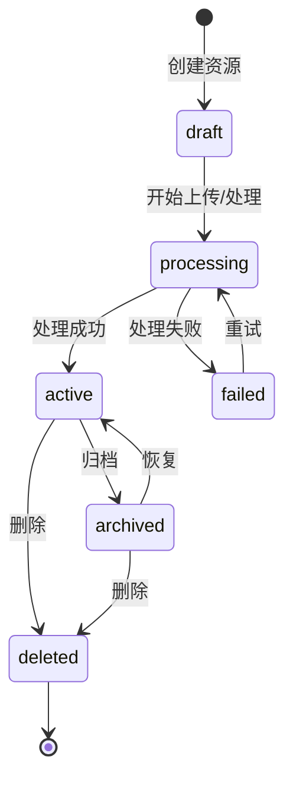
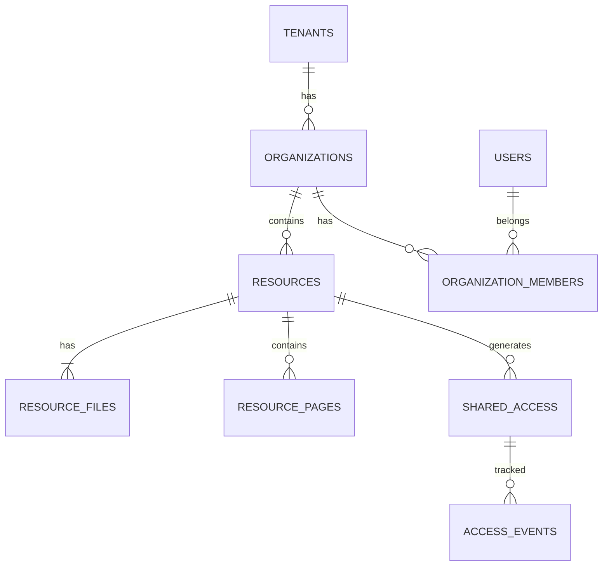

# 架构与流程图资源模板 v1

> **资源编号**：`ARC-YYYY-NNN`  
> **版本**：`{vX.Y.Z}`  
> **模板版本**：`v1`  
> **状态**：`{草稿 / 评审中 / 已批准 / 已归档}`  
> **编写人/适用对象**：`架构师 / 技术负责人 / 高级开发工程师`  
> **编写日期**：`{YYYY-MM-DD}`  
> **关联资源**：  
> - `docs/PRD-vX.Y.Z.md`  
> - `docs/TDD-vX.Y.Z.md`  
> - `docs/templates/TDD-template-v2.md`  
> - `docs/templates/TECH-REVIEW-CHECKLIST-template-v1.md`  
> **评审人**：`CTO、架构师、后端负责人、前端负责人、产品经理、QA 负责人`  
> **渲染工具**：`Mermaid / PlantUML / Draw.io / Excalidraw`

---

## 0. 资源使用说明

本资源是 `{产品名}` 的**架构与流程图统一交付资源**，独立于 PRD 和 TDD，用于集中承载所有帮助开发工程师理解系统、快速进入编码的图表。

**为什么独立成册**：
- PRD 聚焦"做什么"，TDD 聚焦"怎么做"。二者篇幅已经较大，嵌入大量图表会显著降低可读性。
- 图表具有独立演进特征：架构随迭代调整，但需求文字可能不变。
- 开发工程师在编码前通常需要快速浏览"一张大图 + 若干核心流程图"，独立资源便于检索。
- 图表源文件（Mermaid/PlantUML/Draw.io）需要版本控制，独立资源便于管理。

**本资源与 PRD/TDD 的关系**：
- **PRD**：引用本资源中与其功能需求对应的业务流程图、用户旅程图。
- **TDD**：引用本资源中的系统架构图、部署架构图、数据流图、时序图、状态图、ER 图。
- **本资源**：作为"活地图"，随技术实现持续更新。

**目标读者**：
- 新加入的开发工程师（快速 onboarding）
- 后端/前端/测试工程师（编码与用例设计）
- 架构师、Tech Lead（评审与演进）
- 产品经理、运营（理解系统能力边界）

---

## 1. 资源控制信息

### 1.1 变更日志

| 版本 | 日期 | 修改人 | 修改内容 | 影响范围 |
|------|------|--------|----------|----------|
| v0.1.0 | YYYY-MM-DD | {编写人} | 初始版本 | 全资源 |

### 1.2 图表资产清单

| 图表 | 类型 | 工具 | 源文件 | 链接 |
|------|------|------|--------|------|
| 系统架构图 | C4 Container | Mermaid | `{path}` | {链接} |
| 业务流程图 | Flowchart | Mermaid | `{path}` | {链接} |
| 上传时序图 | Sequence | Mermaid | `{path}` | {链接} |
| ERD | ER Diagram | Mermaid | `{path}` | {链接} |

---

## 2. 图表分类与用途

| 图表类型 | 回答的问题 | 主要读者 | 推荐位置 |
|----------|------------|----------|----------|
| 业务架构图 | 系统支撑哪些业务能力？ | 产品、业务、架构 | 本资源第 3 章 |
| 系统架构图（C4 Container） | 有哪些服务/应用？如何交互？ | 开发、测试、运维 | 本资源第 4 章 |
| 部署架构图 | 服务部署在哪里？如何扩展？ | 运维、SRE、架构 | 本资源第 5 章 |
| 数据流图 | 数据从哪里来？到哪里去？ | 开发、数据、安全 | 本资源第 6 章 |
| 业务流程图 | 用户/系统如何完成一件事？ | 产品、开发、测试 | 本资源第 7 章 |
| 时序图 | 多个组件按什么顺序交互？ | 开发（编码直接参考） | 本资源第 8 章 |
| 状态图 | 实体有哪些状态？如何流转？ | 开发、测试 | 本资源第 9 章 |
| ERD | 有哪些表？关系是什么？ | 后端、DBA、数据 | 本资源第 10 章 |

---

## 3. 业务架构图

### 3.1 图：业务领域划分



### 3.2 说明

| 属性 | 内容 |
|------|------|
| 用途 | {说明该图表达的业务能力边界} |
| 读者 | 产品、业务、架构师 |
| 更新频率 | 每个大版本 |
| 对应 PRD | {PRD 章节} |

---

## 4. 系统架构图

### 4.1 图：C4 Container 级别系统架构



### 4.2 组件说明

| 组件 | 技术栈 | 职责 | 对应 TDD 章节 |
|------|--------|------|---------------|
| {组件} | {技术} | {职责} | {章节} |

### 4.3 说明

| 属性 | 内容 |
|------|------|
| 用途 | {说明该图表达的架构层次} |
| 读者 | 开发、测试、运维 |
| 更新频率 | 每次架构变更 |
| 对应 TDD | {TDD 章节} |

---

## 5. 部署架构图

### 5.1 图：生产环境部署拓扑



### 5.2 说明

| 属性 | 内容 |
|------|------|
| 用途 | {说明部署拓扑、高可用策略} |
| 读者 | 运维、SRE、架构 |
| 更新频率 | 每次基础设施变更 |
| 对应 TDD | {TDD 部署章节} |

---

## 6. 数据流图

### 6.1 图：资源上传与处理数据流



### 6.2 数据流说明

| 步骤 | 数据 | 来源 | 去向 | 存储/处理 |
|------|------|------|------|-----------|
| 1 | 原始文件 | 用户 | Upload API | OSS |
| 2 | 处理任务 | Upload API | 任务队列 | Go channel |
| 3 | 解析结果 | Ingestion Worker | PostgreSQL | 持久化 |
| 4 | 向量索引 | Ingestion Worker | Elasticsearch | 检索 |

---

## 7. 业务流程图

### 7.1 图：创建公开共享链接



### 7.2 业务规则

| 规则编号 | 规则 | 对应 PRD |
|----------|------|----------|
| BR-01 | {规则} | FR-XX |
| BR-02 | {规则} | FR-XX |

---

## 8. 时序图

### 8.1 图：资源上传完整时序



### 8.2 时序图使用说明

| 属性 | 内容 |
|------|------|
| 用途 | {说明该时序图对编码的直接指导} |
| 涉及服务 | {列出} |
| 关键数据 | {列出} |
| 异常分支 | {列出} |
| 对应 TDD | {TDD 章节} |
| 对应 API | {API 编号} |

### 8.3 图：公开链接访问时序



---

## 9. 状态图

### 9.1 图：资源生命周期状态



### 9.2 状态说明

| 状态 | 说明 | 可执行操作 | 对应事件 |
|------|------|------------|----------|
| draft | 草稿 | 上传、删除 | resource_created |
| processing | 处理中 | 查询进度 | resource_processing |
| active | 可用 | 查看、分享、归档 | resource_processed |
| failed | 处理失败 | 重试、删除 | resource_processing_failed |
| archived | 已归档 | 恢复、删除 | resource_archived |
| deleted | 已删除 | - | resource_deleted |

---

## 10. 实体关系图（ERD）

### 10.1 图：核心数据模型



### 10.2 说明

| 属性 | 内容 |
|------|------|
| 用途 | {说明 ERD 对数据模型设计的指导} |
| 读者 | 后端、DBA、数据 |
| 详细 DDL | 参见 `docs/TDD-vX.Y.Z.md` 或 `docs/templates/DATABASE-MODEL-template-v1.md` |

---

## 11. 图表管理规范

### 11.1 命名规范

| 图表 | 命名 | 示例 |
|------|------|------|
| 系统架构图 | `system-architecture-v{N}` | `system-architecture-v1` |
| 业务流程图 | `{process}-flow-v{N}` | `resource-upload-flow-v1` |
| 时序图 | `{process}-sequence-v{N}` | `public-link-access-sequence-v1` |
| 状态图 | `{entity}-state-v{N}` | `resource-state-v1` |
| ERD | `core-erd-v{N}` | `core-erd-v1` |

### 11.2 版本管理

- 图表与代码一同版本控制。
- 源文件使用 Mermaid/PlantUML 等文本格式，便于 diff。
- 大版本变更（如服务拆分）升级主版本号。
- 小调整（如新增字段）升级次版本号。

### 11.3 维护责任

| 图表类型 | 维护责任人 | 触发更新条件 |
|----------|------------|--------------|
| 业务架构图 | 产品负责人/架构师 | 业务领域调整 |
| 系统架构图 | 架构师 | 服务拆分/合并/引入新组件 |
| 部署架构图 | SRE/运维负责人 | 基础设施变更 |
| 数据流图 | 数据工程师/后端负责人 | 数据处理链路变更 |
| 业务流程图 | 产品经理 | 业务流程变更 |
| 时序图 | 后端负责人 | 接口交互变更 |
| 状态图 | 后端负责人 | 实体状态变更 |
| ERD | 后端负责人/DBA | 表结构变更 |

### 11.4 与 PRD/TDD 的引用方式

在 PRD 中：
```markdown
- 业务流程详见 [docs/ARCHITECTURE-vX.Y.Z.md#7-业务流程图](ARCHITECTURE-vX.Y.Z.md)。
```

在 TDD 中：
```markdown
- 系统架构详见 [docs/ARCHITECTURE-vX.Y.Z.md#4-系统架构图](ARCHITECTURE-vX.Y.Z.md)。
- 时序图详见 [docs/ARCHITECTURE-vX.Y.Z.md#8-时序图](ARCHITECTURE-vX.Y.Z.md)。
```

---

## 12. 检查清单

- [ ] 所有核心业务流程都有流程图
- [ ] 所有关键接口交互都有时序图
- [ ] 所有核心实体都有状态图
- [ ] 系统架构图覆盖所有服务/组件
- [ ] 部署架构图与生产环境一致
- [ ] 数据流图覆盖 P0 数据链路
- [ ] ERD 与数据库模型一致
- [ ] 图表源文件已纳入版本控制
- [ ] PRD 中引用了对应的业务流程图
- [ ] TDD 中引用了对应的架构/时序/状态图
- [ ] 图表版本号与资源版本号一致
- [ ] 图表有明确维护责任人
