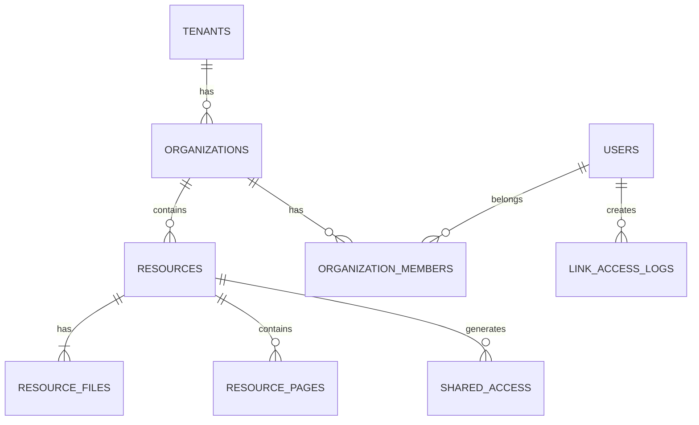

# 数据库模型资源模板 v1

> **资源编号**：`DBM-YYYY-NNN`  
> **版本**：`{vX.Y.Z}`  
> **模板版本**：`v1`  
> **状态**：`{草稿 / 评审中 / 已批准 / 已归档}`  
> **编写人/适用对象**：`后端架构师 / 数据工程师`  
> **编写日期**：`{YYYY-MM-DD}`  
> **关联资源**：  
> - `docs/TDD-vX.Y.Z.md`  
> - `docs/PRD-vX.Y.Z.md`  
> - `docs/templates/API-SPEC-template-v1.md`  
> - `docs/templates/EVENT-TRACKING-template-v1.md`  
> **评审人**：`CTO、后端负责人、DBA、安全负责人`

---

## 0. 资源使用说明

本资源是 `{产品名}` 的数据库模型设计资源（Database Model Resource），用于记录核心业务领域的数据实体、关系、约束和索引设计。

**目标**：
- 为所有数据表建立统一、可维护的设计规范。
- 明确表与表之间的关系（1:1、1:N、M:N）。
- 记录主键、外键、索引、约束、分区、软删除等关键设计。
- 作为后端开发、DBA、数据团队、安全审计的共同参考。

**适用范围**：
- 应用主数据库（如 PostgreSQL）
- 缓存层（如 Redis）
- 分析/数据仓库（如 ClickHouse / BigQuery）
- 搜索引擎索引（如 Elasticsearch / Meilisearch）

---

## 1. 资源控制信息

### 1.1 变更日志

| 版本 | 日期 | 修改人 | 修改内容 | 影响范围 |
|------|------|--------|----------|----------|
| v0.1.0 | YYYY-MM-DD | {编写人} | 初始版本 | 全资源 |

### 1.2 相关 ADR

| ADR 编号 | 标题 | 影响表/字段 |
|----------|------|-------------|
| ADR-00N | {决策标题} | {影响范围} |

---

## 2. 数据库选型与拓扑

### 2.1 数据库选型

| 用途 | 数据库 | 版本 | 部署方式 | 备注 |
|------|--------|------|----------|------|
| 主业务库 | {PostgreSQL} | {15.x} | {阿里云 RDS / 自建} | {备注} |
| 向量检索 | {pgvector} | {0.x} | {插件} | {备注} |
| 缓存 | {Redis} | {7.x} | {Cluster} | {备注} |
| 全文搜索 | {Elasticsearch} | {8.x} | {托管服务} | {可选} |
| 时序/分析 | {ClickHouse} | {24.x} | {托管服务} | {可选} |

### 2.2 拓扑架构

```text
┌─────────────────────────────────────────────────────────────┐
│                        Application                          │
└───────────────────────┬─────────────────────────────────────┘
                        │
        ┌───────────────┼───────────────┐
        │               │               │
   ┌────▼────┐     ┌────▼────┐    ┌─────▼──────┐
   │  PostgreSQL  │     │  Redis  │    │ Elasticsearch │
   │  (主业务库)   │     │ (缓存)  │    │  (全文搜索)   │
   └─────────┘     └─────────┘    └─────────────┘
```

### 2.3 命名规范

- **Schema**：使用 `public` 或业务域 schema（如 `analytics`）。
- **表名**：小写、复数、`snake_case`，如 `organization_members`。
- **字段名**：小写、`snake_case`，避免 SQL 关键字。
- **索引名**：`idx_{table}_{column}`，唯一索引 `uk_{table}_{column}`。
- **外键名**：`fk_{table}_{referenced_table}`。
- **主键**：使用 `uuid` 或 `bigserial`，优先 `uuid`（除日志/事件表）。
- **时间字段**：`created_at`、`updated_at`、`deleted_at`。
- **软删除**：统一使用 `deleted_at timestamptz NULL`。

---

## 3. 实体关系图（ERD）



> 注：上图仅为示例，需替换为实际 ERD。

---

## 4. 核心领域数据模型

### 4.1 领域：{租户与用户域}

#### 4.1.1 表：`tenants`

| 字段 | 类型 | 可空 | 默认值 | 说明 |
|------|------|------|--------|------|
| id | uuid | NOT NULL | gen_random_uuid() | 主键 |
| slug | varchar(64) | NOT NULL | - | 唯一租户标识 |
| name | varchar(255) | NOT NULL | - | 租户名称 |
| status | varchar(32) | NOT NULL | 'active' | active / suspended / deleted |
| settings | jsonb | NULL | '{}' | 租户级配置 |
| created_at | timestamptz | NOT NULL | now() | 创建时间 |
| updated_at | timestamptz | NOT NULL | now() | 更新时间 |
| deleted_at | timestamptz | NULL | - | 软删除 |

**索引**：
```sql
CREATE UNIQUE INDEX uk_tenants_slug ON tenants(slug) WHERE deleted_at IS NULL;
```

**外键/约束**：
- `status` CHECK IN ('active', 'suspended', 'deleted')

---

#### 4.1.2 表：`users`

| 字段 | 类型 | 可空 | 默认值 | 说明 |
|------|------|------|--------|------|
| id | uuid | NOT NULL | gen_random_uuid() | 主键 |
| email | varchar(255) | NOT NULL | - | 唯一邮箱 |
| encrypted_password | varchar(255) | NULL | - | 加密密码 |
| email_verified_at | timestamptz | NULL | - | 邮箱验证时间 |
| created_at | timestamptz | NOT NULL | now() | 创建时间 |
| updated_at | timestamptz | NOT NULL | now() | 更新时间 |
| deleted_at | timestamptz | NULL | - | 软删除 |

**索引**：
```sql
CREATE UNIQUE INDEX uk_users_email ON users(email) WHERE deleted_at IS NULL;
```

---

### 4.2 领域：{Organization 域}

#### 4.2.1 表：`organizations`

| 字段 | 类型 | 可空 | 默认值 | 说明 |
|------|------|------|--------|------|
| id | uuid | NOT NULL | gen_random_uuid() | 主键 |
| tenant_id | uuid | NOT NULL | - | 所属租户 |
| slug | varchar(64) | NOT NULL | - | Organization 标识 |
| name | varchar(255) | NOT NULL | - | 名称 |
| created_at | timestamptz | NOT NULL | now() | 创建时间 |
| updated_at | timestamptz | NOT NULL | now() | 更新时间 |
| deleted_at | timestamptz | NULL | - | 软删除 |

**索引**：
```sql
CREATE UNIQUE INDEX uk_organizations_tenant_slug ON organizations(tenant_id, slug) WHERE deleted_at IS NULL;
CREATE INDEX idx_organizations_tenant_id ON organizations(tenant_id);
```

**外键**：
```sql
ALTER TABLE organizations ADD CONSTRAINT fk_organizations_tenants
  FOREIGN KEY (tenant_id) REFERENCES tenants(id);
```

---

### 4.3 领域：{资源域}

#### 4.3.1 表：`resources`

| 字段 | 类型 | 可空 | 默认值 | 说明 |
|------|------|------|--------|------|
| id | uuid | NOT NULL | gen_random_uuid() | 主键 |
| organization_id | uuid | NOT NULL | - | 所属 Organization |
| title | varchar(500) | NOT NULL | - | 资源标题 |
| status | varchar(32) | NOT NULL | 'draft' | draft / processing / active / archived |
| metadata | jsonb | NULL | '{}' | 元数据 |
| created_at | timestamptz | NOT NULL | now() | 创建时间 |
| updated_at | timestamptz | NOT NULL | now() | 更新时间 |
| deleted_at | timestamptz | NULL | - | 软删除 |

**索引**：
```sql
CREATE INDEX idx_resources_organization_id ON resources(organization_id);
CREATE INDEX idx_resources_status ON resources(status);
```

---

### 4.3.2 表：`resource_chunks`（AI 检索）

| 字段 | 类型 | 可空 | 默认值 | 说明 |
|------|------|------|--------|------|
| id | uuid | NOT NULL | gen_random_uuid() | 主键 |
| resource_id | uuid | NOT NULL | - | 关联资源 |
| item_index | int | NOT NULL | - | 所属序号 |
| chunk_index | int | NOT NULL | - | 块序号 |
| content | text | NOT NULL | - | 文本内容 |
| search_vector | tsvector | NULL | - | PostgreSQL 全文搜索向量 |
| embedding | vector(1536) | NULL | - | OpenAI-compatible Embedding |
| embedding_model | varchar(64) | NULL | - | 生成 embedding 的模型 |
| metadata | jsonb | NULL | '{}' | 额外元数据 |
| created_at | timestamptz | NOT NULL | now() | 创建时间 |

**索引**：
```sql
CREATE INDEX idx_resource_chunks_resource_id ON resource_chunks(resource_id);
CREATE INDEX idx_resource_chunks_search_vector ON resource_chunks USING gin(search_vector);
CREATE INDEX idx_resource_chunks_embedding ON resource_chunks USING hnsw (embedding vector_cosine_ops);
```

**外键**：
```sql
ALTER TABLE resource_chunks ADD CONSTRAINT fk_resource_chunks_resources
  FOREIGN KEY (resource_id) REFERENCES resources(id);
```

### 4.3.3 表：`chunk_boxes`（页面定位框）

| 字段 | 类型 | 可空 | 默认值 | 说明 |
|------|------|------|--------|------|
| id | uuid | NOT NULL | gen_random_uuid() | 主键 |
| chunk_id | uuid | NOT NULL | - | 关联 chunk |
| item_index | int | NOT NULL | - | 序号 |
| bbox | jsonb | NOT NULL | - | 边界框坐标 {x, y, w, h} |
| box_type | varchar(32) | NOT NULL | 'text' | text / heading / table / image / list |
| created_at | timestamptz | NOT NULL | now() | 创建时间 |

**索引**：
```sql
CREATE INDEX idx_chunk_boxes_chunk_id ON chunk_boxes(chunk_id);
CREATE INDEX idx_chunk_boxes_page ON chunk_boxes(chunk_id, item_index);
```

---

## 5. 关联关系模型

### 5.1 多对多关系

#### 5.1.1 表：`organization_members`

| 字段 | 类型 | 可空 | 默认值 | 说明 |
|------|------|------|--------|------|
| organization_id | uuid | NOT NULL | - | 关联 organization |
| user_id | uuid | NOT NULL | - | 关联 user |
| role | varchar(32) | NOT NULL | 'member' | owner / admin / member / public |
| joined_at | timestamptz | NOT NULL | now() | 加入时间 |

**主键**：`(organization_id, user_id)`

**索引**：
```sql
CREATE INDEX idx_organization_members_user_id ON organization_members(user_id);
```

---

## 6. 索引策略

### 6.1 索引设计原则

1. 所有外键字段必须建索引。
2. 频繁用于 WHERE、JOIN、ORDER BY 的字段建索引。
3. 复合索引遵循最左前缀原则。
4. 全文搜索使用 GIN 索引。
5. JSONB 查询使用 GIN 索引。
6. 定期使用 `EXPLAIN ANALYZE` 验证索引效果。

### 6.2 索引清单

| 表名 | 索引名 | 字段 | 类型 | 用途 |
|------|--------|------|------|------|
| tenants | uk_tenants_slug | slug | B-tree | 唯一标识 |
| organizations | uk_organizations_tenant_slug | tenant_id, slug | B-tree | 唯一标识 |
| resources | idx_resources_organization_id | organization_id | B-tree | 列表查询 |

---

## 7. 分区分片策略

### 7.1 分区表

| 表名 | 分区键 | 分区方式 | 保留策略 |
|------|--------|----------|----------|
| events | created_at | 按月分区 | 保留 12 个月 |
| page_views | created_at | 按月分区 | 保留 24 个月 |
| audit_logs | created_at | 按季度分区 | 保留 7 年 |

### 7.2 分片策略

{如果需要分库分表，描述分片键和策略。}

---

## 8. 数据安全与合规

### 8.1 敏感数据字段

| 表名 | 字段 | 敏感级别 | 处理方式 |
|------|------|----------|----------|
| users | email | PII | 加密传输，访问审计 |
| users | encrypted_password | 高 | bcrypt/Argon2 加密 |
| resources | metadata | 中 | 租户隔离 |

### 8.2 租户隔离

- 所有业务表必须包含 `tenant_id` 或 `organization_id`。
- 应用层查询必须附加租户/Organization 过滤。
- 禁止跨租户查询（除非明确授权的聚合分析）。

### 8.3 数据保留与删除

| 数据类型 | 保留期 | 删除方式 |
|----------|--------|----------|
| 用户数据 | 账户存续期 | 软删除 + 30 天后硬删除 |
| 审计日志 | 7 年 | 分区归档 |
| 事件数据 | 12 个月 | 分区删除 |

---

## 9. 数据字典

### 9.1 通用字段说明

| 字段名 | 类型 | 说明 |
|--------|------|------|
| id | uuid | 主键 |
| created_at | timestamptz | 创建时间 |
| updated_at | timestamptz | 更新时间 |
| deleted_at | timestamptz | 软删除时间 |
| tenant_id | uuid | 租户 ID |
| organization_id | uuid | Organization ID |
| status | varchar | 状态字段 |

### 9.2 枚举值字典

#### status（通用）

| 值 | 说明 |
|----|------|
| active | 活跃 |
| inactive | 非活跃 |
| deleted | 已删除 |

---

## 10. 迁移与版本控制

### 10.1 迁移工具

- 工具：{golang-migrate / Atlas / Flyway}
- 命名规范：`{timestamp}_{description}.up.sql` / `.down.sql`
- 存放路径：`migrations/`

### 10.2 变更流程

1. 在本资源更新表设计。
2. 编写迁移脚本（up/down）。
3. 在本地/测试环境执行迁移。
4. 更新 ORM/实体代码。
5. 提交 PR 并通过 Code Review。
6. 在生产环境灰度执行。

---

## 11. 检查清单

- [ ] 所有表都有主键
- [ ] 所有外键字段都有索引
- [ ] 所有表都有 `created_at`、`updated_at`
- [ ] 需要软删除的表都有 `deleted_at`
- [ ] 所有业务表都有 `tenant_id` 或 `organization_id`
- [ ] 枚举字段有 CHECK 约束或引用枚举表
- [ ] JSONB 字段有合理的默认值
- [ ] 敏感字段已标记并设计保护措施
- [ ] 大表已规划分区/归档策略
- [ ] 迁移脚本与模型资源一致
