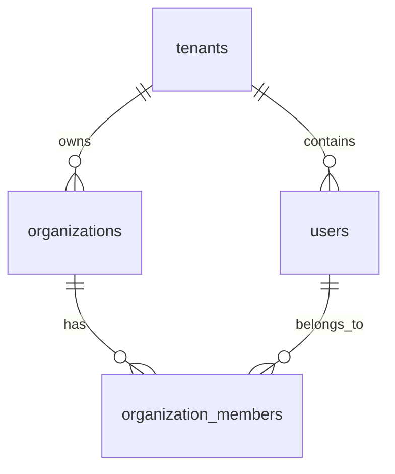

# TDD 技术设计文档模板 v2

> **文档编号**：`TDD-YYYY-NNN`  
> **版本**：`{vX.Y.Z}`  
> **模板版本**：`v2`  
> **状态**：`{草稿 / 评审中 / 已批准 / 已归档}`  
> **编写人/适用对象**：`技术团队`  
> **编写日期**：`{YYYY-MM-DD}`  
> **关联文档**：  
> - `docs/PRD-vX.Y.Z.md`  
> - `docs/database-model.md`  
> - `docs/roadmap-xxx.md`  
> - `docs/ARCHITECTURE-vX.Y.Z.md`  
> - `docs/adr/`  
> **评审人**：`架构师、后端负责人、前端负责人、DevOps、安全负责人、测试负责人`  
> **AI 置信度**：`{high / medium / low}`  
> **AI 红线**：执行前必须通读本模板 `ai_red_flags` 与第 6 节「非功能需求」。  
> **待人工确认事项**：`{问题 1 / 问题 2 / -}`

---

## 0. 文档使用说明

本文档为 `{产品名}` 的技术设计文档（Technical Design Resource，TDD），基于 `{PRD 路径}` 编制，面向架构师、开发工程师、测试工程师、DevOps、安全工程师、SRE。

TDD 目标：
- 将 PRD 中的功能需求转化为可实施的技术方案。
- 明确系统边界、服务职责、数据模型、接口契约、安全策略、性能目标、部署拓扑。
- 为开发、测试、运维提供统一的技术上下文与决策依据。
- 定义生产级基线：可观测性、可恢复性、可扩展性、成本可控。

**使用方式**：
- 每个章节按 `[必须]` / `[推荐]` / `[可选]` 标注；初创团队可裁剪可选章节，金融/医疗/企业级场景建议保留全部。
- 所有占位符用 `{占位符}` 表示，实施时替换为实际内容。
- 所有 "TODO" 标记必须在文档状态转为"已批准"前清除。

### 0.1 LLM / Agent 消费指引

当本 TDD 被 AI Agent 或 LLM 消费时，建议按以下顺序加载上下文：

| 顺序 | 内容 | 说明 |
|------|------|------|
| 1 | front matter | 获取版本、状态、owner、linked_prd、ai_red_flags、pending_confirmation |
| 2 | 第 0 节使用说明 | 理解模板目标与裁剪策略 |
| 3 | 第 2 节范围与上下文 | 理解系统边界与依赖 |
| 4 | 第 3 节总体架构 | 理解服务/组件/数据流 |
| 5 | 第 4 节数据模型 + 第 5 节接口契约 | 理解核心 schema 与 API |
| 6 | 第 6 节非功能需求 | 加载性能、安全、可靠性约束 |
| 7 | 其他章节按需加载 | 上下文受限时可跳过部署拓扑、成本估算等 |

**分块策略**：
- 若全文超过模型上下文上限 60%，先读取范围、架构、数据模型、接口契约、非功能需求。
- 具体部署命令、监控面板配置等可在实现阶段按需拉取。
- `ai_red_flags` 与 `pending_confirmation` 必须在任何生成/修改动作前加载。

---

## 1. 文档控制信息

### 1.1 变更日志

| 版本 | 日期 | 修改人 | 修改内容 | 影响范围 |
|------|------|--------|----------|----------|
| v0.1.0 | YYYY-MM-DD | 技术团队 | 初始版本 | 全文档 |

### 1.2 关联文档

| 文档类型 | 名称 | 路径 |
|----------|------|------|
| PRD | `{PRD 名称}` | `{PRD 路径}` |
| 数据库模型 | `{database-model}` | `docs/database-model.md` |
| 产品路线图 | `{roadmap}` | `docs/roadmap-xxx.md` |
| 设计稿 | `{Figma / Sketch 链接}` | `{URL}` |
| 架构与流程图 | `{ARCHITECTURE 名称}` | `docs/ARCHITECTURE-vX.Y.Z.md` |
| 架构决策记录 | `{ADR}` | `docs/adr/` |

### 1.3 评审记录

| 轮次 | 日期 | 参与人 | 结论 | 待办 |
|------|------|--------|------|------|
| 技术初审 | YYYY-MM-DD | 架构师、后端负责人 | 待修改 | {待办事项} |
| 安全评审 | YYYY-MM-DD | 安全负责人 | 待修改 | {待办事项} |
| 最终评审 | YYYY-MM-DD | 全体 | 通过 | 无 |

---

## 2. 概述与目标

### 2.1 设计目标

将 PRD 中定义的功能需求落盘为可实施的技术方案，重点解决以下技术问题：

1. **{问题 1}**：{一句话描述，例如多格式文档解析与安全预览}。
2. **{问题 2}**：{一句话描述}。
3. **{问题 3}**：{一句话描述}。

### 2.2 设计原则

| 原则 | 说明 | 落地方式 |
|------|------|----------|
| **服务自治** | 每个服务独立部署、独立扩展、独立回滚 | 微服务 / 模块化单体 + CI/CD 独立流水线 |
| **数据安全优先** | 多租户严格隔离，所有敏感访问鉴权 | 行级隔离 + 签名 URL + 审计日志 |
| **异步解耦** | 重操作不阻塞核心链路 | 消息队列 / 本地队列 + 死信队列 |
| **可观测性** | 日志、指标、追踪覆盖所有核心路径 | OpenTelemetry + Prometheus/Grafana + 结构化日志 |
| **成本可控** | 资源按需分配，避免过度设计 | 单可用区起步，按业务量扩展 |
| **可恢复性** | 单点故障可自动恢复，数据可恢复 | 主从复制、定期备份、灾难恢复预案 |

### 2.3 范围边界

**包含**：
- {列出本次 TDD 覆盖的模块}

**不包含**（明确排除，避免范围蔓延）：
- {列出明确排除的模块或特性}

---

## 3. 架构总览

### 3.1 系统架构图

> **建议**：复杂系统架构图、部署拓扑图、时序图、ERD 建议放入独立 `docs/ARCHITECTURE-vX.Y.Z.md`，TDD 中通过链接引用，避免 TDD 过度膨胀。详见 [`ARCHITECTURE-DIAGRAMS-template-v1.md`](ARCHITECTURE-DIAGRAMS-template-v1.md)。

```text
┌─────────────────────────────────────────────────────────────────────────┐
│                              用户访问层                                   │
│  ┌──────────────┐  ┌──────────────┐  ┌──────────────┐                  │
│  │   Web App    │  │   {模块 1}   │  │   {模块 2}   │                  │
│  │  {技术栈}    │  │  {技术栈}    │  │  {技术栈}    │                  │
│  └──────┬───────┘  └──────┬───────┘  └──────┬───────┘                  │
│         └─────────────────┴─────────────────┘                           │
│                              │                                          │
│                         {CDN / WAF / DDoS 防护}                         │
│                              │                                          │
└──────────────────────────────┼──────────────────────────────────────────┘
                               │
                    ┌──────────┴──────────┐
                    │    API Gateway      │
                    │  {Kong / Nginx /    │
                    │   Traefik / AWS ALB}│
                    │                     │
                    │  SSL 终止 / Host 透传│
                    │  路由 / 限流 / WAF   │
                    └──────────┬──────────┘
                               │
        ┌──────────────────────┼──────────────────────┐
        │                      │                      │
   ┌────┴────┐           ┌────┴────┐           ┌────┴────┐
   │ {服务 1}│           │ {服务 2}│           │ {服务 3}│
   │ {技术栈}│           │ {技术栈}│           │ {技术栈}│
   └────┬────┘           └────┬────┘           └────┬────┘
        │                      │                      │
        └──────────────────────┼──────────────────────┘
                               │
        ┌──────────────────────┼──────────────────────┐
        │                      │                      │
   ┌────┴────┐           ┌────┴────┐           ┌────┴────┐
   │ {服务 4}│           │ {服务 5}│           │ {服务 6}│
   │ {技术栈}│           │ {技术栈}│           │ {技术栈}│
   └────┬────┘           └────┬────┘           └────┬────┘
        │                      │                      │
   ┌────┴──────────────────────┴────┐            ┌────┴────┐
   │      {第三方依赖 / 外部服务}      │            │ {对象存储}│
   │  {OnlyOffice / LLM / CRM 等}    │            │ {S3/OSS}│
   └─────────────────────────────────┘            └─────────┘

        ┌────────────────────────────────────────┐
        │              共享基础设施               │
        │  {PostgreSQL}  │  {Redis}  │  {队列}   │
        └────────────────────────────────────────┘
```

### 3.2 服务边界

| 服务 | 职责 | 技术栈 | 部署方式 | 关键 SLO |
|------|------|--------|----------|----------|
| API Gateway | SSL 终止、Host 透传、路由、基础限流、WAF | {Kong / Nginx / Traefik} | {K8s / 云厂商网关} | 可用性 99.99% |
| {Web API} | {业务 API} | {Go / Node.js / Java} | {K8s} | P99 延迟 < 200ms |
| {Public API} | {查看、签名 URL} | {Go} | {K8s} | P99 延迟 < 100ms |
| {Upload Service} | {文件上传} | {Go} | {K8s} | 上传 P99 < 2s |
| {Ingestion Worker} | {异步处理} | {Python / Go} | {K8s} | 成功率 > 95% |
| {Search Service} | {搜索} | {Go + pgvector} | {K8s} | P95 延迟 < 800ms |
| {Assistant Service} | {LLM 调用} | {Python} | {K8s} | P95 延迟 < 3s |
| {Notification Service} | {邮件/通知} | {Go} | {K8s} | 发送成功率 > 99% |
| {CDN} | 静态资源与签名内容缓存分发 | {Cloudflare / 阿里云 CDN} | 全局加速 | 缓存命中率 > 90% |

### 3.3 部署拓扑

```text
┌─────────────────────────────────────────────┐
│              生产环境（Production）           │
│  ┌─────────────────────────────────────┐   │
│  │         {云厂商} {K8s 集群}          │   │
│  │  （建议二期扩展至多可用区）             │   │
│  │                                     │   │
│  │  {服务 1} / {服务 2} / {服务 3} /   │   │
│  │  {服务 4} / {服务 5} / {服务 6}     │   │
│  └─────────────────────────────────────┘   │
│                      │                      │
│          {VPC 对等 / 内网连接}               │
│                      ▼                      │
│  ┌─────────────────────────────────────┐   │
│  │      {第三方独立集群 / 外部服务}      │   │
│  │       {资源规格}                     │   │
│  └─────────────────────────────────────┘   │
│                      │                      │
│                      ▼                      │
│  ┌─────────────────────────────────────┐   │
│  │    共享基础设施                      │   │
│  │  {RDS PostgreSQL} / {Redis} /       │   │
│  │  {对象存储} / {CDN}                 │   │
│  └─────────────────────────────────────┘   │
└─────────────────────────────────────────────┘
```

### 3.4 多环境配置

| 环境 | 用途 | 数据 | 部署方式 | 访问控制 |
|------|------|------|----------|----------|
| 本地 dev | 开发调试 | 模拟数据 | Docker Compose | 本地访问 |
| 开发环境 | 功能联调 | 模拟数据 | {K8s namespace} | VPN / IP 白名单 |
| Staging | 预发布测试 | 生产脱敏数据 | {K8s} | 内部访问 |
| Production | 生产服务 | 真实数据 | {K8s} | 严格审计 |

---

## 4. 数据架构

### 4.1 核心 ER 图

> 本节仅保留最通用的多租户访问上下文实体（租户、用户、Organization、成员关系）。业务实体（文档、订单、会话等）应在数据库模型文档中定义。



### 4.2 表结构设计

> **说明**：完整的数据模型（所有表、索引、约束）应写入 `docs/templates/DATABASE-MODEL-template-v1.md` 或项目实际文档 `docs/DATABASE-MODEL-vX.Y.Z.md`，TDD 中只保留支撑接口设计的核心表示例。

#### 4.2.1 核心示例：租户、Organization 与成员

```sql
CREATE TABLE tenants (
  id uuid PRIMARY KEY DEFAULT gen_random_uuid(),
  slug text UNIQUE NOT NULL, -- 子域名，全局唯一；小写、字母数字连字符，长度 3-63
  name text NOT NULL,
  status text NOT NULL DEFAULT 'active',
  created_at timestamptz NOT NULL DEFAULT now(),
  updated_at timestamptz NOT NULL DEFAULT now(),
  CONSTRAINT tenants_slug_format CHECK (slug ~ '^[a-z0-9]([a-z0-9-]{1,61})[a-z0-9]$')
);

CREATE TABLE organizations (
  id uuid PRIMARY KEY DEFAULT gen_random_uuid(),
  tenant_id uuid NOT NULL REFERENCES tenants(id) ON DELETE CASCADE,
  slug text NOT NULL,
  name text NOT NULL,
  status text NOT NULL DEFAULT 'active',
  created_at timestamptz NOT NULL DEFAULT now(),
  updated_at timestamptz NOT NULL DEFAULT now(),
  UNIQUE (tenant_id, slug),
  CONSTRAINT organizations_slug_format CHECK (slug ~ '^[a-z0-9][a-z0-9_-]{0,62}[a-z0-9]$'),
  CONSTRAINT organizations_slug_reserved CHECK (slug NOT IN ('api', 'www', 'static', 'health', 'admin'))
);

CREATE TABLE users (
  id uuid PRIMARY KEY DEFAULT gen_random_uuid(),
  email text UNIQUE NOT NULL,
  password_hash text,
  status text NOT NULL DEFAULT 'active',
  created_at timestamptz NOT NULL DEFAULT now(),
  updated_at timestamptz NOT NULL DEFAULT now()
);

CREATE TABLE organization_members (
  id uuid PRIMARY KEY DEFAULT gen_random_uuid(),
  organization_id uuid NOT NULL REFERENCES organizations(id) ON DELETE CASCADE,
  user_id uuid NOT NULL REFERENCES users(id) ON DELETE CASCADE,
  role text NOT NULL CHECK (role IN ('owner', 'admin', 'member', 'guest')),
  created_at timestamptz NOT NULL DEFAULT now(),
  UNIQUE (organization_id, user_id)
);
```

### 4.3 索引策略

```sql
-- 根据实际查询补充索引；以下为支撑核心访问上下文的示例索引
CREATE INDEX tenants_slug_idx ON tenants (slug);
CREATE INDEX organizations_tenant_slug_idx ON organizations (tenant_id, slug);
CREATE INDEX users_email_idx ON users (email);
CREATE INDEX organization_members_organization_user_idx ON organization_members (organization_id, user_id);

-- 业务表（文档、订单、事件等）的特殊索引（GIN、HNSW、分区键等）请在数据库模型文档中定义
```

### 4.4 数据流

> **建议**：详细数据流图、时序图建议放入独立 `docs/ARCHITECTURE-vX.Y.Z.md`，TDD 中通过链接引用。详见 [`ARCHITECTURE-DIAGRAMS-template-v1.md`](ARCHITECTURE-DIAGRAMS-template-v1.md)。

#### 4.4.1 {核心业务流 1}

```text
{步骤 1}
    ↓
{步骤 2}
    ↓
{步骤 3}
```

#### 4.4.2 {核心业务流 2}

```text
{步骤 1}
    ↓
{步骤 2}
    ↓
{步骤 3}
```

### 4.5 数据生命周期与归档

| 数据类型 | 保留策略 | 归档方式 | 删除策略 |
|----------|----------|----------|----------|
| 原始文件 | 7 年或合同期 | 低频存储 | 租户删除后软删除 30 天 |
| 页面 webp | 与文档生命周期一致 | 低频存储 | 文档删除后清理 |
| events | 90 天热存储 | 二期归档至对象存储 | 按合规要求保留 |
| 审计日志 | 3 年 | 不可变存储 | 不可删除 |

---

## 5. 接口设计

### 5.1 接口设计原则

- RESTful API，JSON 格式。
- API 默认基路径为 `/api/v1`。
- Organization / 租户默认通过 `Authorization` Token 中的 `wid`/`tid` claim 解析，也可通过请求头 `X-Organization-Id` 或子域名 `{organizationSlug}.api.example.com` 解析。默认不将 `organization_id` 或 `{organizationSlug}` 嵌入 URL path。
- 若 ADR 决定采用“子域名 + 路径 slug”方案，可作为备选方案另行约定。
- 统一错误响应格式。
- 分页统一使用 cursor 或 offset/limit。
- 关键接口要求幂等。
- 所有 P0 接口必须有 OpenAPI 定义。

### 5.2 通用错误响应

```json
{
  "code": "ERROR_CODE",
  "message": "用户可读的错误描述",
  "details": [
    { "field": "email", "issue": "invalid_format" }
  ],
  "request_id": "req_xxx"
}
```

> 说明：错误响应采用扁平结构（与 `API-SPEC-template-v1.md` 和 `openapi-template-v1.yaml` 保持一致），便于 SDK/前端统一解析。

### 5.3 认证与上下文

| 上下文来源 | 说明 |
|------------|------|
| Tenant | 默认通过 `Authorization` Token claim 解析；可选通过请求 Host（子域名或自定义域名）解析 |
| Organization | 默认通过 Token 中的 `wid` claim 或 `X-Organization-Id` 请求头解析；可选通过子域名 `{organizationSlug}.api.example.com` 解析 |
| User | 通过 JWT / Session Cookie 解析 |
| Visitor | 公开链接访问者不登录，使用 visitor_id 标识会话 |

### 5.4 接口契约

#### 5.4.1 {模块 1}

##### API-01：{接口名称}

```http
{METHOD} /api/v1/{path}
Authorization: Bearer {jwt}
Content-Type: application/json
```

**请求参数**：

| 字段 | 类型 | 必填 | 说明 |
|------|------|------|------|
| {field} | {type} | {yes/no} | {desc} |

**成功响应 {CODE}**：

```json
{
  "{field}": "{value}"
}
```

**错误码**：

| 错误码 | HTTP 状态 | 说明 |
|--------|-----------|------|
| ERROR_CODE | 400/401/403/404/... | {说明} |

### 5.5 错误码汇总

| 错误码 | HTTP 状态 | 说明 |
|--------|-----------|------|
| UNAUTHORIZED | 401 | 未认证或 token 过期 |
| FORBIDDEN | 403 | 无权限访问 |
| TENANT_NOT_FOUND | 404 | 子域名/自定义域名未找到对应租户 |
| ORGANIZATION_NOT_FOUND | 404 | organization 不存在或无权限 |
| RATE_LIMITED | 429 | 请求过于频繁 |
| INTERNAL_ERROR | 500 | 服务器内部错误 |

### 5.6 路由策略

- **默认 API base path**：`/api/v1`，完整 URL 示例 `https://api.example.com/api/v1/resources`。
- **Organization / 租户解析**：默认不通过 URL path 嵌入 `organization_id` 或 `{organizationSlug}` 作为**所有接口的租户上下文前缀**，优先按以下顺序解析当前用户所属 organization：
  1. `Authorization` Token 中的 `wid` / `tid` claim；
  2. 请求头 `X-Organization-Id`；
  3. 子域名 `{organizationSlug}.api.example.com`（可选）。
- **资源对象路径例外**：Organization 资源自身的 CRUD（如 `/api/v1/organizations/{organization_id}`）属于资源对象路径，不是租户上下文路径；调用者仍须通过 Token/Header 证明自己的身份与权限，服务端再校验其是否有权访问该 organization。
- **认证**：默认用户接口使用 `bearerAuth`；服务/机器/Webhook 回调验证使用 `apiKeyAuth`（`X-API-Key: <api_key>`）。
- **幂等**：写操作接口要求携带 `X-Idempotency-Key` 请求头。
- **公开 Public 路径**：保持 `/public/resources/{resource_id}`，基于签名 token 访问。
- **备选方案**：若 ADR 决定采用“子域名 + 路径 slug”方案，接口路径可调整为 `/{organizationSlug}/api/v1/...`，但不得与默认 `/api/v1` 示例混用。

---

## 6. 核心模块设计

### 6.1 {模块 1}

#### 6.1.1 职责

- {职责 1}
- {职责 2}

#### 6.1.2 流程

```text
{步骤 1}
    ↓
{步骤 2}
    ↓
{步骤 3}
```

#### 6.1.3 异常处理

| 异常 | 处理策略 |
|------|----------|
| {异常 1} | {策略} |
| {异常 2} | {策略} |

### 6.2 {模块 2}

#### 6.2.1 职责

- {职责 1}
- {职责 2}

---

## 7. 安全设计

### 7.1 认证与授权

#### 7.1.1 用户认证

- 注册/登录：{邮箱 + 密码 / SSO / OAuth}
- Session：{JWT / Session Cookie + Redis}
- Token 策略：access token {15 分钟}，refresh token {7 天}

#### 7.1.2 权限模型

**Organization 角色**：

| 角色 | 权限 |
|------|------|
| OWNER | 全部权限，可删除 organization |
| ADMIN | 管理成员、管理协作空间、创建 organization |
| MEMBER | 上传文档、创建链接、查看分析 |
| GUEST | 仅查看被授权的资源/协作空间 |

### 7.2 多租户隔离

- **行级隔离**：所有业务表包含 `tenant_id` 和 `organization_id`。
- **网关层**：Gateway 透传 Host 与 Authorization 头；tenant/organization 默认在业务服务依据 token claim / `X-Organization-Id` / Host 完成解析。
- **强制过滤**：Repository 层自动注入 `tenant_id` + `organization_id` 过滤条件。

### 7.3 对象存储安全

- Bucket 私有，禁止公开读取。
- 统一 bucket + prefix 隔离：`tenants/{tenantId}/resources/{resourceId}/...`。
- 所有访问通过后端签名的 CDN URL 鉴权。

### 7.4 签名 URL 安全

- 使用 HMAC 签名，密钥仅 CDN 和后端共享。
- Token 包含 tenant/organization/resource/page/expires，防止篡改和越权。
- 有效期默认 15 分钟，可配置。

### 7.5 输入安全

- 文件类型白名单校验（Magic Number + 扩展名）。
- 文件大小限制。
- SQL 注入防护：参数化查询。
- XSS 防护：输出转义，CSP。
- 上传文件病毒扫描（二期）。

### 7.6 审计日志

| 操作类型 | 记录内容 |
|----------|----------|
| 资源上传 | user_id, resource_id, timestamp, ip |
| 链接创建/修改/撤回 | user_id, link_id, permission_change |
| 访问尝试 | visitor_id, link_id, result, ip, user_agent |
| 权限变更 | admin_id, target_user_id, role_change |

### 7.7 合规与隐私

| 合规项 | 要求 | 落地方式 |
|--------|------|----------|
| GDPR / CCPA | 用户数据可导出、可删除 | 数据导出 API + 软删除 + 定期清理 |
| SOC 2 | 审计日志不可篡改 | 独立审计表 + 只读副本 |
| 数据加密 | 传输加密 + 静态加密 | TLS 1.2+ / 云厂商磁盘加密 |

---

## 8. 性能设计

### 8.1 SLO / SLI

| 服务/接口 | SLI | SLO | 测量方式 |
|-----------|-----|-----|----------|
| Web API | P99 延迟 | < 500ms | Prometheus histogram |
| Public API | P99 签名 URL 生成延迟 | < 200ms | Prometheus histogram |
| AI 问答 | P95 延迟 | < 3s | Prometheus histogram |
| 文档解析 | 成功率 | > 95% | 自定义指标 |
| 核心查看链路 | 可用性 | 99.5% | 黑盒探测 |

### 8.2 缓存策略

| 缓存对象 | 缓存层 | TTL | 说明 |
|----------|--------|-----|------|
| 文档元数据 | Redis | 5 分钟 | 高频读取 |
| 页面列表 | Redis | 5 分钟 | 文档 ready 后稳定 |
| 热度评分 | Redis | 1 分钟 | 近实时更新 |
| CDN 图片 | CDN 边缘 | 1 小时 | 已签名 URL 作为缓存 key 的一部分 |

### 8.3 异步处理

| 场景 | 队列 | 说明 |
|------|------|------|
| 文档解析 | ingestion_queue | 可重试，死信队列 |
| 邮件通知 | notification_queue | 合并同类事件 |
| CRM 同步 | integration_queue | 失败重试 3 次 |
| 热度评分计算 | analytics_queue | 准实时 |

### 8.4 限流

| 接口 | 限流策略 |
|------|----------|
| 上传 API | 每用户 10 次/分钟，每租户 100 次/分钟 |
| AI 问答 | 每用户 30 次/分钟，每租户 500 次/分钟 |
| 公开链接访问 | 每 IP 60 次/分钟 |
| 签名 URL 生成 | 每用户 120 次/分钟 |

### 8.5 数据库优化

- 所有查询带 `tenant_id` + `organization_id` 过滤，利用复合索引。
- 大表按时间分区。
- 慢查询监控与告警。

### 8.6 DORA 指标目标

> 本模板工程效率目标参考 [DORA 核心能力](https://dora.dev/) 设定，与 `IMPLEMENTATION-PLAN` 保持一致。

| 指标 | 初始目标 | 成熟期目标 | 测量方式 |
|------|----------|------------|----------|
| 部署频率 | 每周 ≥ 1 次 | 按需 / 每日多次 | CI/CD 部署事件 |
| 变更前置时间 | ≤ 3 天 | ≤ 1 天 | PR 合并 → 生产发布 |
| 变更失败率 | ≤ 15% | ≤ 5% | 发布后 24h 回滚或热修复占比 |
| 服务恢复时间 (MTTR) | ≤ 4 小时 | ≤ 1 小时 | 告警确认到服务恢复 |

---

## 9. 部署与运维

### 9.1 服务部署

| 服务 | 部署方式 | 副本数 | 资源（初始） |
|------|----------|--------|--------------|
| API Gateway | K8s Deployment | 2 | 1C2G |
| Web API Service | K8s Deployment | 3 | 2C4G |
| {其他服务} | K8s Deployment | {N} | {X}C{Y}G |

### 9.2 数据库部署

| 组件 | 部署方式 | 规格 |
|------|----------|------|
| PostgreSQL | 云托管 RDS + pgvector | 8C16G 主，4C8G 从 |
| Redis | 云托管 Redis / Tair | 2C4G |
| 对象存储 | 云厂商 OSS（私有 bucket） | 按需 |
| CDN | Cloudflare / 阿里云 CDN | 按需 |

### 9.3 本地开发环境

使用 `docker-compose.yml` 一键启动：

- PostgreSQL + pgvector
- Redis
- MinIO（模拟对象存储）
- {其他依赖}

### 9.4 CI/CD

```text
开发者提交代码
    ↓
GitHub Actions 触发
    ↓
Lint / Unit Test / Integration Test
    ↓
构建 Docker 镜像
    ↓
推送到镜像仓库
    ↓
部署到 Staging
    ↓
E2E 测试 / 安全扫描
    ↓
手动或自动部署到 Production
```

### 9.5 监控告警

| 监控对象 | 指标 | 告警阈值 |
|----------|------|----------|
| Web API | P99 延迟 | > 500ms |
| Web API | 错误率 | > 1% |
| Ingestion Worker | 队列堆积 | > 100 |
| PostgreSQL | CPU / 连接数 | > 80% |
| SSL 证书 | 有效期 | < 14 天 |

### 9.6 日志与追踪

- 结构化日志：JSON 格式，包含 `trace_id`、`tenant_id`、`organization_id`、`user_id`、`request_id`。
- 分布式追踪：OpenTelemetry + Jaeger/Zipkin。
- 日志收集：Fluentd / Fluent Bit + Loki / ELK。

### 9.7 灾难恢复

| 场景 | RTO | RPO | 策略 |
|------|-----|-----|------|
| 单服务故障 | < 5 分钟 | 0 | K8s 自动重启/扩容 |
| 数据库主库故障 | < 15 分钟 | < 1 分钟 | 主从切换 |
| 对象存储故障 | < 30 分钟 | < 1 小时 | 跨区域复制 |
| 整个可用区故障 | < 4 小时（二期多可用区）/< 8 小时（MVP 单可用区重建） | < 15 分钟（二期）/< 1 小时（MVP 冷备恢复） | MVP 单可用区+跨区域备份；二期部署多可用区 |

### 9.8 回滚与灰度

- **回滚**：K8s Deployment rollback，镜像版本化，数据库变更可回滚。
- **灰度**：基于权重的 Canary 发布，按 tenant 或用户维度灰度。
- **Feature Flag**：二期引入 LaunchDarkly 或自研配置中心。

### 9.9 成本估算

| 组件 | 月度成本（估算） | 计费方式 |
|------|------------------|----------|
| K8s 节点 | $xxx | 按实例 |
| RDS PostgreSQL | $xxx | 按实例 + 存储 |
| Redis | $xxx | 按实例 |
| 对象存储 | $xxx | 按存储 + 流量 |
| CDN | $xxx | 按流量 |
| LLM API | $xxx | 按 token |

---

## 10. 测试策略

### 10.1 测试分层

| 测试类型 | 覆盖范围 | 工具 | 通过标准 |
|----------|----------|------|----------|
| 单元测试 | 核心业务逻辑 | {Go testing + testify / Jest / pytest} | 覆盖率 ≥ 70% |
| 集成测试 | 服务间接口、数据库事务 | {testcontainers / pytest} | P0 用例 100% 通过 |
| 接口测试 | 所有 P0 API | {Postman / httptest} | P0 接口 100% 通过 |
| E2E 测试 | 核心用户路径 | Playwright | P0 路径 100% 通过 |
| 安全测试 | 越权、注入、签名篡改 | OWASP ZAP / 手工 | 无高危漏洞 |
| 性能测试 | P0 接口 | k6 / Locust | 达到 SLO |
| 混沌测试 | 故障注入 | Chaos Mesh / Gremlin | 核心链路可恢复 |

### 10.2 关键测试场景

1. **多租户隔离**：用户 A（tenant1/organization1）无法访问 tenant2/organization2 数据。
2. **Organization 切换**：切换 organization 后，上下文（token claim / `X-Organization-Id`）和数据均正确更新。
3. **签名 URL 安全**：篡改 token 后 CDN 返回 403；直接访问 OSS 返回 403。
4. **核心链路**：{场景 1} → {场景 2} → {场景 3} 可跑通。

---

## 11. 风险与依赖

### 11.1 技术风险

| 风险 | 影响 | 概率 | 缓解措施 |
|------|------|------|----------|
| {风险 1} | {影响} | {高/中/低} | {措施} |
| {风险 2} | {影响} | {高/中/低} | {措施} |

### 11.2 外部依赖

| 依赖 | 用途 | 风险 | 备选 |
|------|------|------|------|
| {依赖 1} | {用途} | {高/中/低} | {备选} |
| {依赖 2} | {用途} | {高/中/低} | {备选} |

### 11.3 故障演练计划

| 演练场景 | 频率 | 目标 | 验收标准 |
|----------|------|------|----------|
| 数据库主库切换 | 每季度 | RTO < 15min | 业务无数据丢失 |
| 对象存储不可用 | 每半年 | 切换备用方案 | 核心查看链路恢复 |
| LLM 服务限流 | 每半年 | 降级策略生效 | 用户收到友好提示 |

---

## 12. 决策记录

| 编号 | 决策 | 备选方案 | 原因 |
|------|------|----------|------|
| TD-01 | {决策} | {备选} | {原因} |
| TD-02 | {决策} | {备选} | {原因} |

---

## 13. 附录

### 13.1 术语表

| 术语 | 说明 |
|------|------|
| TDD | Technical Design Resource，技术设计文档 |
| URL Signing | CDN 签名 URL 能力，用于验证 CDN 请求合法性 |
| Signed URL | 含过期时间与 HMAC 签名的临时 URL |
| HNSW | Hierarchical Navigable Small World，pgvector 近似最近邻索引算法 |
| RRF | Reciprocal Rank Fusion，多路搜索结果融合算法 |
| VPC Peering | 虚拟私有云对等连接 |

### 13.2 参考文档

- `{PRD 路径}`
- `docs/database-model.md`

---

## 14. 待确认事项

> 本节用于记录 AI/人工尚未确认的技术决策。文档状态转为“已批准”前必须清空或转化为 ADR/变更请求。Agent 执行前应优先读取本节，并将未确认项加入 `pending_confirmation`。

1. {待确认事项 1}
2. {待确认事项 2}

---

## 15. 检查清单（文档发布前必须完成）

- [ ] 所有 `{占位符}` 已替换为实际内容
- [ ] 所有 `TODO` 已清除或转为正式 issue
- [ ] 所有 P0 接口已有 OpenAPI / 详细契约
- [ ] 所有 P0 数据表已有 DDL 和索引
- [ ] SLO/SLI 已定义且可测量
- [ ] 安全评审已通过
- [ ] 灾难恢复与回滚策略已明确
- [ ] 成本估算已评审
- [ ] 与 PRD 的关键决策一致
- [ ] 关联团队已评审并签字
