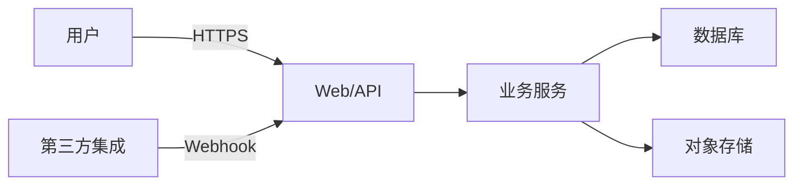

# {系统名} 威胁建模文档

> **文档编号**：`TM-YYYY-NNN`  
> **版本**：`{vX.Y.Z}`  
> **模板版本**：`v1`  
> **状态**：`{草稿 / 评审中 / 已批准 / 已归档}`  
> **编写人/适用对象**：`{安全负责人}`  
> **编写日期**：`{YYYY-MM-DD}`  
> **关联文档**：  
> - `docs/TDD-vX.Y.Z.md`  
> - `docs/PRD-vX.Y.Z.md`  
> - `docs/SECURITY-TEST-PLAN-vX.Y.Z.md`  
> - `docs/COMPLIANCE-vX.Y.Z.md`  
> **评审人**：`{安全负责人、架构师、技术负责人}`  
> **评审日期**：`{YYYY-MM-DD}`  
> **下次评审**：`{YYYY-MM-DD}`

---

## 1. 范围与目标

### 1.1 范围

`{本次威胁建模覆盖的系统、模块、数据流}`

### 1.2 目标

- 识别系统面临的主要威胁
- 评估威胁风险等级
- 制定缓解措施并分配责任人
- 为安全测试和安全设计提供输入

---

## 2. 系统上下文

### 2.1 数据流图（DFD）

### 2.2 关键资产

| 资产 | 类型 | 敏感级别 |
|------|------|----------|
| `{用户上传文档}` | 数据 | 高 |
| `{用户凭证}` | 数据 | 高 |
| `{访问日志}` | 数据 | 中 |
| `{API Key}` | 密钥 | 高 |

### 2.3 信任边界

| 边界 | 说明 |
|------|------|
| 公网 ↔ 网关 | 不可信，需 TLS + WAF |
| 网关 ↔ 服务 | 内部网络，需 mTLS |
| 服务 ↔ 数据存储 | 内部网络，需最小权限 |

---

## 3. 威胁识别

使用 STRIDE 模型进行分类。

| 编号 | 威胁 | STRIDE 类别 | 组件 | 描述 |
|------|------|-------------|------|------|
| `T-001` | 身份伪造 | 假冒 | API 认证 | 攻击者盗用 Token/API Key 访问接口 |
| `T-002` | 越权访问 | 越权 | 文档访问 | 用户访问不属于自己 organization 的文档 |
| `T-003` | 数据泄露 | 信息泄露 | 公开链接 | 签名 URL 被猜测或泄露 |
| `T-004` | 注入攻击 | 篡改 | 上传解析 | 恶意文件导致解析服务被入侵 |
| `T-005` | 拒绝服务 | 拒绝服务 | 上传接口 | 超大文件或高频上传耗尽资源 |
| `T-006` | 审计缺失 | 否认 | 操作日志 | 关键操作无日志，无法追溯 |

---

## 4. 风险评估

### 4.1 评分标准

| 维度 | 1 分 | 2 分 | 3 分 |
|------|------|------|------|
| 影响 | 低 | 中 | 高 |
| 可能性 | 低 | 中 | 高 |

风险等级 = 影响 × 可能性

### 4.2 风险矩阵

| 威胁 | 影响 | 可能性 | 风险等级 | 优先级 |
|------|------|--------|----------|--------|
| `T-001` | 3 | 2 | 6 | 高 |
| `T-002` | 3 | 2 | 6 | 高 |
| `T-003` | 3 | 2 | 6 | 高 |
| `T-004` | 3 | 1 | 3 | 中 |
| `T-005` | 2 | 2 | 4 | 中 |
| `T-006` | 2 | 2 | 4 | 中 |

---

## 5. 缓解措施

| 威胁 | 缓解措施 | 负责人 | 状态 | 验证方式 |
|------|----------|--------|------|----------|
| `T-001` | JWT 短期有效 + Refresh Token 轮换；API Key 最小权限 + 定期轮换 | `{姓名}` | 待办 | 渗透测试 |
| `T-002` | 每条数据查询强制校验 `tenant_id` / `organization_id` | `{姓名}` | 待办 | 代码审计 |
| `T-003` | 签名 URL 带过期时间、单次/短期有效；启用访问日志 | `{姓名}` | 待办 | 安全测试 |
| `T-004` | 文件类型白名单、沙箱解析、病毒扫描 | `{姓名}` | 待办 | 安全测试 |
| `T-005` | 文件大小/页数限制、上传限流、队列削峰 | `{姓名}` | 待办 | 压力测试 |
| `T-006` | 所有关键操作写审计日志，保留 ≥ 180 天 | `{姓名}` | 待办 | 日志审计 |

---

## 6. 安全假设与依赖

- `{TLS 1.2+ 由云负载均衡提供}`
- `{云厂商 IAM 策略正确配置}`
- `{终端用户设备未被完全控制}`

---

## 7. 相关链接

- PRD：`{docs/PRD-vX.Y.Z.md}`
- TDD：`{docs/TDD-vX.Y.Z.md}`
- 安全测试计划：`{docs/SECURITY-TEST-PLAN-vX.Y.Z.md}`
- 合规文档：`{docs/COMPLIANCE-xxx.md}`

---

## 8. 检查清单

- [ ] 数据流图覆盖所有关键路径
- [ ] 所有关键资产已识别
- [ ] 威胁列表使用 STRIDE 分类
- [ ] 风险评估已完成
- [ ] 缓解措施已分配责任人
- [ ] 安全假设已明确记录
