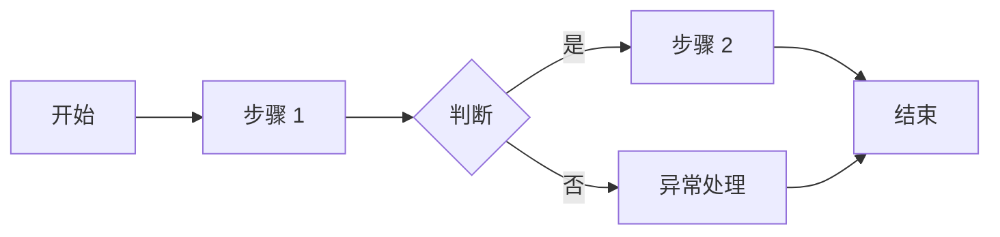

# UI/UX 设计交付文档模板 v1

> **文档编号**：`UI-YYYY-NNN`  
> **版本**：`{vX.Y.Z}`  
> **模板版本**：`v1`  
> **状态**：`{草稿 / 评审中 / 已批准 / 已归档}`  
> **编写人/适用对象**：`产品设计师 / UX 设计师 / 交互设计师`  
> **编写日期**：`{YYYY-MM-DD}`  
> **关联文档**：  
> - `docs/PRD-vX.Y.Z.md`  
> - `docs/TDD-vX.Y.Z.md`  
> - `docs/openapi-vX.Y.Z.yaml`  
> - `docs/templates/USER-RESEARCH-template-v1.md`  
> - `docs/templates/COMPETITIVE-ANALYSIS-template-v1.md`  
> - `docs/templates/PRD-REVIEW-CHECKLIST-template-v1.md`  
> - `docs/templates/API-SPEC-template-v1.md`  
> - `docs/DESIGN.md`（如有设计系统）  
> **评审人**：`产品负责人、前端负责人、后端负责人、测试负责人`  
> **设计工具**：`Figma / Sketch / Adobe XD / ProtoPie`  
> **原型链接**：`{Figma 原型 URL}`  
> **设计稿链接**：`{Figma 设计稿 URL}`  
> **交付状态（UI-DESIGN-DELIVERABLE 专用）**：`{待开发 / 已交付开发 / 已上线}`

---

## 0. 文档使用说明

本文档是 `{产品名}` 的 UI/UX 设计交付文档（Design Deliverable），用于记录从用户研究到高保真设计稿、交互原型、设计标注的完整交付内容。

**目标**：
- 向开发团队清晰传达界面结构、视觉样式和交互行为。
- 作为产品、设计、开发、测试四方对齐的共同依据。
- 确保设计稿与 PRD 需求一致，并支撑后续前端实现与 QA 验收。

**交付物清单**：
- [ ] 低保真/中保真线框图
- [ ] 高保真视觉设计稿
- [ ] 可交互原型
- [ ] 设计标注与切图
- [ ] 设计系统/组件库说明
- [ ] 交互说明文档
- [ ] 响应式适配方案
- [ ] 动效与微交互说明

---

## 1. 文档控制信息

### 1.1 变更日志

| 版本 | 日期 | 修改人 | 修改内容 | 影响范围 |
|------|------|--------|----------|----------|
| v0.1.0 | YYYY-MM-DD | {编写人} | 初始版本 | 全文档 |

### 1.2 相关设计资产

| 资产 | 链接 | 说明 |
|------|------|------|
| Figma 设计稿 | `{URL}` | 高保真设计源文件 |
| Figma 原型 | `{URL}` | 可点击交互原型 |
| 设计系统 | `{URL}` | 组件库与样式库 |
| 用户研究摘要 | `{URL}` | 设计输入来源 |
| 竞品分析 | `{URL}` | 竞品截图与洞察 |

---

## 2. 设计背景与目标

### 2.1 设计目标

1. {目标 1：例如降低用户首次上传文档的学习成本}
2. {目标 2：例如提升协作空间权限管理的操作效率}
3. {目标 3：例如建立专业可信的品牌视觉感知}

### 2.2 目标用户

| 用户角色 | 描述 | 核心诉求 | 设计重点 |
|----------|------|----------|----------|
| {角色 A} | {描述} | {诉求} | {重点} |
| {角色 B} | {描述} | {诉求} | {重点} |

### 2.3 设计原则

| 原则 | 说明 | 在设计中的体现 |
|------|------|----------------|
| {原则 1} | {说明} | {体现} |
| {原则 2} | {说明} | {体现} |
| {原则 3} | {说明} | {体现} |

### 2.4 关键用户任务

| 任务编号 | 任务描述 | 优先级 | 对应 PRD |
|----------|----------|--------|----------|
| TASK-01 | {任务} | P0 | FR-XX |
| TASK-02 | {任务} | P0 | FR-XX |
| TASK-03 | {任务} | P1 | FR-XX |

---

## 3. 信息架构

### 3.1 站点/应用地图

```text
{产品名}
├── {模块 A}
│   ├── {页面 A1}
│   ├── {页面 A2}
│   └── {页面 A3}
├── {模块 B}
│   ├── {页面 B1}
│   └── {页面 B2}
└── {模块 C}
    ├── {页面 C1}
    └── {页面 C2}
```

### 3.2 导航结构

| 导航层级 | 名称 | 入口位置 | 说明 |
|----------|------|----------|------|
| 一级导航 | {名称} | 顶部/侧边栏 | {说明} |
| 二级导航 | {名称} | 侧边栏 | {说明} |
| 快捷入口 | {名称} | 全局头部 | {说明} |

### 3.3 页面清单

| 页面编号 | 页面名称 | 路径/入口 | 优先级 | 对应 PRD | 设计稿链接 |
|----------|----------|-----------|--------|----------|------------|
| P-01 | {首页/仪表盘} | `{/dashboard}` | P0 | FR-01 | {链接} |
| P-02 | {文档列表页} | `{/resources}` | P0 | FR-02 | {链接} |
| P-03 | {文档详情页} | `{/resources/:id}` | P0 | FR-03 | {链接} |
| P-04 | {设置页} | `{/settings}` | P1 | FR-10 | {链接} |

---

## 4. 用户流程图

### 4.1 核心流程：{流程名称 1}



**说明**：
{描述该流程的业务背景、用户目标、关键决策点。}

### 4.2 核心流程：{流程名称 2}

{同上格式}

### 4.3 页面流程图

| 步骤 | 页面 | 用户操作 | 系统反馈 | 跳转目标 |
|------|------|----------|----------|----------|
| 1 | {页面 A} | {操作} | {反馈} | {页面 B} |
| 2 | {页面 B} | {操作} | {反馈} | {页面 C} |

---

## 5. 设计系统

### 5.1 色彩系统

#### 主色

| 名称 | 色值 | 用途 |
|------|------|------|
| Primary-500 | `#XXXXXX` | 主按钮、链接、品牌强调 |
| Primary-600 | `#XXXXXX` | Hover 状态 |
| Primary-700 | `#XXXXXX` | Active/Pressed 状态 |

#### 中性色

| 名称 | 色值 | 用途 |
|------|------|------|
| Neutral-900 | `#XXXXXX` | 主文本 |
| Neutral-500 | `#XXXXXX` | 次要文本 |
| Neutral-200 | `#XXXXXX` | 边框、分隔线 |
| Neutral-50 | `#XXXXXX` | 背景 |

#### 功能色

| 名称 | 色值 | 用途 |
|------|------|------|
| Success-500 | `#XXXXXX` | 成功状态 |
| Warning-500 | `#XXXXXX` | 警告状态 |
| Error-500 | `#XXXXXX` | 错误状态 |
| Info-500 | `#XXXXXX` | 信息提示 |

### 5.2 字体系统

| 样式 | 字号 | 字重 | 行高 | 字间距 | 用途 |
|------|------|------|------|--------|------|
| Display | {N}px | {W} | {N} | {N} | 页面大标题 |
| H1 | {N}px | {W} | {N} | {N} | 页面标题 |
| H2 | {N}px | {W} | {N} | {N} | 区块标题 |
| Body | {N}px | {W} | {N} | {N} | 正文 |
| Caption | {N}px | {W} | {N} | {N} | 辅助说明 |

### 5.3 间距系统

| Token | 值 | 用途 |
|-------|-----|------|
| space-1 | 4px | 极细间距 |
| space-2 | 8px | 小间距 |
| space-4 | 16px | 标准间距 |
| space-8 | 32px | 大间距 |
| space-16 | 64px | 区块间距 |

### 5.4 圆角与阴影

| Token | 值 | 用途 |
|-------|-----|------|
| radius-sm | 4px | 小标签、输入框 |
| radius-md | 8px | 卡片、按钮 |
| radius-lg | 16px | 大卡片、弹窗 |
| shadow-sm | {值} | 悬停卡片 |
| shadow-md | {值} | 下拉菜单、弹窗 |
| shadow-lg | {值} | 模态框 |

### 5.5 组件库清单

| 组件 | 说明 | 状态 | 链接 |
|------|------|------|------|
| Button | 按钮 | Default / Hover / Active / Disabled / Loading | {链接} |
| Input | 输入框 | Default / Focus / Error / Disabled | {链接} |
| Modal | 弹窗 | - | {链接} |
| Table | 表格 | Default / Hover / Selected / Empty | {链接} |
| Toast | 消息通知 | Success / Error / Warning / Info | {链接} |
| Dropdown | 下拉菜单 | - | {链接} |
| Card | 卡片 | - | {链接} |
| Loading | 加载态 | Skeleton / Spinner / Progress | {链接} |

---

## 6. 高保真页面设计

### 6.1 {P-01 页面名称}

#### 6.1.1 页面概述

| 属性 | 内容 |
|------|------|
| 页面编号 | P-01 |
| 页面名称 | {名称} |
| 页面路径 | `{/path}` |
| 对应 PRD | FR-XX |
| 优先级 | P0 |
| 设计稿 | {Figma 链接} |

#### 6.1.2 页面布局

```text
┌─────────────────────────────────────────────────────────────┐
│                        全局导航栏                             │
├───────────────┬─────────────────────────────────────────────┤
│               │                                             │
│   侧边栏       │              主内容区                        │
│               │                                             │
│               │                                             │
│               │                                             │
│               │                                             │
└───────────────┴─────────────────────────────────────────────┘
```

#### 6.1.3 区域说明

| 区域 | 内容 | 交互说明 |
|------|------|----------|
| 全局导航 | {内容} | {交互} |
| 侧边栏 | {内容} | {交互} |
| 主内容区 | {内容} | {交互} |

#### 6.1.4 页面截图

{在此处插入高保真设计稿截图，或引用 Figma 具体 Frame。}

#### 6.1.5 交互说明

| 元素 | 触发方式 | 交互行为 | 异常/边界 |
|------|----------|----------|-----------|
| {元素 1} | 点击 | {行为} | {边界} |
| {元素 2} | Hover | {行为} | {边界} |
| {元素 3} | 加载完成 | {行为} | {边界} |

#### 6.1.6 空状态

{描述该页面的空状态设计。}

#### 6.1.7 异常状态

| 异常场景 | 设计处理 |
|----------|----------|
| 无权限 | {处理} |
| 加载失败 | {处理} |
| 数据为空 | {处理} |

---

### 6.2 {P-02 页面名称}

{同上格式，重复每个核心页面}

---

## 7. 核心组件详细设计

### 7.1 {组件名称 1：例如文档卡片}

#### 7.1.1 组件概述

| 属性 | 内容 |
|------|------|
| 组件名 | {ResourceCard} |
| 用途 | {用途} |
| 使用页面 | {P-01, P-02} |
| 设计稿 | {链接} |

#### 7.1.2 视觉规格

| 属性 | 值 |
|------|-----|
| 宽度 | {N}px / 100% / 自适应} |
| 高度 | {N}px / 自适应} |
| 背景色 | `{token}` |
| 边框 | `{token}` |
| 圆角 | `{token}` |
| 内边距 | `{token}` |
| 阴影 | `{token}` |

#### 7.1.3 状态设计

| 状态 | 视觉表现 | 触发条件 |
|------|----------|----------|
| Default | {表现} | 默认 |
| Hover | {表现} | 鼠标悬停 |
| Selected | {表现} | 被选中 |
| Loading | {表现} | 数据加载中 |
| Error | {表现} | 加载失败 |

#### 7.1.4 交互说明

| 元素 | 触发 | 行为 |
|------|------|------|
| {元素 1} | 点击 | {行为} |
| {元素 2} | 悬停 | {行为} |

---

### 7.2 {组件名称 2}

{同上格式}

---

## 8. 交互原型说明

### 8.1 原型覆盖范围

| 流程 | 页面数 | 交互点 | 原型链接 |
|------|--------|--------|----------|
| {流程 1} | {N} | {N} | {链接} |
| {流程 2} | {N} | {N} | {链接} |

### 8.2 关键交互定义

#### 交互 1：{名称}

| 属性 | 内容 |
|------|------|
| 触发 | {点击 / 悬停 / 滚动 / 拖拽} |
| 来源 | {元素} |
| 目标 | {元素/页面} |
| 动画 | {无 / fade / slide / scale} |
| 时长 | {N}ms |
| 缓动 | {ease / ease-in-out / spring} |
| 说明 | {补充说明} |

#### 交互 2：{名称}

{同上格式}

### 8.3 全局交互规则

| 场景 | 规则 |
|------|------|
| 页面跳转 | {规则} |
| 表单提交 | {规则} |
| 加载状态 | {规则} |
| 错误提示 | {规则} |
| 确认操作 | {规则} |
| 无限滚动/分页 | {规则} |

---

## 9. 响应式与适配

### 9.1 断点定义

| 断点 | 宽度范围 | 设备类型 | 布局策略 |
|------|----------|----------|----------|
| xs | < 576px | 手机竖屏 | 单列堆叠 |
| sm | 576px - 767px | 手机横屏/小平板 | 单列/双列 |
| md | 768px - 991px | 平板 | 双列 |
| lg | 992px - 1199px | 小桌面 | 三列 |
| xl | ≥ 1200px | 大桌面 | 完整布局 |

### 9.2 关键页面适配说明

| 页面 | xs 适配 | md 适配 | xl 适配 |
|------|---------|---------|---------|
| {P-01} | {说明} | {说明} | {说明} |
| {P-02} | {说明} | {说明} | {说明} |

### 9.3 移动端特殊处理

| 场景 | 处理方式 |
|------|----------|
| 导航 | {底部 tab / 汉堡菜单} |
| 表格 | {卡片化 / 横向滚动} |
| 上传 | {调用原生文件选择} |
| 弹窗 | {底部 sheet / 全屏} |

---

## 10. 动效与微交互

### 10.1 动效原则

- {原则 1：例如动效应服务于用户理解，避免炫技}
- {原则 2：例如保持统一时长和缓动曲线}
- {原则 3：例如尊重用户减少动效偏好（prefers-reduced-motion）}

### 10.2 微交互清单

| 编号 | 场景 | 触发 | 动画 | 时长 | 缓动 | 备注 |
|------|------|------|------|------|------|------|
| ANI-01 | {场景} | {触发} | {动画} | {N}ms | {缓动} | {备注} |
| ANI-02 | {场景} | {触发} | {动画} | {N}ms | {缓动} | {备注} |

### 10.3 页面转场

| 转场 | 触发 | 动画 | 时长 | 说明 |
|------|------|------|------|------|
| {转场 A} | {触发} | {动画} | {N}ms | {说明} |

---

## 11. 可访问性（Accessibility）

### 11.1 设计目标

- 符合 {WCAG 2.1 AA / AAA} 标准。
- 支持键盘导航。
- 支持屏幕阅读器。
- 支持高对比度模式。

### 11.2 色彩对比度

| 组合 | 前景色 | 背景色 | 对比度 | 是否符合 AA |
|------|--------|--------|--------|-------------|
| 主按钮文字 | `#FFFFFF` | `#XXXXXX` | {N}:1 | ✅/❌ |
| 正文 | `#XXXXXX` | `#FFFFFF` | {N}:1 | ✅/❌ |

### 11.3 焦点与键盘

| 组件 | 焦点样式 | 键盘操作 |
|------|----------|----------|
| 按钮 | {样式} | Enter/Space 触发 |
| 输入框 | {样式} | Tab 聚焦 |
| 下拉菜单 | {样式} | 方向键选择 |

### 11.4 屏幕阅读器

| 元素 | ARIA 属性 | 说明 |
|------|-----------|------|
| 导航 | `role="navigation"` | 地标 |
| 模态框 | `role="dialog"` | 弹窗 |
| 加载 | `aria-busy="true"` | 加载状态 |

---

## 12. 切图与资源交付

### 12.1 图标

| 图标名称 | 尺寸 | 格式 | 链接 | 用途 |
|----------|------|------|------|------|
| {icon-name} | 24x24 | SVG | {链接} | {用途} |

### 12.2 图片

| 图片名称 | 尺寸 | 格式 | 链接 | 用途 |
|----------|------|------|------|------|
| {image-name} | {尺寸} | {PNG/WebP} | {链接} | {用途} |

### 12.3 导出规范

- 图标：SVG，可调整颜色。
- 图片：WebP/PNG，提供 1x 和 2x 版本。
- 插画：SVG 或 Lottie。
- Logo：SVG + PNG，提供反色版本。

---

## 13. 设计走查与验收

### 13.1 设计走查清单

- [ ] 所有页面与 PRD 功能需求一一对应
- [ ] 所有页面有 Default / Hover / Active / Disabled / Error / Empty 状态
- [ ] 文字内容无占位符
- [ ] 色彩使用符合设计系统
- [ ] 间距使用符合 spacing token
- [ ] 字体层级清晰一致
- [ ] 图标、图片已正确导出
- [ ] 交互说明覆盖所有可交互元素
- [ ] 响应式适配方案完整
- [ ] 可访问性要求已满足
- [ ] 设计稿已按页面/组件命名整理

### 13.2 开发交付 checklist

- [ ] Figma 文件权限已开放给开发团队
- [ ] 设计标注工具已启用（Figma Dev Mode / Zeplin）
- [ ] 切图资源已导出并上传
- [ ] 设计系统组件已同步到前端组件库
- [ ] 交互原型已分享给测试团队
- [ ] 设计变更已通过变更日志同步

### 13.3 QA 验收 checklist

- [ ] 视觉还原度达到 95% 以上
- [ ] 所有交互行为符合设计说明
- [ ] 响应式布局在各断点正常
- [ ] 动效时长和缓动符合规范
- [ ] 可访问性测试通过

---

## 14. 附录

### 附录 A：设计参考与灵感

| 参考来源 | 链接 | 借鉴点 |
|----------|------|--------|
| {来源} | {链接} | {借鉴点} |

### 附录 B：术语表

| 术语 | 说明 |
|------|------|
| {术语} | {说明} |

### 附录 C：常见问题

| 问题 | 解答 |
|------|------|
| {问题 1} | {解答} |

---

## 15. 审批记录

| 角色 | 姓名 | 审批日期 | 意见 |
|------|------|----------|------|
| 产品负责人 | | YYYY-MM-DD | |
| 设计负责人 | | YYYY-MM-DD | |
| 前端负责人 | | YYYY-MM-DD | |
| 测试负责人 | | YYYY-MM-DD | |

---

## 16. 检查清单（文档发布前）

- [ ] 所有 `{占位符}` 已替换为实际内容
- [ ] Figma 链接可正常访问
- [ ] 高保真设计稿覆盖所有 P0 页面
- [ ] 交互原型覆盖所有核心流程
- [ ] 设计系统 token 与组件已定义
- [ ] 响应式方案已明确
- [ ] 动效与微交互已记录
- [ ] 可访问性要求已纳入
- [ ] 切图资源已准备
- [ ] 已获得必要审批
