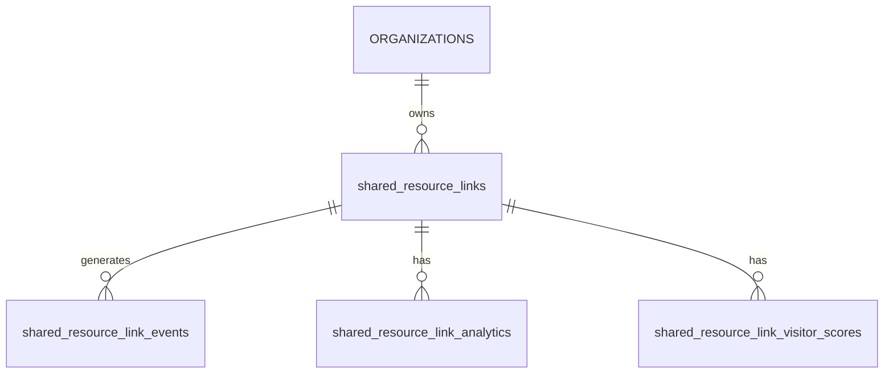

> 本文件为示例，仅用于展示如何填写对应模板。实际项目中请替换为真实内容。

# 数据库模型：Shared Resource Link 访问分析

> **文档编号**：`DBM-2024-011`  
> **版本**：`v1.0.0`  
> **模板版本**：`v1`  
> **状态**：`已批准`  
> **编写人/适用对象**：`后端架构师 / 数据工程师`  
> **编写日期**：`2024-06-18`  
> **关联文档**：  
> - `docs/TDD-v1.0.0.md`  
> - `docs/PRD-v1.0.0.md`  
> - `docs/API-SPEC-v1.0.0.md`  
> **评审人**：`CTO、后端负责人、DBA、安全负责人`

---

## 0. 文档使用说明

本文档为 Shared Resource Link 访问分析功能的数据库模型示例，基于 `DATABASE-MODEL-template-v1.md` 填写。覆盖实体关系、核心表结构、索引与迁移策略。

---

## 1. 文档控制信息

### 1.1 变更日志

| 版本 | 日期 | 修改人 | 修改内容 | 影响范围 |
|------|------|--------|----------|----------|
| v0.1.0 | 2024-06-15 | 孙磊 | 初始版本 | 全文档 |
| v1.0.0 | 2024-06-18 | 孙磊 | 评审通过 | 全文档 |

### 1.2 相关 ADR

| ADR 编号 | 标题 | 影响表/字段 |
|----------|------|-------------|
| ADR-2024-005 | 使用 PostgreSQL 存储 Shared Resource Link 行为事件 | `shared_resource_link_events` |
| ADR-2024-006 | 使用 PostgreSQL 存储 Shared Resource Link 元数据 | `shared_resource_links` |

---

## 2. 数据库选型与拓扑

### 2.1 数据库选型

| 用途 | 数据库 | 版本 | 部署方式 | 备注 |
|------|--------|------|----------|------|
| 主业务库 | PostgreSQL | 15.x | 阿里云 RDS | 存储 Shared Resource Link 元数据与配置 |
| 分析时序库 | PostgreSQL | 24.x | 托管服务 | 存储事件与聚合结果 |
| 缓存 | Redis | 7.x | Cluster | 缓存聚合结果 |

### 2.2 拓扑架构

```text
┌─────────────────────────────────────────────────────────────┐
│                        Application                          │
└───────────────────────┬─────────────────────────────────────┘
                        │
        ┌───────────────┼───────────────┐
        │               │               │
   ┌────▼────┐     ┌────▼────┐    ┌─────▼──────┐
   │PostgreSQL│     │  Redis  │    │ PostgreSQL │
   │(主业务库)│     │ (缓存)  │    │(分析时序库)│
   └─────────┘     └─────────┘    └────────────┘
```

### 2.3 命名规范

- **表名**：小写、复数、`snake_case`。
- **字段名**：小写、`snake_case`。
- **索引名**：`idx_{table}_{column}`，唯一索引 `uk_{table}_{column}`。
- **外键名**：`fk_{table}_{referenced_table}`。
- **主键**：优先 `uuid`。
- **时间字段**：`created_at`、`updated_at`。
- **软删除**：`deleted_at timestamptz NULL`。

---

## 3. 实体关系图（ERD）



---

## 4. 核心领域数据模型

### 4.1 领域：Shared Resource Link 元数据

#### 4.1.1 表：`shared_resource_links`

| 字段 | 类型 | 可空 | 默认值 | 说明 |
|------|------|------|--------|------|
| id | uuid | NOT NULL | gen_random_uuid() | 主键 |
| organization_id | uuid | NOT NULL | - | 所属 Organization |
| resource_id | uuid | NOT NULL | - | 关联文档 |
| slug | varchar(64) | NOT NULL | - | 短链接标识 |
| title | varchar(255) | NOT NULL | - | 链接标题 |
| tracking_enabled | boolean | NOT NULL | true | 是否启用阅读追踪 |
| expires_at | timestamptz | NULL | - | 过期时间 |
| password_hash | varchar(255) | NULL | - | 访问密码哈希 |
| settings | jsonb | NOT NULL | '{}' | 链接配置 |
| created_at | timestamptz | NOT NULL | now() | 创建时间 |
| updated_at | timestamptz | NOT NULL | now() | 更新时间 |
| deleted_at | timestamptz | NULL | - | 软删除 |

**索引**：

```sql
CREATE UNIQUE INDEX uk_shared_resource_links_slug ON shared_resource_links(slug) WHERE deleted_at IS NULL;
CREATE INDEX idx_shared_resource_links_organization_id ON shared_resource_links(organization_id);
CREATE INDEX idx_shared_resource_links_resource_id ON shared_resource_links(resource_id);
CREATE INDEX idx_shared_resource_links_tracking_enabled ON shared_resource_links(organization_id, tracking_enabled) WHERE deleted_at IS NULL;
```

**外键**：

```sql
ALTER TABLE shared_resource_links ADD CONSTRAINT fk_shared_resource_links_organizations
  FOREIGN KEY (organization_id) REFERENCES organizations(id) ON DELETE CASCADE;
ALTER TABLE shared_resource_links ADD CONSTRAINT fk_shared_resource_links_resources
  FOREIGN KEY (resource_id) REFERENCES resources(id) ON DELETE CASCADE;
```

---

### 4.2 领域：行为事件

#### 4.2.1 表：`shared_resource_link_events`（PostgreSQL）

```sql
CREATE TABLE shared_resource_link_events (
  id UUID DEFAULT generateUUIDv4(),
  link_id UUID NOT NULL,
  page_id UUID NOT NULL,
  visitor_token String NOT NULL,
  event_type Enum('page_viewed', 'download') NOT NULL,
  duration_ms UInt32,
  occurred_at DateTime64(3) NOT NULL,
  tenant_id UUID NOT NULL,
  organization_id UUID NOT NULL,
  user_agent String,
  ip_hash String
) ENGINE = MergeTree()
PARTITION BY toYYYYMM(occurred_at)
ORDER BY (link_id, occurred_at)
TTL occurred_at + INTERVAL 90 DAY;
```

| 字段 | 类型 | 说明 |
|------|------|------|
| id | UUID | 主键 |
| link_id | UUID | Shared Resource Link ID |
| page_id | UUID | 页面 ID |
| visitor_token | String | 匿名访客标识 |
| event_type | Enum | page_viewed / download |
| duration_ms | UInt32 | 停留时长 |
| occurred_at | DateTime64(3) | 事件发生时间 |
| tenant_id | UUID | 租户 ID |
| organization_id | UUID | Organization ID |
| user_agent | String | 浏览器 UA |
| ip_hash | String | IP 哈希 |

**索引说明**：

PostgreSQL 中主键 `ORDER BY (link_id, occurred_at)` 即排序键与稀疏索引，可高效支撑按 link 与时间的范围查询。

---

### 4.3 领域：聚合分析

#### 4.3.1 表：`shared_resource_link_analytics`（PostgreSQL）

```sql
CREATE TABLE shared_resource_link_analytics (
  link_id UUID NOT NULL,
  date Date NOT NULL,
  total_views UInt32 NOT NULL,
  unique_visitors UInt32 NOT NULL,
  page_stats String -- JSON: [{page_id, avg_duration_ms, views}]
) ENGINE = SummingMergeTree()
PARTITION BY toYYYYMM(date)
ORDER BY (link_id, date);
```

| 字段 | 类型 | 说明 |
|------|------|------|
| link_id | UUID | Shared Resource Link ID |
| date | Date | 聚合日期 |
| total_views | UInt32 | 总访问次数 |
| unique_visitors | UInt32 | 独立访客数 |
| page_stats | String | 每页访问统计 JSON |

**索引说明**：

主键 `ORDER BY (link_id, date)` 支撑按 link 与日期的高效聚合查询。

#### 4.3.2 表：`shared_resource_link_visitor_scores`（PostgreSQL）

```sql
CREATE TABLE shared_resource_link_visitor_scores (
  link_id UUID NOT NULL,
  visitor_token String NOT NULL,
  heat_level Enum('high', 'medium', 'low') NOT NULL,
  total_views UInt32 NOT NULL,
  unique_pages UInt32 NOT NULL,
  total_duration_ms UInt64 NOT NULL,
  last_seen_at DateTime64(3) NOT NULL,
  calculated_at DateTime64(3) NOT NULL
) ENGINE = ReplacingMergeTree(calculated_at)
PARTITION BY toYYYYMM(calculated_at)
ORDER BY (link_id, visitor_token);
```

| 字段 | 类型 | 说明 |
|------|------|------|
| link_id | UUID | Shared Resource Link ID |
| visitor_token | String | 匿名访客标识 |
| heat_level | Enum | 热度档位：高 / 中 / 低 |
| total_views | UInt32 | 总访问次数 |
| unique_pages | UInt32 | 访问的不同页面数 |
| total_duration_ms | UInt64 | 总停留时长 |
| last_seen_at | DateTime64(3) | 最近访问时间 |
| calculated_at | DateTime64(3) | 评分计算时间 |

---

## 5. 关联关系模型

### 5.1 一对多关系

- `organizations` 1:N `shared_resource_links`
- `shared_resource_links` 1:N `shared_resource_link_events`
- `shared_resource_links` 1:N `shared_resource_link_analytics`
- `shared_resource_links` 1:N `shared_resource_link_visitor_scores`

### 5.2 关系说明

| 父表 | 子表 | 关系 | 级联策略 |
|------|------|------|----------|
| organizations | shared_resource_links | 1:N | ON DELETE CASCADE |
| resources | shared_resource_links | 1:N | ON DELETE CASCADE |
| shared_resource_links | shared_resource_link_events | 1:N | TTL 自动过期 |
| shared_resource_links | shared_resource_link_analytics | 1:N | 手动清理 |
| shared_resource_links | shared_resource_link_visitor_scores | 1:N | 手动清理 |

---

## 6. 索引策略

### 6.1 索引设计原则

1. 所有外键字段必须建索引。
2. 频繁用于 WHERE、JOIN 的字段建索引。
3. 复合索引遵循最左前缀原则。
4. PostgreSQL 主键即排序键，按查询模式设计。

### 6.2 PostgreSQL 索引清单

| 表名 | 索引名 | 字段 | 类型 | 用途 |
|------|--------|------|------|------|
| shared_resource_links | uk_shared_resource_links_slug | slug | B-tree | 短链接唯一标识 |
| shared_resource_links | idx_shared_resource_links_organization_id | organization_id | B-tree | Organization 下列表查询 |
| shared_resource_links | idx_shared_resource_links_resource_id | resource_id | B-tree | 文档关联查询 |
| shared_resource_links | idx_shared_resource_links_tracking_enabled | organization_id, tracking_enabled | B-tree | 按追踪开关过滤 |

### 6.3 PostgreSQL 索引说明

| 表名 | 排序键 | 分区键 | 用途 |
|------|--------|--------|------|
| shared_resource_link_events | (link_id, occurred_at) | toYYYYMM(occurred_at) | 按 link 与时间范围查询 |
| shared_resource_link_analytics | (link_id, date) | toYYYYMM(date) | 按 link 与日期聚合查询 |
| shared_resource_link_visitor_scores | (link_id, visitor_token) | toYYYYMM(calculated_at) | 按 link 与访客查询 |

---

## 7. 分区分片策略

### 7.1 分区表

| 表名 | 分区键 | 分区方式 | 保留策略 |
|------|--------|----------|----------|
| shared_resource_link_events | occurred_at | 按月分区 | TTL 90 天 |
| shared_resource_link_analytics | date | 按月分区 | 保留 2 年 |
| shared_resource_link_visitor_scores | calculated_at | 按月分区 | 保留 90 天 |

### 7.2 分片策略

当前阶段 PostgreSQL 使用单分片，按 link_id 做一致性哈希分片作为二期扩展方案。

---

## 8. 数据安全与合规

### 8.1 敏感数据字段

| 表名 | 字段 | 敏感级别 | 处理方式 |
|------|------|----------|----------|
| shared_resource_links | password_hash | 高 | bcrypt 加密 |
| shared_resource_link_events | ip_hash | 中 | 哈希存储，不展示 |
| shared_resource_link_events | user_agent | 中 | 仅内部分析，不展示 |

### 8.2 租户隔离

- `shared_resource_links` 表包含 `organization_id`。
- `shared_resource_link_events` 等 PostgreSQL 表包含 `tenant_id` 与 `organization_id`。
- 应用层查询必须附加 organization 过滤。

### 8.3 数据保留与删除

| 数据类型 | 保留期 | 删除方式 |
|----------|--------|----------|
| Shared Resource Link 元数据 | 账户存续期 | 软删除 |
| 原始事件 | 90 天 | TTL 自动删除 |
| 聚合结果 | 2 年 | 手动清理 |
| 热度评分 | 90 天 | 覆盖更新 + 手动清理 |

---

## 9. 数据字典

### 9.1 通用字段说明

| 字段名 | 类型 | 说明 |
|--------|------|------|
| id | uuid | 主键 |
| created_at | timestamptz | 创建时间 |
| updated_at | timestamptz | 更新时间 |
| deleted_at | timestamptz | 软删除时间 |
| organization_id | uuid | Organization ID |
| visitor_token | string | 匿名访客标识 |

### 9.2 枚举值字典

#### event_type

| 值 | 说明 |
|----|------|
| page_viewed | 页面被查看 |
| download | 文档被下载 |

#### heat_level

| 值 | 说明 |
|----|------|
| high | 高热度 |
| medium | 中热度 |
| low | 低热度 |

---

## 10. 迁移与版本控制

### 10.1 迁移工具

- 工具：Atlas / golang-migrate
- 命名规范：`{timestamp}_{description}.up.sql` / `.down.sql`
- 存放路径：`apps/api/db/migrations/`

### 10.2 变更流程

1. 在本文档更新表设计。
2. 编写 PostgreSQL / PostgreSQL 迁移脚本。
3. 在本地/测试环境执行迁移。
4. 更新 ORM/实体代码。
5. 提交 PR 并通过 Code Review。
6. 在生产环境灰度执行。

---

## 11. 检查清单

- [x] 所有表都有主键
- [x] 所有外键字段都有索引
- [x] 所有表都有 `created_at`、`updated_at`（PostgreSQL）
- [x] 需要软删除的表都有 `deleted_at`
- [x] 所有业务表都有 `organization_id`
- [x] 枚举字段有 CHECK 约束或引用枚举表
- [x] JSONB 字段有合理的默认值
- [x] 敏感字段已标记并设计保护措施
- [x] 大表已规划分区/归档策略
- [x] 迁移脚本与模型文档一致
